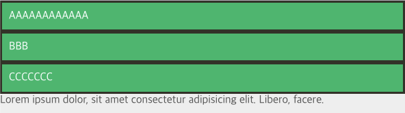
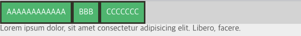
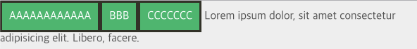
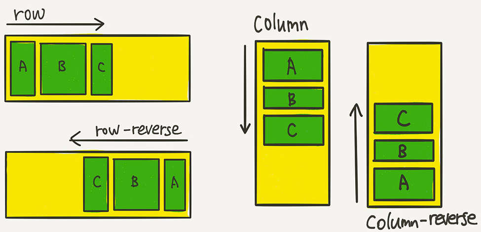
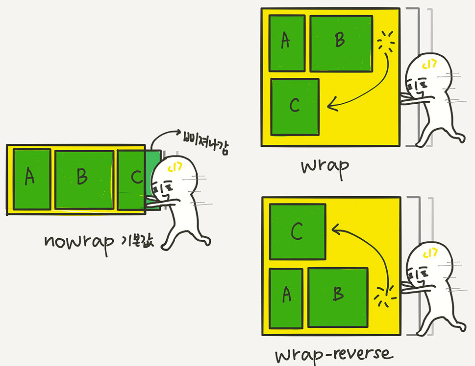

## Flex 기본요소

Flex는 Flexible Box, Flexbox라고 부르기도 한다. 레이아웃 배치 전용 기능으로 만들어진 Flex는 기존의 float이나 inline-block 등을 이용한 기존 방식보다 훨씬 강력하고 편리한 기능들을 제공한다.

> IE에서 Grid legacy만 지원하므로 Flex는 여전히 중요하다.

### 배치의 흐름

Flex 레이아웃을 만들기 위한 기본적 HTML 구조는 아래와 같다.

```html
<div class="container">
  <div class="item">hello</div>
  <div class="item">vicky</div>
  <div class="item">helloflex</div>
</div>
```

부모 요소인 div.container를 Flex Container라고 부르고, 자식 요소인 div.item들은 Flex Item이라고 부른다.
컨테이너가 Flex의 영향을 받는 전체 공간이고, 속성에 따라 각각의 아이템들이 규칙에 따라 배치가 되는 것

Flex 속성들은

- 컨테이너에 적용하는 속성
- 아이템에 적용하는 속성

이렇게 두 가지로 나뉨

### 컨테이너에 적용하는 속성

<aside>
💡 main axis(메인 축) : flex item이 배치된 방향
cross axis(교차 축) : 메인축과 수직이 된 축

</aside>

- `display: flex;`
  Flex 컨테이너에 `display: flex;`를 적용하는 것이 첫걸음이다.
  ```html
  <div class="flex-container">
    <div class="flex-item">AAAAAAAAAAAA</div>
    <div class="flex-item">BBB</div>
    <div class="flex-item">CCCCCCC</div>
  </div>
  Lorem ipsum dolor, sit amet consectetur adipisicing elit. Libero, facere.
  ```
  위와 같은 마크업이 있다고 헀을 때 화면은 아래와 같이 구현된다.
  
  해당 `flex-container`에 `display:flex;`를 적용하면 아래와 같다.
  ```css
  .flex-container {
    display: flex;
  }
  ```
  
  위처럼 마치 `div`들이 `inline`인 것처럼 변경된다.
- `display: inline-flex;`
  inline-flex는 block과 inline-block의 관계를 생각하면 된다.
  아이템의 배치와 관련이 있다기보단 컨테이너가 주변 요소들과 어떻게 어우러질지 결정하는 값
  `inline-flex`는 `inline-block`처럼 동작한다.
  ```css
  .flex-container {
    display: inline-flex;
  }
  ```
  
- `flex-direction`
  아이템들이 배치되는 축의 방향을 결정하는 속성으로 메인축의 방향을 결정하는 요소이다.
  ```css
  .flex-container {
    display: flex;
    flex-direction: row;
    /* flex-direction: column; */
    /* flex-direction: row-reverse; */
    /* flex-direction: column-reverse; */
  }
  ```
  
- `flex-wrap`
  컨테이너가 더 이상 아이템을 한 줄에 담을 여유가 없을 떄 아이템 줄바꿈 처리를 어떻게할지 결정하는 요소
  ```css
  .flex-container {
    display: flex;
    flex-wrap: nowrap;
    /* flex-wrap: wrap; */
    /* flex-wrap: wrap-reverse; */
  }
  ```
  
- `flex-flow`
  `flex-direction`과 `flex-wrap`을 한꺼번에 지정할 수 있는 단축 속성이다.
  `flex-direction`, `flex-wrap` 순으로 한 칸 떼고 써주면 된다.
  ```css
  .flex-container {
    display: flex;
    flex-flow: row nowrap;
    /* 아래의 두 줄을 줄여 썻다 */
    /* flex-direction: row; */
    /* flex-wrap: nowrap; */
  }
  ```
