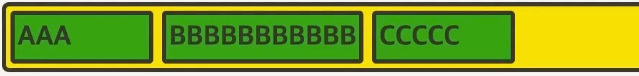
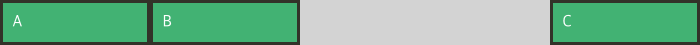
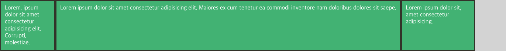
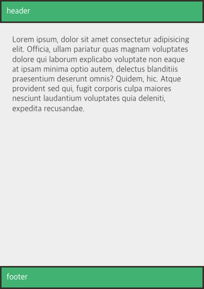
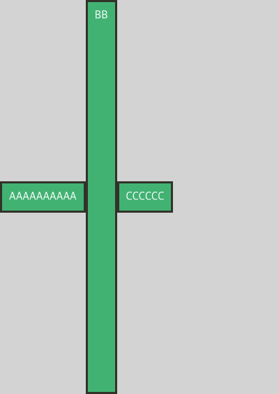

## Flex 기본요소

Flex는 Flexible Box, Flexbox라고 부르기도 한다. 레이아웃 배치 전용 기능으로 만들어진 Flex는 기존의 float이나 inline-block 등을 이용한 기존 방식보다 훨씬 강력하고 편리한 기능들을 제공한다.

> IE에서 Grid legacy만 지원하므로 Flex는 여전히 중요하다.

### 배치의 흐름

Flex 레이아웃을 만들기 위한 기본적 HTML 구조는 아래와 같다.

```html
<div class="container">
  <div class="item">hello</div>
  <div class="item">vicky</div>
  <div class="item">helloflex</div>
</div>
```

부모 요소인 div.container를 Flex Container라고 부르고, 자식 요소인 div.item들은 Flex Item이라고 부른다.
컨테이너가 Flex의 영향을 받는 전체 공간이고, 속성에 따라 각각의 아이템들이 규칙에 따라 배치가 되는 것

Flex 속성들은

- 컨테이너에 적용하는 속성
- 아이템에 적용하는 속성

이렇게 두 가지로 나뉨

### 컨테이너에 적용하는 속성(방향)

<aside>
💡 main axis(메인 축) : flex item이 배치된 방향
cross axis(교차 축) : 메인축과 수직이 된 축

</aside>

- `display: flex;`
  Flex 컨테이너에 `display: flex;`를 적용하는 것이 첫걸음이다.
  ```html
  <div class="flex-container">
    <div class="flex-item">AAAAAAAAAAAA</div>
    <div class="flex-item">BBB</div>
    <div class="flex-item">CCCCCCC</div>
  </div>
  Lorem ipsum dolor, sit amet consectetur adipisicing elit. Libero, facere.
  ```
  위와 같은 마크업이 있다고 헀을 때 화면은 아래와 같이 구현된다.
  
  해당 `flex-container`에 `display:flex;`를 적용하면 아래와 같다.
  ```css
  .flex-container {
    display: flex;
  }
  ```
  
  위처럼 마치 `div`들이 `inline`인 것처럼 변경된다.
- `display: inline-flex;`
  inline-flex는 block과 inline-block의 관계를 생각하면 된다.
  아이템의 배치와 관련이 있다기보단 컨테이너가 주변 요소들과 어떻게 어우러질지 결정하는 값
  `inline-flex`는 `inline-block`처럼 동작한다.
  ```css
  .flex-container {
    display: inline-flex;
  }
  ```
  
- `flex-direction`
  아이템들이 배치되는 축의 방향을 결정하는 속성으로 메인축의 방향을 결정하는 요소이다.
  ```css
  .flex-container {
    display: flex;
    flex-direction: row;
    /* flex-direction: column; */
    /* flex-direction: row-reverse; */
    /* flex-direction: column-reverse; */
  }
  ```
  
- `flex-wrap`
  컨테이너가 더 이상 아이템을 한 줄에 담을 여유가 없을 떄 아이템 줄바꿈 처리를 어떻게할지 결정하는 요소
  ```css
  .flex-container {
    display: flex;
    flex-wrap: nowrap;
    /* flex-wrap: wrap; */
    /* flex-wrap: wrap-reverse; */
  }
  ```
  
- `flex-flow`
  `flex-direction`과 `flex-wrap`을 한꺼번에 지정할 수 있는 단축 속성이다.
  `flex-direction`, `flex-wrap` 순으로 한 칸 떼고 써주면 된다.
  ```css
  .flex-container {
    display: flex;
    flex-flow: row nowrap;
    /* 아래의 두 줄을 줄여 썻다 */
    /* flex-direction: row; */
    /* flex-wrap: nowrap; */
  }
  ```

> 간단한 예제

해상도 `600px` 이하에서 `flex-direction`이 `column`인 레이아웃을 배치하여 반응형을 구현한다고 한다면 아래와 같이 간단히 구현할 수 있음.

```html
<!DOCTYPE html>
<html>
  <head>
    <style>
      .flex-container {
        display: flex;
        flex-direction: column; /* 기존에는 column */
      }
      @media (min-width: 600px) {
        .flex-container {
          flex-direction: row; /* width가 600px 이상에서는 row */
        }
        .flex-item {
          flex: 1;
        }
      }
    </style>
  </head>
  <body>
    <div class="flex-container">
      <div class="flex-item">AAAAA</div>
      <div class="flex-item">BBBBBB</div>
      <div class="flex-item">CCC</div>
    </div>
  </body>
</html>
```

### 컨테이너에 적용하는 속성(정렬)

<aside>
💡 justify : 메인 축 방향으로 정렬
align : 수직 축 방향으로 정렬

</aside>

- `justify-content`
  메인축 방향으로 아이템을 정렬하는 속성임
  ```css
  .flex-container {
    display: flex;
    justify-content: flex-start;
    /* justify-content: flex-end; */
    /* justify-content: center; */
    /* justify-content: space-between; */
    /* justify-content: space-around; */
    /* justify-content: space-evenly; */ /* 모든 여백이 균일, IE, Edge에서 직원이 안됨 */
  }
  ```
- `align-items`
  수직축 방향으로 아이템을 정렬하는 속성임
  justify-content와 수직 방향의 정렬이라고 생각하면 됨
  ```css
  .flex-container {
    height: 300px;
    display: flex;
    align-items: stretch; /* default */
    /* align-items: flex-start; */
    /* align-items: flex-end; */
    /* align-items: center; */
    /* align-items: baseline; */ /* text의 baseline을 의미함 */
  }
  ```

> 배치를 `wrapper`의 정중앙에 놓으려면 `justify`와 `align` 속성을 사용하면 된다.

```css
.container {
  display: inline-flex;
  justify-content: center;
  align-items: center;
  width: 30px;
  height: 30px;
}
```

- `align-content`
  `flex-wrap: wrap`이 설정된 상태에서, 아이템들의 행이 2줄 이상이 되었을 때의 수직축 방향 정렬을 결정하는 속성
  ```css
  .flex-container {
    display: flex;
    flex-wrap: wrap;
    align-content: stretch;
    /* align-content: flex-start; */
    /* align-content: flex-end; */
    /* align-content: center; */
    /* align-content: space-between; */
    /* align-content: space-around; */
    /* align-content: space-evenly; */
    height: 300px;
  }
  ```

### 유연한 박스

- `flex-basis`
  flex 아이템의 기본 크기를 설정 (flex-direction이 row일 때는 너비, column일 대는 높이)
  ```css
  .flex-container {
    display: flex;
  }
  .item {
    flex-basis: 100px;
  }
  ```
  
  원래 내용물이 100px보다 크면 그만큼 알아서 늘어난다. min-width가 100px인 느낌
  그럼 그냥 width 값을 주면 안될까?
  ```css
  .flex-container {
    display: flex;
  }
  .item {
    width: 100px;
  }
  ```
  
  100px보다 내용물이 많으면 늘어나지않고 그 아래로 떨어지게 된다.

### 유연하게 늘리기

- `flex-grow`
  flex-grow는 아이템이 flex-basis의 값보다 커질 수 있는지를 결정하는 속성
  기본적으로 숫자값이 들어가며 몇이든 일단 0보다 큰 값이 셋팅되면 해당 아이텐임 유연한 flexible box로 변하고 원래의 크기보다 커지며 빈공간을 메우게 된다.
  ```jsx
  .item {
  	flex-grow: 0; /* 기본값 */
  }
  ```
  
  ```jsx
  .item {
  	flex-grow: 1;
  }
  ```
  
  flex-grow에 들어가는 숫자의 의미는 **아이템들의 flex-basis를 제외한 여백 부분을 flex-grow에 지정된 숫자의 비율로 나누어 가진다**고 생각하면 된다. 소수점 숫자를 넣어도 된다.
  ```css
  .item:nth-child(1) {
    flex-grow: 1;
  }
  .item:nth-child(2) {
    flex-grow: 2;
  }
  .item:nth-child(3) {
    flex-grow: 1;
  }
  ```
  

### 유연하게 줄이기

- `flex-shrink`
  flex-shrink는 flex-grow와 쌍을 이루는 속성으로 아이템이 flex-basis 값보다 작아질 수 있는지를 결정함
  flex-shrink에는 숫자값이 들어가는데, 몇이든 일단 0보다 큰 값이 세팅되면 해당 아이템이 유연한 flex-box로 변하고 flex-basis보다 작아진다.
  ```css
  .item:nth-child(1) {
    /* flex-shrink: 1; */ /* 기본값 */
    flex-shrink: 0; /* 아무리 줄어들게해도 크기의 변화가 일어나지 않는 고정폭의 컬럼을 만들 수 있다 */
    width: 100px;
  }
  .item:nth-child(2) {
    flex-grow: 1;
  }
  ```
  
  컨테이너 폭이 100%일 때는 위와 같이 설정되고
  
  컨테이너 폭이 250일 때 사이즈가 줄어들게 한다면, 1번쨰 item 박스의 경우 flex-shrink가 0이므로 컨테이너가 아무리 작아져도 찌그러지지 않고 폭이 100px를 유지하게 된다.

### Flex 속성 활용

위 `flex-basis`, `flex-grow`, `flex-shrink`는 `flex`라는 속성으로 줄여쓸 수 있다. (축약형)

```css
.item {
  flex: 1;
  /* flex-grow: 1; flex-shrink: 1; flex-basis: 0%; */
  flex: 1 1 auto;
  /* flex-grow: 1; flex-shrink: 1; flex-basis: auto; */
  flex: 1 500px;
  /* flex-grow: 1; flex-shrink: 1; flex-basis: 500px; */
}
```

`flex-basis` 속성은 default value가 `auto`인데, `flex:1` 로 처리하면 `0`으로 처리된다.
따라서 `auto`로 처리하려면 명시적으로 써줘야한다.

```css
.item:nth-child(1) {
  flex: 1;
  /* flex: 1 1 0; */
}
.item:nth-child(2) {
  flex: 3;
  /* flex: 3 1 0; */
}
.item:nth-child(3) {
  flex: 1;
  /* flex: 1 1 0; */
}
```

위 flex 값 설정은 아래 주석과 같은 값을 설정한 것이 되는 것이다!

만약 `.item:nth-child(1)`에 콘텐츠 양이 지나치게 많으면 레이아웃은 어떻게 될까?


아래와 같이 자동으로 줄바꿈되어 여백 처리가 된다.
그럼 만약 `.item:nth-child(1)`에 내부 콘텐츠가 줄바꿈이 되지 않도록 설정하면 해당 item들은 같은 비율을 유지할 수 있을까? No!

```html
<!DOCTYPE html>
<html>
  <head>
    <style>
      .flex-container {
        display: flex;
      }
      .flex-item:nth-child(1) {
        flex: 1;
      }
      .flex-item:nth-child(2) {
        flex: 3;
      }
      .flex-item:nth-child(3) {
        flex: 1;
      }
      .flex-item p {
        white-space: nowrap;
      }
    </style>
  </head>
  <body>
    <div class="flex-container">
      <div class="flex-item">
        <p>
          Lorem ipsum dolor sit amet consectetur, adipisicing elit. Explicabo eaque nemo minima voluptatum blanditiis,
          voluptas amet. Ut voluptas amet quisquam, quis neque maiores atque temporibus adipisci voluptatum sunt sed
          minima quam repudiandae cumque optio dolores ducimus voluptates dolorum. Obcaecati facere veritatis dicta
          cumque similique, dolorum autem. Repudiandae porro hic exercitationem.
        </p>
      </div>
      <div class="flex-item">BBB</div>
      <div class="flex-item">CCCCCCC</div>
    </div>
  </body>
</html>
```


위 이미지처럼 비율을 유지하지않고 가로가 매우 긴 형태로 변경된다.

위처럼 flex는 기타 요소 설정이 있을 경우 해당 스타일을 반영하고 기존의 레이아웃을 고수하지 않으므로 만약 일관성 있는 정확한 다단 레이아웃을 구현하고 싶다면 flex 보다는 width를 지정하여 설계하는 편이 더 바람직하다.

```css
.flex-item:nth-child(1) {
  overflow: hidden; /* 우측 스크롤 방지를 위해 추가 */
  width: 20%;
}
.flex-item:nth-child(2) {
  width: 60%;
}
.flex-item:nth-child(3) {
  width: 40%;
}
```

위와 같은 코드는 아래와 같은 레이아웃을 도출하므로 컨텐츠 길이에 따라 레이아웃이 영향을 받지 않게된다.


그럼 `flex-grow`, `flex-basis`는 언제 사용할까? 컬럼 만들 때 유연한 박스의 장점을 해당 요소를 추가할 수 있다.

```html
<div class="flex-container">
  <div class="flex-item">
    <p>
      Lorem ipsum dolor sit amet consectetur, adipisicing elit. Explicabo eaque nemo minima voluptatum blanditiis,
      voluptas amet. Ut voluptas amet quisquam, quis neque maiores atque temporibus adipisci voluptatum sunt
    </p>
  </div>
  <div class="flex-item">BBB</div>
  <div class="flex-item">CCCCCCC</div>
  <div class="flex-item">DDDDDDDDDD</div>
</div>
```

```css
.flex-container {
  display: flex;
  flex-wrap: wrap;
}
.flex-item:nth-child(1) {
  width: 20%;
}
.flex-item:nth-child(2) {
  width: 60%;
}
.flex-item:nth-child(3) {
  width: 20%;
}
```

위와 같이 처리하면 아래와 같은 레이아웃이 만들어진다. 부족한 공간만큼 아래에 떨어지는 형태이다.
하지만, float으로 구현한 것과 크게 다르지 않은 느낌이다. 이를 flex-grow로 개선할 수 있음


```css
.flex-container {
  display: flex;
  flex-wrap: wrap;
}
.flex-item {
  flex: 1 1 auto; /* 추가 */
}
.flex-item:nth-child(1) {
  width: 20%;
}
.flex-item:nth-child(2) {
  width: 60%;
}
.flex-item:nth-child(3) {
  width: 20%;
}
```


위처럼 flex-grow를 auto로 설정해주면 떨어진 block이 유연한 박스 형태를 가지게 되는 것을 확인할 수 있음

### 반응형 컬럼

반응형 컬럼은 미디어 쿼리를 통해서 구현한다. 특정한 크기 이상에서는 컬럼배치를 다르게 하기 위해서는 `flex-direction`과 `flex-wrap`, `flex-grow` 속성을 활용하여 반응형을 구현할 수 있다.

```html
<div class="flex-container">
  <div class="flex-item">AAAAAAAAAA</div>
  <div class="flex-item">BB</div>
  <div class="flex-item">CCCCCC</div>
  <div class="flex-item">AAAAAAAAAA</div>
  <div class="flex-item">BB</div>
  <div class="flex-item">CCCCCC</div>
  <div class="flex-item">AAAAAAAAAA</div>
  <div class="flex-item">BB</div>
  <div class="flex-item">CCCCCC</div>
  <div class="flex-item">AAAAAAAAAA</div>
  <div class="flex-item">BB</div>
  <div class="flex-item">CCCCCC</div>
  <div class="flex-item">CCCCCC</div>
</div>
```

```css
.flex-container {
  display: flex;
  flex-direction: column;
  min-height: 100vh;
}
.flex-item {
  flex: 1 auto;
}
@media (min-width: 600px) {
  .flex-container {
    flex-direction: row;
    flex-wrap: wrap;
  }
  .flex-item {
    width: 50%; /* flex-basis: 50%; 같은 의미임 */
    /* flex: 0 auto; */ /* flex-grow를 0으로 설정하면 홀수 컬럼 width가 50% 유지 */
  }
}
@media (min-width: 900px) {
  .flex-item {
    width: 30%; /* flex-grow가 1이기 때문에 남은 영역은 알아서 늘어난다. */
  }
}
```


### 유용한 기법들(auto-margin)

- margin-auto
  이번에는 flex로 정렬된 엘리먼트를 살짝 다르게 배치해본다.
  
  만약 이러한 배치에서 C만 오른쪽으로 붙이고 싶다면 어떻게 해야할까?

  ```html
  <div class="flex-container">
    <div class="flex-item">A</div>
    <div class="flex-item">B</div>
    <div class="flex-item">C</div>
  </div>
  ```

  ```css
  .flex-container {
    display: flex;
    /* width: 700px;
    margin: auto; */ /* margin: auto;로 중앙 정렬 할 수 있음 */
  }
  .flex-item {
    width: 150px;
  }
  .flex-item:last-child {
    margin-left: auto; /* 남아있는 margin을 모두 사용해버린다. */
  }
  ```

  

- 고정폭 컬럼과 가변폭 컬럼 혼합
  flex를 이용하면 고정폭 컬럼과 가변폭 컬럼을 혼합하여 사용하는 것이 매우 쉽다.
  ```html
  <div class="flex-container">
    <div class="flex-item">Lorem, ipsum dolor sit amet consectetur adipisicing elit. Corrupti, molestiae.</div>
    <div class="flex-item">
      Lorem ipsum dolor sit amet consectetur adipisicing elit. Maiores ex cum tenetur ea commodi inventore nam doloribus
      dolores sit saepe.
    </div>
    <div class="flex-item">Lorem ipsum dolor sit, amet consectetur adipisicing.</div>
  </div>
  ```
  위의 돔에 아래와 같은 스타일이 적용되어 있다고 했을 때, 가로 크기를 줄이면 고정되지 않는다.
  ```css
  .flex-container {
    display: flex;
  }
  .flex-item:nth-child(1) {
    width: 150px;
  }
  .flex-item:nth-child(3) {
    width: 200px;
  }
  ```
  이유는 `flex-shrink`가 기본값 1로 설정되어 있기 때문이다. 줄어들게 하는 속성임.
  따라서 이 폭이 유지되도록 flex-shrink를 0으로 고정해준다.
  ```css
  .flex-container {
    display: flex;
  }
  .flex-item:nth-child(1) {
    width: 150px;
    flex-shrink: 0; /* flex: 0 0 auto; 같은 의미 */
  }
  .flex-item:nth-child(3) {
    width: 200px;
    flex-shrink: 0; /* flex: 0 0 auto; 같은 의미 */
  }
  ```
  이렇게 처리하면 2번째 div만 반응형으로 크기가 바뀌며 첫번째, 세번째 div는 고정값을 유지한다.
  그런데 어느 정도 가로 길이를 길게 하다보면 2번째 div도 커지지 않음. 이는 flex-grow가 0으로 설정되어 있기 때문이다.
  
  ```css
  /* 위와 동일..  */
  .flex-item:nth-child(2) {
    flex-grow: 1;
  }
  ```
  위와 같이 처리하면 2번째 div가 계속 나머지 공간을 채우도록 만들어줄 수 있다.
  - 푸터 바닥에 붙이기
    flex를 이용해서 푸터 div를 바닥에 붙이고 싶을 땐 어떻게 할까?
    ```html
    <div class="page">
      <header class="header flex-item">header</header>
      <section class="content">
        Lorem ipsum, dolor sit amet consectetur adipisicing elit. Officia, ullam pariatur quas magnam voluptates dolore
        qui laborum explicabo voluptate non eaque at ipsam minima optio autem, delectus blanditiis praesentium deserunt
        omnis? Quidem, hic. Atque provident sed qui, fugit corporis culpa maiores nesciunt laudantium voluptates quia
        deleniti, expedita recusandae.
      </section>
      <footer class="footer flex-item">footer</footer>
    </div>
    ```
    위에서 살펴봤던 margin - auto 속성을 flex-direction: column 타입으로 활용하면 된다.
    ```css
    .page {
      display: flex;
      flex-direction: column;
      min-height: 100vh;
    }
    .content {
      flex: 1 auto;
      padding: 1.5rem;
    }
    ```
    
  - IE 버그
    IE에는 flex 코드에 에러가 발생한다. 따라서 아래와 같이 스타일을 추가해준다.
    ```css
    .page {
      display: flex;
      flex-direction: column;
      /* min-height: 100vh; */
      height: 100vh; /* IE에서는 min-height 대신 height로 */
    }
    .content {
      overflow: auto; /* IE에서만 추가 */
      flex: 1 auto;
      padding: 1.5rem;
    }
    ```

아래와 같은 돔이 있다고 했을 때 개별 아이템 속성으로 다양한 스타일을 부여할 수 있다.

```html
<div class="flex-container">
  <div class="flex-item">AAAAAAAAAA</div>
  <div class="flex-item">BB</div>
  <div class="flex-item">CCCCCC</div>
</div>
```

### 개별 아이템 속성 align-self

이번에는 각 아이템을 정렬하는 속성에 대해 알아보자. `align-self`는 수직축을 중심으로 움직인다.

`align-self`는 `align-items`보다 우선권이 있는 속성이다.

```css
.flex-container {
  display: flex;
  height: 100vh;
  align-items: center;
}
.flex-item:nth-child(2) {
  align-self: stretch; /* 2번째 아이템만 늘어난다. */
}
```



### 아이템 배치순서 order

각 아이템들의 시각적 나열 순서를 order를 통해 결정할 수 있다.
숫자가 작을수록 먼저 배치된다. html 구조가 바뀌지는 않으므로 접근성 면에서 문제가 될 수 있으므로 주의한다.
시각적 나열 순서가 의미적으로 상관이 없는 콘텐츠에 사용하면 좋다.

```css
.flex-container {
  display: flex;
}
.flex-item:nth-child(1) {
  order: 3;
}
.flex-item:nth-child(2) {
  order: 1;
}
.flex-item:nth-child(3) {
  order: 2;
}
```


### z-index

z-index로 z축 정렬을 할 수있다. z-index를 설정하지않으면 0이므로, 1으로 설정해도 위로 올라온다.

```css
.flex-container {
  display: flex;
}
.flex-item {
  opacity: 0.8;
}
.flex-item:nth-child(1) {
  transform: scale(1.5);
  z-index: 1;
}
.flex-item:nth-child(2) {
  transform: scale(2);
  z-index: 2;
}
.flex-item:nth-child(3) {
  transform: scale(2.2);
}
```
