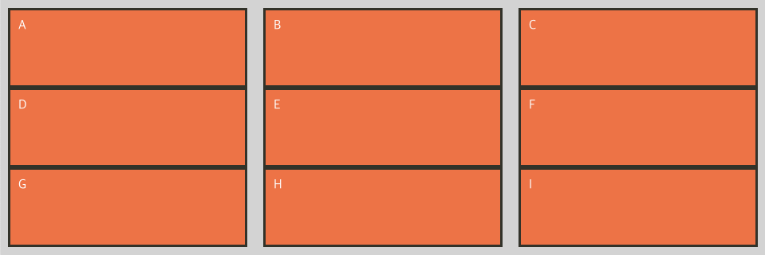
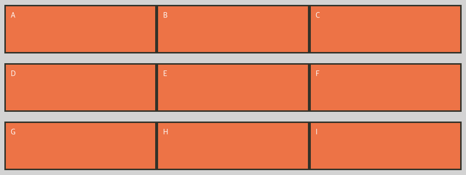

## Flex UI 만들기

### flexible 메뉴 만들기


마우스 hover 시 위와 같은 애니메이션이 동작하도록 구현해보려고 한다.
이를 flex가 아닌 요소로 만든다면 우리는 float 요소를 사용해서 만들었을 것이다.
이를 flex로 구현하면 훨씬 더 매끄러운 ui를 구현할 수 있다.

```html
<ul class="menu">
  <li class="menu-item">
    <a href="#" class="menu-link">Home</a>
  </li>
  <li class="menu-item">
    <a href="#" class="menu-link">About</a>
  </li>
  <li class="menu-item">
    <a href="#" class="menu-link">Product</a>
  </li>
  <li class="menu-item">
    <a href="#" class="menu-link">Contact</a>
  </li>
</ul>
```

```css
/* menu */
.menu {
  display: flex;
}
.menu-item {
  background: gold;
  transition: 0.5s;
  width: 25%;
  /* flex-grow: 1; */
}
.menu-item:hover {
  background: crimson;
  width: 35%;
  /* flex-grow: 1.5; */
}
.menu-link {
  display: block;
  padding: 1em;
  font-size: 1.2rem;
  font-weight: bold;
  color: #555;
  text-decoration: none;
  text-align: center;
}
.menu-link:hover {
  color: white;
}
```

위와 같은 애니메이션으로 위와 같은 후버 이벤트를 매끄럽게 구현할 수 있다.
`flex-grow`를 사용하여 가로 길이를 조정해줘도 되지만 IE에서는 flex-grow가 지원되지 않으므로 width로 처리했다!

### 유연한 검색창 만들기

이번에는 검색창도 만들어본다.
새로 만들 검색창은 아래와 같이 가로 크기에 따라 input의 가로 넓이가 stretch되는 특징을 가진다.


```html
<form class="search-form">
  <input type="search" />
  <input type="submit" value="찾기" />
</form>
```

```css
/* search */
.search-form {
  margin-top: 50px;
  display: flex;
  height: 40px; /* align-items: stretch 라서 내부 요소들이 중앙 정렬된다. */
}
.search-form input[type="search"] {
  border: 0;
  border-radius: 0.3em;
  font-size: 1rem;
  margin-right: 10px;
  flex: 1;
}
.search-form input[type="submit"] {
  border: 0;
  border-radius: 0.3em;
  font-size: 1rem;
  background-color: gold;
  width: 4em;
}
```

부모 속성이 display: flex 속성인 items 들은 높이값에 따라 내부 요소가 stretch 되는 특징이 있다는 것을 새로 배웠다. 위 속성을 사용하면 padding으로 위아래 간격을 조절하던 것을 쉽게 개선할 수 있을 것 같다.

### 불릿 리스트


이번에는 불릿이 있는 리스트를 만들어본다.
flex를 통해 앞에 불릿이 있고, 줄넘김이 되었을 떄 두번째 줄도 예쁘게 정렬된 효과를 낼 수 있다.

```html
<ul class="info-list">
  <li class="info-list-item">
    Lorem ipsum dolor sit amet consectetur adipisicing elit. Nihil fugit numquam aspernatur excepturi, eos soluta
    praesentium maiores commodi minus accusantium?
  </li>
  <li class="info-list-item">
    Lorem ipsum dolor sit amet consectetur adipisicing elit. Ullam corporis reiciendis sunt fugiat nobis.
  </li>
  <li class="info-list-item">
    Lorem ipsum dolor sit amet consectetur adipisicing elit. Ullam consequatur alias, ducimus ea magnam nostrum
    repudiandae repellendus deleniti veniam? Assumenda expedita ad eum nihil!
  </li>
</ul>
```

```css
/* bullet */
.info-list-item {
  display: flex;
  margin: 0.5em 0;
}
.info-list-item::before {
  content: "";
  margin-right: 0.5em;
}
```

이번에는 bullet을 별도의 엘리먼트로 추가하는 것이 아닌 `li.info-list-item`의 `::before` 요소로 추가해준다.
해당 영역을 뒀을 때 before와 기존 텍스트 사이를 flex 처리해주려면 `li.info-list-item`에 `display: flex;` 요소를 넣어주면 된다.

### 메시지 리스트


이번에는 사람 사진이나 프로필이 포함된 메시지 리스트를 구현해본다.
이미지는 image 태그로 쓰지 않고, figure 태그를 통해 구현해본다.(background-image로 호출)

```html
<ul class="user-list message-list">
  <li class="user-item message-item">
    <figure class="user-photo" style="background-image: url(images/ilbuni.png)"></figure>
    <p class="message-content">
      Lorem ipsum dolor sit amet consectetur adipisicing elit. Iure nobis, nisi numquam harum voluptates vel corrupti
      dolorem id, dicta eveniet similique architecto et, exercitationem quaerat alias ratione. Dicta, beatae,
      aspernatur, sit commodi quis illo non aut repellendus veritatis at ab.
    </p>
  </li>
  <li class="user-item message-item">
    <figure class="user-photo" style="background-image: url(images/ilbuni.png)"></figure>
    <p class="message-content">
      Lorem ipsum dolor sit amet consectetur adipisicing elit. Iure nobis, nisi numquam harum voluptates vel corrupti
      dolorem id, dicta eveniet similique architecto et, exercitationem quaerat alias ratione.
    </p>
  </li>
  <li class="user-item message-item">
    <figure class="user-photo" style="background-image: url(images/ilbuni.png)"></figure>
    <p class="message-content">
      Lorem ipsum dolor sit amet consectetur adipisicing elit. Iure nobis, nisi numquam harum voluptates vel corrupti
      dolorem id.
    </p>
  </li>
</ul>
```

```css
/* user list - messge list */
.user-item {
  display: flex;
  margin-bottom: 1.5em; /* rem은 html의 font-size를 기준으로 함 */
}
.user-photo {
  flex-shrink: 0;
  width: 50px;
  height: 50px;
  border: 2px solid #333;
  border-radius: 50%;
  background-color: gold;
  background-repeat: no-repeat;
  background-position: center;
  background-size: 150%;
  margin-right: 0.5em;
}
```

위 스타일에서 `.user-item`의 `margin-bottom`을 `em`으로 설정한 이유는 해당 태그의 `font-size`를 기준으로 상속받기 위해서임. 만약 `rem`을 쓰면 해당 태그의 `font-size`가 50px이어도 영향을 받지 않는다.

### 유저리스트

이번에는 동일한 메시지리스트인데, 콘텐츠 내용이 말줄임으로 표현되는 유저리스트를 만들어보려고 한다.


```html
<ul class="user-list message-list">
  <li class="user-item friend-item">
    <figure class="user-photo" style="background-image: url(../images/ilbuni.png)"></figure>
    <p class="user-name">비키 비키 비키 비키 비키 비키 비키 비키 비키 비키 비키 비키 비키 비키 비키</p>
  </li>
  <li class="user-item friend-item">
    <figure class="user-photo" style="background-image: url(../images/ilbuni.png)"></figure>
    <p class="user-name">비키 비키 비키 비키 비키 비키 비키 비키 비키 비키 비키 비키 비키 비키 비키</p>
  </li>
  <li class="user-item friend-item">
    <figure class="user-photo" style="background-image: url(../images/ilbuni.png)"></figure>
    <p class="user-name">비키 비키 비키 비키 비키 비키 비키 비키 비키 비키 비키 비키 비키 비키 비키</p>
  </li>
</ul>
```

```css
/* user list - friend list */
.friend-item {
  align-items: center;
}
.user-name {
  overflow: hidden;
  text-overflow: ellipsis;
  white-space: nowrap;
}
```

위와 같이 간단하게 한줄 텍스트 처리를 할 수 있음

### 모달

이번에는 크기가 얼마이던지 가운데로 정렬되는 모달을 flex를 통해 구현해보고자 한다.


```html
<div class="modal">
  <div class="dialog">
    Lorem ipsum dolor sit amet consectetur adipisicing elit. Repudiandae ad delectus minima rem saepe, sunt aliquam
    vitae, perferendis laborum impedit ipsa, et soluta facilis libero alias numquam ratione voluptatem quod doloribus
    pariatur fuga quo? Sapiente, distinctio tempore cupiditate facere nobis nesciunt magnam cumque nemo quibusdam autem
    ea rerum exercitationem temporibus.
  </div>
</div>
```

```css
/* modal */
.modal {
  position: fixed;
  display: flex;
  justify-content: center;
  align-items: center;
  left: 0;
  right: 0;
  top: 0;
  bottom: 0;
  background: rgba(0, 0, 0, 0.3);
}
.dialog {
  background: white;
  width: 50vw;
  padding: 2em;
  border-radius: 1em;
}
```

`.modal` 클래스에 `display: flex` 속성을 주고 가운데 중앙 정렬 하는 방법으로 구현하면 된다. 간단쓰

### 카드 리스트

웹 어플리케이션에서 굉장히 많이 사용하는 카드레이아웃을 flex로 구현해보고자 한다.
특히 콘텐츠 영역에 양이 다를 경우 카드 높낮이가 모두 다르게 노출되는 것과 달리 flex를 사용하면 모두 일정한 높이를 가지도록 만들 수 있다.

```html
<div class="card-list-con">
  <ul class="card-list">
    <li class="card-item">
      <figure class="card-image" style="background-image: url(../images/ilbuni.png)"></figure>
      <div class="card-desc">Lorem ipsum dolor, sit amet consectetur adipisicing elit. Atque, placeat!</div>
    </li>
    <li class="card-item">
      <figure class="card-image" style="background-image: url(../images/ilbuni.png)"></figure>
      <div class="card-desc">Lorem ipsum dolor,</div>
    </li>
    <li class="card-item">
      <figure class="card-image" style="background-image: url(../images/ilbuni.png)"></figure>
      <div class="card-desc">
        Lorem ipsum dolor, sit amet consectetur adipisicing elit. Atque, placeat!Lorem ipsum dolor, sit amet consectetur
        adipisicing elit. Atque, placeat!
      </div>
    </li>
    <li class="card-item">
      <figure class="card-image" style="background-image: url(../images/ilbuni.png)"></figure>
      <div class="card-desc">Lorem ipsum dolor, sit amet consectetur adipisicing elit. Atque, placeat!</div>
    </li>
    <li class="card-item">
      <figure class="card-image" style="background-image: url(../images/ilbuni.png)"></figure>
      <div class="card-desc">Lorem ipsum dolor, sit amet consectetur adipisicing elit. Atque, placeat!</div>
    </li>
    <li class="card-item">
      <figure class="card-image" style="background-image: url(../images/ilbuni.png)"></figure>
      <div class="card-desc">Lorem ipsum dolor, sit amet consectetur adipisicing elit. Atque, placeat!</div>
    </li>
    <li class="card-item">
      <figure class="card-image" style="background-image: url(../images/ilbuni.png)"></figure>
      <div class="card-desc">Lorem ipsum dolor, sit amet consectetur adipisicing elit. Atque, placeat!</div>
    </li>
    <li class="card-item">
      <figure class="card-image" style="background-image: url(../images/ilbuni.png)"></figure>
      <div class="card-desc">Lorem ipsum dolor, sit amet consectetur adipisicing elit. Atque, placeat!</div>
    </li>
  </ul>
</div>
```

```css
/* cards list */
.card-item {
  display: flex;
  flex-direction: column;
  margin-bottom: 2rem;
}
.card-image {
  height: 0;
  padding-bottom: 80%; /* 이미지를 height의 80% 비율로 보여준다  */
  background-color: lightgray;
  background-repeat: no-repeat;
  background-position: center;
  background-size: cover;
}
.card-image img {
  display: none; /* figure background 이미지로 노출 */
}
.card-desc {
  padding: 1em;
  background: white;
  flex: 1 1 auto;
}

@media (min-width: 600px) {
  .card-list-con {
    overflow-x: hidden;
  }
  .card-list {
    display: flex;
    flex-wrap: wrap;
    margin: 0 -1rem; /* card간 간격조정은 padding으로, 양 끝은 margin으로 조정 */
    /* card-item이 33.333%일 때 row에 item이 2개일 경우 가운데가 비는 형상 발생 */
    /* justify-content: space-between; */
  }
  .card-item {
    width: 50%;
    padding: 0 1rem;
  }
}
```






