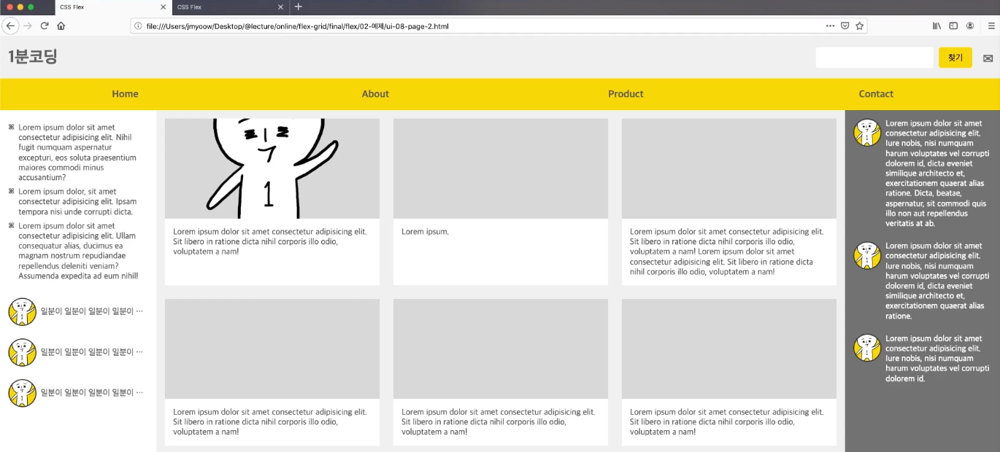
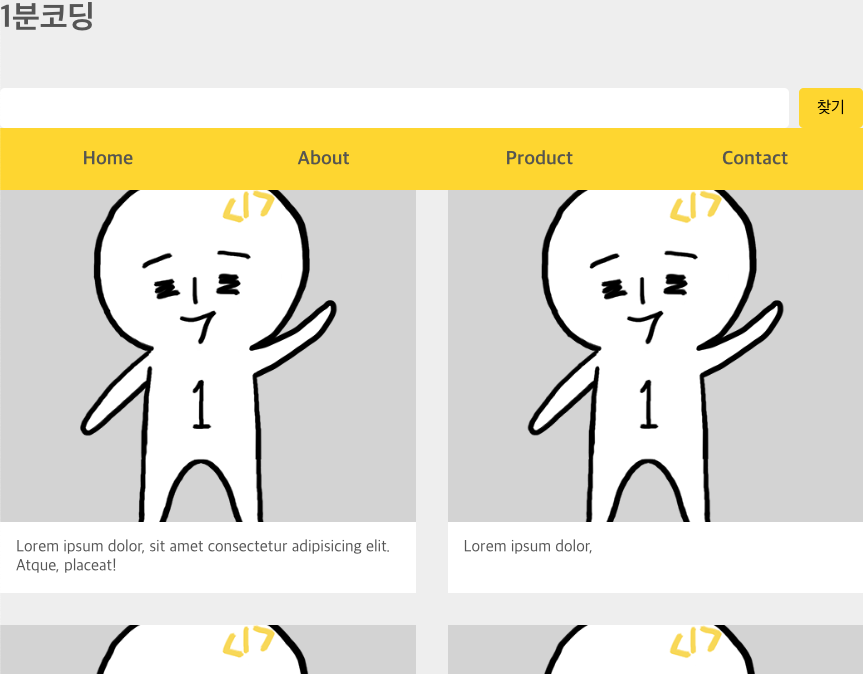
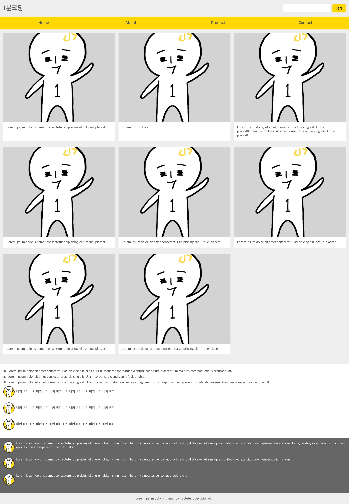

## Flex 반응형 페이지 만들기

Flex UI에서 만든 컴포넌트들을 하나의 페이지로 모아서 반응형 페이지를 만들어보도록 한다.



### Step 1

위 영역을 크게 헤더, 메뉴, 좌/우측 사이드바, 메인 콘텐츠, 푸터 이렇게 6가지 섹션으로 나눠볼 수 있다.
위 내용을 기존의 Flex UI에서 만든 컴포넌트를 이어 붙여 html 노드를 만들면 아래와 같다.

```html
<!DOCTYPE html>
<html>
  <head>
    <meta charset="UTF-8" />
    <meta name="viewport" content="width=device-width, initial-scale=1.0" />
    <meta http-equiv="X-UA-Compatible" content="ie=edge" />
    <title>CSS Flex</title>
    <link rel="stylesheet" href="../flex-ui/default.css" />
    <link rel="stylesheet" href="../flex-ui/ui.css" />
    <link rel="stylesheet" href="ui-page.css" />
  </head>
  <body>
    <div class="page">
      <!-- header -->
      <header class="header">
        <h1 class="website-title">1분코딩</h1>
        <form class="search-form">
          <input type="search" />
          <input type="submit" value="찾기" />
        </form>
      </header>
      <!-- menu -->
      <ul class="menu">
        <li class="menu-item">
          <a href="#" class="menu-link">Home</a>
        </li>
        <li class="menu-item">
          <a href="#" class="menu-link">About</a>
        </li>
        <li class="menu-item">
          <a href="#" class="menu-link">Product</a>
        </li>
        <li class="menu-item">
          <a href="#" class="menu-link">Contact</a>
        </li>
      </ul>

      <!-- primary -->
      <section class="primary">
        <div class="card-list-con">
          <ul class="card-list">
            <li class="card-item">
              <figure class="card-image" style="background-image: url(../images/ilbuni.png)"></figure>
              <div class="card-desc">Lorem ipsum dolor, sit amet consectetur adipisicing elit. Atque, placeat!</div>
            </li>
            <li class="card-item">
              <figure class="card-image" style="background-image: url(../images/ilbuni.png)"></figure>
              <div class="card-desc">Lorem ipsum dolor,</div>
            </li>
            <li class="card-item">
              <figure class="card-image" style="background-image: url(../images/ilbuni.png)"></figure>
              <div class="card-desc">
                Lorem ipsum dolor, sit amet consectetur adipisicing elit. Atque, placeat!Lorem ipsum dolor, sit amet
                consectetur adipisicing elit. Atque, placeat!
              </div>
            </li>
            <li class="card-item">
              <figure class="card-image" style="background-image: url(../images/ilbuni.png)"></figure>
              <div class="card-desc">Lorem ipsum dolor, sit amet consectetur adipisicing elit. Atque, placeat!</div>
            </li>
            <li class="card-item">
              <figure class="card-image" style="background-image: url(../images/ilbuni.png)"></figure>
              <div class="card-desc">Lorem ipsum dolor, sit amet consectetur adipisicing elit. Atque, placeat!</div>
            </li>
            <li class="card-item">
              <figure class="card-image" style="background-image: url(../images/ilbuni.png)"></figure>
              <div class="card-desc">Lorem ipsum dolor, sit amet consectetur adipisicing elit. Atque, placeat!</div>
            </li>
            <li class="card-item">
              <figure class="card-image" style="background-image: url(../images/ilbuni.png)"></figure>
              <div class="card-desc">Lorem ipsum dolor, sit amet consectetur adipisicing elit. Atque, placeat!</div>
            </li>
            <li class="card-item">
              <figure class="card-image" style="background-image: url(../images/ilbuni.png)"></figure>
              <div class="card-desc">Lorem ipsum dolor, sit amet consectetur adipisicing elit. Atque, placeat!</div>
            </li>
          </ul>
        </div>
      </section>

      <!-- secondary-a -->
      <aside class="secondary secondary-a">
        <ul class="info-list">
          <li class="info-list-item">
            Lorem ipsum dolor sit amet consectetur adipisicing elit. Nihil fugit numquam aspernatur excepturi, eos
            soluta praesentium maiores commodi minus accusantium?
          </li>
          <li class="info-list-item">
            Lorem ipsum dolor sit amet consectetur adipisicing elit. Ullam corporis reiciendis sunt fugiat nobis.
          </li>
          <li class="info-list-item">
            Lorem ipsum dolor sit amet consectetur adipisicing elit. Ullam consequatur alias, ducimus ea magnam nostrum
            repudiandae repellendus deleniti veniam? Assumenda expedita ad eum nihil!
          </li>
        </ul>
        <ul class="user-list message-list">
          <li class="user-item friend-item">
            <figure class="user-photo" style="background-image: url(../images/ilbuni.png)"></figure>
            <p class="user-name">비키 비키 비키 비키 비키 비키 비키 비키 비키 비키 비키 비키 비키 비키 비키</p>
          </li>
          <li class="user-item friend-item">
            <figure class="user-photo" style="background-image: url(../images/ilbuni.png)"></figure>
            <p class="user-name">비키 비키 비키 비키 비키 비키 비키 비키 비키 비키 비키 비키 비키 비키 비키</p>
          </li>
          <li class="user-item friend-item">
            <figure class="user-photo" style="background-image: url(../images/ilbuni.png)"></figure>
            <p class="user-name">비키 비키 비키 비키 비키 비키 비키 비키 비키 비키 비키 비키 비키 비키 비키</p>
          </li>
        </ul>
      </aside>
      <!-- secondary-b -->
      <aside class="secondary secondary-b">
        <ul class="user-list message-list">
          <li class="user-item message-item">
            <figure class="user-photo" style="background-image: url(../images/ilbuni.png)"></figure>
            <p class="message-content">
              Lorem ipsum dolor sit amet consectetur adipisicing elit. Iure nobis, nisi numquam harum voluptates vel
              corrupti dolorem id, dicta eveniet similique architecto et, exercitationem quaerat alias ratione. Dicta,
              beatae, aspernatur, sit commodi quis illo non aut repellendus veritatis at ab.
            </p>
          </li>
          <li class="user-item message-item">
            <figure class="user-photo" style="background-image: url(../images/ilbuni.png)"></figure>
            <p class="message-content">
              Lorem ipsum dolor sit amet consectetur adipisicing elit. Iure nobis, nisi numquam harum voluptates vel
              corrupti dolorem id, dicta eveniet similique architecto et, exercitationem quaerat alias ratione.
            </p>
          </li>
          <li class="user-item message-item">
            <figure class="user-photo" style="background-image: url(../images/ilbuni.png)"></figure>
            <p class="message-content">
              Lorem ipsum dolor sit amet consectetur adipisicing elit. Iure nobis, nisi numquam harum voluptates vel
              corrupti dolorem id.
            </p>
          </li>
        </ul>
      </aside>
      <!-- footer -->
      <footer class="footer"></footer>
    </div>
  </body>
</html>
```



### 전체적인 padding 레이아웃 잡기

```css
.header {
  display: flex;
  justify-content: space-between; /* .search-form { margin-left: auto; } 도 가능 */
  height: 80px;
  align-items: center;
  padding: 0 1rem;
}
.search-form {
  width: 300px;
  max-width: 60%; /* 브라우저 창이 로고를 물어갈 경우 대비(호..?) */
}
section.primary {
  padding: 1rem;
}
.secondary {
  padding: 1rem;
}
.secondary-a {
  background-color: white;
}
.secondary-b {
  color: white;
  background: #666;
}
.footer {
  padding: 1rem;
  text-align: center;
}
```

`header`는 `justify-content`로 로고와 검색창 사이를 그리거나, `.search-form`에 `maring-left: auto;` 를 넣어 처리할 수도 있다. `.search-form`에 `max-width`는 창 크기가 줄어들어 여유가 없을 때 최대 60%로 처리하여 자연스럽게 처리될 수 있도록 함.


