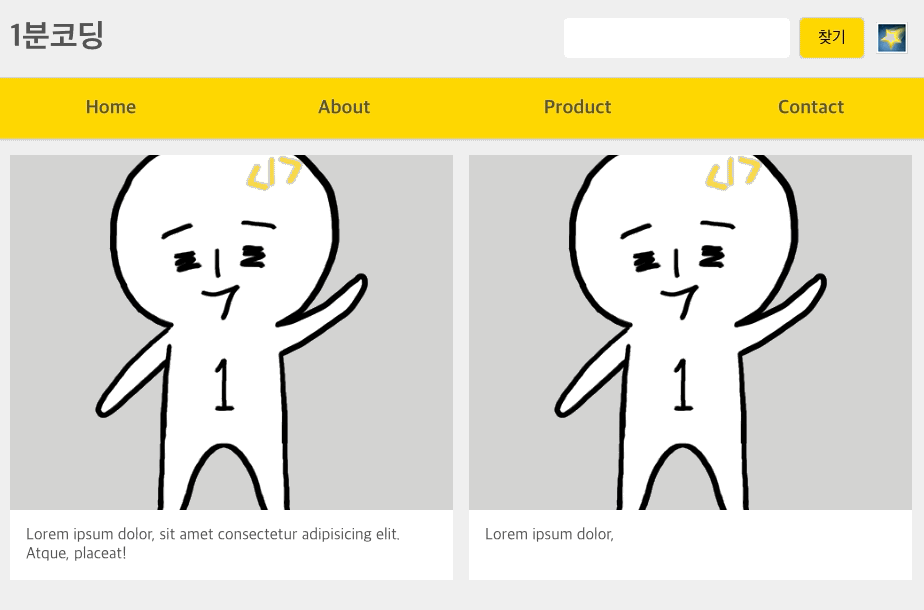

## Flex 반응형 페이지 만들기

Flex UI에서 만든 컴포넌트들을 하나의 페이지로 모아서 반응형 페이지를 만들어보도록 한다.


### Step 1

위 영역을 크게 헤더, 메뉴, 좌/우측 사이드바, 메인 콘텐츠, 푸터 이렇게 6가지 섹션으로 나눠볼 수 있다.
위 내용을 기존의 Flex UI에서 만든 컴포넌트를 이어 붙여 html 노드를 만들면 아래와 같다.

```html
<!DOCTYPE html>
<html>
  <head>
    <meta charset="UTF-8" />
    <meta name="viewport" content="width=device-width, initial-scale=1.0" />
    <meta http-equiv="X-UA-Compatible" content="ie=edge" />
    <title>CSS Flex</title>
    <link rel="stylesheet" href="../flex-ui/default.css" />
    <link rel="stylesheet" href="../flex-ui/ui.css" />
    <link rel="stylesheet" href="ui-page.css" />
  </head>
  <body>
    <div class="page">
      <!-- header -->
      <header class="header">
        <h1 class="website-title">1분코딩</h1>
        <form class="search-form">
          <input type="search" />
          <input type="submit" value="찾기" />
        </form>
      </header>
      <!-- menu -->
      <ul class="menu">
        <li class="menu-item">
          <a href="#" class="menu-link">Home</a>
        </li>
        <li class="menu-item">
          <a href="#" class="menu-link">About</a>
        </li>
        <li class="menu-item">
          <a href="#" class="menu-link">Product</a>
        </li>
        <li class="menu-item">
          <a href="#" class="menu-link">Contact</a>
        </li>
      </ul>

      <!-- primary -->
      <section class="primary">
        <div class="card-list-con">
          <ul class="card-list">
            <li class="card-item">
              <figure class="card-image" style="background-image: url(../images/ilbuni.png)"></figure>
              <div class="card-desc">Lorem ipsum dolor, sit amet consectetur adipisicing elit. Atque, placeat!</div>
            </li>
            <li class="card-item">
              <figure class="card-image" style="background-image: url(../images/ilbuni.png)"></figure>
              <div class="card-desc">Lorem ipsum dolor,</div>
            </li>
            <li class="card-item">
              <figure class="card-image" style="background-image: url(../images/ilbuni.png)"></figure>
              <div class="card-desc">
                Lorem ipsum dolor, sit amet consectetur adipisicing elit. Atque, placeat!Lorem ipsum dolor, sit amet
                consectetur adipisicing elit. Atque, placeat!
              </div>
            </li>
            <li class="card-item">
              <figure class="card-image" style="background-image: url(../images/ilbuni.png)"></figure>
              <div class="card-desc">Lorem ipsum dolor, sit amet consectetur adipisicing elit. Atque, placeat!</div>
            </li>
            <li class="card-item">
              <figure class="card-image" style="background-image: url(../images/ilbuni.png)"></figure>
              <div class="card-desc">Lorem ipsum dolor, sit amet consectetur adipisicing elit. Atque, placeat!</div>
            </li>
            <li class="card-item">
              <figure class="card-image" style="background-image: url(../images/ilbuni.png)"></figure>
              <div class="card-desc">Lorem ipsum dolor, sit amet consectetur adipisicing elit. Atque, placeat!</div>
            </li>
            <li class="card-item">
              <figure class="card-image" style="background-image: url(../images/ilbuni.png)"></figure>
              <div class="card-desc">Lorem ipsum dolor, sit amet consectetur adipisicing elit. Atque, placeat!</div>
            </li>
            <li class="card-item">
              <figure class="card-image" style="background-image: url(../images/ilbuni.png)"></figure>
              <div class="card-desc">Lorem ipsum dolor, sit amet consectetur adipisicing elit. Atque, placeat!</div>
            </li>
          </ul>
        </div>
      </section>

      <!-- secondary-a -->
      <aside class="secondary secondary-a">
        <ul class="info-list">
          <li class="info-list-item">
            Lorem ipsum dolor sit amet consectetur adipisicing elit. Nihil fugit numquam aspernatur excepturi, eos
            soluta praesentium maiores commodi minus accusantium?
          </li>
          <li class="info-list-item">
            Lorem ipsum dolor sit amet consectetur adipisicing elit. Ullam corporis reiciendis sunt fugiat nobis.
          </li>
          <li class="info-list-item">
            Lorem ipsum dolor sit amet consectetur adipisicing elit. Ullam consequatur alias, ducimus ea magnam nostrum
            repudiandae repellendus deleniti veniam? Assumenda expedita ad eum nihil!
          </li>
        </ul>
        <ul class="user-list message-list">
          <li class="user-item friend-item">
            <figure class="user-photo" style="background-image: url(../images/ilbuni.png)"></figure>
            <p class="user-name">비키 비키 비키 비키 비키 비키 비키 비키 비키 비키 비키 비키 비키 비키 비키</p>
          </li>
          <li class="user-item friend-item">
            <figure class="user-photo" style="background-image: url(../images/ilbuni.png)"></figure>
            <p class="user-name">비키 비키 비키 비키 비키 비키 비키 비키 비키 비키 비키 비키 비키 비키 비키</p>
          </li>
          <li class="user-item friend-item">
            <figure class="user-photo" style="background-image: url(../images/ilbuni.png)"></figure>
            <p class="user-name">비키 비키 비키 비키 비키 비키 비키 비키 비키 비키 비키 비키 비키 비키 비키</p>
          </li>
        </ul>
      </aside>
      <!-- secondary-b -->
      <aside class="secondary secondary-b">
        <ul class="user-list message-list">
          <li class="user-item message-item">
            <figure class="user-photo" style="background-image: url(../images/ilbuni.png)"></figure>
            <p class="message-content">
              Lorem ipsum dolor sit amet consectetur adipisicing elit. Iure nobis, nisi numquam harum voluptates vel
              corrupti dolorem id, dicta eveniet similique architecto et, exercitationem quaerat alias ratione. Dicta,
              beatae, aspernatur, sit commodi quis illo non aut repellendus veritatis at ab.
            </p>
          </li>
          <li class="user-item message-item">
            <figure class="user-photo" style="background-image: url(../images/ilbuni.png)"></figure>
            <p class="message-content">
              Lorem ipsum dolor sit amet consectetur adipisicing elit. Iure nobis, nisi numquam harum voluptates vel
              corrupti dolorem id, dicta eveniet similique architecto et, exercitationem quaerat alias ratione.
            </p>
          </li>
          <li class="user-item message-item">
            <figure class="user-photo" style="background-image: url(../images/ilbuni.png)"></figure>
            <p class="message-content">
              Lorem ipsum dolor sit amet consectetur adipisicing elit. Iure nobis, nisi numquam harum voluptates vel
              corrupti dolorem id.
            </p>
          </li>
        </ul>
      </aside>
      <!-- footer -->
      <footer class="footer"></footer>
    </div>
  </body>
</html>
```


### 전체 레이아웃 내 여백 반영

```css
.header {
  display: flex;
  justify-content: space-between; /* .search-form { margin-left: auto; } 도 가능 */
  height: 80px;
  align-items: center;
  padding: 0 1rem;
}
.search-form {
  width: 300px;
  max-width: 60%; /* 브라우저 창이 로고를 물어갈 경우 대비(호..?) */
}
section.primary {
  padding: 1rem;
}
.secondary {
  padding: 1rem;
}
.secondary-a {
  background-color: white;
}
.secondary-b {
  color: white;
  background: #666;
}
.footer {
  padding: 1rem;
  text-align: center;
}
```

`header`는 `justify-content`로 로고와 검색창 사이를 그리거나, `.search-form`에 `maring-left: auto;` 를 넣어 처리할 수도 있다. `.search-form`에 `max-width`는 창 크기가 줄어들어 여유가 없을 때 최대 60%로 처리하여 자연스럽게 처리될 수 있도록 함.

### 모달 액션 css로 구현하기

보통 모달 액션은 onclick 이벤트를 JavaScript 코드로 추가해 넣는다. 아래와 같이 말이다!

```html
<div class="page">
  <!-- header -->
  <header class="header">
    <h1 class="website-title">Flex코딩</h1>
    <form class="search-form">
      <input type="search" />
      <input type="submit" value="찾기" />
    </form>
    <div id="modal-switch">💟</div>
  </header>
</div>
```

```css
.header {
  display: flex;
  height: 80px;
  align-items: center;
  padding: 0 1rem;
}
.search-form {
  width: 300px;
  max-width: 60%; /* 브라우저 창이 로고를 물어갈 경우 대비 */
  margin-left: auto;
}
#modal-switch {
  font-size: 2rem;
}
```

위와 같이 변경 후 `#modal-switch` 태그에 클릭 이벤트를 추가하는 방식이 가장 기본적임. 하지만 `#modal-switch` 을 input으로 구현하면 css로도 클릭 이벤트를 구현할 수 있다.

```html
<body>
  <input type="checkbox" id="modal-switch" />
  <label for="modal-switch">
    <span>modal 열고 닫기</span>
  </label>
  <!-- modal -->
  <div class="modal">
    <div class="dialog">
      Lorem ipsum dolor sit amet consectetur adipisicing elit. Repudiandae ad delectus minima rem saepe, sunt aliquam
      vitae, perferendis laborum impedit ipsa, et soluta facilis libero alias numquam ratione voluptatem quod doloribus
      pariatur fuga quo? Sapiente, distinctio tempore cupiditate facere nobis nesciunt magnam cumque nemo quibusdam
      autem ea rerum exercitationem temporibus.
    </div>
  </div>
</body>
```

```css
.search-form {
  width: 300px;
  max-width: 60%;
  margin-left: auto; /* space-between 대신 적용 */
  margin-right: 3rem; /* label[for="modal-switch"] 자리 만들기 */
}
.modal {
  display: none;
  top: 80px;
}
#modal-switch:checked ~ .modal {
  /* 바로 다음 형제노드만 선택할 때는 + 사용 */
  display: flex;
}
#modal-switch:checked ~ label[for="modal-switch"]:before {
  content: "🌌"; /* 클릭했을 때 */
}
label[for="modal-switch"] {
  display: flex;
  align-items: center;
  justify-content: center;
  position: absolute;
  top: 1.3rem;
  right: 1rem;
  width: 40px;
  height: 40px;
}
label[for="modal-switch"]:before {
  content: "🌠";
  font-size: 2rem;
  line-height: initial;
  cursor: pointer;
}
/* 스크린리더, SEO 이슈가 있어 display:none; 혹은 width:0; 미사용, overflow 속성 사용 */
#modal-switch,
label[for="modal-switch"] span {
  position: absolute;
  width: 1px;
  height: 1px;
  overflow: hidden;
  opacity: 0;
  top: 0;
}
```



### 반응형 사이드바 구현

창이 조금 커졌을 때 사이드바가 노출되도록 스타일을 변경해본다.
해당 영역은 `primary`, `secondary-a`, `secondary-b` 가 `flex`로 배치되도록 구성해야하는데, 보통 해당 3개의 영역을 wrapper div로 감싸서 스타일 처리를 하는 방법을 썻다면, 이번에는 별도의 감싸는 태그 없이 3개의 태그에 flex 배치를 해보도록 한다.

```css
@media (min-width: 1024px) {
  .page {
    display: flex;
    flex-wrap: wrap;
  }
  .header,
  .menu {
    width: 100%;
  }
  .secondary {
    width: 20%;
  }
  .secondary-a {
    order: 1;
  }
  .primary {
    width: 60%;
    order: 2;
  }
  .secondary-b {
    order: 3;
  }
  .footer {
    order: 4;
    border-top: 1px solid lightgray;
    width: 100%;
  }
}

@media (min-width: 1400px) {
  .secondary {
    width: 300px; /* 화면이 너무 커졌을 때 sidebar width 고정 */
  }
  .primary {
    width: calc(100% - 600px);
    /* flex: 1 1 auto; */ /* flex를 썻을 때 자리를 못찾는 이슈 발생 > width로 사용 */
    /* flex: auto; */
  }
}
```


