## Grid 기본요소

Grid는 CSS 레이아웃의 끝판왕이라고 할 수 있다.
flex와 grid는 둘 다 레이아웃 배치에 사용되는데, 이 둘의 큰 차이점은 Flex는 한 방향 레이아웃 시스템(1차원)인 반면, grid는 두 방향(가로-세로) 레이아웃 시스템(2차원)이라는 점이다.

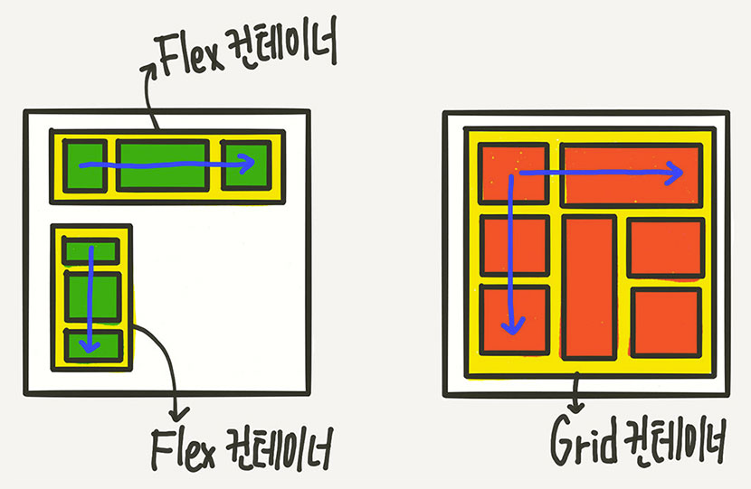

위와 같이 flex는 한 덩어리 안에서 가로, 세로 방향 중 한 방식을 결정하여 레이아웃을 짜는 반면 그리드는 한 덩어리 안에서 가로, 세로 방향을 모두 적용할 수 있어 활용할 수 있는 범위가 더 넓다.

그럼 grid가 flex를 대신할 수 있을까? 완전히 그렇진 않다. Flex 가 편한 방법이 있고, grid가 편한 방법이 있음. 따라서 둘 다 잘 알아야 한다! 보통 큰 골격 레이아웃은 grid로 세부 레이아웃은 Flex로 구현한다.

<aside>
✅ Grid는 IE에서 지원하지 않으므로 한국에서는 그림의 떡이다?
NoNo! IE 10, 11에서도 구버전 스펙(새 창)을 지원하기 때문에 귀찮지만 방법이 없는 것은 아님.
한계는 있지만 뭐가 다른지를 알아두고 대응하면 충분히 사용할 수 있다.

</aside>

그리드는 파이어폭스 개발자 도구에서 레이아웃을 명확하게 보여주는 기능을 가지므로, 해당 실습은 파이어폭스에서 진행한다.
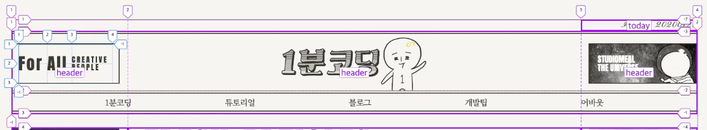

### 용어 정리

Grid 레이아웃을 만들기 위한 기본적인 HTML 구조는 Flex와 마찬가지로 컨테이너와 아이템만 있으면 된다.

```html
<div class="container">
  <div class="item">A</div>
  <div class="item">B</div>
  <div class="item">C</div>
  <div class="item">D</div>
  <div class="item">E</div>
</div>
```

```css
.container {
  display: grid;
}
```

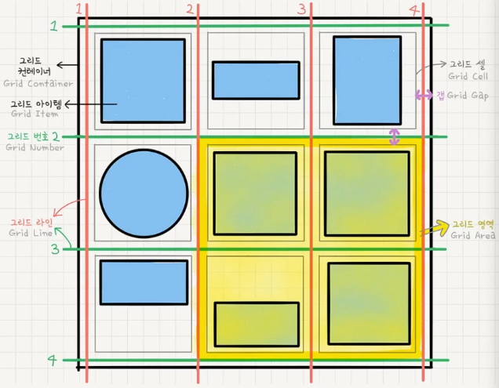

- 그리드 컨테이너(Grid Container)
  - 부모 요소인 div.container를 grid container(그리드 컨테이너)라고 부름
  - display: grid를 적용하는 grid의 전체 영역. grid 컨테이너 안의 요소들이 grid 규칙의 영향을 받아 정렬
- 그리드 아이템(Grid Item)
  - 자식 요소인 div.item들을 grid item(그리드 아이템)이라고 부름
  - grid 규칙에 의해 배치되는 요소
- 그리드 트랙(Grid Track)
  - grid의 행(Row) 또는 열(Column)
- 그리드 셀(Grid Cell)
  - grid의 한 칸을 가리킴 div 같은 실제 html 요소는 그리드 아이템, 이런 grid 아이템 하나가 들어가는 가상의 칸이라고 생각한다.
  - 위 그림에서 그리드 셀은 9개를 의미함
- 그리드 라인(Grid Line)
  - Grid 셀을 구분하는 선
- 그리드 번호(Grid Number)
  - Grid 라인의 각 번호
- 그리드 갭(Grid Gap)
  - Grid 셀 사이의 간격
- 그리드 영역(Grid Area)
  - Grid 라인으로 둘러싸인 사각형 영역으로 그리드 셀의

### 그리드 기본 형태

Grid도 Flex와 마찬가지로 Grid 컨테이너에 적용하는 속성과 Grid 아이템에 적용하는 속성으로 나뉜다.
Grid 레이아웃을 실습하기에 앞서 `default.css`가 기본 고정 스타일로 추가되는데, 여기에 아래 스타일이 Flex 대신에 추가된다고 보면 된다.

```css
.grid-container {
  padding: 10px;
  background: lightgray;
}
.grid-item {
  padding: 10px;
  border: 3px solid rgb(50, 50, 40);
  color: white;
  background: #ff6937;
}
```

- 그리드 형태 정의 : `grid-template-rows`, `grid-template-columns`

  - 컨테이너에 grid 트랙의 크리들을 지정해주는 속성, 여러단위를 사용할 수 있고 섞어 사용 가능함
  - `grid-template-columns`

    ```css
    .grid-container {
      display: grid;
      grid-template-columns: 100px 300px 200px;
    }
    ```

    위와 같은 스타일은 아래와 같은 결과를 도출한다.

    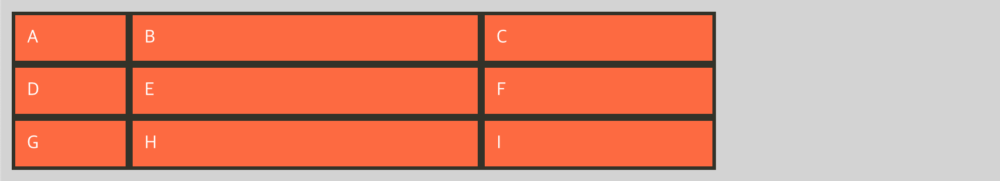

    ```css
    .grid-container {
      display: grid;
      grid-template-columns: 1fr 1fr; /* fr: fraction, 비, 비율, 분수, 부분 */
    }
    ```

    위 스타일은 아래와 같은 결과를 도출한다.

    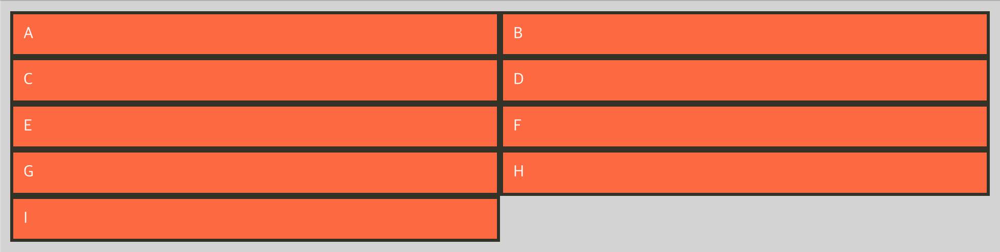

    ```css
    .grid-container {
      display: grid;
      grid-template-columns: 1fr 500px 1fr;
    }
    ```

    위 스타일은 아래와 같은 결과를 도출한다.

    ```css
    .grid-container {
      display: grid;
      /* grid-template-columns: 1fr 1fr 1fr 1fr 1fr; */
      grid-template-columns: repeat(5, 1fr); /* 1fr을 5번 반복하겠다. */
    }
    ```

    같은 속성값이 여러번 반복되면 repeat 을 써서 단축하여 작성할 수 있다.

    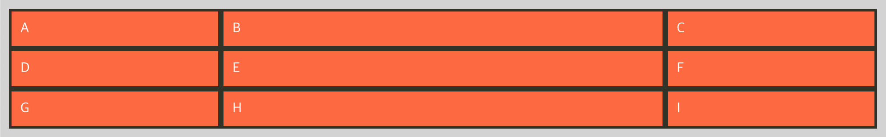

    ```css
    .grid-container {
      display: grid;
      grid-template-columns: repeat(3, 1fr 2fr 1fr);
    }
    ```

    repeat에 복수개의 속성을 부여할 수 있다.

    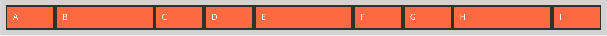

  - `grid-template-rows`

    - grid-template-columns에서 부여한 속성 모두 똑같이 사용 가능

    ```css
    .grid-container {
      display: grid;
      grid-template-columns: repeat(3, 1fr);
      grid-template-rows: 200px 200px 200px; /* rows 간 속성 */
    }
    ```

    위 속성은 아래와 같은 결과를 도출한다.
    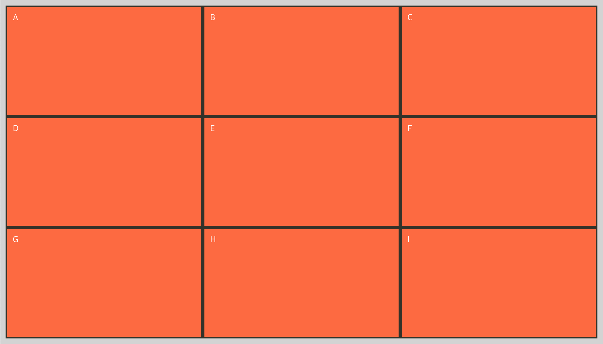

    ```css
    .grid-container {
      display: grid;
      grid-template-columns: repeat(3, 1fr);
      grid-template-rows: 200px 200px; /* 200px 200px auto;와 같음*/
    }
    ```

    row가 3개일 때 2개에 대한 속성만 부여할 경우 나머지는 기본 간격(auto)만 가져간다.
    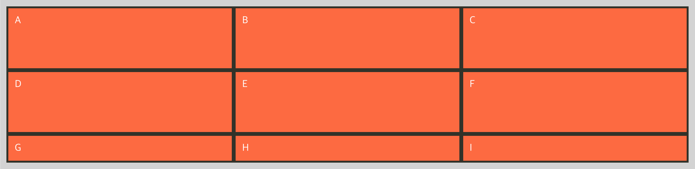

    ```css
    .grid-container {
      display: grid;
      grid-template-columns: repeat(3, 1fr);
      grid-template-rows: repeat(3, 1fr);
    }
    ```

    위와 같이 설정하면 아래와 같은 결과를 도출, 왜일까?
    display: block;은 높이값을 따로 가지지않기 때문에 늘어나지 않음
    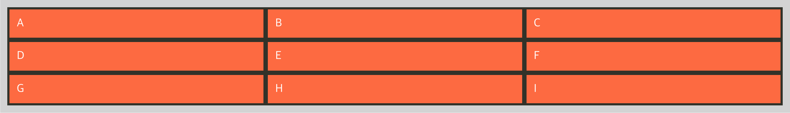
    만약 꽉 채우고 싶다면 어떻게 해야할까?
    별도의 height 값을 부여하면 됨. 이때 별도로 `grid-template-rows`를 부여하지 않아도 `height`값만 부여되면 해당 row 간격은 자동으로 늘어남. 참고!

    ```css
    .grid-container {
      display: grid;
      heigh: 50vh; /* grid-template-rows 별도 부여없어도 알아서 늘어난다. */
    }
    ```

    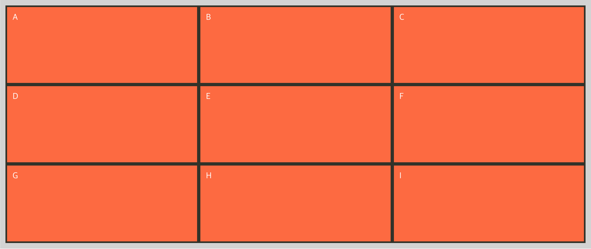

    ### 자동으로 채우기

grid는 기본적으로 자신이 가지고 있는 콘텐츠 만큼 크기가 맞춰진다.

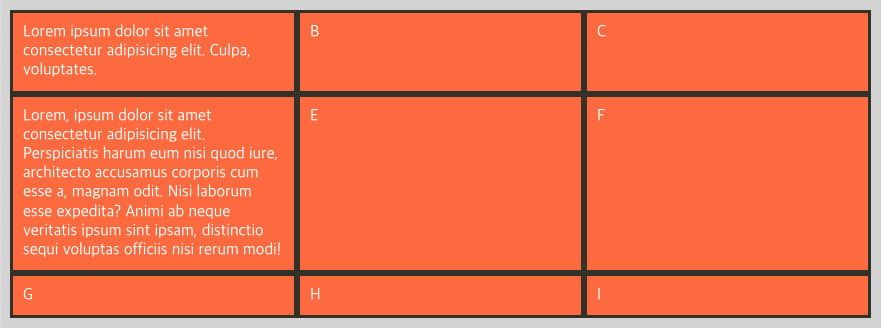

각 row 별로 높이가 똑같음. 만약 최소한 높이가 정해졌으면 좋겠다고 생각할 땐 어떻게할까?

- 최솟값, 최댓값 설정: `minmax(min, max)`
  ```css
  .grid-container {
    grid-template-columns: repeat(3, 1fr);
    grid-template-rows: repeat(3, minmax(100px, auto));
  }
  ```
  위와 같이 최솟값을 100px, 최댓값을 auto로 갖도록 설정하면 아래와 같은 결과를 가진다.
  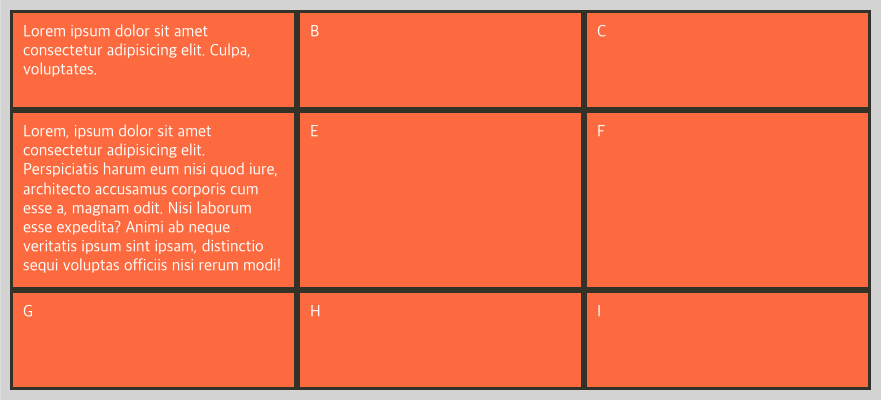
- 자동으로 채우기: `auto-fill`, `auto-fit`
  이번에는 `repeat` 함수 내에서 값 대신에 쓸 수 있는 방법을 알아보자
  `auto-fill`과 `auto-fit`은 `column`의 개수를 미리 정하지 않고 설정된 너비가 허용하는 한 최대한 셀을 채운다.
  먼저 `auto-fill`을 보자
  ```css
  .grid-container {
    display: grid;
    grid-template-columns: repeat(auto-fill, minmax(20%, auto));
  }
  ```
  위 속성은 아래와 같은 결과를 도출한다.
  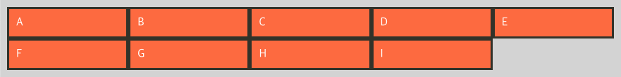
  최소 20%의 너비를 가지도록 하면서 너비가 허용하는 한 최대한 셀을 채우도록 하면 위와 같은 레이아웃을 가진다. 만약 `minmax(25%, auto)`로 설정했다면 첫번째에 4칸만 올라가는 형태일 것이다.
  위 속성을 사용해 별도의 미디어쿼리 없이 레이아웃을 구현할 수도 있다.
  ```css
  .grid-container {
    display: grid;
    grid-template-columns: repeat(auto-fill, minmax(200px, auto));
  }
  ```
  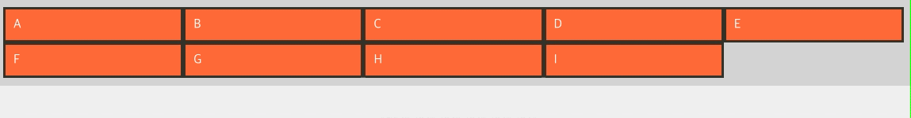
  다음은 auto-fit은 갯수가 모자랄 때, 나머지 여백을 채워주는 속성이다.
  ```html
  <div class="grid-container">
    <div class="grid-item">A</div>
    <div class="grid-item">B</div>
    <div class="grid-item">C</div>
  </div>
  ```
  ```css
  .grid-container {
    display: grid;
    grid-template-columns: repeat(auto-fit, minmax(200px, auto));
  }
  ```
  위와 같이 설정하면 grid-item이 200px을 가졌을 때 여백이 남을 경우 남은 공간을 각 div가 나눠갖는다.
  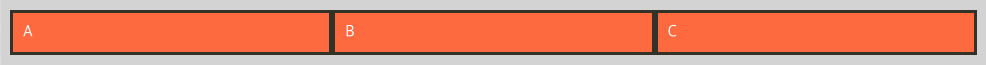
  각 활용하는 용도가 다르므로 필요한 상황에 맞춰서 사용한다.

### 셀 간격 만들기

그리드 셀 사이의 간격을 설정한다.

- 행과 행 사이의 간격: `row-gap`
- 열과 열 사이의 간격: `column-gap`
- 전체 간격: `gap` (구, grid-gap)

  ```css
  .grid-container {
    display: grid;
    grid-template-columns: repeat(3, 1fr);
    grid-template-rows: repeat(3, minmax(100px, auto));
    gap: 20px; /* grid-gap: 20px; */
    /* column-gap: 20px; */
    /* row-gap: 20px; */
  }
  ```

  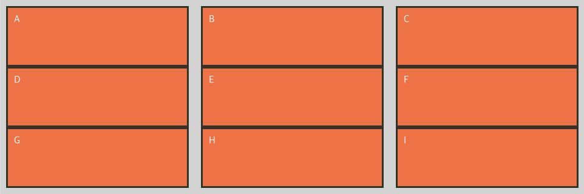

  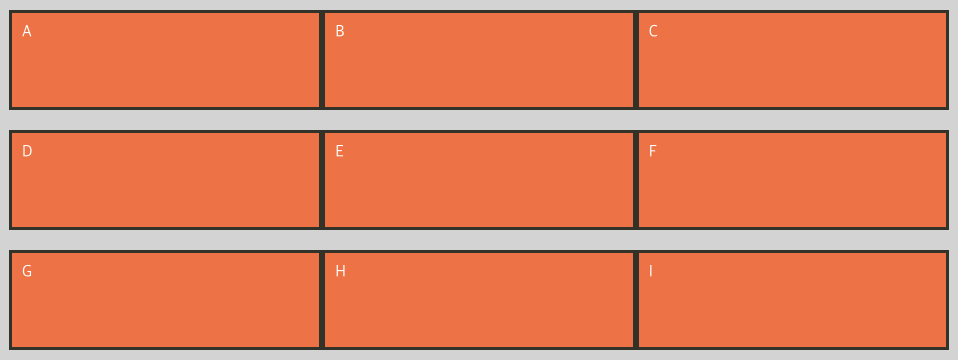

  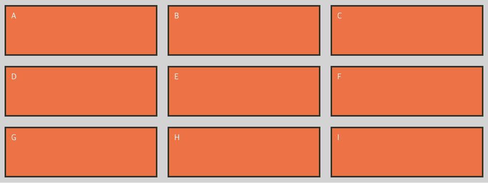
  단, gap 속성은 IE에서 지원되지 않으므로 별도의 margin이나 공백용 셀을 만드는 방법으로 개선한다.

### 그리드 자동 정의

그리드 형태를 자동으로 정의하는 하는 grid-auto-columns, grid-auto-rows에 대해 알아보자.
해당 속성은 통제를 벗어난 위치에 있는 트랙의 크기를 지정하는 속성이다.
”통제를 벗어난"이라는 게 무슨 의미일까? 아래와 같은 돔과 스타일이 설정되어있다고 하자

```html
<div class="grid-container">
  <div class="grid-item">A</div>
  <div class="grid-item">B</div>
  <div class="grid-item">C</div>
  <div class="grid-item">D</div>
  <div class="grid-item">
    Lorem ipsum dolor sit amet consectetur adipisicing elit. Eveniet asperiores rerum a. Atque pariatur eos hic
    laboriosam sint corporis numquam magni molestias, veritatis voluptatem commodi. Eos reiciendis nihil maiores facilis
    autem repellat, dolor sequi ea, cumque voluptatum temporibus libero ex labore ratione est qui necessitatibus
    repudiandae quae ab eveniet sunt.
  </div>
  <div class="grid-item">F</div>
  <div class="grid-item">G</div>
  <div class="grid-item">H</div>
  <div class="grid-item">I</div>
</div>
```

```css
.grid-container {
  display: grid;
  grid-template-columns: repeat(3, 1fr);
  grid-template-rows: repeat(2, minmax(100px, auto));
  gap: 20px;
}
```

위 스타일은 아래의 결과를 도출한다.

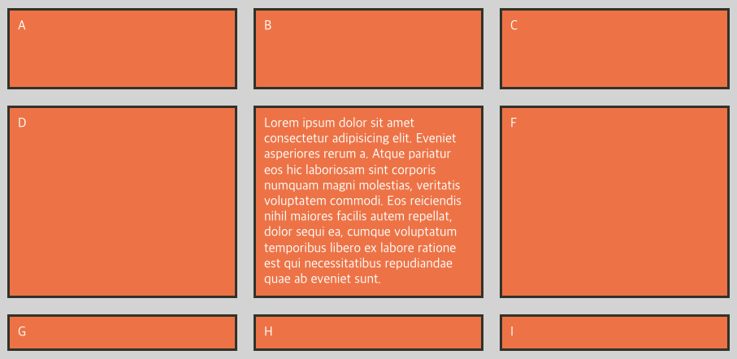

`grid-template-rows`의 `repeat` 속성이 2이므로 G, H, I는 100px의 높이를 가지지 못하는 한계가 있다. 이러한 통제를 벗어난 요소에 그리드를 자동으로 정의해주는 속성이 grid-auto-rows(columns)이다.(인피니트 스크롤 등으로 끊임없이 요소에 같은 속성이 적용되어야 할 때 사용하면 좋음)

```css
.grid-container {
  display: grid;
  grid-template-columns: repeat(3, 1fr);
  /* grid-template-rows: repeat(2, minmax(100px, auto)); */
  grid-auto-rows: minmax(100px, auto);
  gap: 20px;
}
```

따라서 위와 같이 grid-template-rows 속성을 grid-auto-rows로 변경하면 아래와 같이 도출된다.

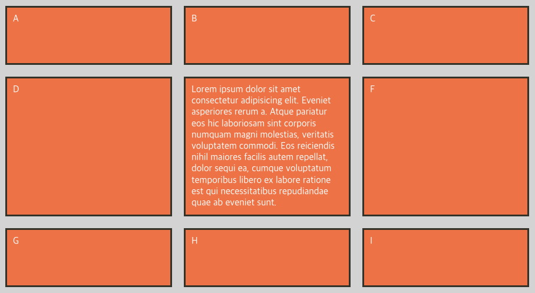
