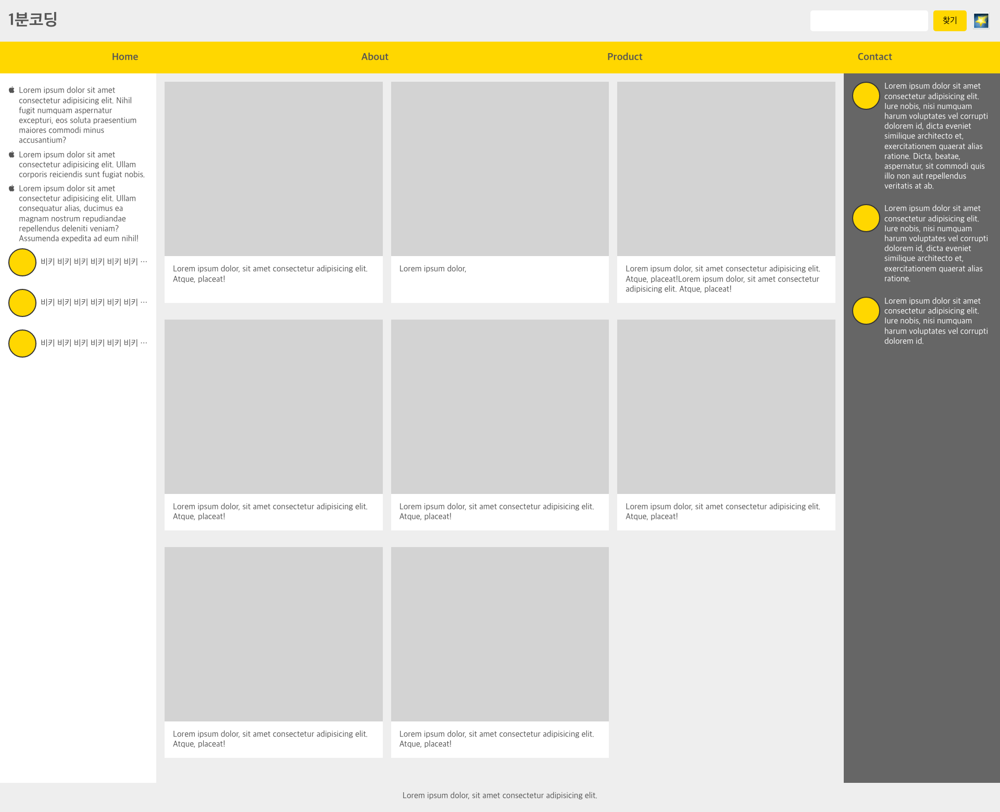

## Grid 반응형 페이지 만들기

### Grid 번호로 레이아웃 잡기

기존에 실습한 Flex 반응형 페이지를 Grid 기반으로 변경해본다. Grid는 상세한 배치보다는 전체 레이아웃에 적용시키는 경우가 많으므로 전체 레이아웃과 카드리스트를 Grid 기반으로 바꿔본다.

먼저 그리드로 영역을 어떻게 나눌지를 생각해보자. 셀들이 어떻게 나뉘어질지 생각해보면 된다.
그리드로 영역을 지정할 때는 1) 영역별로 번호로 스타일을 주는 방법과 2) 영역별로 이름을 지정하여 스타일을 주는 방법이 있다. 먼저 1번 방법으로 구현해본다.

```css
@media (min-width: 1024px) {
  .page {
    display: grid;
    grid-template-columns: 20% 1fr 20%; /* fr은 강제성이 없어서 퍼센트로 처리한다. */
  }
  .header {
    grid-column: 1 / 4;
    grid-row: 1 / 2;
  }
  .menu {
    grid-column: 1 / 4;
    grid-row: 2 / 3;
  }
  .primary {
    grid-column: 2 / 3;
    grid-row: 3 / 4;
  }
  .secondary-a {
    grid-column: 1 / 2;
    grid-row: 3 / 4;
  }
  .secondary-b {
    grid-column: 3 / 4;
    grid-row: 3 / 4;
  }
  .footer {
    grid-column: 1 / 4;
    grid-row: 4 / 5;
  }
}
/* 화면이 너무 커졌을 때 sidebar width를 고정하기 */
@media (min-width: 1400px) {
  .page {
    grid-template-columns: 300px 1fr 300px;
  }
}
```

전체 레이아웃을 구성했던 미디어쿼리 영역을 위와 같은 스타일로 변경해준다.
영역별로 숫자로 자리를 설정할 수 있어서 매우 편리함. 화면이 너무 커졌을 때에는 20%로 주던 간격을 300px로 고정하는 방법으로 레이아웃 처리를 해줄 수 있다.



### Grid 이름으로 레이아웃 잡기

이번에는 위 레이아웃을 grid-template-areas 속성으로 이름으로 레이아웃에 배치하는 것을 구현해본다.

```css
@media (min-width: 1024px) {
  .page {
    display: grid;
    grid-template-columns: 20% 1fr 20%;
    grid-template-areas:
      "header header header"
      "menu menu menu"
      "secondary-a primary secondary-b"
      "footer footer footer";
  }
  .header {
    grid-area: header;
  }
  .menu {
    grid-area: menu;
  }
  .primary {
    grid-area: primary;
  }
  .secondary-a {
    grid-area: secondary-a;
  }
  .secondary-b {
    grid-area: secondary-b;
  }
  .footer {
    grid-area: footer;
  }
}
```

위와 같이 하면 기존 넘버링으로 처리하던 레이아웃과 동일한 레이아웃으로 구현됨! 직관적이다.
