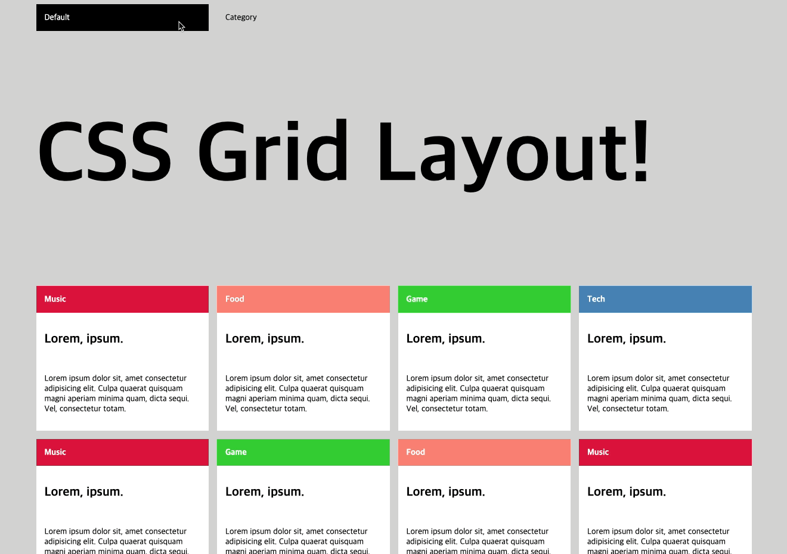
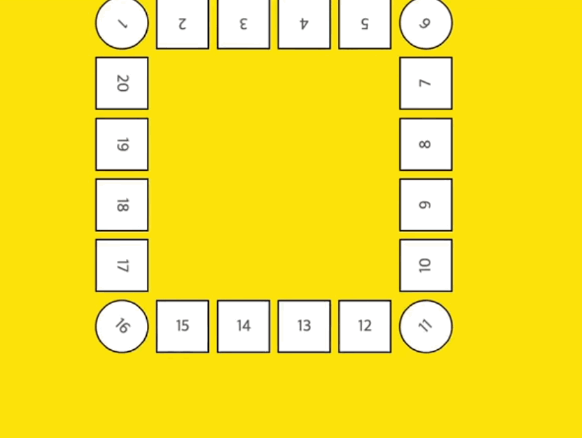
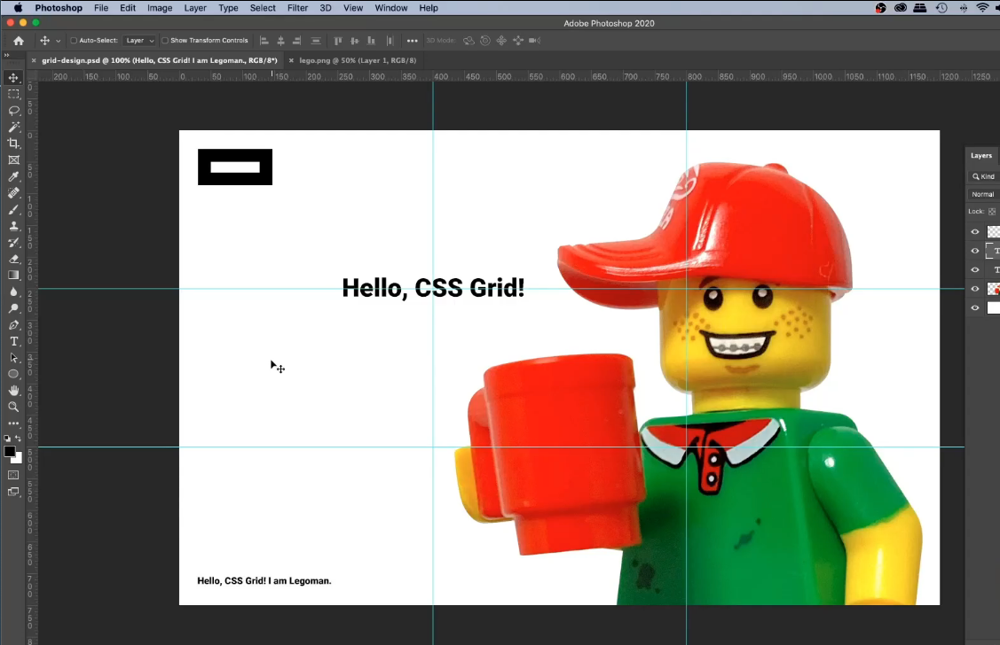

## Grid로 창의적인 레이아웃 구현하기

### 카테고리 정렬하기

이번에는 CSS 그리드를 활용해 아래의 여러 카테고리가 뒤섞인 카드리스트를 자바스크립트를 쓰지 않고 같은 카테고리의 카드끼리 정렬해보고자 한다.

```html
<article class="grid-container">
  <input type="radio" name="sort-control" value="default" id="radio-sort-default" />
  <label class="sort-label" for="radio-sort-default">Default</label>
  <input type="radio" name="sort-control" value="category" id="radio-sort-category" />
  <label class="sort-label" for="radio-sort-category">Category</label>

  <header class="page-header">
    <h1 class="site-title">CSS Grid Layout!</h1>
  </header>

  <section class="cate-sect cate-music">
    <header class="cate-sect-header">
      <div class="cate-name">Music</div>
      <h2 class="cate-sect-title">Lorem, ipsum.</h2>
    </header>
    <p class="cate-sect-cont">
      Lorem ipsum dolor sit, amet consectetur adipisicing elit. Culpa quaerat quisquam magni aperiam minima quam, dicta
      sequi. Vel, consectetur totam.
    </p>
  </section>

  <section class="cate-sect cate-food">
    <header class="cate-sect-header">
      <div class="cate-name">Food</div>
      <h2 class="cate-sect-title">Lorem, ipsum.</h2>
    </header>
    <p class="cate-sect-cont">
      Lorem ipsum dolor sit, amet consectetur adipisicing elit. Culpa quaerat quisquam magni aperiam minima quam, dicta
      sequi. Vel, consectetur totam.
    </p>
  </section>

  <section class="cate-sect cate-game">
    <header class="cate-sect-header">
      <div class="cate-name">Game</div>
      <h2 class="cate-sect-title">Lorem, ipsum.</h2>
    </header>
    <p class="cate-sect-cont">
      Lorem ipsum dolor sit, amet consectetur adipisicing elit. Culpa quaerat quisquam magni aperiam minima quam, dicta
      sequi. Vel, consectetur totam.
    </p>
  </section>

  <section class="cate-sect cate-tech">
    <header class="cate-sect-header">
      <div class="cate-name">Tech</div>
      <h2 class="cate-sect-title">Lorem, ipsum.</h2>
    </header>
    <p class="cate-sect-cont">
      Lorem ipsum dolor sit, amet consectetur adipisicing elit. Culpa quaerat quisquam magni aperiam minima quam, dicta
      sequi. Vel, consectetur totam.
    </p>
  </section>

  <!-- sections.. -->
</article>
```

위와 같은 돔이 있다고 했을 떄 기본 스타일은 아래와 같다.

```css
html {
  font-size: 87.5%; /* 14px */
  font-family: Roboto, "Noto Sans KR", sans-serif;
  -moz-osx-font-smoothing: grayscale;
  text-rendering: optimizeLegibility !important;
}
body {
  background: lightgray;
}
img {
  max-width: 100%;
  height: auto;
}
.grid-container {
  display: grid;
  grid-template-columns: repeat(4, 1fr);
  grid-gap: 1rem;
  max-width: 1200px;
  margin: 0 auto;
}
.page-header {
  grid-column: 1/5;
}
.page-footer {
  grid-column: 1/5;
  padding: 1rem 0 3rem;
  font-size: 0.8rem;
}
.site-title {
  font-size: 10rem;
  font-family: "Roboto Condensed";
}
.cate-sect {
  background: white;
}
.cate-name {
  padding: 1rem;
  font-weight: bold;
  color: white;
}
.cate-music .cate-name {
  background: crimson;
}
.cate-game .cate-name {
  background: limegreen;
}
.cate-food .cate-name {
  background: salmon;
}
.cate-tech .cate-name {
  background: steelblue;
}
.cate-sect-cont {
  padding: 1rem;
}
.cate-sect-title {
  padding: 1rem;
}
input[name="sort-control"] {
  position: absolute;
  left: -1000rem;
}
.sort-label {
  padding: 1rem;
  cursor: pointer;
}
:checked + .sort-label {
  color: white;
  background: black;
}
```

핵심은 category input이 checked 된 상태일 떄, 정렬되도록 보여주는 것이다.
아래 처리한 스타일 소스를 보자

```css
/* category가 체크되었을 때 cate-music을 grid-row 3/4행으로 */
#radio-sort-category:checked ~ .cate-music {
  grid-row: 3/4;
}
/* category가 체크되었을 때 cate-food을 grid-row 4/5행으로 */
#radio-sort-category:checked ~ .cate-food {
  grid-row: 4/5;
}
/* category가 체크되었을 때 cate-game을 grid-row 5/6행으로 */
#radio-sort-category:checked ~ .cate-game {
  grid-row: 5/6;
}
/* category가 체크되었을 때 cate-tech을 grid-row 6/7행으로 */
#radio-sort-category:checked ~ .cate-tech {
  grid-row: 6/7;
}
```

위와 같이 `grid-row`로 checked 시 특정 클래스의 요소에 스타일을 부여함으로써 원하는 레이아웃으로 배치할 수 있다. 위와 같은 레이아웃은 여러 랜덤 아이템을 정렬 기능으로 보여주고자 할 때 유용하게 쓰일 수 있음 🙂



### 3D 보드게임판

3D 보드게임판을 그리드를 이용해 손쉽게 구현할 수 있다.

```html
<div class="game">
  <div class="tile">
    <input type="radio" name="tile" id="tile1" />
    <label for="tile1">1</label>
  </div>
  <div class="tile">
    <input type="radio" name="tile" id="tile2" />
    <label for="tile2">2</label>
  </div>
  <div class="tile">
    <input type="radio" name="tile" id="tile3" />
    <label for="tile3">3</label>
  </div>
  <div class="tile">
    <input type="radio" name="tile" id="tile4" />
    <label for="tile4">4</label>
  </div>
  <div class="tile">
    <input type="radio" name="tile" id="tile5" />
    <label for="tile5">5</label>
  </div>
  <div class="tile">
    <input type="radio" name="tile" id="tile6" />
    <label for="tile6">6</label>
  </div>
  <div class="tile">
    <input type="radio" name="tile" id="tile7" />
    <label for="tile7">7</label>
  </div>
  <div class="tile">
    <input type="radio" name="tile" id="tile8" />
    <label for="tile8">8</label>
  </div>
  <div class="tile">
    <input type="radio" name="tile" id="tile9" />
    <label for="tile9">9</label>
  </div>
  <div class="tile">
    <input type="radio" name="tile" id="tile10" />
    <label for="tile10">10</label>
  </div>
  <div class="tile">
    <input type="radio" name="tile" id="tile11" />
    <label for="tile11">11</label>
  </div>
  <div class="tile">
    <input type="radio" name="tile" id="tile12" />
    <label for="tile12">12</label>
  </div>
  <div class="tile">
    <input type="radio" name="tile" id="tile13" />
    <label for="tile13">13</label>
  </div>
  <div class="tile">
    <input type="radio" name="tile" id="tile14" />
    <label for="tile14">14</label>
  </div>
  <div class="tile">
    <input type="radio" name="tile" id="tile15" />
    <label for="tile15">15</label>
  </div>
  <div class="tile">
    <input type="radio" name="tile" id="tile16" />
    <label for="tile16">16</label>
  </div>
  <div class="tile">
    <input type="radio" name="tile" id="tile17" />
    <label for="tile17">17</label>
  </div>
  <div class="tile">
    <input type="radio" name="tile" id="tile18" />
    <label for="tile18">18</label>
  </div>
  <div class="tile">
    <input type="radio" name="tile" id="tile19" />
    <label for="tile19">19</label>
  </div>
  <div class="tile">
    <input type="radio" name="tile" id="tile20" />
    <label for="tile20">20</label>
  </div>
</div>
```

총 20번 타일까지 존재하는 .game 컨테이너 돔을 위처럼 구현한다.
각 타일별 스타일을 grid로 구현한 것인데, 아래와 같이 구현했다.

```css
body {
  display: flex;
  align-items: center;
  justify-content: center;
  perspective: 1000px;
  color: black;
  background: #fff000;
}
.game {
  display: grid;
  grid-template-rows: repeat(6, 11vmin); /* vmin: vh,vw 중 작은 수치를 잡아낸다. 높이가 작을 경우 11% * vh를 의미함 */
  grid-template-columns: repeat(6, 11vmin);
  gap: 1vw;
  transform: rotateX(0deg) rotateZ(0deg);
  transform-style: preserve-3d;
  animation: starting 2s 0.5s forwards;
}
.tile {
  /* overflow: hidden; */
  /* overflow: hidden이 되어있으면 3D 효과 안됨 */
  position: relative;
  border: 3px solid black;
  font-size: 2rem;
  transform-style: preserve-3d;
}
.tile label {
  display: flex;
  align-items: center;
  justify-content: center;
  width: 100%;
  height: 100%;
  background: #fff;
  transform-style: preserve-3d;
  cursor: pointer;
}
.tile label:hover {
  color: white;
  background: dodgerblue;
}
.tile input {
  position: absolute;
  opacity: 0;
}
.tile input:checked + label {
  color: white;
  background: crimson;
}
.tile input:checked + label:before {
  content: "";
  position: absolute;
  display: block;
  width: 100px;
  height: 100px;
  background: url(images/ilbuni.png) no-repeat center;
  background-size: contain;
  border-radius: 50%;
  animation: dongdong 0.22s infinite alternate;
}
.tile:nth-child(1) {
  grid-row: 1;
  grid-column: 1;
  transform: rotate(135deg);
  border-radius: 50%;
}
.tile:nth-child(2) {
  grid-row: 1;
  transform: rotate(180deg);
}
.tile:nth-child(3) {
  grid-row: 1;
  transform: rotate(180deg);
}
.tile:nth-child(4) {
  grid-row: 1;
  transform: rotate(180deg);
}
.tile:nth-child(5) {
  grid-row: 1;
  transform: rotate(180deg);
}
.tile:nth-child(6) {
  grid-row: 1;
  transform: rotate(225deg);
  border-radius: 50%;
}
.tile:nth-child(7) {
  grid-row: 2;
  grid-column: 6;
  transform: rotate(270deg);
}
.tile:nth-child(8) {
  grid-row: 3;
  grid-column: 6;
  transform: rotate(270deg);
}
.tile:nth-child(9) {
  grid-row: 4;
  grid-column: 6;
  transform: rotate(270deg);
}
.tile:nth-child(10) {
  grid-row: 5;
  grid-column: 6;
  transform: rotate(270deg);
}
.tile:nth-child(11) {
  grid-row: 6;
  grid-column: 6;
  transform: rotate(315deg);
  border-radius: 50%;
}
.tile:nth-child(12) {
  grid-row: 6;
  grid-column: 5;
}
.tile:nth-child(13) {
  grid-row: 6;
  grid-column: 4;
}
.tile:nth-child(14) {
  grid-row: 6;
  grid-column: 3;
}
.tile:nth-child(15) {
  grid-row: 6;
  grid-column: 2;
}
.tile:nth-child(16) {
  grid-row: 6;
  grid-column: 1;
  transform: rotate(45deg);
  border-radius: 50%;
}
.tile:nth-child(17) {
  grid-row: 5;
  transform: rotate(90deg);
}
.tile:nth-child(18) {
  grid-row: 4;
  transform: rotate(90deg);
}
.tile:nth-child(19) {
  grid-row: 3;
  transform: rotate(90deg);
}
.tile:nth-child(20) {
  grid-row: 2;
  transform: rotate(90deg);
}

.tile:nth-child(1) label,
.tile:nth-child(6) label,
.tile:nth-child(11) label,
.tile:nth-child(16) label {
  border-radius: 50%;
}
```

초기 게임판 init 시 동작하는 3D 애니메이션과 통통 튀는 인터렉티브 스타일은 anmation 요소로 구현한 것이다.

```css
@keyframes starting {
  from {
    transform: rotateX(0deg) rotateZ(0deg);
  }
  to {
    transform: rotateX(60deg) rotateZ(240deg);
  }
}
@keyframes dongdong {
  from {
    transform: translateZ(30px) rotateX(-90deg) scaleY(0.7);
  }
  to {
    transform: translateZ(60px) rotateX(-90deg);
  }
}
```



### 그리드 기반 디자인을 코드로 옮기기

이번 시간에는 그리드 레이아웃을 기반으로 디자인한 작업물을 그대로 코드로 옮기는 것을 구현해보고자 한다.
보통 디자이너는 그리드를 기반으로 디자인을 하기 때문에 해당 작업이 좋은 경험이 될 수 있다.

순서는 먼저 포토샵으로 디자인을 구현한 뒤 → 코드로 옮기는 순으로 진행한다.



위와 같이 포토샵에서 그리드 기반으로 디자인이 완료되었다는 가정하에 해당 레이아웃을 실제 코드로 구현해본다.

```html
<div class="page">
  <div class="logo-container">
    <div class="logo"></div>
  </div>
  <div class="message">
    <p>Hello, CSS Grid!</p>
  </div>
  <footer class="footer">
    <p>Lorem ipsum dolor sit amet consectetur adipisicing.</p>
  </footer>
</div>
```

위와 같이 간단하게 돔을 구현했다.

```css
body {
  font-family: Roboto, sans-serif;
  font-weight: 900;
  color: #222;
  background: url(images/lego.png) no-repeat white; /* 레고 이미지를 background로 넣어준다 */
  background-position: calc(50% + 22vw) 0; /* 창 사이즈에 비례해서 움직이도록 처리 */
  background-size: calc(300px + 40vw) auto; /* 고정크기 + 가변크기를 하면 기본 width는 보장된다. */
}
.page {
  display: grid;
  grid-template-columns: repeat(3, 1fr); /* 3 * 3 격자 생성 */
  grid-template-rows: repeat(3, 1fr); /* 3 * 3 격자 생성 (1fr > 33.3333vh도 가능) */
  height: 100vh;
}
.logo-container {
  grid-column: 1; /* .message와 같은 그리드 공간을 공유하므로 정확하게 명시 */
  grid-row: 1; /* .message와 같은 그리드 공간을 공유하므로 정확하게 명시 */
  padding: 30px;
}
.logo {
  width: 100px;
  height: 50px;
  border: 20px solid #222;
}
.message {
  grid-column: 1 / 3; /* 칸을 2 * 2로 지정 */
  grid-row: 1 / 3; /* 칸을 2 * 2로 지정 */
  justify-self: center; /* 2 * 2에서 가운데 정렬 */
  align-self: center; /* 2 * 2에서 가운데 정렬 */
  /* font-size: 3rem; */
  /* font-size: 3.5vw; */
  font-size: calc(20px + 2.5vw);
  text-align: center;
}
.footer {
  /* grid-column: 1 / 3; */
  grid-column: 1 / span 2; /* 글자 개행이 되지 않도록 1-2칸 차지하도록 처리 */
  grid-row: 3;
  align-self: end; /* 맨 끝으로 가도록 처리 */
  padding: 30px;
}
```

### 그리드 기반 디자인을 코드로 옮기기 - 반응형 구현

```css
.message {
  /* styles... */
  font-size: calc(20px + 2.5vw); /* 크기가 20px 이하로는 절대 안 작아진다. */
}

@media (orientation: portrait) {
  /* landscape: 세로모드, portrait: 가로모드 */
  body {
    background-position: calc(50% + 27vw) 100%;
    background-size: calc(450px + 40vw) auto;
  }
  .page {
    grid-template-rows: repeat(4, 1fr);
  }
  .logo {
    width: 70px;
    height: 35px;
    border-width: 15px;
  }
  .footer {
    font-size: 0.8rem;
    grid-row: 4;
  }
}
```

반응형 구현 시 max-width로 스타일을 분기하지 않고, 세로모드인지 가로모드인지를 체크하는 orientation 속성으로 스타일을 처리해주면 매우 깔끔하게 레이아웃을 구현할 수 있다. (작은 가로형에서도 동일한 레이아웃을 유지할 수 있음) 또, 필요에 따라 grid-template을 3에서 4로 바꿔 레이아웃을 운영하는 것도 좋은 방법이다 : )


