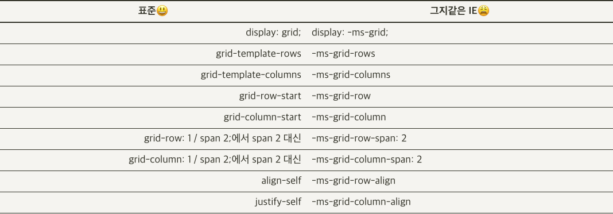
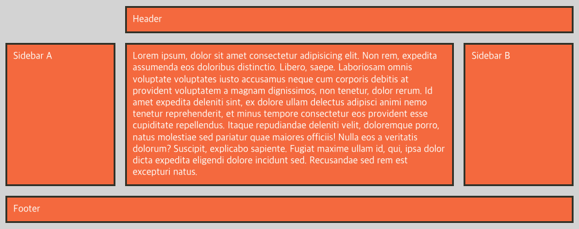
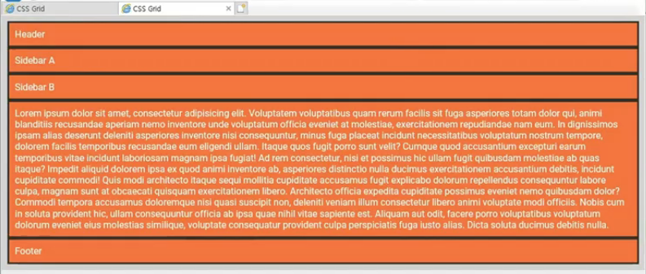

## IE에서 Grid 사용하기

### 속성 비교

이번 시간에는 IE에서 Grid를 사용하는 방법을 정리해본다.
먼저 IE 10,11부터 Grid 지원이 된다. 한계가 있지만 적절히 사용하면 충분히 상용 서비스에도 적용할 수 있음



위 표를 참고하자

### IE에 Grid 레이아웃 적용하기

챕터1에서 영역 이름으로 그리드를 정의하는 것을 배우면서 만들어본 레이아웃을 그대로 IE에서도 동일하게 적용해보도록 한다. 아래의 HTML 구조와 CSS를 설정값을 가진 자료이다.

```html
<!DOCTYPE html>
<html>
  <style>
    .grid-container {
      display: grid;
      gap: 1rem;
      grid-template-columns: 1fr 3fr 1fr;
      grid-template-areas:
        ". header header"
        "sidebar-a main sidebar-b"
        "footer footer footer";
    }
    .header {
      grid-area: header;
    }
    .sidebar-a {
      grid-area: sidebar-a;
    }
    .main {
      grid-area: main;
    }
    .sidebar-b {
      grid-area: sidebar-b;
    }
    .footer {
      grid-area: footer;
    }
  </style>
  <body>
    <div class="grid-container">
      <div class="header grid-item">Header</div>
      <div class="sidebar-a grid-item">Sidebar A</div>
      <div class="sidebar-b grid-item">Sidebar B</div>
      <div class="main grid-item">
        Lorem ipsum, dolor sit amet consectetur adipisicing elit. Non rem, expedita assumenda eos doloribus distinctio.
        Libero, saepe. Laboriosam omnis voluptate voluptates iusto accusamus neque cum corporis debitis at provident
        voluptatem a magnam dignissimos, non tenetur, dolor rerum. Id amet expedita deleniti sint, ex dolore ullam
        delectus adipisci animi nemo tenetur reprehenderit, et minus tempore consectetur eos provident esse cupiditate
        repellendus. Itaque repudiandae deleniti velit, doloremque porro, natus molestiae sed pariatur quae maiores
        officiis! Nulla eos a veritatis dolorum? Suscipit, explicabo sapiente. Fugiat maxime ullam id, qui, ipsa dolor
        dicta expedita eligendi dolore incidunt sed. Recusandae sed rem est excepturi natus.
      </div>
      <div class="footer grid-item">Footer</div>
    </div>
  </body>
</html>
```

위 자료는 크롬이나 파이어폭스에서 아래와 같은 레이아웃을 구현한다.



이를 IE에서 오픈하면 아래와 같이 노출됨



IE에서는 각 요소의 자리를 직접 다 지정해줘야한다는 불편함이 있지만, float 속성 등을 이용해 구현한 레이아웃보다 훨씬 더 심플하고 직관적이며 css 양도 효과적으로 줄일 수 있다. 따라서 아래와 같이 설정하여 grid를 지속적으로 이용하는 것이 바람직하겠다.

```css
.grid-container {
  display: -ms-grid;
  display: grid;
  gap: 1rem; /* IE 미지원 */
  -ms-grid-columns: 1fr 3fr 1fr;
  grid-template-columns: 1fr 3fr 1fr;
}
.header {
  -ms-grid-column: 2; /* 2에서 시작 */
  -ms-grid-column-span: 2;
  grid-column: 2 / span 2;
  -ms-grid-row: 1;
  grid-row: 1;
  margin: 0 0 1rem 1rem; /* gap 대신 */
}
.sidebar-a {
  -ms-grid-column: 1;
  grid-column: 1;
  -ms-grid-row: 2;
  grid-row: 2;
}
.main {
  -ms-grid-column: 3;
  grid-column: 2;
  -ms-grid-row: 2;
  grid-row: 2;
  margin: 0 1rem; /* gap 대신 */
}
.sidebar-b {
  -ms-grid-column: 2;
  grid-column: 3;
  -ms-grid-row: 2;
  grid-row: 2;
}
.footer {
  -ms-grid-column: 1;
  -ms-grid-column-span: 3;
  grid-column: 1 / span 3;
  -ms-grid-row: 3;
  grid-row: 3;
  margin-top: 1rem; /* gap 대신 */
}
```

위처럼 `-ms-`타입의 속성을 추가해주면 크롬 브라우저와 동일한 레이아웃으로 적용되는 것을 확인할 수 있다.
