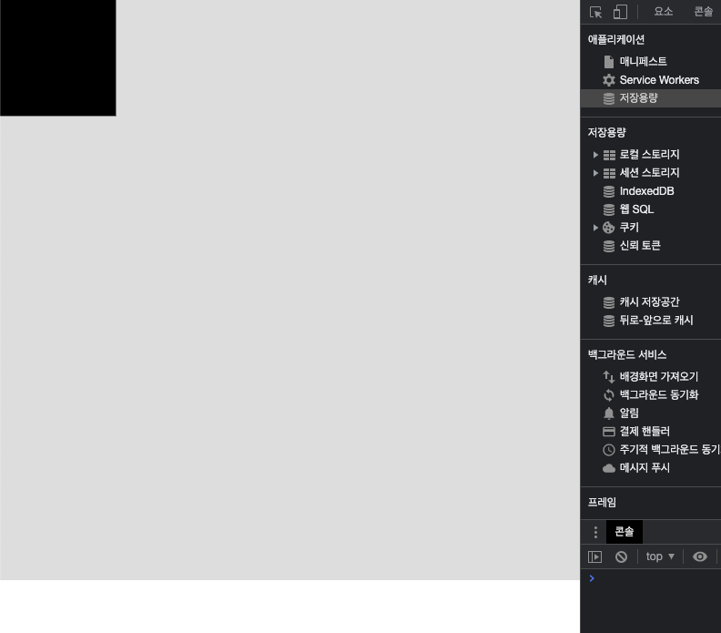
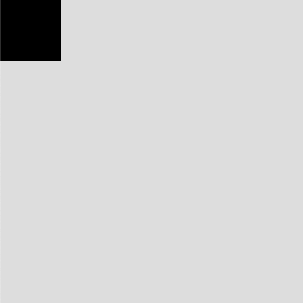
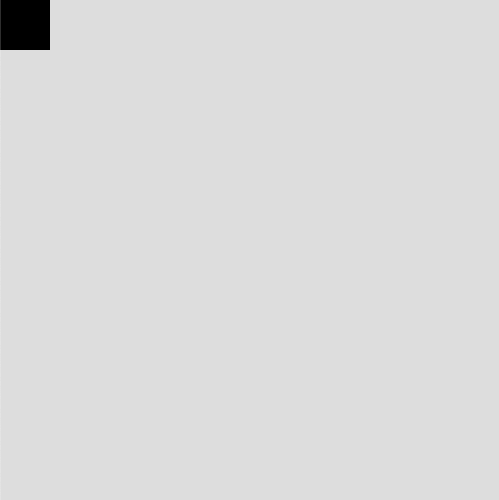

## SVG 개념과 기본적인 사용법

---

### SVG란

확장 가능한 벡터 그래픽(Scalable Vector Graphics) - 점과 점 사이의 계산을 이용한다.
XML 기반의 2차원 그래픽
아이콘, 이미지, 그래프, 사용자 인터페이스(UI) 등에 널리 사용됨
DOM의 일부로 각 개체별로 HTML 엘리먼트가 추가됨
벡터이기 때문에 이미지 크기에 상관없이 선명하게 유지되며, 모양이 많이 복잡하지 않으면 파일 사이즈도 작다.
CSS와 자바스크립트를 이용해 조작이 가능
크기(width, height)가 큰 이미지 표현에 유리
모양이 복잡하고 개체수가 많을 수록 성능이 떨어진다. (웹에서 아이콘 등에 많이 사용)

### 캔버스(Canvas)란

비트맵 기반 그래픽 - 픽셀 기반
이미지나 비디오의 픽셀 조작, 게임, 퍼포먼스가 중요한 이미지 조작 등에 쓰임
단일 태그 `<canvas>`로 표현
자바스크립트를 이용해 조작은 가능하나 CSS는 불가
픽셀 단위의 조작이 가능하여 일반 HTML 엘리먼트로는 불가능한 다양한 표현이 가능
조수준(low-level) API로 코딩량이 많고 까다로움
크기가 커질수록 성능이 떨어짐

### HTML 문서에 SVG를 넣는 여러가지 방법들

- `` 태그
  ```html
  <html>
    <head></head>
    <body>
      
    </body>
  </html>
  ```
- CSS Background
  ```html
  <html>
    <head>
      <style>
        .svg {
        	width: 300px;
        	height: 300p[x;
        	background: url('images/studiomeal.svg') no-repeat 0 0;
        }
      </style>
    </head>
    <body>
      <div class="svg"></div>
    </body>
  </html>
  ```
- SVG 요소들을 직접 inline으로 삽입
  ```html
  <html>
    <head> </head>
    <body>
      <?xml version="1.0" encoding="utf-8"?>
      <!-- Generator: Adobe Illustrator 25.4.0, SVG Export Plug-In . SVG Version: 6.00 Build 0)  -->
      <svg
        version="1.1"
        id="Layer_1"
        xmlns="http://www.w3.org/2000/svg"
        xmlns:xlink="http://www.w3.org/1999/xlink"
        x="0px"
        y="0px"
        viewBox="0 0 30 30"
        style="enable-background:new 0 0 30 30;"
        xml:space="preserve"
      >
        <style type="text/css">
          .st0 {
            fill: #1312c1;
          }
          .st1 {
            fill: #0154fa;
          }
          .st2 {
            fill: #14bff3;
          }
          .st3 {
            fill-rule: evenodd;
            clip-rule: evenodd;
            fill: #ffffff;
          }
          .st4 {
            clip-path: url(#SVGID_00000073711108235787354850000012741412802206222211_);
          }
          .st5 {
            clip-path: url(#SVGID_00000129897060068873308140000009211469482576468654_);
            fill: #131336;
          }
          .st6 {
            clip-path: url(#SVGID_00000132060944647183492700000011612699060816431803_);
          }
          .st7 {
            clip-path: url(#SVGID_00000134231838495488880700000010313422575546805939_);
            fill: #131336;
          }
          .st8 {
            clip-path: url(#SVGID_00000144315411763205316030000006486093183677511340_);
          }
          .st9 {
            clip-path: url(#SVGID_00000011726791836818404150000016593319191945246869_);
            fill: #131336;
          }
          .st10 {
            clip-path: url(#SVGID_00000046318173597030001130000000177777597488076203_);
          }
          .st11 {
            clip-path: url(#SVGID_00000164481267360167934340000004307499473432645550_);
            fill: #131336;
          }
          .st12 {
            clip-path: url(#SVGID_00000065076619794031716180000016289340212593702810_);
          }
          .st13 {
            clip-path: url(#SVGID_00000152945629593378166880000006717472535433071234_);
            fill: #131336;
          }
          .st14 {
            clip-path: url(#SVGID_00000022546094002964378640000002001954288482484919_);
          }
          .st15 {
            clip-path: url(#SVGID_00000110459214410274047190000016122648009429263757_);
            fill: #131336;
          }
        </style>
        <g>
          <path class="st0" d="M15,0C6.7,0,0,6.7,0,15c0,2.1,0.4,4.1,1.2,5.9L28,7.5C25.4,3,20.6,0,15,0z" />
          <path class="st1" d="M30,15c0-2.7-0.7-5.3-2-7.5L13.1,15L28,22.5C29.3,20.3,30,17.7,30,15z" />
          <path class="st2" d="M28,22.5L13.1,15L1.2,20.9C3.5,26.3,8.8,30,15,30C20.6,30,25.4,27,28,22.5z" />
        </g>
        <g id="page">
          <g id="detail-activation-button" transform="translate(-1627.000000, -299.000000)">
            <g id="상단" transform="translate(250.000000, 0.000000)">
              <g id="Default-button" transform="translate(1306.000000, 282.000000)">
                <path
                  id="Fill-1"
                  class="st3"
                  d="M92.8,30.5c1.1,0.6,1.1,2.3,0,2.9L88,36.2L83.2,39c-1.1,0.6-2.5-0.2-2.5-1.5V32v-5.6
  								c0-1.3,1.4-2.1,2.5-1.5l4.8,2.8L92.8,30.5z"
                />
              </g>
            </g>
          </g>
        </g>
      </svg>
    </body>
  </html>
  ```
- `<object>` 태그
  ```html
  <html>
    <head></head>
    <body>
      <object data="images/face.svg" type="image/svg+xml"></object>
    </body>
  </html>
  ```
  이미지로 넣었을 때와 달리 실제 돔 생성 시 해당 `svg` 요소들이 `html`에 그대로 삽입된다.

### SVG 크기 설정

svg는 아래와 같이 크기를 설정할 수 있다.

```html
<!DOCTYPE html>
<html lang="en">
  <head>
    <title>svg</title>
    <style>
      body {
        margin: 0;
      }
      svg {
        background: #ddd;
      }
    </style>
  </head>
  <body>
    <!-- svg 태그에 직접 속성값으로 크기를 지정할 수 있다. -->
    <svg width="500" height="500">
      <rect x="0" y="0" width="100" height="100"></rect>
    </svg>
  </body>
</html>
```

혹은

```html
<!DOCTYPE html>
<html lang="en">
  <head>
    <title>svg</title>
    <style>
      body {
        margin: 0;
      }
      /* css에 크기를 지정할 수 있다. */
      svg {
        width: 500px;
        height: 500px;
        background: #ddd;
      }
    </style>
  </head>
  <body>
    <svg>
      <rect x="0" y="0" width="100" height="100"></rect>
    </svg>
  </body>
</html>
```

만약 화면에 가득찬 상태에서 해상도 비율에 따라 반응형으로 처리하고 싶다면 svg의 width, height 값을 따로 부여하지 않고 `viewBox` 프로퍼티를 부여하면 된다.

```html
<!DOCTYPE html>
<html lang="en">
  <head>
    <title>svg</title>
    <style>
      body {
        margin: 0;
      }
      svg {
        background: #ddd;
      }
    </style>
  </head>
  <body>
    <svg viewBox="0 0 500 500">
      <rect x="0" y="0" width="100" height="100"></rect>
    </svg>
  </body>
</html>
```



여기에서 직접 svg에 width, height 값을 줄 수 있다. (반응형 사라짐)

```html
<!DOCTYPE html>
<html lang="en">
  <head>
    <title>svg</title>
    <style>
      body {
        margin: 0;
      }
      svg {
        width: 500px;
        height: 500px;
        background: #ddd;
      }
    </style>
  </head>
  <body>
    <svg viewBox="0 0 500 500">
      <rect x="0" y="0" width="100" height="100"></rect>
    </svg>
  </body>
</html>
```



500*500에 100*100 사각형이 존재

viewBox 프로퍼티를 1000으로 바꿔주면 어떻게 될까?

```html
<!DOCTYPE html>
<html lang="en">
  <head>
    <title>svg</title>
    <style>
      body {
        margin: 0;
      }
      svg {
        width: 500px;
        height: 500px;
        background: #ddd;
      }
    </style>
  </head>
  <body>
    <svg viewBox="0 0 1000 1000">
      <rect x="0" y="0" width="100" height="100"></rect>
    </svg>
  </body>
</html>
```



1000\*1000에 100\*100 사각형이 존재

만약 viewBox 크기를 100\*100으로 변경하면 가득찬 정사각형만 노출되게됨

### SVG 압축하기

svg 파일도 코드가 길어지면 보기도 불편하고 용량이 크기 때문에 압축해서 사용한다. [검색창]에 SVGOMG를 찾아 들어가 압축을 진행해보자. 직접 코드를 복사해서 붙여넣거나 업로드 하여 압축할 수 있다.

```html
<?xml version="1.0" encoding="utf-8"?>
<!-- Generator: Adobe Illustrator 25.4.0, SVG Export Plug-In . SVG Version: 6.00 Build 0)  -->
<svg
  version="1.1"
  id="Layer_1"
  xmlns="http://www.w3.org/2000/svg"
  xmlns:xlink="http://www.w3.org/1999/xlink"
  x="0px"
  y="0px"
  viewBox="0 0 30 30"
  style="enable-background:new 0 0 30 30;"
  xml:space="preserve"
>
  <style type="text/css">
    .st0 {
      fill: #1312c1;
    }
    .st1 {
      fill: #0154fa;
    }
    .st2 {
      fill: #14bff3;
    }
    .st3 {
      fill-rule: evenodd;
      clip-rule: evenodd;
      fill: #ffffff;
    }
    .st4 {
      clip-path: url(#SVGID_00000073711108235787354850000012741412802206222211_);
    }
    .st5 {
      clip-path: url(#SVGID_00000129897060068873308140000009211469482576468654_);
      fill: #131336;
    }
    .st6 {
      clip-path: url(#SVGID_00000132060944647183492700000011612699060816431803_);
    }
    .st7 {
      clip-path: url(#SVGID_00000134231838495488880700000010313422575546805939_);
      fill: #131336;
    }
    .st8 {
      clip-path: url(#SVGID_00000144315411763205316030000006486093183677511340_);
    }
    .st9 {
      clip-path: url(#SVGID_00000011726791836818404150000016593319191945246869_);
      fill: #131336;
    }
    .st10 {
      clip-path: url(#SVGID_00000046318173597030001130000000177777597488076203_);
    }
    .st11 {
      clip-path: url(#SVGID_00000164481267360167934340000004307499473432645550_);
      fill: #131336;
    }
    .st12 {
      clip-path: url(#SVGID_00000065076619794031716180000016289340212593702810_);
    }
    .st13 {
      clip-path: url(#SVGID_00000152945629593378166880000006717472535433071234_);
      fill: #131336;
    }
    .st14 {
      clip-path: url(#SVGID_00000022546094002964378640000002001954288482484919_);
    }
    .st15 {
      clip-path: url(#SVGID_00000110459214410274047190000016122648009429263757_);
      fill: #131336;
    }
  </style>
  <g>
    <path class="st0" d="M15,0C6.7,0,0,6.7,0,15c0,2.1,0.4,4.1,1.2,5.9L28,7.5C25.4,3,20.6,0,15,0z" />
    <path class="st1" d="M30,15c0-2.7-0.7-5.3-2-7.5L13.1,15L28,22.5C29.3,20.3,30,17.7,30,15z" />
    <path class="st2" d="M28,22.5L13.1,15L1.2,20.9C3.5,26.3,8.8,30,15,30C20.6,30,25.4,27,28,22.5z" />
  </g>
  <g id="page">
    <g id="detail-activation-button" transform="translate(-1627.000000, -299.000000)">
      <g id="상단" transform="translate(250.000000, 0.000000)">
        <g id="Default-button" transform="translate(1306.000000, 282.000000)">
          <path
            id="Fill-1"
            class="st3"
            d="M92.8,30.5c1.1,0.6,1.1,2.3,0,2.9L88,36.2L83.2,39c-1.1,0.6-2.5-0.2-2.5-1.5V32v-5.6
					c0-1.3,1.4-2.1,2.5-1.5l4.8,2.8L92.8,30.5z"
          />
        </g>
      </g>
    </g>
  </g>
  <!-- svg codes.. -->
</svg>
```

위와 같은 svg 파일을 SVGOMG에서 압축하여 코드를 복사하면 아래와 같이 나온다.

```html
<svg
  version="1.1"
  id="Layer_1"
  xmlns="http://www.w3.org/2000/svg"
  xmlns:xlink="http://www.w3.org/1999/xlink"
  x="0"
  y="0"
  viewBox="0 0 30 30"
  style="enable-background:new 0 0 30 30"
  xml:space="preserve"
>
  <style>
    .st4 {
      clip-path: url(#SVGID_00000073711108235787354850000012741412802206222211_);
    }
    .st5 {
      clip-path: url(#SVGID_00000129897060068873308140000009211469482576468654_);
      fill: #131336;
    }
    .st6 {
      clip-path: url(#SVGID_00000132060944647183492700000011612699060816431803_);
    }
    .st7 {
      clip-path: url(#SVGID_00000134231838495488880700000010313422575546805939_);
      fill: #131336;
    }
    .st8 {
      clip-path: url(#SVGID_00000144315411763205316030000006486093183677511340_);
    }
    .st9 {
      clip-path: url(#SVGID_00000011726791836818404150000016593319191945246869_);
      fill: #131336;
    }
    .st10 {
      clip-path: url(#SVGID_00000046318173597030001130000000177777597488076203_);
    }
    .st11 {
      clip-path: url(#SVGID_00000164481267360167934340000004307499473432645550_);
      fill: #131336;
    }
    .st12 {
      clip-path: url(#SVGID_00000065076619794031716180000016289340212593702810_);
    }
    .st13 {
      clip-path: url(#SVGID_00000152945629593378166880000006717472535433071234_);
      fill: #131336;
    }
    .st14 {
      clip-path: url(#SVGID_00000022546094002964378640000002001954288482484919_);
    }
    .st15 {
      clip-path: url(#SVGID_00000110459214410274047190000016122648009429263757_);
      fill: #131336;
    }
  </style>
  <path d="M15 0C6.7 0 0 6.7 0 15c0 2.1.4 4.1 1.2 5.9L28 7.5C25.4 3 20.6 0 15 0z" style="fill:#1312c1" />
  <path d="M30 15c0-2.7-.7-5.3-2-7.5L13.1 15 28 22.5c1.3-2.2 2-4.8 2-7.5z" style="fill:#0154fa" />
  <path d="M28 22.5 13.1 15 1.2 20.9C3.5 26.3 8.8 30 15 30c5.6 0 10.4-3 13-7.5z" style="fill:#14bff3" />
  <g id="page">
    <g id="detail-activation-button" transform="translate(-1627 -299)">
      <g id="상단" transform="translate(250)">
        <g id="Default-button" transform="translate(1306 282)">
          <path
            id="Fill-1"
            d="M92.8 30.5c1.1.6 1.1 2.3 0 2.9L88 36.2 83.2 39c-1.1.6-2.5-.2-2.5-1.5V26.4c0-1.3 1.4-2.1 2.5-1.5l4.8 2.8 4.8 2.8z"
            style="fill-rule:evenodd;clip-rule:evenodd;fill:#fff"
          />
        </g>
      </g>
    </g>
  </g>
  <defs><path id="SVGID_1_" d="M-939.9-738.8h1910v1508h-1910z" /></defs>
  <clipPath id="SVGID_00000176729021863554081580000013078580214140017845_">
    <use xlink:href="#SVGID_1_" style="overflow:visible" />
  </clipPath>
  <g style="clip-path:url(#SVGID_00000176729021863554081580000013078580214140017845_)">
    <defs>
      <path
        id="SVGID_00000120521035362130816920000017635377402466254002_"
        d="M696.5-435.4c.9.5.9 1.7 0 2.2l-3.7 2.1-3.7 2.1c-.9.5-1.9-.1-1.9-1.1v-8.6c0-1 1.1-1.6 1.9-1.1l3.7 2.1 3.7 2.3z"
      />
    </defs>
    <clipPath id="SVGID_00000001651530633117474130000013214879305438440356_">
      <use xlink:href="#SVGID_00000120521035362130816920000017635377402466254002_" style="overflow:visible" />
    </clipPath>
    <path
      style="clip-path:url(#SVGID_00000001651530633117474130000013214879305438440356_);fill:#131336"
      d="M686.1-440.8h12v13.5h-12z"
    />
  </g>
  <defs>
    <path id="SVGID_00000183225540229419139140000017389902886308211893_" d="M-939.9-738.8h1910v1508h-1910z" />
  </defs>
  <clipPath id="SVGID_00000060019329756597398380000016507878931103639231_">
    <use xlink:href="#SVGID_00000183225540229419139140000017389902886308211893_" style="overflow:visible" />
  </clipPath>
  <g style="clip-path:url(#SVGID_00000060019329756597398380000016507878931103639231_)">
    <defs>
      <path
        id="SVGID_00000173852177047222065970000003600958624786277307_"
        d="M696.5-435.4c.9.5.9 1.7 0 2.2l-3.7 2.1-3.7 2.1c-.9.5-1.9-.1-1.9-1.1v-8.6c0-1 1.1-1.6 1.9-1.1l3.7 2.1 3.7 2.3z"
      />
    </defs>
    <clipPath id="SVGID_00000103229137443171940550000004998928304121396668_">
      <use xlink:href="#SVGID_00000173852177047222065970000003600958624786277307_" style="overflow:visible" />
    </clipPath>
    <path
      style="clip-path:url(#SVGID_00000103229137443171940550000004998928304121396668_);fill:#131336"
      d="M686.1-440.8h12v13.5h-12z"
    />
  </g>
  <g>
    <defs>
      <path id="SVGID_00000142165282367905305300000014308813118477420169_" d="M-940.5-738.5h1910v1508h-1910z" />
    </defs>
    <clipPath id="SVGID_00000044141582432896557670000012893576619388169392_">
      <use xlink:href="#SVGID_00000142165282367905305300000014308813118477420169_" style="overflow:visible" />
    </clipPath>
    <g style="clip-path:url(#SVGID_00000044141582432896557670000012893576619388169392_)">
      <defs>
        <path
          id="SVGID_00000171687239501084344550000005355902117840447416_"
          d="M695.9-435c.9.5.9 1.7 0 2.2l-3.7 2.1-3.7 2.1c-.9.5-1.9-.1-1.9-1.1v-8.6c0-1 1.1-1.6 1.9-1.1l3.7 2.1 3.7 2.3z"
        />
      </defs>
      <clipPath id="SVGID_00000107548699696343846770000014625652912682943898_">
        <use xlink:href="#SVGID_00000171687239501084344550000005355902117840447416_" style="overflow:visible" />
      </clipPath>
      <path
        style="clip-path:url(#SVGID_00000107548699696343846770000014625652912682943898_);fill:#131336"
        d="M685.5-440.5h12v13.5h-12z"
      />
    </g>
  </g>
  <g>
    <defs>
      <path id="SVGID_00000011752568114198802170000017151994090132197017_" d="M-940.5-738.5h1910v1508h-1910z" />
    </defs>
    <clipPath id="SVGID_00000096025515127133712250000018085455463222307228_">
      <use xlink:href="#SVGID_00000011752568114198802170000017151994090132197017_" style="overflow:visible" />
    </clipPath>
    <g style="clip-path:url(#SVGID_00000096025515127133712250000018085455463222307228_)">
      <defs>
        <path
          id="SVGID_00000001624301745178724670000016820024426077504926_"
          d="M695.9-435c.9.5.9 1.7 0 2.2l-3.7 2.1-3.7 2.1c-.9.5-1.9-.1-1.9-1.1v-8.6c0-1 1.1-1.6 1.9-1.1l3.7 2.1 3.7 2.3z"
        />
      </defs>
      <clipPath id="SVGID_00000065040579088715534100000003468048837592883856_">
        <use xlink:href="#SVGID_00000001624301745178724670000016820024426077504926_" style="overflow:visible" />
      </clipPath>
      <path
        style="clip-path:url(#SVGID_00000065040579088715534100000003468048837592883856_);fill:#131336"
        d="M685.5-440.5h12v13.5h-12z"
      />
    </g>
  </g>
  <g>
    <defs>
      <path id="SVGID_00000022523909200151149890000006647985020403759256_" d="M-940.5-738.5h1910v1508h-1910z" />
    </defs>
    <clipPath id="SVGID_00000033338215748406732780000003901308758453871792_">
      <use xlink:href="#SVGID_00000022523909200151149890000006647985020403759256_" style="overflow:visible" />
    </clipPath>
    <g style="clip-path:url(#SVGID_00000033338215748406732780000003901308758453871792_)">
      <defs>
        <path
          id="SVGID_00000158729934719831074390000008206993849053281453_"
          d="M695.9-435c.9.5.9 1.7 0 2.2l-3.7 2.1-3.7 2.1c-.9.5-1.9-.1-1.9-1.1v-8.6c0-1 1.1-1.6 1.9-1.1l3.7 2.1 3.7 2.3z"
        />
      </defs>
      <clipPath id="SVGID_00000023994678341584605220000004760318161613255821_">
        <use xlink:href="#SVGID_00000158729934719831074390000008206993849053281453_" style="overflow:visible" />
      </clipPath>
      <path
        style="clip-path:url(#SVGID_00000023994678341584605220000004760318161613255821_);fill:#131336"
        d="M685.5-440.5h12v13.5h-12z"
      />
    </g>
  </g>
  <g>
    <defs>
      <path id="SVGID_00000121967787806215611090000011809801106640720785_" d="M-940.5-738.5h1910v1508h-1910z" />
    </defs>
    <clipPath id="SVGID_00000150096684044632318100000010910980396317287560_">
      <use xlink:href="#SVGID_00000121967787806215611090000011809801106640720785_" style="overflow:visible" />
    </clipPath>
    <g style="clip-path:url(#SVGID_00000150096684044632318100000010910980396317287560_)">
      <defs>
        <path
          id="SVGID_00000061473801886280996000000009148819496806511753_"
          d="M695.9-435c.9.5.9 1.7 0 2.2l-3.7 2.1-3.7 2.1c-.9.5-1.9-.1-1.9-1.1v-8.6c0-1 1.1-1.6 1.9-1.1l3.7 2.1 3.7 2.3z"
        />
      </defs>
      <clipPath id="SVGID_00000000185928171666528380000014403911796570158247_">
        <use xlink:href="#SVGID_00000061473801886280996000000009148819496806511753_" style="overflow:visible" />
      </clipPath>
      <path
        style="clip-path:url(#SVGID_00000000185928171666528380000014403911796570158247_);fill:#131336"
        d="M685.5-440.5h12v13.5h-12z"
      />
    </g>
  </g>
</svg>
```

위처럼 복사해서 사용하거나 파일을 다운받아 적용한다. 실제 기존 용량의 87.82%를 줄 일 수 있다고 나옴..!
앞으로 잘 사용하자 :)
