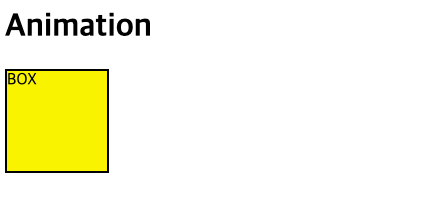

## CSS Transform, Translate, Animation

### Transform

CSS Transform에 대해 좀 더 알아보자. CSS transform은 도형의 크기를 조절 혹은, 회전하거나 위치를 바꾸는 등의 변화를 담당한다. CSS3에서 추가된 기능으로 다양한 변형을 할 수 있다. transform의 기본값은 정중앙이고, 기준값을 자유자재로 변화를 줄 수 있기 때문에 사방으로 변화를 자유자재로 할 수 있는 것이다.

아래와 같은 마크업이 있다고 하자.

```html
<!DOCTYPE html>
<html>
  <head>
    <style>
      body {
        margin: 0;
      }
      .box-container {
        display: flex;
      }
      .box {
        width: 100px;
        height: 100px;
        background: rgba(255, 255, 0, 0.7);
        border: 2px solid black;
      }
    </style>
  </head>
  <body>
    <h1>CSS Transform</h1>
    <p>
      Lorem ipsum dolor sit, amet consectetur adipisicing elit. Minima illo hic quos qui voluptate suscipit quo
      perspiciatis neque officia cumque. Enim, eos debitis voluptatem ullam officia maiores vitae, ipsa tempore, facilis
      iure esse omnis perspiciatis reiciendis distinctio nobis vel perferendis! Necessitatibus molestiae a veniam aut
      pariatur maxime inventore deserunt. Odit consequuntur dolore ex magni atque sequi hic natus animi nemo officiis
      est laboriosam consequatur porro enim, vero quibusdam? Iure tenetur nihil sunt necessitatibus vitae numquam
      voluptatem deserunt recusandae pariatur voluptate quaerat, temporibus earum minima dolor suscipit obcaecati
      voluptatibus nobis iste voluptatum ipsum ratione? Minima quisquam eos provident fugiat blanditiis nulla?
    </p>
    <div class="box-container">
      <div class="box">A</div>
      <div class="box">B</div>
      <div class="box">C</div>
      <div class="box">D</div>
      <div class="box">E</div>
    </div>
    <p>
      Lorem ipsum dolor sit, amet consectetur adipisicing elit. Minima illo hic quos qui voluptate suscipit quo
      perspiciatis neque officia cumque. Enim, eos debitis voluptatem ullam officia maiores vitae, ipsa tempore, facilis
      iure esse omnis perspiciatis reiciendis distinctio nobis vel perferendis! Necessitatibus molestiae a veniam aut
      pariatur maxime inventore deserunt. Odit consequuntur dolore ex magni atque sequi hic natus animi nemo officiis
      est laboriosam consequatur porro enim, vero quibusdam? Iure tenetur nihil sunt necessitatibus vitae numquam
      voluptatem deserunt recusandae pariatur voluptate quaerat, temporibus earum minima dolor suscipit obcaecati
      voluptatibus nobis iste voluptatum ipsum ratione? Minima quisquam eos provident fugiat blanditiis nulla?
    </p>
  </body>
</html>
```

위 마크업은 아래의 결과를 보여준다.


여기에서 일반적으로 도형에 마우스 hover 시 A ~ E 도형에 사이즈 변형을 한다고 할 때 아래처럼 구현할 수 있다.

```css
.box:hover {
  width: 200px;
  height: 200px;
}
```


이처럼 기본적으로 width, height 값을 변경하면 나머지 도형이 좌우로 밀리는 현상이 나타난다.
이를 transform으로 효과를 바꾸면 아래와 같다.

```css
.box:hover {
  transform: scale(2);
}
```


transform은 변경 중심이 center이기 때문에 좌우 도형에 영향을 미치지않도록 되어있으므로 훨씬 더 간단하게 레이아웃에 변형을 줄 수 있다. 브라우저가 reflow할 때 연산의 값을 해당 마크업에만 적용하므로 훨씬 더 좋은 성능을 가진다.

또한, 여러개의 변형을 값으로 줄 수도 있다.

```css
.box:hover {
  transform: scale(2) rotate(15deg);
}
```


비틀기도 가능하다.

```css
.box:hover {
  transform: skew(30deg); /* X축 비틀기 */
}
```


```css
.box:hover {
  transform: skewY(30deg); /* Y축 비틀기, 음수로 값을 넣으면 방향이 반대로 설정된다. */
}
```


도형의 이동은 translate로 변형할 수 있다.

```css
.box:hover {
  transform: translate(30px, 10px);
}
```


```css
.box:hover {
  transform: translateX(-30px) translateY(-10px);
}
```


`scale` 값을 변형할 때 `transform-origin` 속성으로 기준점을 다양하게 설정할 수 있다.

```css
.box:hover {
  transform: scale(1.5);
  transform-origin: right top; /* 숫자로도 부여할 수 있음 */
  /* left top */
  /* transform-origin: 0% 0%; */
  /* right bottom */
  /* transform-origin: 100% 100%; */
  /* center center */
  /* transform-origin: 50% 50%; */
}
```


```css
.box:hover {
  transform-origin: 100% 100%;
  transform: rotate(15deg);
}
```


위와 같이 bottom right를 기준으로 15도 회전하는 효과를 도형에 부여하면 위와 같이 변경시킬수도 있다.

### Transition

CSS animation을 줄 수 있는 `transition` 효과에 대해 알아보자

```css
.box:hover {
  transform: scale(2);
}
```

위와 같은 `transform` 효과를 자연스럽게 구현하기 위해서 `transition`을 이용한다.

```css
.box {
  /* code... */
  transition: 1s;
}
```


위와 같이 손쉽게 좋은 성능으로 애니메이션을 구현할 수 있음

위 transition 효과를 크롬 개발자도구로 상세히 보면 그 내부 속성을 하나씩 알아볼 수 있다.


- trasition-duration은 재생시간을 의미. 1s이면, 1초동안 애니메이션이 동작한다.
- timing-function은 가속도를 의미한다. (ease: 가속도(자연스러운, default), linear: 등속도(일정한))
  해당 설정은 좌측 아이콘을 누르면 다양한 애니메이션 방정식을 설정해볼 수 있다.
  

      

- trasition-delay는 애니메이션을 지연시키는 것을 의미한다.
  ```css
  .box {
    /* code... */
    transition: 1s 2s; /* transition-delay 속성을 2s로 준다. */
  }
  ```
  

애니메이션은 transform에만 적용할 수 있는 것이 아니라 다양한 도형 설정 중 수치로 표현된 것들이 변하는 것에 모두 적용할 수 있다.

```css
.box {
  /* code.. */
  transition: 0.5s;
}
.box:hover {
  width: 200px;
}
```


위에서 transform 적용이 수치로 표현된 것들에만 적용된다는 것은 아래의 예를 의미한다.

```css
.box {
  width: auto; /* width: auto;는 수치가 아님 */
  height: 100px;****
  background: rgba(255, 255, 0, 0.7);
  border: 2px solid black;
  transition: 2s;
}
.box:hover {
  width: 200px;
  background: red;
}
```


### Animation

CSS에 애니메이션을 구현할 수 있는 방법은 transition 외에도 animation이 있다.

```html
<!DOCTYPE html>
<html>
  <head>
    <style>
      .box {
        width: 100px;
        height: 100px;
        background: #fff000;
        border: 2px solid #000;
      }
    </style>
  </head>
  <body>
    <h1>Animation</h1>
    <div class="box">BOX</div>
  </body>
</html>
```



위와 같은 BOX가 하나 있다고 하자.
위 BOX 텍스트를 도형의 정 가운데로 두려면 `display: flex;` 속성을 이용하면 된다.

```css
.box {
  width: 100px;
  height: 100px;
  background: #fff000;
  border: 2px solid #000;
  /* 텍스트 중앙 정렬 */
  display: flex;
  align-items: center;
  justify-content: center;
}
```


이제 이 BOX에 애니메이션 효과를 줘본다.
애니메이션은 동작 중간에 변화르 시점을 잡을 수 있는 Keyframe 속성을 제공한다.

```css
@keyframes sample-ani {
  0% {
    transform: translate(0, 0);
  }
  50% {****
    transform: translate(300px, 0);
  }
  100% {
    transform: translate(300px, 100px);
  }
}
.box {

	/* codes.. */
  animation: sample-ani 2s linear infinite;
}
```


위 애니메이션 또한 크롬 개발자도구에서 상세 옵션을 확인하고 다양한 옵션으로의 테스트가 가능하다.


위 infinite로 값을 준 `animation-iteration-count` 옵션의 경우 정수로 실제 실행 횟수를 지정할 수 있다.
만약 `animation-iteration-count: 3`일 경우 애니메이션이 3번 실행된 후 멈춘다. 또, `animation-direction` 속성으로 `alternate`를 주면 애니메이션이 끊기지않고 이어지는 효과를 줄 수 있다.

```css
.box {
  /* codes.. */
  /* animation-direction: alternate, reverse, alternate-reverse */
  animation: sample-ani 3s linear infinite alternate;
}
```


애니메이션이 끝난 시점에 초기 시점으로 돌아가는 특성을 바꾸고 싶으면 `animation-fill-mode`를 `forwards`로 주면 된다. 또 `animation-play-state` 속성으로 `running`이 아닌 `paused` 속성을 주면 마우스 hover 시에 애니메이션이 멈추도록 설정해 줄 수도 있다.

```css
.box {
  /* codes.. */
  animation: sample-ani 3s linear forwards;
}
.box:hover {
  animation-play-state: paused; /* 마우스를 올리면 멈춘다 */
}
```
