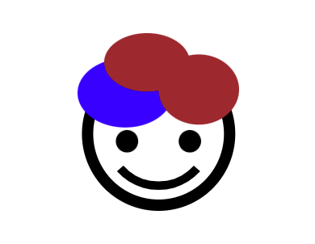

## SVG에 CSS와 JavaScript 적용

### CSS 적용하기

기존에 만들어두었던 `face.svg`를 가지고 css 로 여러 변화를 줘보자

```html
<!DOCTYPE html>
<html lang="en">
  <head></head>
  <body>
    <svg class="face" data-name="Layer 1" xmlns="http://www.w3.org/2000/svg" viewBox="0 0 571 625.5">
      <circle cx="286.5" cy="354.5" r="251" stroke-width="40" fill="none" stroke="#000" stroke-miterlimit="10" />
      <circle class="face__eye" cx="175" cy="380.5" r="42.5" />
      <circle class="face__eye" cx="397" cy="380.5" r="42.5" />
      <path
        d="M422 476.16a181.3 181.3 0 0 1-135.48 60.59H286a181.3 181.3 0 0 1-135.48-60.59"
        stroke-width="30"
        fill="none"
        stroke="#000"
        stroke-miterlimit="10"
      />
      <ellipse class="face__hair" cx="168.5" cy="210.5" rx="168.5" ry="121.5" />
      <ellipse class="face__hair" cx="428.5" cy="198.5" rx="142.5" ry="123.5" />
      <ellipse class="face__hair" cx="245.5" cy="103" rx="151.5" ry="103" />
    </svg>
  </body>
</html>
```

style을 아래와 같이 준다.

```css
.face {
  width: 200px;
  /* 중간정렬 */
  position: absolute;
  top: 0;
  right: 0;
  bottom: 0;
  left: 0;
  margin: auto;
}
.face__hair {
  fill: brown;
}
/* nth-of-type :: ellipse 태그의 n번째 형제인 요소 */
.face__hair:nth-of-type(1) {
  fill: blue;
}
@keyframes eye-ani {
  0% {
    transform: scale(0.9);
  }
  100% {
    transform: scale(1.1);
  }
}
.face__eye {
  animation: eye-ani 1s infinite alternate; /* alternate 0~100 > 100~0 */
}

/* nth-of-type :: circle 태그의 n번째 형제인 요소 */
.face__eye:nth-of-type(2) {
  transform-origin: 175px 380.5px; /* cx="175" cy="380.5" */
}
.face__eye:nth-of-type(3) {
  transform-origin: 397px 380.5px; /* cx="397" cy="380.5" */
}
```

위와 같이 처리하면 아래와 같이 face가 변경된다.



svg를 스타일링하는 다른 방법도 있다. 바로 svg 태그 안에 스타일 코드를 넣는 것이다. XML 파서에서 오류가 날 수 있어서 `<![CDATA[]]>`로 감싸준다. (안 넣어줘도 큰 문제가 없다.)

```html
<!DOCTYPE html>
<html lang="en">
  <head></head>
  <body>
    <svg class="face" data-name="Layer 1" xmlns="http://www.w3.org/2000/svg" viewBox="0 0 571 625.5">
      <style>
        <![CDATA[
             .face { .. }
        	/* codes.. */
            ]]>
      </style>
      <circle cx="286.5" cy="354.5" r="251" stroke-width="40" fill="none" stroke="#000" stroke-miterlimit="10" />
      <circle class="face__eye" cx="175" cy="380.5" r="42.5" />
      <circle class="face__eye" cx="397" cy="380.5" r="42.5" />
      <path
        d="M422 476.16a181.3 181.3 0 0 1-135.48 60.59H286a181.3 181.3 0 0 1-135.48-60.59"
        stroke-width="30"
        fill="none"
        stroke="#000"
        stroke-miterlimit="10"
      />
      <ellipse class="face__hair" cx="168.5" cy="210.5" rx="168.5" ry="121.5" />
      <ellipse class="face__hair" cx="428.5" cy="198.5" rx="142.5" ry="123.5" />
      <ellipse class="face__hair" cx="245.5" cy="103" rx="151.5" ry="103" />
    </svg>
  </body>
</html>
```

svg 파일 안에 스타일이 포함되어 있으므로, 단독으로 사용할 수 있다는 점에서 장점이라고 할 수 있다.
