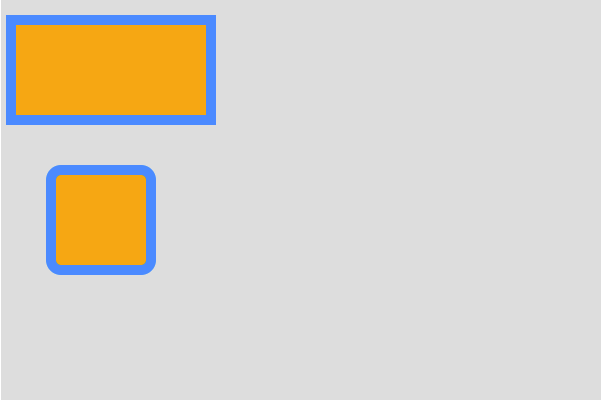
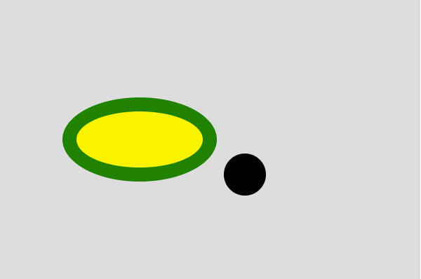
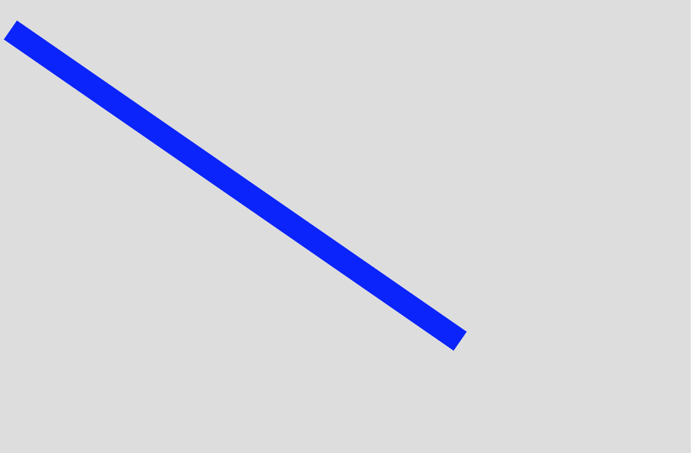
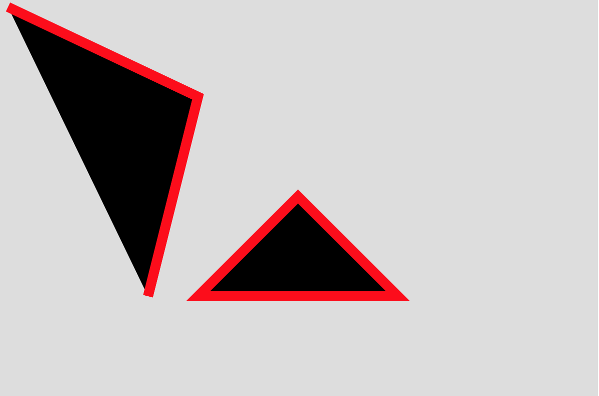
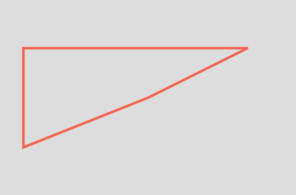
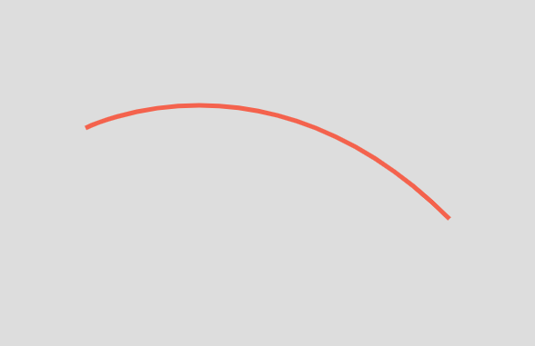
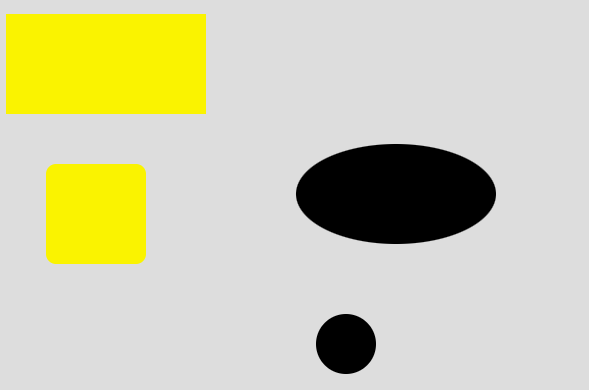

## SVG 그리기

### 기본도형 그리기

데이터를 시각화할 떄 기본 도형들을 사용하므로 svg로 기본 도형을 그리는 방법을 알아야 한다. 또한 export 된 svg 파일의 버그를 개선할 때에도 이러한 기본지식이 큰 도움이 된다.

먼저 사각형을 그려본다



```html
<!DOCTYPE html>
<html>
  <head>
    <meta charset="UTF-8" />
    <meta name="viewport" content="width=device-width, initial-scale=1.0" />
    <meta http-equiv="X-UA-Compatible" content="ie=edge" />
    <title>SVG</title>
    <style>
      .shapes {
        width: 600px;
        height: 400px;
        background: #ddd;
      }
      rect {
        fill: orange;
        stroke: dodgerblue;
        stroke-width: 10; /* px 안써도 자동으로 들어간다. */
      }
    </style>
  </head>
  <body>
    <svg class="shapes">
      <!-- <rect x="10" y="20" width="200" height="100"></rect> -->
      <rect x="10" y="20" width="200" height="100" />
      <!-- rx, ry: 모서리 둥근 정도 -->
      <rect x="50" y="170" rx="10" ry="10" width="100" height="100" />
    </svg>
  </body>
</html>
```

원과 타원은 각각 circle과 ellipse 태그로 구현할 수 있다.



```html
<!DOCTYPE html>
<html>
  <head>
    <meta charset="UTF-8" />
    <meta name="viewport" content="width=device-width, initial-scale=1.0" />
    <meta http-equiv="X-UA-Compatible" content="ie=edge" />
    <title>SVG</title>
    <style>
      .shapes {
        width: 600px;
        height: 400px;
        background: #ddd;
      }
      ellipse {
        fill: #fff000; /* tag 스타일의 green이 아닌 #ff0으로 적용. style css에 우선권이 있다. */
      }
    </style>
  </head>
  <body>
    <svg class="shapes">
      <!-- cx, cy: 원의 중앙 좌표, r: 반지름 -->
      <circle cx="350" cy="250" r="30" />
      <!-- 타원: ellipse, cx, cy 원의 중앙 좌표, rx: 가로방향 반지름, ry: 세로방향 반지름 -->
      <ellipse cx="200" cy="200" rx="100" ry="50" fill="red" stroke="green" stroke-width="20" />
    </svg>
  </body>
</html>
```

사진을 보면 `ellipse` 태그 즉, 타원형의 경우 배경이 `#fff000`이 적용되어있는 것을 볼 수 있다. 이는 tag 안의 `green` 값보다 css 값이 더 우선권을 가진다는 것을 의미한다.

### 직선 그리기

직선은 아래와 같이 그릴 수 있다.



```html
<!DOCTYPE html>
<html>
  <head></head>
  <body>
    <svg class="shapes">
      <!-- 직선: line, x1: 선이 시작하는 x 위치, x2: 선이 끝나는 x 위치, y1: 선이 시작하는 y 위치, y2: 선이 끝나는 y 위치, -->
      <line x1="10" x2="400" y1="30" y2="300" stroke="blue" stroke-width="20" />
    </svg>
  </body>
</html>
```

직선을 잇는 도형은 `polyline`과 `polygon`으로 그릴 수 있는데, 이 둘의 차이는 시작점과 끝점이 이어지는 지에 대한 여부이다.



```html
<!DOCTYPE html>
<html>
  <head></head>
  <body>
    <svg class="shapes">
      <!-- 잇는 직선: polyline, x 시작점, y 시작점, x 끝점, y 끝점 : 끝점이 시작점과 연결되지 않고 멈춰진다. -->
      <polyline points="10 10, 200 100, 150 300" stroke="red" stroke-width="10" />
      <!-- 다각형: polygon, x 시작점, y 시작점, x 끝점, y 끝점, : 끝점이 시작점과 연결된다.  -->
      <polygon points="200 300, 300 200, 400 300" stroke="red" stroke-width="10" />
    </svg>
  </body>
</html>
```

위 `polyline`은 끝점과 시작점이 연결되지 않고 끝나는 반면 `polygon`은 끝점과 시작점이 연결되어 3면이 균일한 stroke를 가지게 된다.

### Path로 그리기

path로 그리기에 앞서 `svg` 태그는 `xmlns` 속성을 함께 포함해서 작성하는 것이 정석이다.

```html
<svg class="shapes" xmlns="http://www.w3.org/2000/svg"></svg>
```

`xmlns` 속성은 `svg` 네임 스페이스를 정의하는 것으로 사용된 svg 버전을 정의함

path는 곡선, 직선 같은 것들을 모두 그릴 수 있다. 우선 직선을 그려보자.

```html
<!DOCTYPE html>
<html>
  <head>
    <style>
      .shapes {
        width: 600px;
        height: 400px;
        background: #ddd;
      }
      path {
        stroke: tomato;
        stroke-width: 5;
        /* fill을 없애지 않으면 검정색 default */
        fill: transparent;
      }
    </style>
  </head>
  <body>
    <svg class="shapes" xmlns="http://www.w3.org/2000/svg">
      <!-- d: M(시작점) x좌표, y좌표, L(직선) x좌표, y좌표, -->
      <!-- H(가로직선) x좌표, V(세로직선) y좌표, Z(다각형의 원성) -->
      <path d="M 300 200 L 500 100 H 50 V 300 Z"></path>
    </svg>
  </body>
</html>
```

위와 같이 그리면 아래와 같은 도형이 완성된다.



곡선은 시작점, 조정점(중간점), 끝점 정보로 이루어진다.

```html
<!-- d: M(시작점, x, y), C(곡선 설정, 시작(x, y), 조정점(x, y), 끝점(x, y)) -->
<path d="M 100 150 C 100 150, 300, 50, 500 250"></path>
```

그러면 아래와 같은 곡선이 완성된다.



### stroke 모양 조정하기

선의 끝처리, 선이 만나는 부분을 처리하는 설정을 배워보자.
일러스트에서 cap, corner 속성을 css 설정로 조정할 수 있다.

```html
<!DOCTYPE html>
<html>
  <head>
    <style>
      .shapes {
        width: 600px;
        height: 400px;
        background: #ddd;
      }
      path {
        stroke: tomato;
        stroke-width: 20;
        /* stroke-linecap: butt, square, round */
        stroke-linecap: round;
        /* stroke-linejoin: miter, round, bevel */
        stroke-linejoin: bevel;
        fill: transparent;
      }
    </style>
  </head>
  <body>
    <svg class="shapes" xmlns="http://www.w3.org/2000/svg">
      <path d="M 50 200 L 300 100 L 400 200"></path>
    </svg>
  </body>
</html>
```

`stroke-linecap`은 선의 끝점 처리에 대한 설정이며, `stroke-linejoin` 설정은 이어진 점에 대한 처리 설정을 의미한다. 각각 butt, squre, round와 miter, round, bevel 값으로 각 속성을 결정할 수 있다.


### 그룹 만들기

또 알아두면 좋은 태그로 그룹이 있다. 같은 레벨에 정의되어 있는 도형들을 g태그를 사용해 그룹을 지을 수 있다.

```html
<!DOCTYPE html>
<html>
  <head>
    <meta charset="UTF-8" />
    <meta name="viewport" content="width=device-width, initial-scale=1.0" />
    <meta http-equiv="X-UA-Compatible" content="ie=edge" />
    <title>SVG</title>
    <style>
      .shapes {
        width: 600px;
        height: 400px;
        background: #ddd;
      }
      .group-1 {
        fill: #fff000;
      }
    </style>
  </head>
  <body>
    <svg class="shapes">
      <g class="group-1">
        <rect x="10" y="20" width="200" height="100"></rect>
        <rect x="50" y="170" rx="10" ry="10" width="100" height="100"></rect>
      </g>
      <circle cx="350" cy="350" r="30"></circle>
      <ellipse cx="400" cy="200" rx="100" ry="50"></ellipse>
    </svg>
  </body>
</html>
```

위와 같이 group-1로 묶은 도형들이 같은 스타일이 적용되도록 처리할 수 있다.


