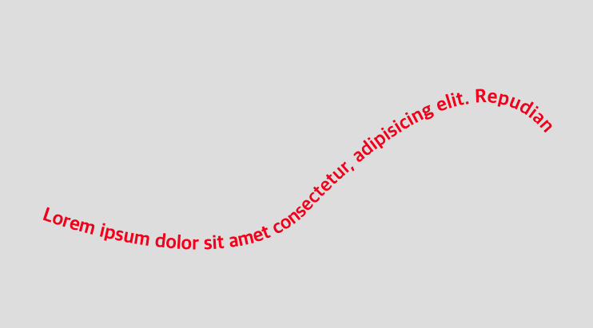
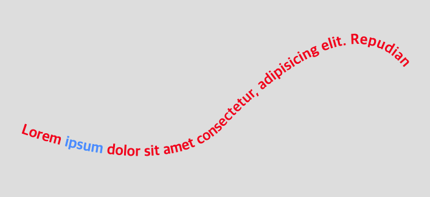

## SVG 텍스트

### 기본 글자 쓰기

글자는 text 태그를 쓰며, x, y 좌표를 속성으로 준다,

```html
<!DOCTYPE html>
<html>
  <head>
    <meta charset="UTF-8" />
    <meta name="viewport" content="width=device-width, initial-scale=1.0" />
    <meta http-equiv="X-UA-Compatible" content="ie=edge" />
    <title>SVG</title>
    <style>
      body {
        margin: 0;
      }
      .svg {
        position: absolute;
        width: 100%;
        height: 100%;
        background: #ddd;
      }
      text {
        font-size: 1.5rem;
        font-weight: bold;
        fill: red; /* color는 fill 속성으로 */
      }
    </style>
  </head>
  <body>
    <svg class="svg" xmlns="http://www.w3.org/2000/svg">
      <text x="20" y="50">Hello, SVG!</text>
    </svg>
  </body>
</html>
```

text에 대한 다양한 스타일은 css 속성으로 동일하게 부여하면 된다. 단, 색은 color가 아닌 fill로 부여한다.

### 곡선을 따라 글자 쓰기

그럼 path와 text를 조합하여 곡선을 따라 글자가 배치되는 레이아웃을 구현해보자. (일단 html 요소로 구현하기 어려운 것들을 svg를 통해 구현할 수 있기 때문에 svg를 쓰는 것임)

```html
<!DOCTYPE html>
<html>
  <head>
    <title>SVG</title>
    <style>
      body {
        margin: 0;
      }
      .svg {
        position: absolute;
        width: 100%;
        height: 100%;
        background: #ddd;
      }
      text {
        font-size: 1.5rem;
        font-weight: bold;
        fill: red;
      }
      path {
        stroke: red;
        fill: transparent;
      }
    </style>
  </head>
  <body>
    <svg class="svg" xmlns="http://www.w3.org/2000/svg">
      <!-- defs: 나중에 참조할 그래픽 요소를 담아놓는 공간 -->
      <!-- defs 안에 들어가서 별도의 설정을 하지 않으면 레이아웃에 노출되지 않음 -->
      <defs>
        <path
          id="text-curve"
          d="M 50 400 C 50 400, 300 500, 400 400 C 400 400, 600 170, 700 300"
        ></path>
      </defs>
      <text x="20" y="50">
        <textPath href="#text-curve">
          Lorem ipsum dolor sit amet consectetur, adipisicing elit. Repudiandae doloribus in sit
          porro, magnam modi sint facilis voluptas incidunt fugiat.
        </textPath>
      </text>
    </svg>
  </body>
</html>
```

path에 맞춰 글자가 정렬되도록 하려면 `defs` 태그를 사용하여 구현해야하는데, `defs`는 참조할 그래픽 요소나 정보를 담아놓는 공간으로 위와 같은 `path` 요소 이외에도 `mask`나 `gradient` 정보를 넣어둘 수 있고, css 정보도 `defs` 태그 안에 보관할 수 있다.

위와 같이 설정 후 `path`에 참조할 id 속성(text-curve)을 추가 해준 뒤, 이를 적용할 text 태그 내부를 `textPath` 태그로 감싸준 다음 href로 #text-curve를 참조하도록 만들어주면 아래와 같이 만들어진다.



### 텍스트 부분 스타일링 적용하기

만약 위 레이아웃에 ipsum 만 폰트크기를 다르게 하고 싶을 땐 어떻게 할까? 보통 html에서는 해당 영역을 별도의 `span` 태그로 감싸서 스타일을 별도로 준다. svg `text`에서도 동일한데, 단 `span`이 아닌 `tspan` 태그로 감싸준다.

```html
<!DOCTYPE html>
<html>
  <head>
    <style>
      /* 위 코드와 동일 */
      .special {
        fill: dodgerblue;
      }
    </style>
  </head>
  <body>
    <svg class="svg" xmlns="http://www.w3.org/2000/svg">
      <defs>
        <path
          id="text-curve"
          d="M 50 400 C 50 400, 300 500, 400 400 C 400 400, 600 170, 700 300"
        ></path>
      </defs>
      <text x="20" y="50">
        <textPath href="#text-curve">
          Lorem
          <tspan class="special">ipsum</tspan>
          dolor sit amet consectetur, adipisicing elit. Repudiandae doloribus in sit porro, magnam
          modi sint facilis voluptas incidunt fugiat.
        </textPath>
      </text>
    </svg>
  </body>
</html>
```


