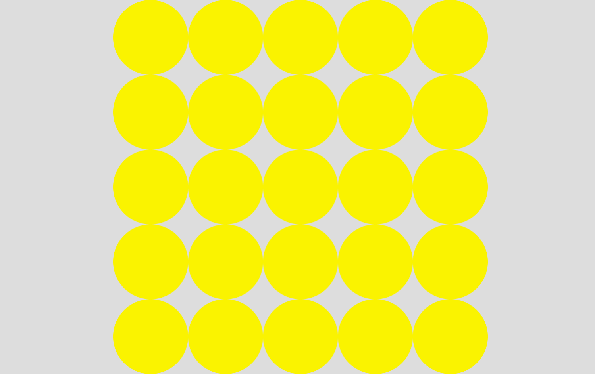

## SVG 효과

### 그라디언트

계속해서 `svg`에서 그라디언트를 쓰는 방법에 대해 알아보자.
이번에는 object 태그를 이용해 `svg` 파일을 불러와서 적용해본다.

```html
<!DOCTYPE html>
<html>
  <head>
    <style>
      .svg-obj {
        /* 가운데 정렬 */
        position: absolute;
        top: 0;
        right: 0;
        bottom: 0;
        left: 0;
        width: 200px;
        margin: auto;
      }
    </style>
  </head>
  <body>
    <object class="svg-obj" data="images/face_hair.svg" type="image/svg+xml"></object>
  </body>
</html>
```

위 `face_hair.svg` 파일에 스타일을 부여하기 위해 직접 해당 svg 파일을 수정해보도록 한다.

`images/face_hair.svg`


```html
<svg xmlns="http://www.w3.org/2000/svg" viewBox="0 0 571 625.5">
  <circle
    cx="286.5"
    cy="354.5"
    r="251"
    stroke-width="40"
    fill="none"
    stroke="#000"
    stroke-miterlimit="10"
  />
  <circle cx="175" cy="380.5" r="42.5" />
  <circle cx="397" cy="380.5" r="42.5" />
  <path
    d="M422 476.16a181.3 181.3 0 0 1-135.48 60.59H286a181.3 181.3 0 0 1-135.48-60.59"
    stroke-width="30"
    fill="none"
    stroke="#000"
    stroke-miterlimit="10"
  />
  <path
    d="M428.5 75a164.06 164.06 0 0 0-35.68 3.9C376.86 33.64 317 0 245.5 0 162.57 0 95.22 45.3 94 101.49c-55.71 19.82-94 61.19-94 109C0 277.6 75.44 332 168.5 332c62 0 116.14-24.14 145.41-60.09C339.87 302.3 381.53 322 428.5 322c78.7 0 142.5-55.29 142.5-123.5S507.2 75 428.5 75z"
  />
</svg>
```

위 svg 파일에서 머리 부분에 그라디언트 효과를 주고싶다면
머리 부분 태그인 가장 마지막 `path` 태그에 .hair 클래스를 붙여 작업하도록 해볼 수 있다.

```html
<svg xmlns="http://www.w3.org/2000/svg" viewBox="0 0 571 625.5">
  <defs>
    <!-- 참조할 요소를 defs에 담는다 -->
    <!-- linearGradient: 직선, radialGradient: 원형 -->
    <linearGradient id="hair-color">
      <!-- offset: 위치(그라디언트 위치) -->
      <stop offset="0%" stop-color="yellow" />
      <stop offset="50%" stop-color="hotpink" />
      <stop offset="100%" stop-color="deepskyblue" />
    </linearGradient>
    <style>
      <![CDATA[
      .hair {
        fill: url('#hair-color'); /* fill의 url 내부로 연결해준다. */
      }
      ]]>
    </style>
  </defs>
  <circle
    cx="286.5"
    cy="354.5"
    r="251"
    stroke-width="40"
    fill="none"
    stroke="#000"
    stroke-miterlimit="10"
  />
  <circle cx="175" cy="380.5" r="42.5" />
  <circle cx="397" cy="380.5" r="42.5" />
  <path
    d="M422 476.16a181.3 181.3 0 0 1-135.48 60.59H286a181.3 181.3 0 0 1-135.48-60.59"
    stroke-width="30"
    fill="none"
    stroke="#000"
    stroke-miterlimit="10"
  />
  <path
    class="hair"
    d="M428.5 75a164.06 164.06 0 0 0-35.68 3.9C376.86 33.64 317 0 245.5 0 162.57 0 95.22 45.3 94 101.49c-55.71 19.82-94 61.19-94 109C0 277.6 75.44 332 168.5 332c62 0 116.14-24.14 145.41-60.09C339.87 302.3 381.53 322 428.5 322c78.7 0 142.5-55.29 142.5-123.5S507.2 75 428.5 75z"
  />
</svg>
```

먼저 그라디언트에 대한 설정은 `defs` 태그 안에 설정한다.
구현하고자 하는 그라디언트 스타일(옵션)에 해당하는 태그(`linearGradient`(직선), 이 밖에도 `radialGradient`(원형)이 있음)로 감싼 뒤 변경 지점을 `stop` 태그로 분리하여 `offset`과 `stop-color` 속성으로 그라디언트 색을 지정해준다. 이렇게 만들어진 `#hair-color`그라데이션 스타일을 `.hair` path 태그에 연결해주면 되는데, 이 스타일 속성 또한 `defs` 태그 내 style 태그로 넣어주며, `fill` 속성에 `url` 값으로 `linearGradient`의 `id`값을 연결해주면 잘 적용된다.


### 패턴의 기본적인 사용법

패턴의 기본적인 사용법을 알아보자. 먼저 패턴은 defs 태그안에서 구현한 뒤 이를 적용할 `svg` 태그를 만들어 `url`로 연결해주면 된다. 아래의 코드를 보자

```html
<!DOCTYPE html>
<html>
  <head>
    <style>
      body {
        margin: 0;
      }
      svg {
        width: 500px;
        height: 500px;
        background: #ddd;
      }
      .pattern-circle {
        fill: #fff000;
      }
      /* 직접 부여할 수 있다.
      .bg-rect {
        fill: url(#bg-pattern);
      } 
      */
    </style>
  </head>
  <body>
    <svg>
      <defs>
        <!-- 1. width, height 0.1 : 1/10 크기로 패턴 한 조각을 넣겠다  -->
        <pattern id="bg-pattern" x="0" y="0" width="0.1" height="0.1">
          <!-- 2. circle 패턴을 추가: defs 바깥에서 적용을 해야 노출된다 -->
          <circle cx="25" cy="25" r="25" class="pattern-circle"></circle>
        </pattern>
      </defs>
      <!-- 3. url 연결은 직점 해도 되고, css 속성으로 부여해도 된다. -->
      <rect class="bg-rect" x="0" y="0" width="100%" height="100%" fill="url(#bg-pattern)"></rect>
    </svg>
  </body>
</html>
```

1. defs 태그 안에 pattern 태그로 패턴을 정의해준다. 패턴이 시작되는 위치를 x, y 좌표로 넣으며 width, height는 패턴 한 조각의 크기를 정의한다.

   ⇒ `width="0.1"`, `height="0.1"`이므로 1/10 크기로 패턴 한 조각을 넣겠다라는 것을 의미함

2. `pattern` 태그 안에 실제 노출될 패턴을 추가한다.(위 예시는 `circle` 태그) , 해당 데이터는 그냥 저장했을 때에는 노출되지 않으며 하단 `rect` 태그에 `fill` 속성안에 url로 `#bg-pattern`을 연결시키면 된다.


이런 패턴이 완성된다.

이를 브라우저 화면 전체에 뿌리고 싶을 땐 svg 태그에 viewBox 속성으로 지정해준다. (svg 스타일도 변경)

```html
<!DOCTYPE html>
<html>
  <head>
    <style>
      body {
        margin: 0;
      }
      svg {
        position: absolute;
        left: 0;
        top: 0;
        width: 100%;
        height: 100%;
        background: #ddd;
      }
      .pattern-circle {
        fill: #fff000;
      }
    </style>
  </head>
  <body>
    <svg viewBox="0 0 1000 1000">
      <defs>
        <pattern id="bg-pattern" x="0" y="0" width="0.1" height="0.1">
          <circle cx="50" cy="50" r="50" class="pattern-circle"></circle>
        </pattern>
      </defs>
      <rect class="bg-rect" x="0" y="0" width="100%" height="100%" fill="url(#bg-pattern)"></rect>
    </svg>
  </body>
</html>
```


viewBox를 0 0 1000 1000으로 하면 위와 같이 가운데 정렬되어 10개의 원이 노출된다.

만약 5개의 원으로 가득 채우려면 어떻게 하면 될까?

`viewBox="0 0 500 500”` 과 pattern을 `width="0.2" height="0.2”`로 설정하면 된다.



### 애니메이션이 적용된 일러스트 패턴

이번에는 svg 요소를 사용하지 않고 body에 background-image로 svg 요소를 사용해보자.
가장 간단하게 아래와 같이 background-image를 넣어보자

```html
<!DOCTYPE html>
<html>
  <head>
    <style>
      body {
        background-image: url(./images/face_hair.svg);
      }
    </style>
  </head>
  <body></body>
</html>
```

그러면 작은 알갱이들이 가득 차는 상황이 발생한다.


body에 background-size를 100px로 주면 아래와 같이 잘 나온다.


svg 파일에 애니메이션 효과를 추가하여 오른쪽 눈만 움직이도록 처리할 수도 있음

`/images/face_s.svg`

```html
<svg xmlns="http://www.w3.org/2000/svg" viewBox="0 0 63 69.01" class="face">
  <defs>
    <style>
      @keyframes eye-ani {
        from {
          transform: scaleY(1);
        }
        to {
          transform: scaleY(0.2);
        }
      }
      .face::hover {
        fill: red;
      }
      .face:hover .right-eye {
        transform-origin: 19px 42px;
        animation: eye-ani 0.5s alternate infinite;
      }
    </style>
  </defs>
  <path
    d="M138.61,133a29.89,29.89,0,1,1,21.14-8.75A29.72,29.72,0,0,1,138.61,133Zm0-55.38a25.49,25.49,0,1,0,18,7.46A25.32,25.32,0,0,0,138.61,77.63Z"
    transform="translate(-107 -64)"
  />
  <g>
    <circle class="right-eye" cx="19.31" cy="41.98" r="4.69" />
    <circle cx="43.8" cy="41.98" r="4.69" />
  </g>
  <path
    d="M138.61,124.88h-.05a21.76,21.76,0,0,1-16.19-7.24l2.47-2.21a18.44,18.44,0,0,0,13.72,6.14h.05a18.44,18.44,0,0,0,13.72-6.14l2.46,2.21A21.73,21.73,0,0,1,138.61,124.88Z"
    transform="translate(-107 -64)"
  />
  <path
    d="M154.28,72.27a17.56,17.56,0,0,0-3.94.44c-1.76-5-8.37-8.71-16.25-8.71-9.15,0-16.58,5-16.72,11.2C111.23,77.38,107,82,107,87.23c0,7.4,8.32,13.4,18.59,13.4,6.84,0,12.82-2.66,16-6.63a16.61,16.61,0,0,0,12.65,5.53C163,99.53,170,93.43,170,85.9S163,72.27,154.28,72.27Z"
    transform="translate(-107 -64)"
  />
</svg>
```


