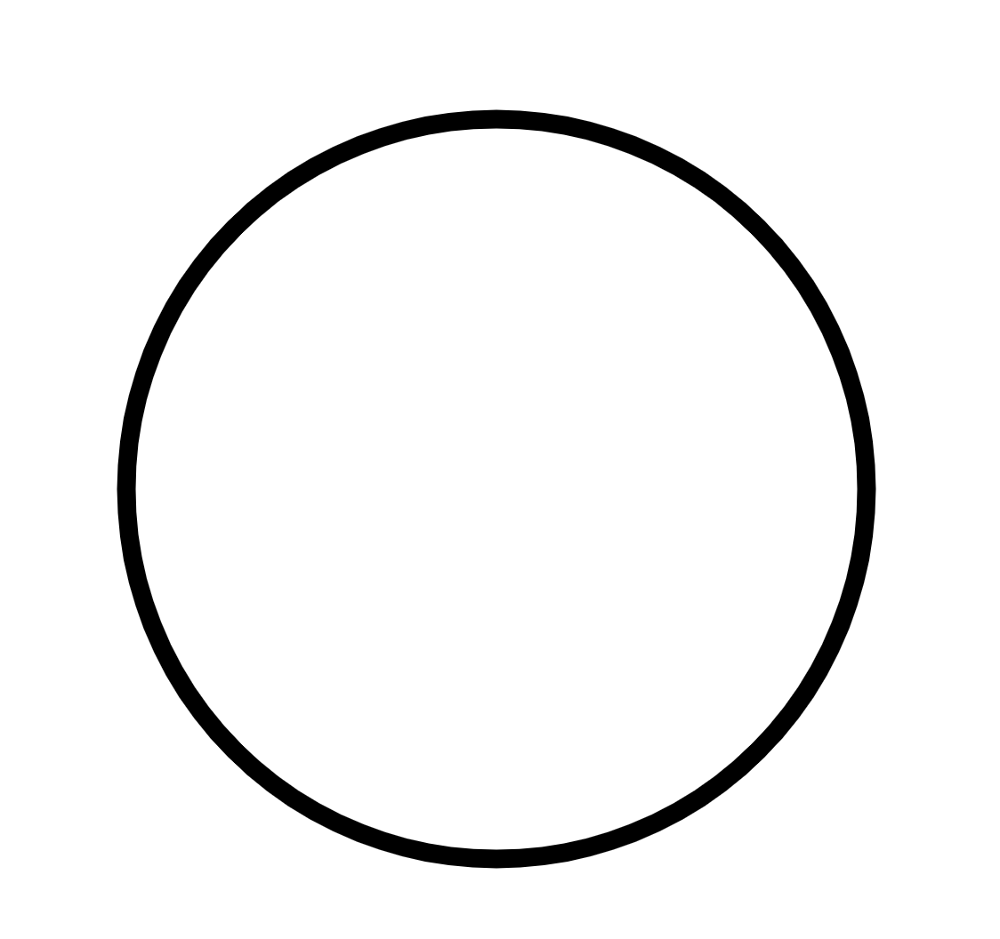
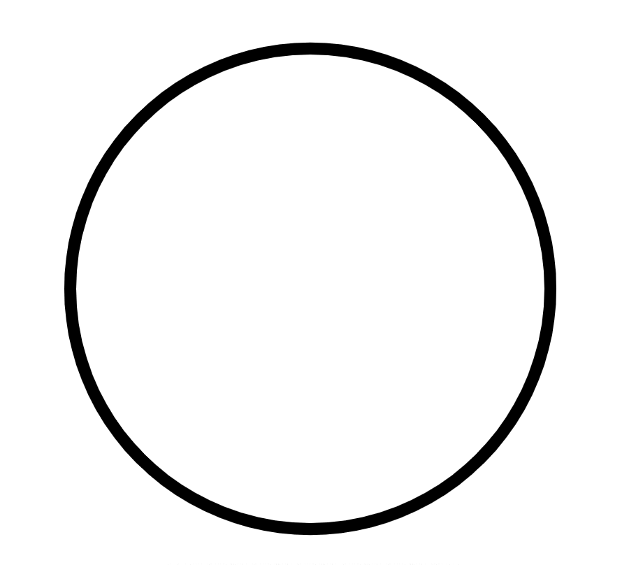
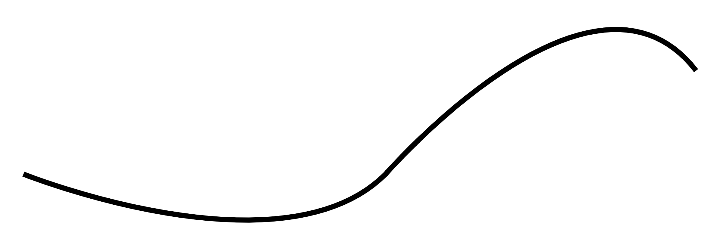
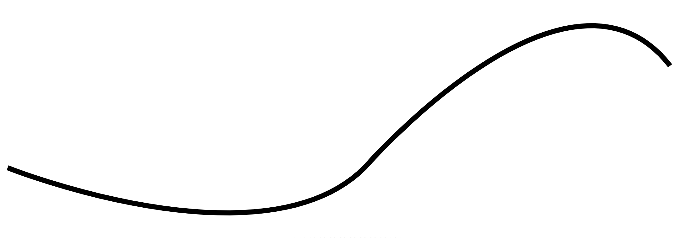

## stroke 애니메이션

### Stroke 애니메이션 기본

Stroke 애니메이션 중 stroke-dasharray와 stroke-dashoffset을 배워보자

```html
<!DOCTYPE html>
<html>
  <head>
    <style>
      @keyframes dash-ani {
        from {
          stroke-dashoffset: 700;
        }
        to {
          stroke-dashoffset: 0;
        }
      }
      circle {
        stroke: black;
        stroke-width: 5;
        stroke-dasharray: 700;
        stroke-dashoffset: 0;
        fill: transparent;
        animation: dash-ani 2s infinite;
      }
    </style>
  </head>
  <body>
    <svg viewBox="0 0 800 500">
      <circle cx="400" cy="250" r="100"></circle>
    </svg>
  </body>
</html>
```

`stroke-dasharray`는 도형의 점선을 이루는 정도를 나타내며 `stroke-dashoffset`은 선이 나타나는 비율을 의미한다. 위와 같이 `stroke-dasharray`가 700이고, `stroke-dashoffset`이 0이면 아래와 같이 원형이 만들어짐



`stroke-dashoffset`을 350으로 하면 절반정도 찬 원이 되며, `stroke-dashoffset`을 0으로 하면 선이 아예 사라지게 된다. 이를 애니메이션으로 위 소스처럼 구현하면 아래와 같은 동작이 가능해진다.



다른 모양도 만들어보자.
아래와 같은 path가 자연스럽게 애니메이션 되는 것을 구현해보고자 한다.

```html
<svg viewBox="0 0 800 500">
  <path d="M 50 400 C 50 400, 300 500, 400 400 C 400 400,  600 170, 700 300"></path>
</svg>
```



이선을 자연스럽게 그리려면 먼저 이 선의 길이를 알아야 한다. 눈대중으로 알 수 없으니 이를 알 수 있는 `getTotalLength()`메서드가 존재 함

```jsx
console.log(document.querySelector("path").getTotalLength()); // 726.1061401367188
```

```css
path {
  stroke: black;
  stroke-width: 5;
  stroke-dasharray: 727; /* getTotalLength() 메서드 적용 */
  stroke-dashoffset: 0;
  fill: transparent;
  animation: dash-ani 2s; /* dash-ani 적용 */
}
```


