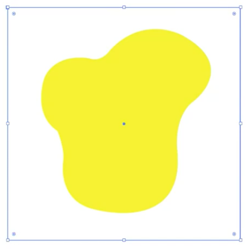
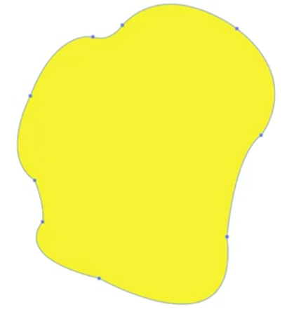
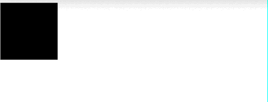

## SMIL 애니메이션

### SMIL 애니메이션의 기본적인 사용법

SMIL(Synchronized Multimedia Integration Language)는 SVG에서 애니메이션을 만들 때 사용하는 언어이다. 초기에 `deprecated`되었다가 취소되었음. IE 외에는 정상 지원되므로 없어질 가능성이 있음에도 알아두자. css 애니메이션이 처리하지 못하는 것을 SMIL로 만들 수 있다.

SMIL 애니메이션은 svg 태그 내 적용할 도형 내부에 `animate` 태그로 작업해준다.

```html
<!DOCTYPE html>
<html>
  <head>
    <style>
      body {
        margin: 0;
      }
    </style>
  </head>
  <body>
    <svg class="svg" viewBox="0 0 1000 1000">
      <rect x="10" y="10" width="20%" height="20%">
        <animate attributeName="x" dur="1s" to="700" repeatCount="1" fill="freeze"></animate>
      </rect>
    </svg>
  </body>
</html>
```

SMIL 속성

- attributeName: 바꿀 속성 이름
- dur: 얼마나 걸릴 건지
- to: 어디로 갈건지(목적지)
- repeatCount: 반복횟수(`indefinite` 무한반복을 의미)
- fill: freeze(애니메이션 끝난 상태로 멈춤)


### SMIL 애니메이션 조작하기

SMIL 애니메이션도 조작할 수 있다. 사각형을 클릭했을 때 애니메이션이 일어나도록 클릭이벤트를 만들어보자

```html
<!DOCTYPE html>
<html>
  <head>
    <style>
      body {
        margin: 0;
      }
    </style>
  </head>
  <body>
    <svg class="svg" viewBox="0 0 1000 1000">
      <defs>
        <script>
          // 스크립트가 태그보다 앞서 있으므로 DOMContentLoaded로 처리해준다. window.addEventListener("DOMContentLoaded", () => { const
          rectElem = document.querySelector(".rect"); const aniElem = document.querySelector(".ani"); rectElem.addEventListener("click", ()
          => { aniElem.beginElement(); // 애니메이션 시작 }); });
        </script>
      </defs>

      <rect class="rect" x="10" y="10" width="20%" height="20%">
        <!-- begin: 언제 시작할지(indefinite 시작 X으로 설정) -->
        <animate class="ani" attributeName="x" dur="1s" to="700" repeatCount="1" fill="freeze" begin="indefinite"></animate>
      </rect>
    </svg>
  </body>
</html>
```

위와 같이하면 실제 사각형을 클릭했을 때 x축으로 700만큼 이동하는 애니메이션이 실행된다.

### Morphing 효과

도형의 모양이 부드럽게 변하는 Morphing 효과를 구현해보자



일러스트에서 이런 모양으로 도형을 하나 그려본다.



기준 도형을 바탕으로 바뀔 도형을 만들어준다.

위 이미지를 `svg` 파일로 `export`하여 코드를 붙여넣은 뒤 변하게 될 도형도 새롭게 그려준다.  
여기에서 중요한 점은 첫 이미지의 포인트 점 갯수가 바뀔 도형에도 동일하게 유지되어야 한다는 점이다.  
즉, 애니메이션이 점의 위치가 이동하는 과정으로 그려지므로 기존 도형에서 변형을 시켜주는 방식으로 바꿔준다.

도형 겉에 테두리를 하나 장착해주는데 이 이유는 도형이 변경되면서 크기가 바뀌는 이슈가 있어 해상도에 따라 도형이 잘려 노출될 수도 있기 때문임.  
실제 svg 파일을 긁어온 뒤 정사각형 부분의 path를 삭제해주면, 테두리선은 사라지되 기존 크기는 동일하게 유지하여 원하는 레이아웃을 만들 수 있다.

```html
<!DOCTYPE html>
<html>
  <head>
    <style>
      body {
        margin: 0;
      }
    </style>
  </head>
  <body>
    <svg id="Layer_1" data-name="Layer 1" xmlns="http://www.w3.org/2000/svg" viewBox="0 0 684 684">
      <defs>
        <style>
          .cls-1 {
            fill: #fff000;
          }
        </style>
      </defs>
      <path
        class="cls-1"
        d="M282,192s-96-20-131,56c0,0-39,105,38,157,0,0,22,51,17,88,0,0-20,117,91,142,0,0,273,77,243-181,0,0-10-93,49-137,0,0,134-101-34-193,0,0-112-62-211,43C344,167,320,205,282,192Z"
        transform="translate(-42 -42)"
      >
        <!-- attributeName: 어떤 속성에 애니메이션을 부여할 것인지, dur: 애니메이션 시간 -->
        <!-- to: 어디로?(바뀔 도형 즉, 두번째 svg의 path를 복사해서 붙여 넣어준다) -->
        <animate
          attributeName="d"
          dur="3s"
          to="M282,142s-96,30-131,106c0,0-109,105-32,157,0,0,22,51,17,88,0,0,50,117,161,142,0,0,373,77,343-181,0,0-10-93,49-137,0,0,34-101-134-193,0,0-112-112-211-7C344,117,320,155,282,142Z"
        ></animate>
      </path>
    </svg>
  </body>
</html>
```

IE 환경에서는 SMIL을 지원하지 않는 점 참고할 것! 또한, 위와 같은 효과를 내는 svg 라이브러리가 많으므로 손쉽게 활용해보자.
크롬의 경우 css 애니메이션으로 SMIL 효과를 구현할 수 있음(크롬만 지원하므로 실무에서 사용은 아직 한계가 있다)

### CSS 애니메이션의 alternate를 SMIL로 구현하기

CSS 애니메이션의 alternate 효과는 번갈아가면서 애니메이션의 진행방향을 바꾸는 효과이다.
시작과 끝이 끊어지는 효과가 아닌, 자연스럽게 이어지도록 처리하는 효과를 의미

이를 SMIL로도 구현할 수 있다.

```html
<!DOCTYPE html>
<html>
  <head> </head>
  <body>
    <svg class="svg" viewBox="0 0 1000 1000">
      <rect class="rect" x="10" y="10" width="20%" height="20%">
        <!-- to 대신 values 0 > 700 > 0 -->
        <!-- keyTimes: 시작 0, 중간 0.5, 끝 1 (여러 지점을 설정할 수 있다.) -->
        <animate class="ani" attributeName="x" dur="3s" values="0; 700; 0" keyTimes="0; 0.2; 0.6; 1" repeatCount="indefinite"></animate>
      </rect>
    </svg>
  </body>
</html>
```

기존에 사용하던 to 속성 대신 `values` 속성으로 값을 설정한다.
도형의 움직임을 0 → 700 → 0 으로 alternate 효과 설정, keyTimes로 애니메이션 움직임을 0~1 사이로 지정할 수 있다..! 만약 values의 값 설정이 4 포인트이면, keyTimes 값 설정 포인트도 4포인트로 주면 됨


