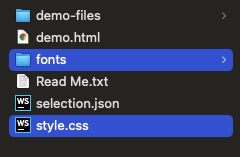

## 아이콘 폰트 만들기

### 아이콘 폰트 세트 만들기

이번에는 svg를 이용해 나만의 아이콘 폰트를 만들어보자
아이콘 폰트를 만들 때에는 [icomoon](https://icomoon.io/)이라는 사이트를 이용한다.

- 우측 상단 [IcoMoon App] 클릭 → Import Icons → 추가할 Svg 파일 추가 → 우측 메뉴버튼 내 [Properties] 클릭하여 원하는 이름으로 아이콘명 변경(Mealcon) → 추출할 아이콘 Select (하단 Selection(2)가 되도록!) → 하단 [Generate Font] 클릭 → Download 클릭하여 zip 파일 해제

위와 같은 과정으로 처리하면 아래와 같은 파일이 다운로드되는데,
이 중 fonts와 style.css를 프로젝트에 옮겨 붙인다!



`style.css`

다운받은 fonts들명을 프로젝트에 맞게 적절히 수정을 할 수 있으며, 해당 내용을 style.css에도 반영해준다.

```css
@font-face {
  font-family: "mealcon";
  src: url("fonts/mealcon.eot?sbetgy");
  src: url("fonts/mealcon.eot?sbetgy#iefix") format("embedded-opentype"), url("fonts/mealcon.ttf?sbetgy") format("truetype"),
    url("fonts/mealcon.woff?sbetgy") format("woff"), url("fonts/mealcon.svg?sbetgy#mealcon") format("svg");
  font-weight: normal;
  font-style: normal;
  font-display: block;
}

[class^="icon-"],
[class*=" icon-"] {
  /* use !important to prevent issues with browser extensions that change fonts */
  font-family: "mealcon" !important;
  speak: never;
  font-style: normal;
  font-weight: normal;
  font-variant: normal;
  text-transform: none;
  line-height: 1;

  /* Better Font Rendering =========== */
  -webkit-font-smoothing: antialiased;
  -moz-osx-font-smoothing: grayscale;
}

.icon-face:before {
  content: "\e900";
}
.icon-studiomeal:before {
  content: "\e901";
}
```

실제 잘 노출시켜보자!

```html
<!DOCTYPE html>
<html>
  <head>
    <!-- style.css 연결 -->
    <link rel="stylesheet" href="style.css" />
  </head>
  <body>
    <h1>SVG Icon Font</h1>
    <p><i class="icon-face"></i> Face icon</p>
    <p><i class="icon-studiomeal"></i> Logo icon</p>
  </body>
</html>
```

위처럼 `icon-face`, `icon-studiomeal` 이란 이름으로 아이콘을 사용할 수 있게 된다!

적당한 스타일과 애니메이션도 추가해본다.

```css
@keyframes icon-ani-tongtong {
  from {
    transform: translateY(0);
  }
  to {
    transform: translateY(0.3em);
  }
}

.icon-red {
  color: red !important;
}

.icon-ani-tongtong {
  display: inline-block;
  animation: icon-ani-tongtong 0.3s alternate infinite;
}
```

```html
<!DOCTYPE html>
<html>
  <head>
    <link rel="stylesheet" href="style.css" />
  </head>
  <body>
    <h1>SVG Icon Font</h1>
    <p><i class="icon-face icon-red icon-ani-tongtong"></i> Face icon</p>
    <p><i class="icon-studiomeal icon-ani-tongtong"></i> Logo icon</p>
  </body>
</html>
```

위와 같이 추가한 애니메이션을 class 태그에 넣어주면, 아이콘에 다양한 효과를 추가해줄 수 있게된다!
