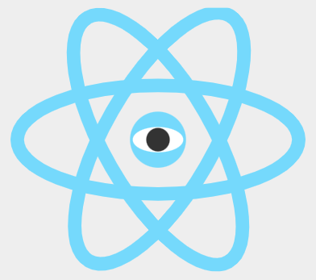
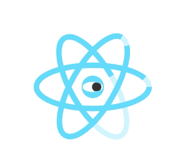

## 인터랙티브 SVG: 마우스를 따라다니는 귀여운 몬스터 애니메이션

### React Mon 만들기

여태까지 배워왔던 다양한 svg 인터랙티브를 활용해 마우스를 따라다니는 리액트 몬스터 애니메이션을 구현해보고자 한다. 아래와 같은 svg 파일을 기준으로 작업하는데, 하늘색 타원은 모두 15px의 stroke로 구성되어 있다. 즉, stroke를 이용한 다양한 애니메이션 구현이 가능하다는 의미!



위 svg 파일을 작업 파일에 끌고와서 기본적인 스타일을 설정해준다.

```html
<!DOCTYPE html>
<html>
  <head>
    <style>
      /* 화면 정중앙으로 오도록 */
      .react-mon {
        position: absolute;
        top: 0;
        right: 0;
        left: 0;
        bottom: 0;
        width: 200px;
        height: 200px;
        margin: auto;
      }
      .cls-1 {
        fill: none;
        stroke: #61dafb;
        stroke-miterlimit: 10;
        stroke-width: 15px;
      }
    </style>
  </head>
  <body>
    <svg class="react-mon" viewBox="0 0 327 291.84">
      <ellipse class="cls-1" cx="163.5" cy="145.92" rx="156" ry="60" />
      <ellipse class="cls-1" cx="384" cy="384" rx="156" ry="60" transform="matrix(.5 -.87 .87 .5 -361.05 286.47)" />
      <ellipse class="cls-1" cx="384" cy="384" rx="60" ry="156" transform="rotate(-30 -170.504 676.413)" />
      <circle cx="163.5" cy="145.92" r="31" fill="#61dafb" />
      <ellipse cx="163.5" cy="145.92" rx="28" ry="14" fill="#fff" />
      <circle cx="163.5" cy="145.92" r="13" fill="#333" />
    </svg>
  </body>
</html>
```

이제 위 svg 파일에 하나씩 애니메이션을 넣어보자. 먼저 눈알이 왔다갔다 하는 동작을 추가해보고자 한다. 눈알 태그에 `eye-ball`이라는 클래스를 추가해주고 깜빡이는 효과를 위해 흰자영역에는 mask처리를 위해 복사해준다. (흰자영역 mask를 defs로 옮겨담지않고, 복사하는 이유? 흰자는 계속 레이아웃 내 존재한 상태에서 변경되어야 하므로 복사해준다)

```html
<!DOCTYPE html>
	<!-- codes.. -->
  <body>
    <svg class="react-mon" viewBox="0 0 327 291.84">
			<defs>
        <mask id="eye-mask">
          <ellipse class="eye" cx="163.5" cy="145.92" rx="28" ry="14" fill="#fff" />
        </mask>
      </defs>
      <!-- codes.. -->
			<!-- 흰자 영역 -->
			<ellipse class="eye" cx="163.5" cy="145.92" rx="28" ry="14" fill="#fff" />
			<!-- 눈알 영역(마스크 적용) -->
      <g mask="url(#eye-mask)">
        <circle class="eye-ball" cx="163.5" cy="145.92" r="13" fill="#333" />
      </g>
    </svg>
  </body>
</html>
```

위 처럼 mask를 처리한뒤 각각 eye-ball, eye 클래스에 애니메이션을 적용해준다.

```css
/* 눈알 움직이는 애니메이션 */
@keyframes eye-ball-ani {
  0% {
    transform: translateX(-20px);
  }
  100% {
    transform: translateX(20px);
  }
}
/* 눈 흰자 꿈뻑이는 애니메이션 */
@keyframes eye-ani {
  80% {
    transform: scaleY(1);
  }
  90% {
    transform: scaleY(0.01);
  }
  100% {
    transform: scaleY(0.01);
  }
}
.eye {
  transform-origin: 50% 50%;
  animation: eye-ani 2s alternate linear infinite;
}
.eye-ball {
  animation: eye-ball-ani 1s alternate linear infinite;
}
```

위와 같이 처리하면 눈동자 애니메이션이 완성된다!

### 타원 애니메이션 구현

타원애니메이션은 stroke-dashoffset 속성을 이용해 구현하는 애니메이션이다.
완성된 효과를 보면 뒤에 투명도가 들어간 하늘색 타원형 위에 진한 파란색 타원형이 일정한 시간을 가지고 animation 동작이 이루어지는 것을 알 수 있다. 따라서 동일한 타원형 태그를 두개를 만들어 처리해준다.

```html
<svg class="react-mon" viewBox="0 0 327 291.84">
  <defs>
    <!-- codes... -->
  </defs>
  <g>
    <ellipse class="cls-1" cx="163.5" cy="145.92" rx="156" ry="60" />
    <ellipse class="cls-1 cls-eff cls-eff-1" cx="163.5" cy="145.92" rx="156" ry="60" />
  </g>
  <g>
    <ellipse class="cls-1" cx="384" cy="384" rx="156" ry="60" transform="matrix(.5 -.87 .87 .5 -361.05 286.47)" />
    <ellipse
      class="cls-1 cls-eff cls-eff-2"
      cx="384"
      cy="384"
      rx="156"
      ry="60"
      transform="matrix(.5 -.87 .87 .5 -361.05 286.47)"
    />
  </g>
  <g>
    <ellipse class="cls-1" cx="384" cy="384" rx="60" ry="156" transform="rotate(-30 -170.504 676.413)" />
    <ellipse
      class="cls-1 cls-eff cls-eff-3"
      cx="384"
      cy="384"
      rx="60"
      ry="156"
      transform="rotate(-30 -170.504 676.413)"
    />
  </g>
  <!-- codes... -->
</svg>
```

위처럼 동일한 태그를 생성한뒤 그룹(g) 태그로 묶어준 다음 애니메이션 효과를 줄 `cls-eff` 클래스와
각 타원마다 애니메이션 효과를 별도록 주기 위한 `cls-eff-1`, `cls-eff-2`, `cls-eff-3` 클래스를 준다.

먼저 해당 동작의 애니메이션을 위해서는 `stroke-dashoffset` 값을 가져와야 한다.

```jsx
document.querySelector(".cls-eff").getTotalLength(); // 712.134
```

해당 값은 위처럼 `getTotalLength` 메서드를 이용해 가져올 수 있음. 해당 값을 이용해 만든 애니메이션 `ell-ani`는 아래와 같다.

```css
/* 애니메이션 동작 */
@keyframes ell-ani {
  0% {
    stroke-dashoffset: -713;
  }
  50% {
    stroke-dashoffset: 0;
  }
  100% {
    stroke-dashoffset: 713;
  }
}

/* codes... */

.cls-1 {
  fill: none;
  stroke: #61dafb;
  stroke-width: 15px;
  opacity: 0.3; /* 뒤 배경 타원에는 투명도 부여 */
}
.cls-eff {
  opacity: 1; /* 실제 애니메이션 적용될 타원은 투명도 1 부여 */
  stroke-dasharray: 713;
  stroke-dashoffset: -713;
  animation: ell-ani 0.7s infinite ease-in-out; /* 무한대로 동작하도록 처리 */
}
.cls-eff-2 {
  animation-delay: 0.1s; /* 애니메이션 시점 다르게 처리 */
}
.cls-eff-3 {
  animation-delay: 0.2s; /* 애니메이션 시점 다르게 처리 */
}
```


