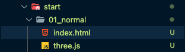
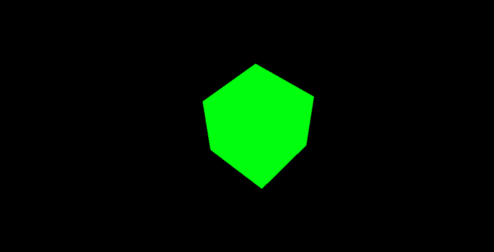

## Three.js 시작하기

### Three.js를 배우기 전에

Three.js는 webGL을 기반으로 한다. webGL은 Web Graphics Library의 약자로 웹상에서 2D 및 3D 그래픽을 랜더링하기 위한 로우 레벨 JavaScript API이다. webGL을 통해 3D 개발, 고급 3D 그래픽 애플리케이션을 만들 수 있게 됐다. 하지만 webGL은 배우기가 어렵다. 로우레벨 코드이기 때문..

webGL을 쉽고 간편하게 사용하기 위해 Three.js가 나옴. webGL을 이용하는 라이브러리는 여러가지가 있으나 Three.js가 제일 많이 쓰이고 있는 듯함

### three.js 열어보기

기본적으로 three.js 를 실행해본다.
나의 경우 크롬에서 실행 시 webGL이 정상 동작하지 않고 에러를 뿜어댔는데, 크롬 설정 [시스템] - [가능한 경우 하드웨어 가속 사용] 설정을 해제해둬서 그랬음.. 만약 이 설정을 해 둔 사람이라면 실행이 안될 것 같다.

위 설정을 활성화 한 후 `three.js` 소스를 다운로드 받은 다음 루트 위치에 옮겨준 뒤 이를 실행시킬 `index.html`을 three.js 공식 [document](https://threejs.org/docs/index.html#manual/en/introduction/Creating-a-scene)에서 긁어온다.



`./index.html`

```html
<!DOCTYPE html>
<html>
  <head>
    <meta charset="utf-8" />
    <title>My first three.js app</title>
    <style>
      body {
        margin: 0;
      }
    </style>
  </head>

  <body>
    <script src="three.js"></script>
    <script>
      const scene = new THREE.Scene();
      const camera = new THREE.PerspectiveCamera(75, window.innerWidth / window.innerHeight, 0.1, 1000);

      const renderer = new THREE.WebGLRenderer();
      renderer.setSize(window.innerWidth, window.innerHeight);
      document.body.appendChild(renderer.domElement);

      const geometry = new THREE.BoxGeometry(1, 1, 1);
      const material = new THREE.MeshBasicMaterial({ color: 0x00ff00 });
      const cube = new THREE.Mesh(geometry, material);
      scene.add(cube);

      camera.position.z = 5;

      function animate() {
        requestAnimationFrame(animate);

        cube.rotation.x += 0.01;
        cube.rotation.y += 0.01;

        renderer.render(scene, camera);
      }

      animate();
    </script>
  </body>
</html>
```

위를 live server로 실행 시키면 정상적으로 초록 상자가 노출된다.



### 자바스크립트 module 기본

작업하기 전에 JavaScript의 module에 대한 이해를 해야한다.

`index.html`

```html
<!DOCTYPE html>
<html lang="en">
  <head>
    <!-- ... -->
  </head>
  <body>
    <script type="module" src="main.js"></script>
  </body>
</html>
```

위와 같이 작성한 경우 일반 javaScript을 모듈 형태로 쓸 수 있음

`hello.js`

```jsx
export default function hello1() {
  console.log("hello 1!");
}

export function hello2() {
  console.log("hello 2!");
}
```

위와 같이 export default, export 로 모듈 내보내기를 처리해 준 뒤 main.js에서 아랭와 같이 씀

```jsx
// import { hello1, hello2 } from "./hello.js";
// import hello1 from "./hello.js";
import * as hello from "./hello.js";

hello.hello1();
hello.hello2();
```

3D 애니메이션 구현 시에는 `import * as alias` 형태로 많이 사용하는 편. 알고 있지만 한번 더 짚고 넘어감
