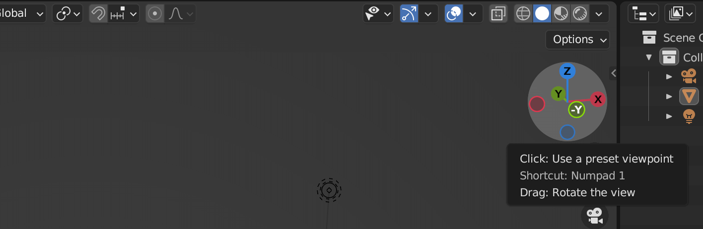
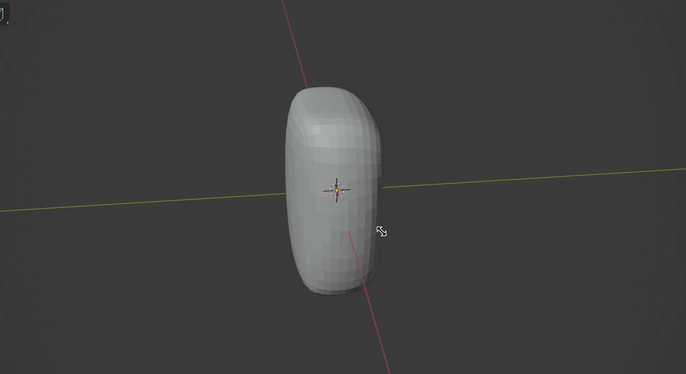
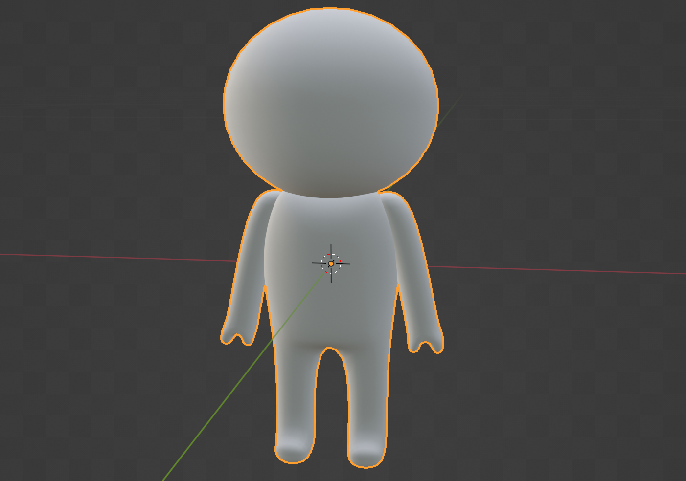
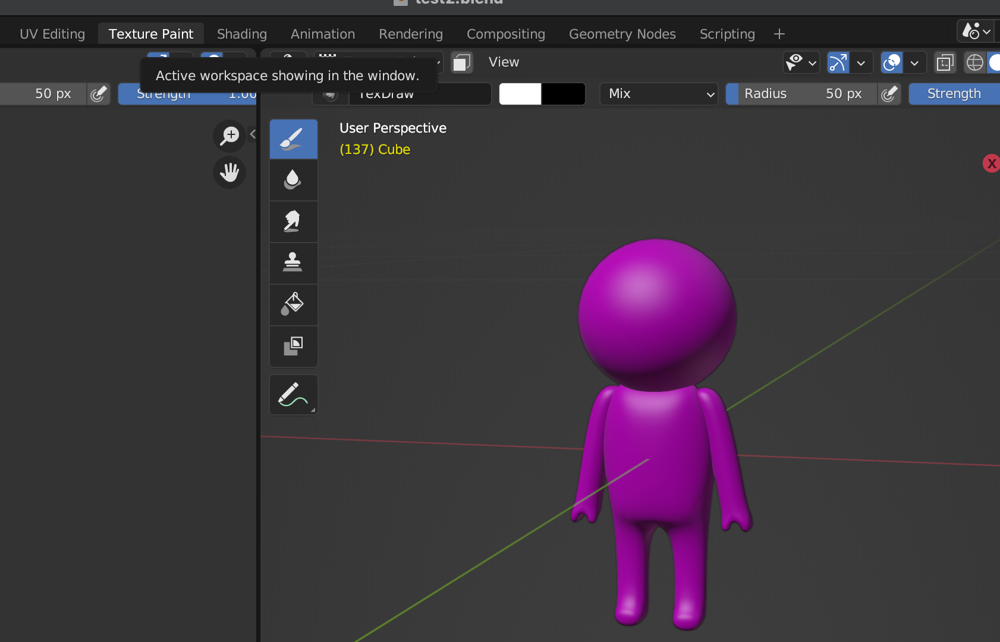
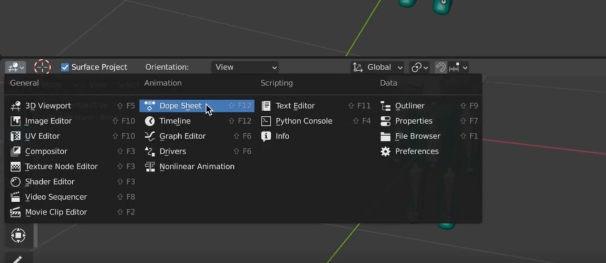

## 응용 1 - 3D 모델 Three.js에서 활용하기

지금까지는 three.js에서 기본적으로 제공하는 도형을 가지고 작업을 해보았다.
이번에는 커스텀 모델을 three.js에서 활용하는 방법에 대해 배워보자

### 커스텀 3D 모델 포맷

glTF(GL Transmission Format의 줄임말)은 3차원 장면과 모델을 표현하는 파일 포맷으로 JSON 표준에 기반한다. json 데이터에 각종 정보가 들어있고, 그것을 활용해 three.js에서 그려낼 수 있다.

다양한 포맷이 있지만 glTF이 제일 대표적인 포맷이다. glb는 glTF를 바이너리 데이터 자체로 가지고 있는데, 블랜더라는 프로그램으로 3D 모델을 만든 뒤 glTF의 바이너리 포맷인 glb를 활용해 three.js에서 그려본다.

먼저 gltf download라고 구글에 치면 다양한 글이 나온다. 사람들이 만들어놓은 모듈을 돈주고 구매하거나 무료로 사용할 수 있다. 하지만 간단하더라도 직접 만들어서 내가 원하는 파일을 사용해보는 것이 훨씬 활용도가 높으므로 직접 3D 모델링 프로그래밍도 살짝 배워본다.

### Blender 소개


블랜더에 대한 기본적인 기능을 배워본다. 다양한 3d 모델링 툴이 있지만 Blender 오픈소스 기반의 툴이다.
즉, 무료임.. 따라서 이 툴을 사용해서 배워본다.

### Blender 패널 추가/삭제


블렌더를 실행시켜보면 이런 이미지가 가장 먼저 뜬다. 기본 시작형태임. 각종 패널에 대해 먼저 알아보자


좌측 화살표 방향의 버튼을 누르면 다양한 타입의 에디터로 사물을 볼 수 있는 설정 기능이 나온다. 기본은 3D Viewport이고 다양한 설정으로 화면을 볼 수 있다.

가장 기본적으로 패널을 추가하고 삭제하는 방법에 대해 알아본다.


마우스를 이동시켜 여백을 주면 추가 패널 생성, 추가된 여백 쪽으로 다시 드래그를 이동시키면 패널이 삭제되는 구조이다.

### 마우스/트랙패드 컨트롤

본격적으로 모델링을 해본다. 기본 3D Viewport에서 3D 모델링을 한다. 우선 트랙패드로 컨트롤 하는 방법에 대해 알아본다. (기본 트랜패드 사용하므로)

1. 두 손가락으로 움직이기

   

2. Shift + 두 손가락으로 움직이기 = 시점 이동

   

3. Command + 두 손가락으로 움직이기 = 확대/축소

   

4. 각 축을 위에서 정렬해서 보고싶다면 오른쪽 우측 패널 이용

   

주의할 것은 three.js에서 y가 위아래, z가 앞뒤 방향이였다면, 블렌더에서는 z가 위아래, y가 앞뒤 방향이다. 참고하자. 또한 정면 모습을 보고싶다면 y축의 맞은편 동그라미를 누르면 앞면을 보는 것으로 이해하면 된다



y가 안써있는 연두색 면이 정면임

### 3D 뷰포트 패널

우측 scene collection을 보면 Camera, Cube, Light 객체가 존재함


위와 같이 각 역할을 하고 있음을 알 수 있다. 하지만 우리는 three.js에서 3d 모델을 가져와서 쓰려고 하는거기 때문에 Camera, Light가 필요없다. 마우스 오른쪽 클릭 → Delete를 클릭해서 없애준다.

이외에도 우측에 Cube가 어떻게 보이는지를 설정할 수 있음


첫번째는 외곽 선만 보여줌, 두번 째는 기본값, 세번째는 mesh까지 포함된 Cube


마지막은 빛이 적용된 cube를 보여주는 설정이다.

이 밖에도 T를 누르면 자동으로 좌측 메뉴 판넬이 토글, N을 누르면 우측 option 창이 토글되어 나타남

### 메쉬의 크기, 추가/ 삭제

아래 이미지의 한 칸이 1을 의미한다. 즉 아래 mesh는 가로, 세로, 높이가 2인 정육면체임


아예 새로운 형태의 구를 만들수도 있는데, 이때는 삭제하고 새로 추가해주는 것이 좋다.


위 패널에서 Add 버튼을 눌러 원하는 모양의 mesh를 추가해줄 수도 있고 Shift + A 단축키를 눌러 추가해줄 수 있다. UV Sphere + Plane을 추가하면 아래와 같이 노출됨


### Object 모드와 Edit 모드

기본 모드는 Object 모드이다.


이때에는 아래와 같이 mesh에 대한 다양한 Transform이 가능하다.


이를 Edit모드로 바꿔보면 아래와 같이 변신함


각 점선면의 위치를 조절할 수 있다.


설정을 바꾸면 점을 수정, 선을 수정, 면을 수정하도록 모드를 설정할 수 있음
이때 움직일 점을 클릭 후 G를 누르면 수정할 수 있도록 커서가 바뀌고 이때 이동하면 x, y, z축이 모두 수정되므로 x축만 수정하고 싶을 경우에는 G + X를 같이 누르면 아래와 같이 가이드선이 생기면서 x축만 변경됨


즉 이동은 G, 회전은 R, 크기는 S로 설정할 수 있다.


A를 눌러 전체 선택한 뒤 S를 누르면 전체 크기를 수정할 수 있다 이때 Shift + z를 누르면 z축을 제외한 나머지 축만 수정되도록 설정할 수 있다.


그러면 위와같이 x, y만 커진 사각형을 만들 수 있음. Object 모드에서도 수정할 수 있지만 크기의 변화가 차이가 있다. 만약 위와같이 박스의 크기를 키울 경우 Object 모드에서는 그만큼 크기가 커짐, Edit 모드에서는 그 자체로 1이 되는 사이즈로 변경된다. 즉 mesh의 크기 자체를 조정할 경우 Edit 모드에서 수정해주는 것이 바람직함

또 Object 모드에서 mesh를 추가할 경우 각 mesh가 각자의 edit mode를 가지게 된다.
(선택했을 때 하나씩만 선택됨)


만약 mesh를 edit모드에서 추가할 경우에는 mesh 클릭 시 아래와 같이 선택됨


두 개가 같이 선택된다. 즉 한번에 두가지 mesh를 같이 수정할 수 있게되는 것이다.
각 사용법에 맞는 Mode에서 메쉬를 추가해서 관리할 수 있어야 한다.

### 캐릭터 몸통 만들기

이제 진짜 뭔갈 만들어본다. 캐릭터 몸통을 하나 그려볼 것임


우측 Modifier Properties를 클릭해보면 Modifier를 추가할 수 있는 구좌가 생긴다. 이걸 클릭한 뒤 Subdivision Surface를 선택하면 아래와 같이 노출됨


우측에 생기는 설정창에 Levels Viewport를 Render와 맞춰주면 좀 더 오밀조밀한 구가 생성됨.
이제 Edit Mode로 전환한다. 그러면 큐브 내부에 들어간 구모양으로 변환됨. 이때 Ctrl + R을 눌러주면 아래와 같이 노란 가이드라인 선이 나온다. 이 선을 클릭한 상태로 드래그하면 모양 변경 가능


또, 클릭하기 전 스크롤을 올리면 가이드라인 수도 가감이 가능함.
스크롤을 올려 가이드라인을 두 개로 만든 뒤 중앙에 위치하도록 작업해준다.


x, y, z 축 모두 작업해주면 아래와 같이 변환됨


이것을 몸통으로 사용할 것이므로 크기를 조정해준다. 크기조정도 Edit mode에서 해주는게 좋음
키를 140cm라고 생각하면 몸통은 40cm정도로 생각해줄 수 있다. A를 눌러 전체 선택을 해준 뒤 S 혹은 G와 축소할 방향 등을 x, y, z 혹은 Shift + x, y, z(x, y, z 축을 제외한 모든 축을 의미)을 순차적으로 눌러 조정해준다.



디테일한 수정은 동영상 혹은 직접 작업하여 깨우치는 편이 빠르다. 앞은 살짝 배가 나오게, 뒷면을 허리가 살짝 들어간 형태로 몸통을 완성해보았다.

### 캐릭터 다리 만들기(대칭)

다리는 새 mesh를 추가하는 것이 아닌 면에서 뽑아내는 방법으로 만들어본다.
Edit mode에서 면을 선택 후 다리를 만들 면을 선택 후 E를 누른 상태에서 mesh를 늘이면 아래와 같이 다리를 만들 수 있음


방향에 따라 들어가게 할 수도 있고, 나오게할 수도 있다. 다리는 양쪽이니 두 면을 선택해서 동시에 뽑아내면 되겠지만 똑같이 좌우를 만드는 더 나은 방법이 있다.

Object Mode로 전환 후 Mirror Modifier를 추가해준다.


그 뒤 Edit mode로 이동하여 위와 같은 동일한 방법으로 한면을 클릭 후 E를 누른 상태에서 눌려주면 대칭된 양쪽에 다리가 생김 거울 효과가 생긴 것 같다.


이후 G 누른 뒤 Z를 누른 상태에서 길이를 좀 더 세밀하게 수정해줄 수 있다.
그러고 나서 보면 아쉽다. 다리가 점점 얇아짐.. 이는 면을 선택해서 바꿔줄 수 있다.


Shift를 눌러 면 중복 선택 후 S를 누른 뒤 Y를 누른 채로 굵기를 Y 축방향으로 조절해준다.

이제 발을 만들어본다. Command + R을 누르면 Loop Cut and Slide 기능이 활성화 된다.


위와 같이 위치를 조정하여 아래 발 영역까지 다리를 두껍게 만들어준다.
이제 발도 귀엽게 만들어줘보자. 늘려줄 면을 선택 후 E를 눌러서 뽑아내면 아래와 같이 발을 만들 수 있음


위 방법들들을 여러모로 활용해서 원하는 다리와 몸 형태를 갖춰본다.


몸통 다리 완성!

### 캐릭터 팔 만들기

팔은 메쉬를 추가해서 작업해본다. Shift + A를 눌러서 Cube 하나를 추가해준다. 그러면 띠용 아래와 같이 생성됨


G + X 를 눌러서 x축으로 좀 분리해본다.


캐릭터에 비해 크기가 너무 크므로 사이즈 부터 줄여준다.
내가 줄이고 싶은 메쉬를 전체 선택하려면 메쉬 위에 마우스를 올려두고 L 을 누르면 전체 선택이 된다.


다음으로 Y축 상위로 정렬 후 S를 눌러 사이즈 줄이기 + G+x 조합으로 위치를 캐릭터 옆에 조정해 줌


몸통 정도의 크기가 되도록 아래와 같이 줄여주었다.


이제 상세히 팔모양을 만들어 볼 차례이다.

우선 길게(S + Shift + z) 만들어 준 다음. 굵기 조정(ctrl+R 후 굵기 위치 조정)도 해준다.


뭉툭한 물병 모양의 어깨는 Edge mode(2번) 선택 바깥 쪽 선만 선택한 뒤 G + z로 수정해주면 아래와 같이 어깨 모양을 수정해줄 수 있음


이제 면 분할을 통해 손 모양을 만들어본다. 손바닥 영역의 면(Face mode: 3번)을 선택 후 마우스 오른쪽 + Subdivide를 클릭하면 먼저 2\*2로 면이 나뉘어진다. 더 많이 나눠주려면 하단의 Subdivide 창에서 값을 조정해줄 수 있다. (아래 이미지 참고)


우리는 Number of Cuts를 2로 선택해서 총 9개의 칸으로 나눠준다.


다음 원하는 영역만 선택해서 E를 눌러준 뒤 아래로 내려주면 아래와 같이 손 모양을 만들 수 있다.


손바닥 부분도 자연스럽게 g + z의 조합으로 수정해줄 수 있다.


앞서 조절한 방법을 사용해서 디테일하게 수정을 더해준다.
팔 길이가 너무 기니까 S + Z를 눌러서 길이도 아래와 같이 수정


다음 R + Y를 눌러 약간 기울게 회전해준 뒤 G + Z, G + X로 위치를 수정해준다.


대충 완성되었다. Alt + z를 눌러 x레이모드로 변형하면 어깨를 좀 더 자연스럽게 변경해줄 수 있다.


내부 라인을 선택 후 g+x를 통해 아래와 같이 수정


더 자연스러워졌다! 이처럼 모잘라보이거나 아쉬운 부분을 위에서 배운 방법대로 계속 가다듬어주면 몸통이 완성된다! Tab , Alt + z를 눌러서 Object로 나와보면 아래와 같이 몸통이 잘 만들어진 것을 확인할 수 있다.


### 캐릭터 머리 만들기

머리를 만들기 전에 몸통이 모두 구현이 끝났다면 Default 값으로 적용을 바꿔준다.
Object Mode 상태에서 우측 Modifier의 Subdivision + Mirror를 모두 Apply를 눌러준다.


Apply 후 변화가 없어보이지만, tab을 눌러 Edit mode로 들어가보면 모양이 달라져있는 것을 확인할 수 있다.


이제 완전히 mesh 한 형태가 생성된 것이다. Shift + a로 UV Sphere를 눌러 머리로 사용할 구를 추가해준다.
그리고 S로 크기 조정, 살짝 납작하고, Y축으로도 살짝 눌려진 머리를 각 단축키를 이용해 아래처럼 구현해준다.


tab으로 Object mode로 나왔더니 오돌토돌 딱딱함. 마우스 오른쪽 버튼 Shade Smooth를 눌러주면 아래와 같이 매끄러운 캐릭터로 변신하게 된다.



다음에는 옷도 입혀보자!

### UV 매핑(전개도 만들기)

옷을 입힌다는 것은 texture material을 mesh에 적용한다는 것을 의미한다.
텍스쳐 이미지를 외부 프로그램으로 만들어서 그것을 불러와서 적용하는 방법이 있고, 블렌더에서 직접 칠할 수도 있다. 텍스쳐 이미지를 생성하는 것은 쉽지 않은 방법이긴 함. 따라서 색칠을 해본다.

우선 패널을 둘러 나눠본다.


그리고 한쪽 패널에 UV Editor를 오픈해준다. 그러면 아래와 같이 네모난 사각형이 나옴


위 그림에 적용할 텍스쳐 이미지의 전개도를 만든다고 생각하면 된다.
전개도는 입체 형태를 평면에 쫙 펼친 형태를 의미한다.
우선 오징어게임 복장을 만들어보는데 체육복의 흰 띄를 표현할 영역만 edit mode에서 선택해준다. (팔다리 좌우)


이렇게 edge mode로 각면을 중복 선택해준 뒤 마우스 오른쪽 클릭 - Mark Seam이란 기능을 눌러주면 영역이 진한 색으로 변경되면서 구역이 나뉘어진다. 이렇게 해놓으면 나중에 편하다


위와 같이 지정 후 A를 눌러 mesh를 전체 선택하면 좌측에 아래와 같이 전개도가 그려짐


여기에서 u를 눌러 uv mapping 메뉴 + Unwrap을 누르면 선택 영역이 아래와 같이 변경된다.


이 때 a를 눌러 전체 선택 후 UV 메뉴에서 Average Islands Scale을 클릭해준다.
실제 메쉬 비율에 맞게 텍스쳐 이미지 비율을 맞춰준 것을 의미한다.

그런데 여전히 겹쳐져서 뭐가 뭔지 모르겠음. 이때 다시 UV 메뉴에서 Pack Islands를 선택해준다.


그러면 아래와 같이 전개도가 정리됨 색칠하기 좋아보인다.


하지만 간격이 굉장히 붙어있음 간격을 늘려본다. 전체선택된 상태에서 하단 왼쪽에 Pack Islands 탭으로 이동


여기에서 Margin값을 0.1로 조정해주면 아래와 같이 변한다


간격이 생김! 이제 색칠을 본격적으로 해본다.

### 색칠하기

이제 정말 색칠을 해보자. 색칠은 Image Editor로 한다.


여기에서 Paint 모드를 선택해주어야 아까 만든 전개도가 나옴


그리고 위에 Texture Paint라는 탭 메뉴를 누르면 갑자기 모델이 보라색으로 변함



보라색은 적용된 텍스쳐 이미지가 없음을 의미함 실제 우측 패널에도 No Textures라고 나온다.


우측 플러스 버튼을 누른 뒤 Base Color를 선택 후 Name과 색상을 입맛에 맞게 변경 후 OK를 누르면 오징어게임 체육복색으로 도배가 된다.


여기에서 얼굴에 흰색을 칠해보면 왼쪽 전개도에도 그림이 그려짐. 그러면 어떤 전개도가 어느 위치의 mesh 인지를 자연스럽게 추측할 수 있게된다. 얼굴은 흰색으로 칠할거니까.. 얼굴영역 전개도를 하얗게 칠해줬다.


그럼 위와 같이 됨. 좀전에 별도로 추가해주었던 체육복의 선도 색칠해주면 아래와 같이 노출된다.


이제 얼굴도 자세히 그려줘본다.


ㅋㅋ 대충 완성.. 이 모델로 three.js 애니메이션을 구현해보자!
색 다시 칠해봄 ㅋㅋ


### 애니메이션 뼈대 만들기

이제 애니메이션을 만들기 위해 three.js에서 상황에 맞게 맞춰쓰기 위해서 뼈대를 만들어야 한다.


우선 Object mode에서 Shift + A를 눌러 Armature - Single Bone을 추가한다.
(만약 Single Bone 선택이 보이지 않을 경우 아래 순서대로 옵션을 활성화해준다.)

[Edit - Preferences - Add-ons 탭에 “rig”로 검색한 뒤 Rigging: Rigify 옵션 활성화]


이후 우측 Object Properties 메뉴 클릭 후 - Viewport Display 내 Show 속성을 In Front로 설정해준다.
이것이 기본 뼈대가 됨


이후 Edit mode에서 S를 누른 뒤 크기 축소, G를 누른 뒤 z를 눌러 이동 시켜줘서 위와 같이 메인 축을 만든다.
이제 움직일 부분에 대한 관절도 만들 건데 고개를 움직일 수 있도록 처리한다.


축의 원부분을 클릭 후 E를 누른 상태에서 마우스를 움직여주면 고개쪽으로 축을 추가할 수 있음
다음으로 팔도 움직이기 위해서 Shift+A를 눌러 팔에 축을 만들어준다. 이동, 크기조정, 회전(R+Y)로 맞춰줌


오른쪽 팔을 만들었으니 복사해서 왼쪽 팔도 만들어준다. 우선 가운데 중심 축을 기준으로 복사해야하므로 기존 Median Point 설정에서 3D Cursor로 바꿔준다.


그러면 축 중심이 가운데 축으로 변경되어서 회전을 해도 중심축을 기준으로 움직인다.


이것을 활용해서 Shift + D를 눌러서 복제해준 뒤 S + X를 눌러 X축 기준으로 이동 -1을 눌러주면 대칭 복사 완료


양쪽 어깨 뼈대 생성 완료!

다리도 동일하게 만들어준다.


단순한 뼈대가 완성되었다. 이제 뼈대를 만들었으니 이를 연결해준다.

Object Mode에서 mesh와 뼈대를 중복을 선택해준 뒤 Command + P를 누른 다음 Armature Deform - With Automatic Weights를 선택해주면 자동으로 뼈대가 이어진다.


(이후 자동 처리가 안되서 수업자료로 캡쳐 대신함) 잘 이어졌는지 확인은 Pose Mode에서 해준다.


그런데 중심축을 이리저리 움직여보면 어깨가 따로 논다. 몸통과 어깨가 연결되지 않아서 그렇당..
이때는 Edit Mode에서 자식이 되는 어깨를 먼저 선택 후 중심축을 중복 선택 후 Ctrl + P 를 눌러 Keep Offset으로 연결해준다.


몸 전체가 같이 움직이게 된다.

### 애니메이션 만들기

이제 애니메이션을 만들어본다. 하단에 패널을 추가한 뒤 Dope Sheet을 추가해준다.



그러면 아래와 같은 창이 생김


Dope Sheet의 셀렉트 박스를 눌러 Action Editor를 눌러준다. 그런 뒤 우측의 New 버튼을 클릭해보자.
이름은 default라고 적어준다. default는 좌우로 고개를 움직이는 것 애니메이션을 넣을 것임

애니메이션은 기본적으로 변화가 있는 부분에 키 프레임을 삽입해주는 개념이다. 아래 숫자가 프레임 수이며, space를 누르면 재생이 시작된다. 재생을 시작한 뒤 변화를 줄 프레임을 선택 후 변경하고자 하는 대로 고개를 조금 움직여준 뒤 A 눌러서 전체 프레임 선택 + I를 누르면 Insert Keyframe Menu를 눌러 Location, Rotation & scale을 선택해준다.


그러면 하단과 같이 애니메이션이 추가가 된 것을 확인할 수 있다.


다음으로 48프레임으로 옮겨 고개를 반대쪽으로 회전시킨 다음 A 선택 후 I → Location, Rotation & Scale을 다시 선택해준다. 그럼 아래와 같은 애니메이션이 생성됨


그런데 시작점이 중간이다보니 이어지는 느낌이 들지 않음 즉, 48에서 구현한 키프레임을 0에 복사해넣어주면 연결되는 동작으로 보여지게 구현이 가능하다.

48에 둔 상태에서 Shift + D를 누른 상태에서 마우스 이동으로 시작점으로 점을 이동해주면 된다.


그럼 뾰롱 왔다갔다하는 애니메이션이 완성됨. 이 애니메이션을 three.js에서 무한반복 시키면 계속 오뚜기처럼 움직이는 모델이 완성되는 것임. 이렇게 1번째 default animation 구현 완료!

다음 두번째 애니메이션을 만들어본다. default 이름 우측의 New Action 버튼을 눌러서 생성함
이름은 jump로 한다. 징검다리를 건너기 위함이다. 다음으로 앞서 만들어둔 24, 48초 애니메이션을 삭제해준다.
(x 누른 뒤 Delete Keyframes 선택)

기존에 첫번째 액션이 갸우뚱한 자세이므로 계속 갸우뚱한 상태로 존재한다. 이를 다시 제자리로 돌리기 위해서는 a 를 눌러 전체 선택 후 Alt + R을 누르면 돌아온다. 이 상태에서 I를 눌러 아까와 같이 Location, Rotation & Scale을 선택해야 정자세로 시작되는 애니메이션 키프레임이 완성됨

본격적인 점프 동작을 만들어본다. 빠르게 움직여야 하므로 5초에 애니메이션을 추가해본다.

1. R + X축을 눌러 다리가 움직이는 모양을 좀 내준다 (G + Y를 눌러서 앞 뒤로 다리 늘리기), 팔도 동일


이렇게 만들어준 뒤 아까와 동일하게 A + I + Location, Rotation & Scale 선택해주면 애니메이션 키프레임 추가 완성! 다음 24프레임에서 착지 애니메이션을 구현할 것인데, 그 전에 20초쯤까지 5초에 구현한 애니메이션을 복사해준다. (키프레임 전체 선택 후 Shift + D로 이동 처리)


이렇게해야 뛰었을 때 따로 변화가 없게 이어질 것임. 24프레임에서는 착지가 완료된 상태일 것이므로 0초에 생성한 키프레임을 똑같이 복사하여 24초에 복제해준다. (Shift + D)


점프는 Three.js에서 물리 엔진으로 구현해줄 것이므로 애니메이션은 이렇게 완성하면 된다.

### Blender 파일 내보내기

이제 만들어진 블렌더 파일을 three.js로 가져다 쓰기 위해 export 해보자!

먼저 Object로 이동, Export할 메쉬를 선택 후 File > Export > `gLTF 2.0(.glb/.gltf)` 선택
Export 하기 전 창 우측에 Selected Objects를 반드시 선택 한 다음, Transform > + Y Up도 선택해준다.


Blender에서는 x축이 위로가게 작업했지만, Three.js에서는 Y축이 기준이 되기 때문임 (Three.js와 방향이 같으니 편함)

별도 설정은 필요할 때 추가해주면 되고, Export glTF 2.0을 눌러주면 고생한 glb파일이 생성된다!

### 커스텀 모델 로드하기

blender에서 열심히 만든 캐릭터를 three.js에 로드해본다. src/models 내에 export한 파일을 호출하려면 webpack.config에 설정이 필요하다.

`webpack.config.js`

```jsx
module.exports = {
	// ..
	plugins: [
		new HtmlWebpackPlugin({
			template: './src/index.html',
			minify: process.env.NODE_ENV === 'production' ? {
				collapseWhitespace: true,
				removeComments: true,
			} : false
		}),
		new CleanWebpackPlugin(),
			patterns: [
				{ from: "./src/main.css", to: "./main.css" },
				{ from: "./src/models", to: "./models" }, // 추가
				// { from: "./src/images", to: "./images" },
				// { from: "./src/sounds", to: "./sounds" }
			],
		})
	]
};
```

다음 서버 구동을 해보면 빈 페이지가 나온다. gltf 파일을 import하려면 별도 GLTFLoader 로더가 필요하다.

```jsx
import { GLTFLoader } from "three/examples/jsm/loaders/GLTFLoader";
```

위와 같이 import 후 실제 파일을 load해본다.

```jsx
// ----- 주제: glb 파일 불러오기

export default function example() {
  // Renderer, Scene, Camera, Light, Controls ..
  const controls = new OrbitControls(camera, renderer.domElement);

  // gltf loader
  const gltfLoader = new GLTFLoader();
  gltfLoader.load("/models/ilbuni.glb", (gltf) => {
    console.log(gltf);
    console.log(gltf.scene.children[0]); // Object3D {isObject3D: true, uuid: '22121302-940d-4e3a-b784-8232d72cf78e', name: 'Armature', type: 'Object3D', parent: Group, …}
  });

  // ..
}
```

위와 같이 Load 메서드를 실행 후 두번째 인자에 함수를 넣을 수 있는데, gltf 인자를 콘솔로 찍어보면 아래와 같음


animations에 2개로 들어있는데 블렌더에서 만든 애니메이션 두 개가 담겨있는 것임. 내가 원하는 순간에 애니메이션이 동작하도록 배열 인자를 꺼내서 쓸 수 있다.

가장 먼저 scene의 children에 존재하는 첫번째 object를 가져다가 호출하는 것이 먼저임

```jsx
// ----- 주제: glb 파일 불러오기

export default function example() {
  // Renderer, Scene, Camera, Light, Controls ..
  const controls = new OrbitControls(camera, renderer.domElement);

  // gltf loader
  const gltfLoader = new GLTFLoader();
  gltfLoader.load("/models/ilbuni.glb", (gltf) => {
    const character = gltf.scene.children[0];
    scene.add(character);
  });

  // ..
}
```

위와 같이 호출 후 scene.add 해주면 화면에 잘 나타는 것을 볼 수 있음!


하나의 메쉬로 생각하고 기존에 배웠던 여러가지 효과를 주면 똑같이 반영된다.

### 커스텀 모델 애니메이션

다음엔 애니메이션도 구현해본다. 애니메이션을 넣으려면 THREE.AnimationMixer가 필요함

`src/ex02.js`

```jsx
// ----- 주제: 커스텀 모델 애니메이션 구현

export default function example() {
  // Renderer, Scene, Camera, Light, Controls ..
  const controls = new OrbitControls(camera, renderer.domElement);

  // gltf loader
  const gltfLoader = new GLTFLoader();
  let mixer;
  gltfLoader.load("/models/ilbuni.glb", (gltf) => {
    const character = gltf.scene.children[0];
    scene.add(character);

    // console.log(gltf.animations); // 2개의 애니메이션을 가지고 있음

    mixer = new THREE.AnimationMixer(character);
    const actions = [];
    actions[0] = mixer.clipAction(gltf.animations[0]); // default animation
    actions[1] = mixer.clipAction(gltf.animations[1]); // jump animation

    // 애니메이션 실행
    actions[0].repetitions = 2; // 반복 횟수 (default Infinity)
    actions[0].clampWhenFinished = true; // 애니메이션이 끝나면 멈춤
    actions[0].play();
  });

  // 그리기
  const clock = new THREE.Clock();

  function draw() {
    const delta = clock.getDelta();

    // Mixer.update - 외부 리소스가 로드가 된 후 생성되도록 처리
    mixer?.update(delta);

    renderer.render(scene, camera);
    renderer.setAnimationLoop(draw);
  }

  // ..
}
```

mixer라는 변수에 각 idx로 애니메이션을 clipAction을 통해 지정해준 다음,
이에 대한 상세 설정(repetitions, clampWhenFinished 등)을 한 뒤 play() 함수를 실행시켜주면 된다.

화면 변경이 안되는 이유는 draw 함수 내에서 update를 안해줬기 때문! 따라서 draw 함수 내에서 mixer를 update해주면 된다.
앞에 `?.` 연산자를 쓴 이유는 draw가 실행되는 시점과 mixer가 로드되는 시점이 상이한 케이스가 있기 때문으로
모든 외부 리소스가 로드된 뒤 update 되도록 코드를 넣어주었다.


완성스

### 다운로드 받은 파일 활용하기

이번에는 다른 사람들이 만든 멋진 블렌더 메쉬를 사용해서 구현해보자
구글에 free glb라고 치면 여러 사이트가 나온다. 샘플 사이트는 [Sketchfab](https://sketchfab.com/tags/glb)이라는 곳을 이용할 예정

그 중 한가지 테스트 메쉬를 다운로드 받아본다. 대부분 퀄리티가 좋아서 큰 용량이다.(3.8MB)
동일하게 호출해서 화면에 띄워보면된다.

`src/ex01.js`

```jsx
export default function example() {
  // Renderer, Scene, Camera, Light, Controls ..
  const controls = new OrbitControls(camera, renderer.domElement);

  // gltf loader
  const gltfLoader = new GLTFLoader();
  gltfLoader.load("/models/dinosaur.glb", (gltf) => {
    const character = gltf.scene.children[0];
    scene.add(character);
  });

  // ..
}
```

무서운 공룡 노출


만들어진 파일마다 애니메이션도 이미 생성된 케이스가 있기 때문에 이런 것들을 활용해보면 좋다.
