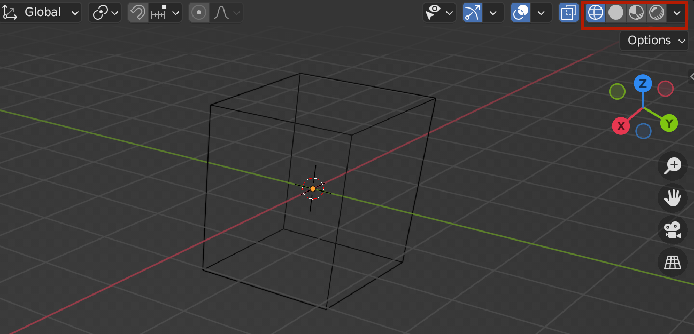

## 응용 1 - 3D 모델 Three.js에서 활용하기

지금까지는 three.js에서 기본적으로 제공하는 도형을 가지고 작업을 해보았다.
이번에는 커스텀 모델을 three.js에서 활용하는 방법에 대해 배워보자

### 커스텀 3D 모델 포맷

glTF(GL Transmission Format의 줄임말)은 3차원 장면과 모델을 표현하는 파일 포맷으로 JSON 표준에 기반한다. json 데이터에 각종 정보가 들어있고, 그것을 활용해 three.js에서 그려낼 수 있다.

다양한 포맷이 있지만 glTF이 제일 대표적인 포맷이다. glb는 glTF를 바이너리 데이터 자체로 가지고 있는데, 블랜더라는 프로그램으로 3D 모델을 만든 뒤 glTF의 바이너리 포맷인 glb를 활용해 three.js에서 그려본다.

먼저 gltf download라고 구글에 치면 다양한 글이 나온다. 사람들이 만들어놓은 모듈을 돈주고 구매하거나 무료로 사용할 수 있다. 하지만 간단하더라도 직접 만들어서 내가 원하는 파일을 사용해보는 것이 훨씬 활용도가 높으므로 직접 3D 모델링 프로그래밍도 살짝 배워본다.

### Blender 소개

블랜더에 대한 기본적인 기능을 배워본다. 다양한 3d 모델링 툴이 있지만 Blender 오픈소스 기반의 툴이다.
즉, 무료임.. 따라서 이 툴을 사용해서 배워본다.

### Blender 패널 추가/삭제

블렌더를 실행시켜보면 이런 이미지가 가장 먼저 뜬다. 기본 시작형태임. 각종 패널에 대해 먼저 알아보자

좌측 화살표 방향의 버튼을 누르면 다양한 타입의 에디터로 사물을 볼 수 있는 설정 기능이 나온다. 기본은 3D Viewport이고 다양한 설정으로 화면을 볼 수 있다.

가장 기본적으로 패널을 추가하고 삭제하는 방법에 대해 알아본다.

마우스를 이동시켜 여백을 주면 추가 패널 생성, 추가된 여백 쪽으로 다시 드래그를 이동시키면 패널이 삭제되는 구조이다.

### 마우스/트랙패드 컨트롤

본격적으로 모델링을 해본다. 기본 3D Viewport에서 3D 모델링을 한다. 우선 트랙패드로 컨트롤 하는 방법에 대해 알아본다. (기본 트랜패드 사용하므로)

1. 두 손가락으로 움직이기

   

2. Shift + 두 손가락으로 움직이기 = 시점 이동

   

3. Command + 두 손가락으로 움직이기 = 확대/축소

   

4. 각 축을 위에서 정렬해서 보고싶다면 오른쪽 우측 패널 이용

   

주의할 것은 three.js에서 y가 위아래, z가 앞뒤 방향이였다면, 블렌더에서는 z가 위아래, y가 앞뒤 방향이다. 참고하자. 또한 정면 모습을 보고싶다면 y축의 맞은편 동그라미를 누르면 앞면을 보는 것으로 이해하면 된다

y가 안써있는 연두색 면이 정면임

### 3D 뷰포트 패널

우측 scene collection을 보면 Camera, Cube, Light 객체가 존재함

위와 같이 각 역할을 하고 있음을 알 수 있다. 하지만 우리는 three.js에서 3d 모델을 가져와서 쓰려고 하는거기 때문에 Camera, Light가 필요없다. 마우스 오른쪽 클릭 → Delete를 클릭해서 없애준다.

이외에도 우측에 Cube가 어떻게 보이는지를 설정할 수 있음

첫번째는 외곽 선만 보여줌, 두번 째는 기본값, 세번째는 mesh까지 포함된 Cube

마지막은 빛이 적용된 cube를 보여주는 설정이다.

이 밖에도 T를 누르면 자동으로 좌측 메뉴 판넬이 토글, N을 누르면 우측 option 창이 토글되어 나타남

### 메쉬의 크기, 추가/ 삭제

아래 이미지의 한 칸이 1을 의미한다. 즉 아래 mesh는 가로, 세로, 높이가 2인 정육면체임

아예 새로운 형태의 구를 만들수도 있는데, 이때는 삭제하고 새로 추가해주는 것이 좋다.

위 패널에서 Add 버튼을 눌러 원하는 모양의 mesh를 추가해줄 수도 있고 Shift + A 단축키를 눌러 추가해줄 수 있다. UV Sphere + Plane을 추가하면 아래와 같이 노출됨

### Object 모드와 Edit 모드

기본 모드는 Object 모드이다.

이때에는 아래와 같이 mesh에 대한 다양한 Transform이 가능하다.

이를 Edit모드로 바꿔보면 아래와 같이 변신함

각 점선면의 위치를 조절할 수 있다.

설정을 바꾸면 점을 수정, 선을 수정, 면을 수정하도록 모드를 설정할 수 있음
이때 움직일 점을 클릭 후 G를 누르면 수정할 수 있도록 커서가 바뀌고 이때 이동하면 x, y, z축이 모두 수정되므로 x축만 수정하고 싶을 경우에는 G + X를 같이 누르면 아래와 같이 가이드선이 생기면서 x축만 변경됨

즉 이동은 G, 회전은 R, 크기는 S로 설정할 수 있다.

A를 눌러 전체 선택한 뒤 S를 누르면 전체 크기를 수정할 수 있다 이때 Shift + z를 누르면 z축을 제외한 나머지 축만 수정되도록 설정할 수 있다.

그러면 위와같이 x, y만 커진 사각형을 만들 수 있음. Object 모드에서도 수정할 수 있지만 크기의 변화가 차이가 있다. 만약 위와같이 박스의 크기를 키울 경우 Object 모드에서는 그만큼 크기가 커짐, Edit 모드에서는 그 자체로 1이 되는 사이즈로 변경된다. 즉 mesh의 크기 자체를 조정할 경우 Edit 모드에서 수정해주는 것이 바람직함

또 Object 모드에서 mesh를 추가할 경우 각 mesh가 각자의 edit mode를 가지게 된다.
(선택했을 때 하나씩만 선택됨)

만약 mesh를 edit모드에서 추가할 경우에는 mesh 클릭 시 아래와 같이 선택됨

두 개가 같이 선택된다. 즉 한번에 두가지 mesh를 같이 수정할 수 있게되는 것이다.
각 사용법에 맞는 Mode에서 메쉬를 추가해서 관리할 수 있어야 한다.
