## 물리엔진 만들기

### 개요

이번 시간에는 three.js에서 물리엔진을 사용해본다.
시작부터 물리엔진은 어렵다. 따라서 잘만들어둔 라이브러리를 사용함.
이번 시간에는 가장 사용이 쉬운 cannon.js로 만들어본다.

Mesh(three.js) + Body(cannon.js)의 조합으로 물리엔진을 구현한다.
Body는 눈에 보이지 않은 상태로 적용되어 구현된다. Mesh 자체는 중력이나 떨어지는 등의 액션을 구현할 수 없다.
이런 것들은 cannon.js가 구현해 줌. 이걸 구현하기 위해서는 Body의 위치를 Mesh가 따라가도록 해줘야 한다.
한 쌍이 되어 움직인다고 보면 됨

### 물리엔진 월드 생성

cannon.js 문서는 [여기](http://schteppe.github.io/cannon.js/docs/)를 참조. 일단 설치를 해준다.

```bash
> npm i cannon-es
```

그러면 아래와 같이 접근할 수 있음

`physics/src/ex01.js`

```jsx
import * as CANNON from "cannon-es";
```

먼저 중력을 적용해주기 위해 Controls에 아래와 같은 코드를 추가해본다.

```jsx
import * as THREE from "three";
import { OrbitControls } from "three/examples/jsm/controls/OrbitControls";
import * as CANNON from "cannon-es";

// ----- 주제: cannon.js 기본 세팅

export default function example() {
  // Renderer, Scene, Camera, Light ..

  // Controls
  const constols = new OrbitControls(camera, renderer.domElement);

  const connonWorld = new CANNON.World();
  connonWorld.gravity.set(0, -10, 0); // 중력을 세팅(x, y, z축 설정) - 아직 아무런 변화가 없다.

  // Mesh, etc...
}
```

위와 같이 중력을 `grayity.set`으로 구현함. 물론 화면상 변화는 없다. 중력이 세팅되었을 뿐 아무런 이벤트가 없기 때문. 다음으로는 중력에 의해 부딪힐 바닥을 만들어보겠다.

먼저 바닥으로 사용할 Mesh를 아래에 추가해준다.

```jsx
export default function example() {
  // Renderer, Scene, Camera, Light ..

  // ..
  connonWorld.gravity.set(0, -10, 0);

  // Mesh
  const floorMesh = new THREE.Mesh(
    new THREE.PlaneGeometry(10, 10),
    new THREE.MeshStandardMaterial({ color: "slategray" })
  );

  scene.add(floorMesh);

  // ..
}
```

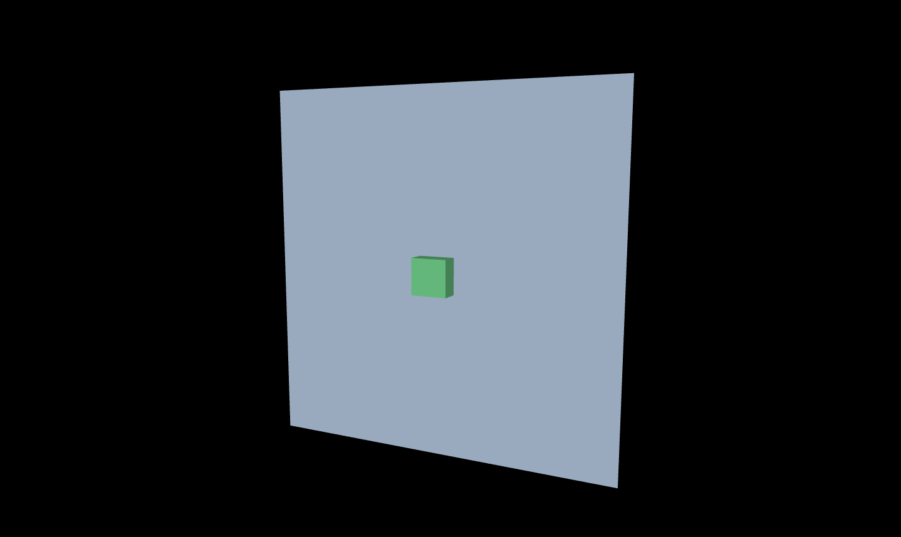

그럼 요래 노출.. 바닥이니까 아래로 가게 조정해준다.

```jsx
export default function example() {
  // Renderer, Scene, Camera, Light ..
  // ..
  connonWorld.gravity.set(0, -10, 0);

  // Mesh
  const floorMesh = new THREE.Mesh(
    new THREE.PlaneGeometry(10, 10),
    new THREE.MeshStandardMaterial({ color: "slategray" })
  );

  floorMesh.rotation.x = -Math.PI * 0.5; // 앞면이 위로 향하기 위해 음수 처리
  scene.add(floorMesh);

  const boxGeometry = new THREE.BoxGeometry(1, 1, 1);
  const boxMaterial = new THREE.MeshStandardMaterial({ color: "seagreen" });
  const boxMesh = new THREE.Mesh(boxGeometry, boxMaterial);

  boxMesh.position.y = 0.5; // boxMesh 위치를 0.5만큼 올려주면 모두 보임
  scene.add(boxMesh);

  // ..
}
```

위와 같이 floorMesh와 boxMesh 모두 값을 수정해주면 아래와 같이 노출됨

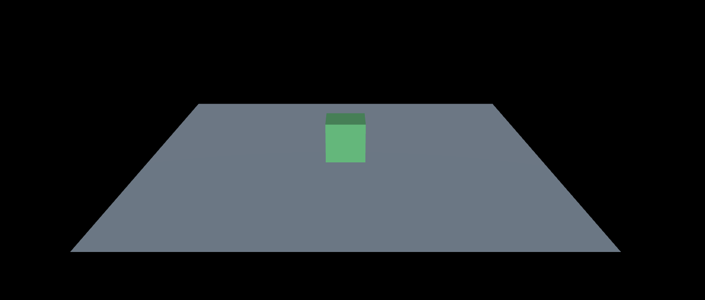

이제 cannon 바닥도 설정해줘야한다.

### 물리가 적용되는 객체 만들기

`connonWorld.gravity.set` 에 이어서 코드를 작성한다.

`src/ex01.js`

```jsx
export default function example() {
  // Renderer, Scene, Camera, Light ..

  const cannonWorld = new CANNON.World();
  cannonWorld.gravity.set(0, -10, 0);

  const floorShape = new CANNON.Plane(); // 바닥을 만들기 위한 모양
  const floorBody = new CANNON.Body({
    // 무게를 가지는 바닥 - 물리엔진이 적용된 실체(유리컴)
    mass: 0, // 무게 설정
    position: new CANNON.Vec3(0, 0, 0), // 바닥의 위치
    shape: floorShape // 바닥의 모양
  });
  floorBody.quaternion.setFromAxisAngle(new CANNON.Vec3(-1, 0, 0), Math.PI * 0.5); // 바닥의 회전(축의 방향(x축으로 설정), 각도(90도))
  cannonWorld.addBody(floorBody); // 바닥을 월드에 추가

  const boxShape = new CANNON.Box(new CANNON.Vec3(0.25, 2.5, 0.25)); // 박스의 모양
  const boxBody = new CANNON.Body({
    mass: 1,
    position: new CANNON.Vec3(0, 10, 0),
    shape: boxShape
  });
  cannonWorld.addBody(boxBody); // 박스를 월드에 추가

  // Mesh ..
}
```

아래 메쉬를 만들엇던 방법되로 물리엔진도 바닥과, 박스를 별도로 만들어야 함. floorShape, boxShape이라는 모양을 우선 만든 뒤 floorBody, boxBody에 연결해주고, 설정을 마친 설정들을 최종적으로 cannonWorld에 추가해주면 된다.

그런데 이대로는 전혀 변화가 없음. delta 함수에서 동작을 해줘야 함!

```jsx
export default function example() {
  // Renderer, Scene, Camera, Light, Cannon, Mesh ..

  // 그리기
  const clock = new THREE.Clock();

  function draw() {
    const delta = clock.getDelta();

    let cannonStepTime = 1 / 60;
    if (delta < 0.01) cannonStepTime = 1 / 120;

    cannonWorld.step(cannonStepTime, delta, 3); // 물리 엔진을 계산(시간, 델타, 반복 횟수)
    boxMesh.position.copy(boxBody.position); // 박스의 위치를 박스 메쉬에 적용
    boxMesh.quaternion.copy(boxBody.quaternion); // 박스의 회전을 박스 메쉬에 적용

    renderer.render(scene, camera);
    renderer.setAnimationLoop(draw);
  }
}
```

`cannonStepTime`의 경우 동작할 시간을 결정함 (시간, 델타, 반복 횟수) 보통 주사율이 60인 화면일 경우를 default value로 설정한 뒤, 120인 경우(고사양 해상도를 지원) 1/120으로 지원하도록 설정한다.

다음으로 해당 값을 `cannonWorld.step` 으로 연결 후 boxMesh에 boxBody를 position과 quaternion값에 연결해주면 y축이 10인 상태에서 발생한 추락을 처리하는 물리엔진을 확인할 수 있다.

(Mesh가 넘어지는 상황을 보고 싶어서 box를 긴 형태로 만들었음)

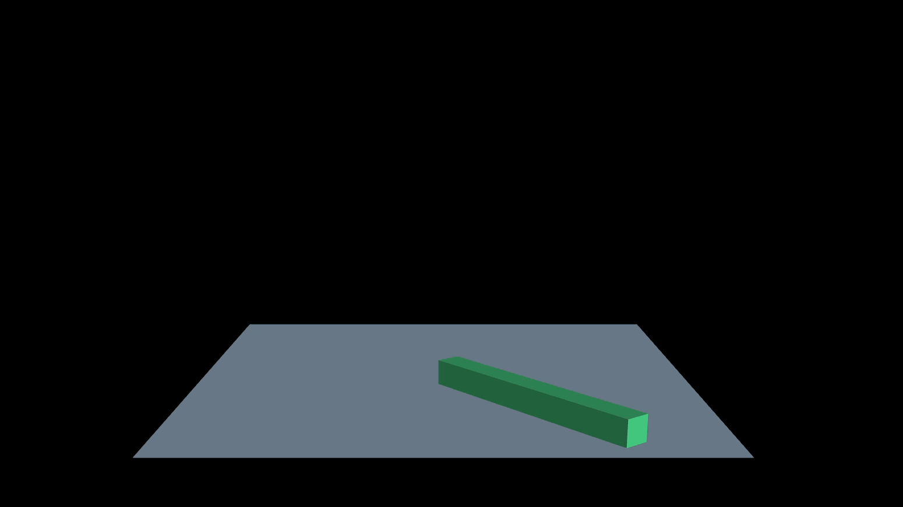

### 재질에 따른 마찰력과 반발력

cannon.js에서도 재질을 설정할 수 있다. 이를 Contact Material라고 함
재질은 왜 필요할까? 어떤 물체에 힘이 가해졌을 때 재질에 따라서 마찰력이나 반발력 등이 모두 다르기 때문임

더 리얼한 효과를 나타내기 위해서는 상세한 재질을 설정하는 것이 도움이 될 수 있음
이번에는 위의 박스 형태가 아닌 공을 통통 튀게 만들어보겠다.

`src/ex02.js`

```jsx
import * as THREE from "three";
import { OrbitControls } from "three/examples/jsm/controls/OrbitControls";
import * as CANNON from "cannon-es";

// ----- 주제: Contact Material

export default function example() {
  // Renderer, Scene, Camera, Light ..

  // Controls
  const controls = new OrbitControls(camera, renderer.domElement);

  // Cannon
  const cannonWorld = new CANNON.World();
  cannonWorld.gravity.set(0, -10, 0); // 중력 세팅

  const floorShape = new CANNON.Plane(); // 바닥용 모양
  const floorBody = new CANNON.Body({
    // 무게를 가지는 바닥 - 물리엔진이 적용된 실체
    mass: 0, // 무게 설정
    position: new CANNON.Vec3(0, 0, 0), // 바닥의 위치
    shape: floorShape // 바닥의 모양
  });
  floorBody.quaternion.setFromAxisAngle(new CANNON.Vec3(-1, 0, 0), Math.PI * 0.5); // 바닥의 회전
  cannonWorld.addBody(floorBody); // 바닥 월드 추가

  const sphereShape = new CANNON.Sphere(0.5); // 구의 반지름을 넣음
  const sphereBody = new CANNON.Body({
    mass: 1,
    position: new CANNON.Vec3(0, 10, 0),
    shape: sphereShape
  });
  cannonWorld.addBody(sphereBody); // 박스를 월드에 추가

  // Mesh
  const floorMesh = new THREE.Mesh(
    new THREE.PlaneGeometry(10, 10),
    new THREE.MeshStandardMaterial({ color: "slategray" })
  );
  floorMesh.rotation.x = -Math.PI * 0.5;
  scene.add(floorMesh);

  const sphereGeometry = new THREE.SphereGeometry(0.5); // 반지름 입력
  const sphereMaterial = new THREE.MeshStandardMaterial({ color: "seagreen" });
  const sphereMesh = new THREE.Mesh(sphereGeometry, sphereMaterial);
  sphereMesh.position.y = 0.5;
  scene.add(sphereMesh);

  // 그리기
  const clock = new THREE.Clock();
  function draw() {
    const delta = clock.getDelta();

    let cannonStepTime = 1 / 60;
    if (delta < 0.01) cannonStepTime = 1 / 120;

    cannonWorld.step(cannonStepTime, delta, 3); // 물리 엔진을 계산(시간, 델타, 반복 횟수)
    sphereMesh.position.copy(sphereBody.position); // 구의 위치를 구 메쉬에 적용
    sphereMesh.quaternion.copy(sphereBody.quaternion); // 구의 회전을 구 메쉬에 적용

    renderer.render(scene, camera);
    renderer.setAnimationLoop(draw);
  }

  //..
}
```

일단 기본적인 구 형태로 코드 작성..

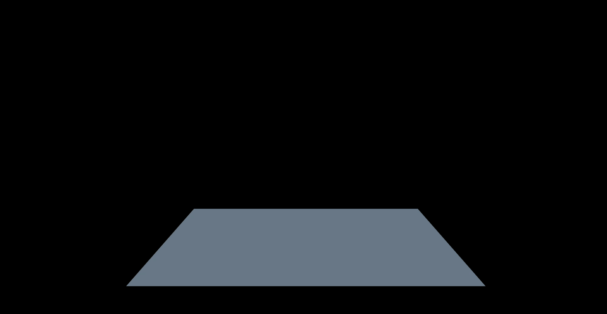

그런데 자세히 보니 구가 살짝 떠있는 느낌이다. 그림자가 없어서 그런 듯.. 그림자를 넣어준다.

```jsx
export default function example() {
  // Renderer ...
  renderer.shadowMap.enabled = true; // shadowMap 추가
  renderer.shadowMap.type = THREE.PCFSoftShadowMap; // shadowMap 추가

  // Light..
  const directionalLight = new THREE.DirectionalLight("white", 1);
  directionalLight.position.x = 1;
  directionalLight.position.z = 2;
  directionalLight.castShadow = true; // castShadow 추가
  scene.add(directionalLight);

  // Scene, Camera, Controls, Cannon, Mesh ..
  const floorMesh = new THREE.Mesh(
    new THREE.PlaneGeometry(10, 10),
    new THREE.MeshStandardMaterial({ color: "slategray" })
  );
  floorMesh.rotation.x = -Math.PI * 0.5;
  floorMesh.receiveShadow = true; // receiveShadow 추가
  scene.add(floorMesh);

  const sphereGeometry = new THREE.SphereGeometry(0.5);
  const sphereMaterial = new THREE.MeshStandardMaterial({ color: "seagreen" });
  const sphereMesh = new THREE.Mesh(sphereGeometry, sphereMaterial);
  sphereMesh.position.y = 0.5;
  sphereMesh.castShadow = true; //caseShadow 추가
  scene.add(sphereMesh);

  //..
}
```

위와 같이 renderer, directionalLight, floorMesh, sphereMesh 등에 그림자 속성을 추가함


그림자가 짜잔 만들어졌다. 자세히 보면 떨어질 때 충격에 의해 살짝 튀기는데.. 이제 이걸 앞서 얘기한 contactMaterial을 사용해서 변경해본다.

```jsx
export default function example() {
  // Renderer, Light, Scene, Camera, Controls,

  // Cannon
  const cannonWorld = new CANNON.World();
  cannonWorld.gravity.set(0, -10, 0);

  // Contact Material
  const defaultMaterial = new CANNON.Material("default");
  const rubberMaterial = new CANNON.Material("rubber");
  const ironMaterial = new CANNON.Material("iron");
  const defaultContactMaterial = new CANNON.ContactMaterial(defaultMaterial, defaultMaterial, {
    friction: 0.5, // 마찰력,
    restitution: 0.5 // 반발력
  }); // 부딪힐 재질을 두 개 넣음 + 상세 설정 추가
  cannonWorld.defaultContactMaterial = defaultContactMaterial; // 재질 설정 적용

  // floorShape, floorBody ..
  // ..
}
```

위와 같이 재질을 설정해서 넣는다. `CANNON.ContactMaterial`에는 각각 부딪힐 재질을 2개 설정하고, 이에 대한 상세 옵션을 세 번째 전달인자에 설정하면 됨


이건 재질에 따라 액션이 다 달라진다. 만약 바닥은 defaultMaterial, 공은 고무공(rubberMatrial)이라면?

```jsx
export default function example() {
  // ..
  cannonWorld.defaultContactMaterial = defaultContactMaterial;

  // 추가
  const rubberDefaultContactMaterial = new CANNON.ContactMaterial(
    rubberMaterial, // 튀기는 공은 rubberMaterial
    defaultMaterial, // 바닥은 defaultMaterial
    {
      friction: 0.5,
      restitution: 0.7
    }
  );
  cannonWorld.addContactMaterial(rubberDefaultContactMaterial); // rubber 재질 추가

  const floorShape = new CANNON.Plane();
  const floorBody = new CANNON.Body({
    mass: 0,
    position: new CANNON.Vec3(0, 0, 0),
    shape: floorShape,
    material: defaultMaterial // 바닥 재질 설정
  });
  floorBody.quaternion.setFromAxisAngle(new CANNON.Vec3(-1, 0, 0), Math.PI * 0.5); // 바닥의 회전(축의 방향(x축으로 설정), 각도(90도))
  cannonWorld.addBody(floorBody);

  const sphereShape = new CANNON.Sphere(0.5);
  const sphereBody = new CANNON.Body({
    mass: 1,
    position: new CANNON.Vec3(0, 10, 0),
    shape: sphereShape,
    material: rubberMaterial // 공 재질 설정
  });
  cannonWorld.addBody(sphereBody);

  // ..
}
```

위와 같이 `rubberDefaultContactMaterial`이라는 ContactMaterial 생성 후 이를 addContactMaterial에 추가, floorBody, sphereBody에 material로 각 재질 반영해주면 진짜 고무공이 튀는 효과를 주게된다.

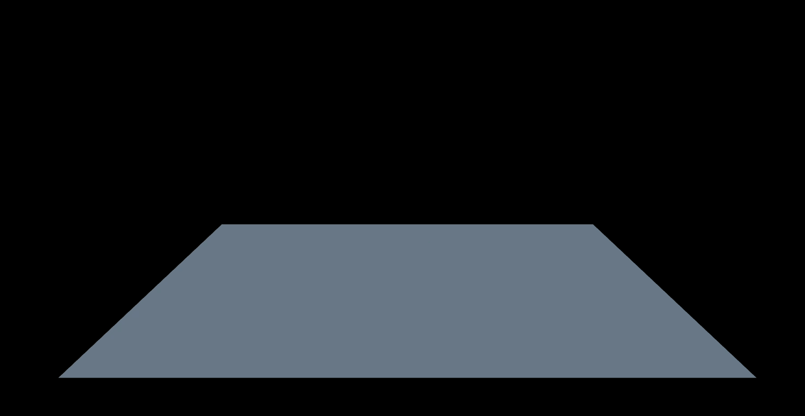

위와 같은 방식으로 ironMaterial을 설정하면 철 재질의 사물이 default floor에 부딪히는 효과를 줄 수 있게됨
필요에 따라 적절한 material을 설정하여 사용하도록 하자!

### 힘(Force)

힘은 물체의 위치에 영향을 주는 외부적 힘을 의미한다. 우선 기존 코드를 좀 다듬는다.
기존 테스트하던 rubberMaterial, ironMaterial 삭제 후 defaultMaterial 로 적용

이제 아무데나 클릭을 하면 바람이 불도록 해본다.

`src/ex03.js`

```jsx
export default function example() {
  // ..

  // Contact Material
  const defaultMaterial = new CANNON.Material("default");
  const defaultContactMaterial = new CANNON.ContactMaterial(defaultMaterial, defaultMaterial, {
    friction: 0.5, // 마찰력,
    restitution: 0.3 // 반발력
  }); // 부딪힐 재질을 두 개 넣음 + 상세 설정 추가
  cannonWorld.defaultContactMaterial = defaultContactMaterial;

  // ..

  // 이벤트
  window.addEventListener("click", () => {
    sphereBody.applyForce(new CANNON.Vec3(-100, 0, 0), sphereBody.position);
  });
}
```

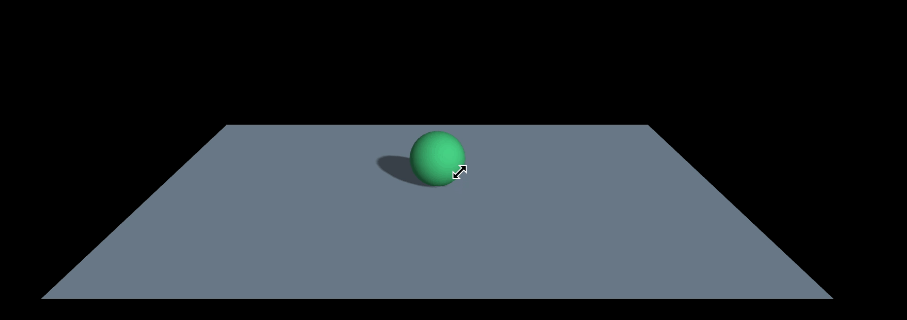

원을 클릭하면 힘의 방향 왼쪽으로 흘러가버림! 근데 끝도 없이 흘러가버린다.
여기에 laycaster 에서 배웠던 드래그 시 이벤트가 발생하던 현상을 여기서도 동일하게 제거해본다.

```jsx
// ..
import { PreventDragClick } from "./PreventDragClick";

export default function example() {
  // ..

  // 이벤트
  window.addEventListener("click", () => {
    if (preventDragClick.mouseMoved) return;
    sphereBody.applyForce(new CANNON.Vec3(-100, 0, 0), sphereBody.position);
  });

  const preventDragClick = new PreventDragClick(canvas);
}
```

위와 같이 해주면 드래그 시 이벤트 발생 노

또, 여러번 클릭 시 speed에 가속도가 붙는데, 이도 수정해준다.

```jsx
export default function example() {
  // ..

  // 이벤트
  window.addEventListener("click", () => {
    if (preventDragClick.mouseMoved) return;

    // Speed 초기화
    sphereBody.velocity.x = 0;
    sphereBody.velocity.y = 0;
    sphereBody.velocity.z = 0;
    sphereBody.angularVelocity.x = 0;
    sphereBody.angularVelocity.y = 0;
    sphereBody.angularVelocity.z = 0;

    sphereBody.applyForce(new CANNON.Vec3(-100, 0, 0), sphereBody.position);
  });

  const preventDragClick = new PreventDragClick(canvas);
}
```

다음으로는 멈추게는 어떻게하면 될까? draw 함수에서 위 velocity를 점차 0으로 변경시켜 주면됨

```jsx
export default function example() {
  // ..

  function draw() {
    // ..

    // 속도 감소
    sphereBody.velocity.x *= 0.98;
    sphereBody.velocity.y *= 0.98;
    sphereBody.velocity.z *= 0.98;
    sphereBody.angularVelocity.x *= 0.98;
    sphereBody.angularVelocity.y *= 0.98;
    sphereBody.angularVelocity.z *= 0.98;

    renderer.render(scene, camera);
    renderer.setAnimationLoop(draw);
  }

  draw();

  // ..
}
```

0.98 곱해준다면 점차 값은 0에 수렴할 것이므로 자연스러운 정지가 완성됨

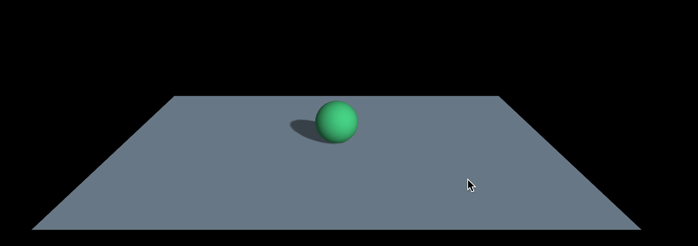

이런 이벤트는 바람이 분다거나 와력에 의한 부드러운 움직임을 표현할 때 많이 사용함!

### 랜덤 위치에 공 생성하기

뷰를 이루는 구성과 효과가 많아지면서 그만큼 부하가 늘어난다. 그래서 가능하다면 성능을 좋게 만들 수 있는 방법들을 적용하면서 작업하는게 좋다. 예시를 위해 클릭 할 때마다 공이 생기는 ui를 구현해본다.

기존의 sphereMesh 구현 코드와 그와 관련된 draw 함수 내 코드 그리고 클릭 시 이벤트 코드를 모두 삭제해준다. 또한, 구를 생성하는 로직은 별도의 클래스 문법으로 작성한 뒤 import 하는 방식을 사용한다.

`src/ex04.js`

```jsx
// ..
import { MySphere } from "./MySphere";

// ----- 주제: Performance(성능 좋게 하기)

export default function example() {
  // Renderer, Scene, Camera, Light, Controls ..
  const cannonWorld = new CANNON.World();
  cannonWorld.gravity.set(0, -10, 0);

  // Contact Material
  // CANNON defaultMaterial, floorShape, sphereShape...

  // Mesh
  // floorMesh, sphereGeometry, sphereMaterial, sphereMesh...

  // 그리기
  const clock = new THREE.Clock();

  function draw() {
    const delta = clock.getDelta();

    let cannonStepTime = 1 / 60;
    if (delta < 0.01) cannonStepTime = 1 / 120;
    cannonWorld.step(cannonStepTime, delta, 3);

    renderer.render(scene, camera);
    renderer.setAnimationLoop(draw);
  }

  window.addEventListener("click", () => {
    // 여기서부터 시작..
    new MySphere({
      scene,
      geometry: sphereGeometry,
      material: sphereMaterial,
      x: (Math.random() - 0.5) * 2,
      y: Math.random() * 5 + 2,
      z: (Math.random() - 0.5) * 2,
      scale: Math.random() + 0.2
    });
  });

  // ..
}
```

기본 포맷은 위와 같고, click 이벤트부터 MySphere 클래스의 인스턴스가 생성되도록 작업을 시작해주자

`src/MySphere.js`

```jsx
import { Mesh } from "three";

export class MySphere {
  constructor(info) {
    this.scene = info.scene;
    this.geometry = info.geometry;
    this.material = info.material;
    this.x = info.x;
    this.y = info.y;
    this.z = info.z;
    this.scale = info.scale;

    this.mesh = new Mesh(this.geometry, this.material);
    this.mesh.scale.set(this.scale, this.scale, this.scale);
    this.mesh.castShadow = true;
    // position 설정은 cannon body에서 설정하면 mesh가 따라가므로 무의미함
    // 그러나 클릭 시 mesh가 제대로 생성되는지 확인을 위해 일단 넣음
    this.mesh.position.set(this.x, this.y, this.z);
    this.scene.add(this.mesh);
  }
}
```

위와 같이 코드를 작성하면, 아래처럼 원하는대로 구가 클릭했을 때마다 하나씩 생성된다.

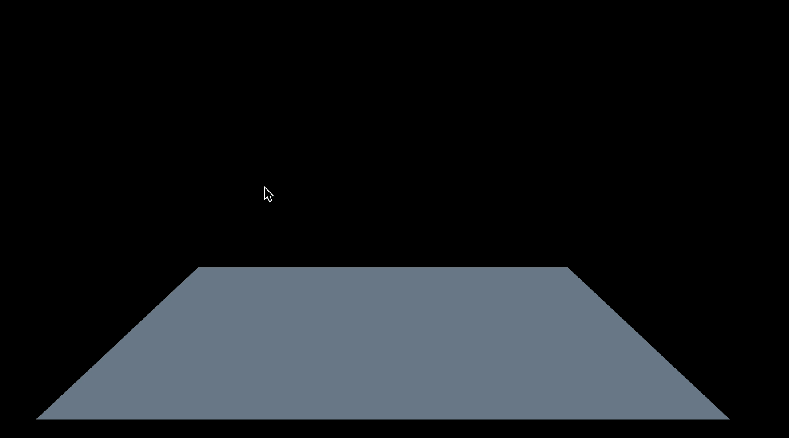

이제 여기에 cannon.body를 적용해보자

`src/MySphere.js`

```jsx
export class MySphere {
  constructor(info) {
    // ..

    this.setCannonBody();
  }

  setCannonBody() {} // setCannonBody 메서드 추가
}
```

위와 같이 MyShpere에 setCannonBody라는 이벤트를 추가 후 생성자 시 동작하도록 코드를 작성해줄 것임. 먼저 cannon body를 추가하기 위해서는 cannonWorld도 필요하므로 해당 데이터도 인스턴스 생성 시 가져올 수 있도록 추가해준다.

```jsx
export default function example() {
  // ...
  window.addEventListener("click", () => {
    new MySphere({
      scene,
      cannonWorld, // cannonWorld argument 추가
      geometry: sphereGeometry,
      material: sphereMaterial,
      x: (Math.random() - 0.5) * 2,
      y: Math.random() * 5 + 2,
      z: (Math.random() - 0.5) * 2,
      scale: Math.random() + 0.2
    });
  });
}
```

이어서 contructor 생성 시 info.cannonWorld를 반영한 뒤 setCannonBody를 구현해본다.

```jsx
// ..
import { Body, Sphere, Vec3 } from "cannon-es";

export class MySphere {
  constructor(info) {
    // ..
    this.cannonWorld = info.cannonWorld;

    this.setCannonBody();
  }

  setCannonBody() {
    // Sphere의 크기가 모두 다른 상태 > 각 반지름을 구해야 함(기본 0.5 * 각 scale)
    const shape = new Sphere(0.5 * this.scale);
    this.cannonBody = new Body({
      mass: 1,
      position: new Vec3(this.x, this.y, this.z),
      shape
    });

    this.cannonWorld.addBody(this.cannonBody);
  }
}
```

위와 같이 하면 cannonBody 적용 완료. 하지만 클릭해도 공은 떨어지지 않는다.
아직 cannon이랑 mesh가 연결되지 않았기 때문. 그런데 이 동작은 draw 함수에서 구현해야 하므로, 인스턴스를 배열로 담아 관리할 필요가 있다.

```jsx
export default function example() {
  // ...

  const spheres = []; // sphere 인스턴스를 담을 배열 정의

  // 그리기
  const clock = new THREE.Clock();

  function draw() {
    const delta = clock.getDelta();

    let cannonStepTime = 1 / 60;
    if (delta < 0.01) cannonStepTime = 1 / 120;

    cannonWorld.step(cannonStepTime, delta, 3);

    // spheres를 배열마다 돌면서 cannonBody와 mesh를 연결해준다.
    spheres.forEach((item) => {
      item.mesh.position.copy(item.cannonBody.position);
      item.mesh.quaternion.copy(item.cannonBody.quaternion);
    });

    renderer.render(scene, camera);
    renderer.setAnimationLoop(draw);
  }

  window.addEventListener("click", () => {
    // shperes에 인스턴스 추가
    spheres.push(
      new MySphere({
        scene,
        cannonWorld,
        geometry: sphereGeometry,
        material: sphereMaterial,
        x: (Math.random() - 0.5) * 2,
        y: Math.random() * 5 + 2,
        z: (Math.random() - 0.5) * 2,
        scale: Math.random() + 0.2
      })
    );
  });
}
```

위와 같이 추가해주면 원하는 구의 애니메이션까지 구현이 가능해진다.

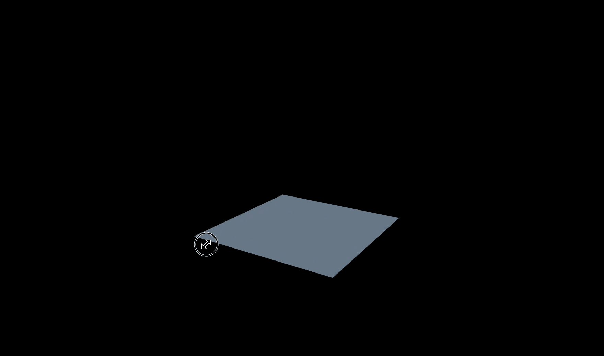

원래 목적인 성능 개선을 위한 사전 조건이 만들어졌다. 성능 관리 설정.. 해보자

### 성능 관리 설정

이제 성능을 어떻게 좋게 만들어줄 수 있는지 확인해본다. 크게 2가지를 확인해볼 것임

`src/ex04.js`

```jsx
import { MySphere } from "./MySphere";

// ----- 주제: Performance(성능 좋게 하기)

export default function example() {
  // Renderer, Scene, Camera, Light, Controls ..
  const cannonWorld = new CANNON.World();
  cannonWorld.gravity.set(0, -10, 0);

  // 성능을 위한 세팅
  cannonWorld.allowSleep = true; // 물리엔진이 휴면 상태로 들어갈 수 있도록 허용
  cannonWorld.broadphase = new CANNON.SAPBroadphase(cannonWorld); // 물리엔진의 충돌을 계산하는 방법을 SAP로 설정
  // SAPBroadphase: 물리엔진이 충돌을 계산하는 방법 중 가장 효율적
  // NativeBroadphase: 기본값
  // GridBroadphase: 구역을 나누어 테스트, 물리엔진이 충돌을 계산하는 방법 중 가장 정확함

  // ..
}
```

먼저 allowSleep은 물리엔진이 움짐임을 마쳤을 때 테스트를 하지않고, 휴면 상태로 들어가는 설정이다. 위 설정을 추가하지 않으면 테스트가 의미없는 아이들도 계속 테스트를 하고 있음.. 성능에 도움이 된다. 하지만 단점은 게임은 멈춰있을 때에도 계속 돌아가야하므로 필요한 경우에만 적용해야 한다.

broadphase 설정은 연산과정에 대한 설정인데 SAPBroadphase의 경우 퀄리티를 저하시키지 않으면서 효율적으로 연산을 하는 설정으로 주로 사용함. 기본값은 NativeBroadphase이고, GridBroadphase라는 설정도 있음.

### 충돌 사운드 넣기

물리엔진마다 충돌 시 사운드를 넣어보자. 이벤트는 cannonBody에 해줘야 함
즉 MySphere 인스턴스에 충돌 이벤트를 바인딩해주면 됨

우선 사용할 mp3 파일을 webpack.config에 추가해주자

`webpack.config.js`

```jsx
//..

module.exports = {
  // ..
  plugins: [
    // ..
    new CopyWebpackPlugin({
      patterns: [
        { from: "./src/main.css", to: "./main.css" },
        { from: "./src/sounds", to: "./sounds" } // add
      ]
    })
  ]
};
```

이후 나머지 mp3 파일을 이벤트로 아래와 같이 바인딩 해줌

`src/ex05.js`

```jsx
import { MySphere } from "./MySphere";

// ----- 주제: 충돌 이벤트, 사운드 넣기

export default function example() {
  // Renderer, Scene, Camera, Light, Controls ..

  const sound = new Audio("/sounds/boing.mp3");

  function collide(e) {
    console.log(e); // {type: 'collide', body: Body, contact: ContactEquation, target: Body}
    sound.currentTime = 0; //
    sound.play(); // 소리가 난다.
  }

  // 이벤트
  window.addEventListener("click", () => {
    const mySphere = new MySphere({
      scene,
      cannonWorld,
      geometry: sphereGeometry,
      material: sphereMaterial,
      x: (Math.random() - 0.5) * 2,
      y: Math.random() * 5 + 2,
      z: (Math.random() - 0.5) * 2,
      scale: Math.random() + 0.2
    });

    spheres.push(mySphere);
    mySphere.cannonBody.addEventListener("collide", collide); // 충돌 이벤트 coolide로 정의
  });
}
```

위와 같이 기존 인스턴스 생성을 `mySphere`라는 변수에 담아서, 해당 cannonBody에 collide로 이벤트 리스너를 추가해준다. 위 collide 함수 내 `sound.currentTime = 0;`은 충돌 시 연속적인 사운드 재생을 위해서 추가했다. (만약 위 속성이 없음 떨어질 때마다 맞춰서 사운드가 실행되지 않고 연속적으로 재생되기만 함.. 뾰뵤롤로뿅이 아님)

그런데 위와 같은 설정으로 인해 조금만 충돌이 되도 소리가 나는 것이 거슬린다.
아주 약하게 미세한 충돌일 때에는 사운드가 나지 않도록 하면 좋겠다.
(충돌 속도가 임의의값 이상일 경우에만 재생)

```jsx
export default function example() {
  // Renderer, Scene, Camera, Light, Controls ..

  const sound = new Audio("/sounds/boing.mp3");

  function collide(e) {
    // 충돌한 물체의 속도
    const velocity = e.contact.getImpactVelocityAlongNormal();
    if (velocity > 3) {
      sound.currentTime = 0;
      sound.play(); //
    }
  }

  // events...
}
```

충돌한 물체의 속도를 `e.contact.getImpactVelocityAlongNormal();`로 구해올 수 있으므로 해당 값이 3이상일 때만 소리가 재생되도록 하면 자연스러운 소리 재생 구현 완료 !

### 오브젝트 제거하기

이번에는 생성된 메쉬들을 화면에서 지우는걸 만들어본다. 특정 버튼을 누르면 메쉬들이 지워지도록 만들어본다. canvas html을 추가하지 않고, 코드로 버튼을 주입해서 구현함

`src/ex06.js`

```jsx
// ----- 주제: 오브젝트 제거하기

export default function example() {
  // Renderer, Scene, Camera, Light, Controls ..
  // draws..

  // 삭제하기
  const btn = document.createElement("button");
  btn.style.cssText = "position: absolute; left: 20px; top: 20px; fontsize: 20px";
  btn.innerHTML = "삭제";
  document.body.append(btn);

  btn.addEventListener("click", () => {
    spheres.forEach((item) => {
      item.cannonBody.removeEventListener("collide", collide); // 충돌 사운드 이벤트 제거
      cannonWorld.removeBody(item.cannonBody); // cannonBody remove
      scene.remove(item.mesh); // mesh remove
    });
  });
}
```

위와 같이 삭제버튼을 직접 html에 주입 후 해당 버튼을 클릭 시 spheres 배열을 순회하면서 해당 mesh와 cannnonBody, collide 이벤트를 모두 제거해주었다. 이렇게 해야 모든 리소스 자원을 회수할 수 있음. 꼼꼼하게 다 지워주는게 좋당

### 도미노 만들기 - glb 배치

이번에는 도미노를 만들어본다. 기존에 만들었던 btn, sphere, click 시 충돌 이벤트에 대한 코드는 모두 삭제함

블렌더에서 만든 도미노 파일을 불러와서 20개를 세워보도록 한다.
파일 호출을 하기 위해 우선 webpack 설정에 models 폴더를 추가해줌

`webpack.config.js`

```jsx
//..

module.exports = {
  // ..
  plugins: [
    // ..
    new CopyWebpackPlugin({
      patterns: [
        { from: "./src/main.css", to: "./main.css" },
        { from: "./src/sounds", to: "./sounds" },
        { from: "./src/models", to: "./models" }
      ]
    })
  ]
};
```

이후 실제 작업 파일에서 아래와 같이 gltfLoader를 Domino 객체에 상속해준 뒤 20개의 도미노를 일렬로 세워본다.

`src/ex07.js`

```jsx
// ..
import { GLTFLoader } from "three/examples/jsm/loaders/GLTFLoader";
import { Domino } from "./Domino";

// ----- 주제: 도미노

export default function example() {
  // Renderer, Scene, Camera, Light, Controls ..

  // Loader
  const gltfLoader = new GLTFLoader();

  // Cannon, Mesh ...

  // 도미노 생성
  const dominoes = [];
  let domino;
  for (let i = -3; i < 17; i++) {
    domino = new Domino({
      scene,
      cannonWorld,
      gltfLoader,
      z: -i * 0.8
    });
    dominoes.push(domino);
  }

  //
}
```

위 Domino 클래스 객체는 아래와 같다.

`src/Domino.js`

```jsx
import { Mesh, BoxGeometry, MeshBasicMaterial } from "three";
import { Body, Vec3, Box } from "cannon-es";

export class Domino {
  constructor(info) {
    this.scene = info.scene;
    this.cannonWorld = info.cannonWorld;

    this.width = info.width || 0.6;
    this.height = info.height || 1;
    this.depth = info.depth || 0.2;

    this.x = info.x || 0;
    this.y = info.y || 0.5; // y가 0이면 절반이 파뭍혀버림
    this.z = info.z || 0;

    this.rotationY = info.rotationY || 0;

    info.gltfLoader.load("/models/domino.glb", (glb) => {
      this.modelMesh = glb.scene.children[0];
      this.modelMesh.castShadow = true;
      this.modelMesh.position.set(this.x, this.y, this.z);
      this.scene.add(this.modelMesh);
    });
  }
}
```

위와 같이 contructor에서 gltfLoader를 통해 메쉬를 생성하여, scene.add 해주면 정상 노출됨

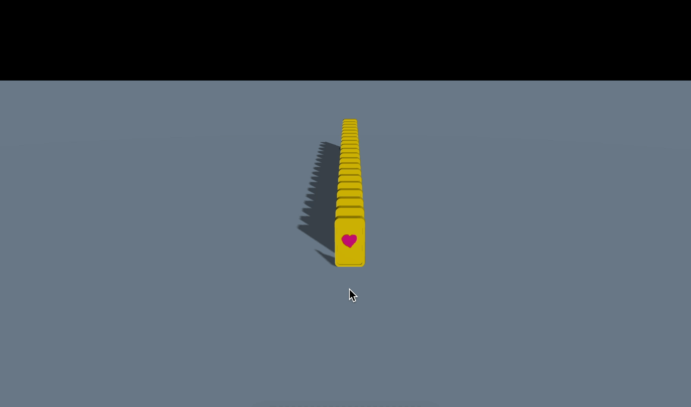

### 도미노 만들기 - 물리엔진 적용

이제 도노에 물리엔진을 적용해본다. cannon.js를 적용하는 것임

`src/Domino.js`

```jsx
import { Mesh, BoxGeometry, MeshBasicMaterial } from "three";
import { Body, Vec3, Box } from "cannon-es";

export class Domino {
  constructor(info) {
    //..

      this.setCannonBody();
    });
  }
	// 물리엔진 적용 setCannonBody 메서드 구현
  setCannonBody() {
    const shape = new Box(new Vec3(this.width / 2, this.height / 2, this.depth / 2));
    this.cannonBody = new Body({
      mass: 1,
      position: new Vec3(this.x, this.y, this.z),
      shape
    });
    this.cannonBody.quaternion.setFromAxisAngle(new Vec3(0, 1, 0), this.rotationY); // (축, 각도)
    this.cannonWorld.addBody(this.cannonBody);
  }
}
```

실제 물리엔진을 mesh에 연결하는 것은 draw 함수에서 한다.

`src/ex07.js`

```jsx
export default function example() {
  // Renderer, Scene, Camera, Light, Controls, Cannon, Mesh ...

  // 도미노 생성
  const dominoes = [];
  let domino;
  for (let i = -3; i < 17; i++) {
    domino = new Domino({
      scene,
      cannonWorld,
      gltfLoader,
      z: -i * 0.8
    });
    dominoes.push(domino);
  }

  // 그리기
  const clock = new THREE.Clock();

  function draw() {
    const delta = clock.getDelta();

    let cannonStepTime = 1 / 60;
    if (delta < 0.01) cannonStepTime = 1 / 120;
    cannonWorld.step(cannonStepTime, delta, 3);

    // 물리엔진을 mesh와 연결
    dominoes.forEach((domino) => {
      if (domino.cannonBody) {
        domino.modelMesh.position.copy(domino.cannonBody.position);
        domino.modelMesh.quaternion.copy(domino.cannonBody.quaternion);
      }
    });

    // ..
  }

  //
}
```

위와 같이 하면 아까와 같은 도미노 배열을 UI로 확인할 수 있는데, 실제 제대로 적용이 잘되었는지 확인해보기 위해 Domino의 객체 생성정보에 y값을 높게해서 덜어지는 효과를 내보기로 한다.

```jsx
export default function example() {
  // Renderer, Scene, Camera, Light, Controls, Cannon, Mesh ...

  const dominoes = [];
  let domino;
  for (let i = -3; i < 17; i++) {
    domino = new Domino({
      scene,
      cannonWorld,
      gltfLoader,
      y: 2, // test용 데이터 추가
      z: -i * 0.8
    });
    dominoes.push(domino);
  }

  // ..
}
```

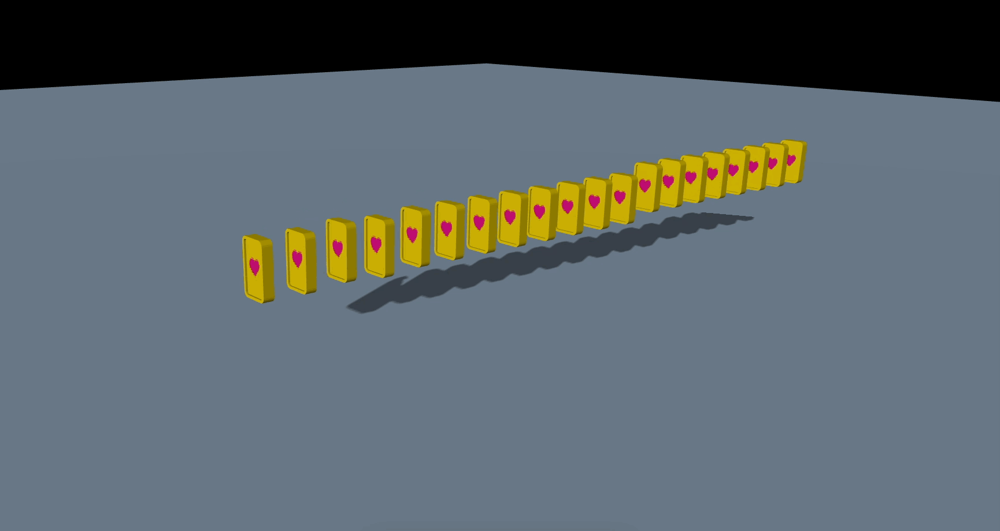

물리엔진 적용 완료
