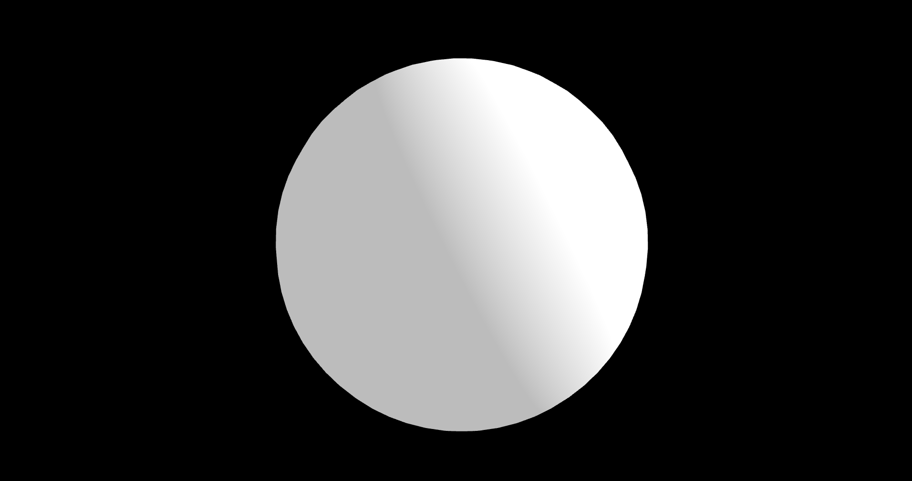
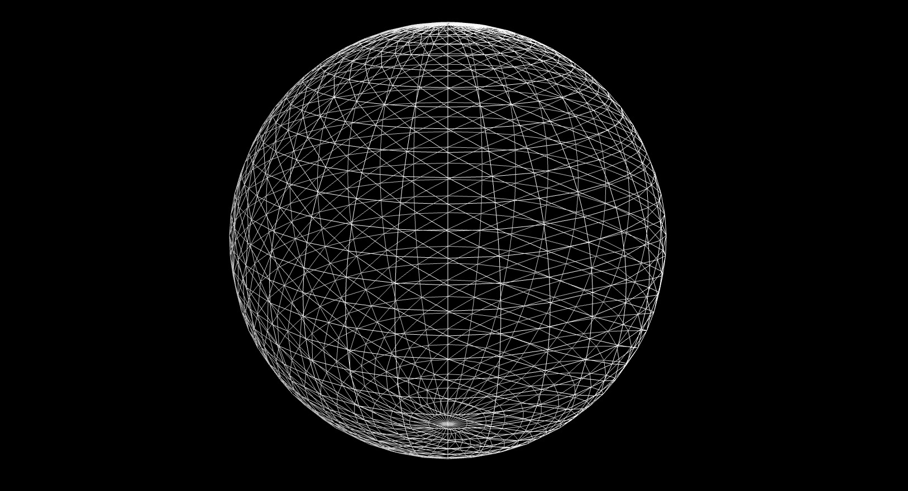
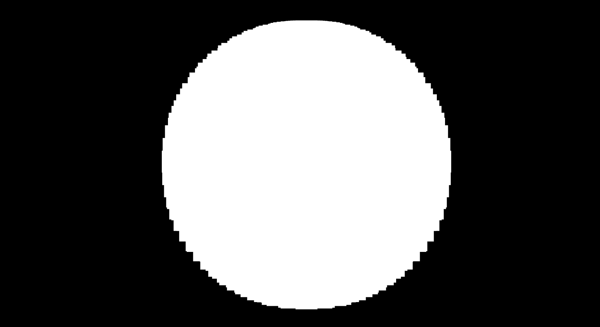
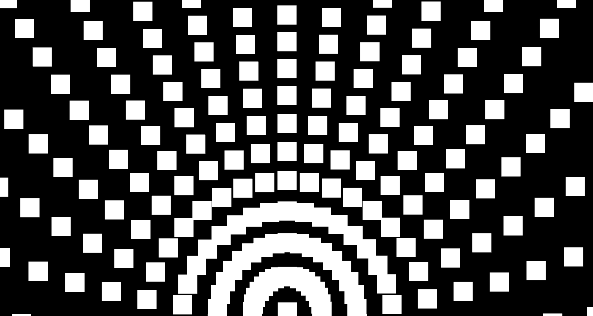
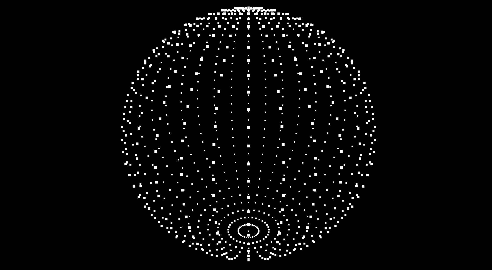
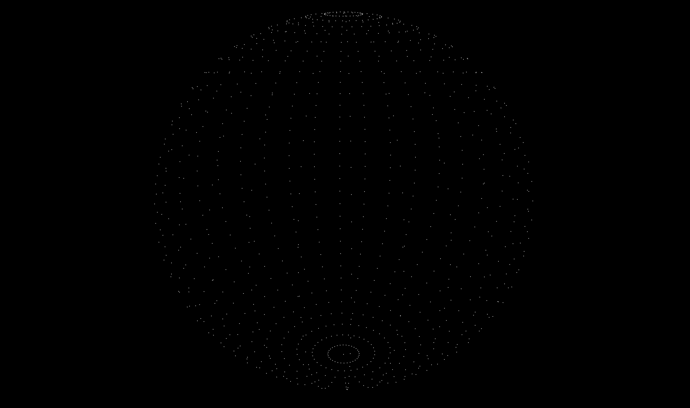
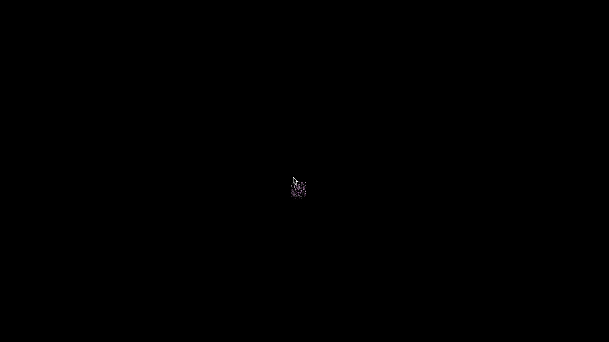
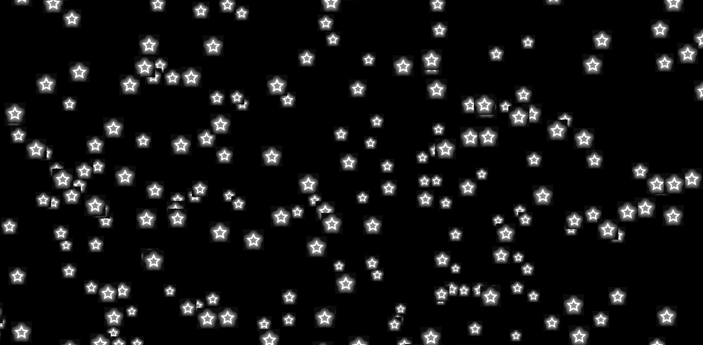
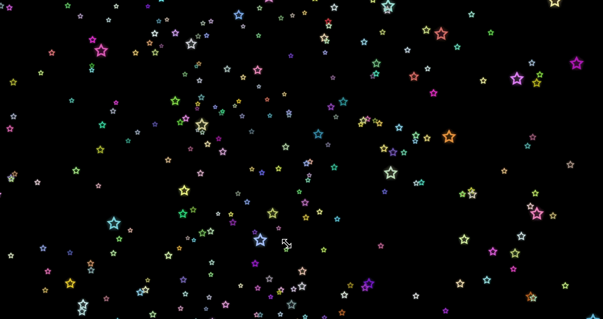

## Particle

이번 섹션에서는 Particle에 대해 배워본다. three.js로 Particle(작은 입자)들을 랜덤하게 뿌리거나, 흩어지게 하고, 입자 대신 이미지를 사용해보는 등의 작업을 해봄. 일반 Mesh랑 다르게 Particle 사용하면 특별한 효과를 낼 수 있음

### Basic Geometry Particle



먼저 위와 같은 구가 있다고 하자. 이 Mesh에 wireframe이 보이도록 살짝 수정해주면 아래와 같음

```jsx
const geometry = new THREE.SphereGeometry(1, 32, 32);
const material = new THREE.MeshStandardMaterial({ wireframe: true });
const mesh = new THREE.Mesh(geometry, material);
scene.add(mesh);
```



기본 Geometry에서 Particle을 사용한다는 것은 각 정점(vertex)들의 Particle을 하나로 묶는 것을 의미한다.

`src/ex01.js`

```jsx
import * as THREE from "three";
import { OrbitControls } from "three/examples/jsm/controls/OrbitControls";

// ----- 주제: 기본 Geometry 파티클

export default function example() {
  // Renderer, Scene, Camera, Light, Controls ..

  // Mesh
  const geometry = new THREE.SphereGeometry(1, 32, 32);
  const material = new THREE.PointsMaterial();
  const points = new THREE.Points(geometry, material); // mesh 대신 points 사용
  scene.add(points);

  // ..
}
```

위와 같이 기존의 material을 `PointsMaterial`로 수정 후 Mesh가 아닌 Points라는 걸로 scene.add 시켜줌
그러면 아래와 같이 노출된다.



자글자글한 픽셀 뭉치 구와 같은데 OrbitControls가 적용되어있으므로 이를 확대시켜보면 아래와 같다.



각 점들이 살아있다. 우선 각 Particle 사이즈가 너무 크므로 좀 줄여준다.

```jsx
export default function example() {
  // Mesh
  const geometry = new THREE.SphereGeometry(1, 32, 32);
  const material = new THREE.PointsMaterial({
    size: 0.02 // size 설정
  });
  const points = new THREE.Points(geometry, material);
  scene.add(points);

  // ..
}
```

그러면 좀 더 가시적인 Particle UI 확인 가능



원근에 따라 Particle의 사이즈가 다르게 보이는데 이를 하나의 사이즈로 고정할 수도 있음

```jsx
export default function example() {
  // Mesh
  const geometry = new THREE.SphereGeometry(1, 32, 32);
  const material = new THREE.PointsMaterial({
    size: 1,
    sizeAttenuation: false // 설정 추가
  });

  // 혹은 아래와 같이 설정해줄 수도 있음
  // material.size = 0.02;
  // material.sizeAttenuation = false;

  const points = new THREE.Points(geometry, material);
  scene.add(points);

  // ..
}
```

그러면 아래와 같은 구가 만들어진다.



특이하다. 이러한 Particle rlsmddmf 활용해서 재미있는 형태의 UI를 구현할 수 있음

### random Particle

이번에는 랜덤한 위치에 Particle을 흩뿌려보자.
아까는 정해진 형태의 Particle을 보여주기 위해 기본 제공되는 `SphereGeometry`를 이용했다.

이번에는 Geometry가 필요하지만, 형태가 정해져있지 않으므로 `BufferGeometry`를 사용한다.
BufferGeometry는 기본으로 가진 형태가 없이 우선 geometry를 만든 뒤 vertex를 직접 세팅 할 경우 사용하는 메서드이다.

`src/ex02.js`

```jsx
import * as THREE from "three";
import { OrbitControls } from "three/examples/jsm/controls/OrbitControls";

// ----- 주제: 랜덤 파티클

export default function example() {
  // Renderer, Scene, Camera, Light, Controls ..

  // Mesh(Geometry + Material)
  const geometry = new THREE.BufferGeometry();
  const count = 1000;

  // BufferGeometry에 노출할 포인트들의 위치 설정
  // Float32Array position 배열은 x, y, z를 가지므로 3개씩 1000개 생성
  const positions = new Float32Array(count * 3);
  for (let i = 0; i < positions.length; i++) {
    positions[i] = (Math.random() - 0.5) * 10; // -5 ~ 5 사이의 랜덤
  }

  // BufferAttribute에 positions 배열을 넣어줌(3은 x, y, z를 의미)
  geometry.setAttribute("position", new THREE.BufferAttribute(positions, 3));

  const material = new THREE.PointsMaterial({ size: 0.03, color: "plum" });
  const particles = new THREE.Points(geometry, material);
  scene.add(particles);

  const points = new THREE.Points(geometry, material); // mesh 대신 points 사용
  scene.add(points);

  // ..
}
```

위와 같이 BufferGeometry를 사용해서 랜덤 파티클을 구현할 수 있다.



1000개의 점을 -5 ~ 5 사이의 값을 가지도록 랜덤하게 설정하여 PointsMaterial과 함께 조합함
위 코드를 통해 우주 속의 별을 표현해볼 수 있다.

### Particle Image

이번에는 Particle에 이미지를 사용해보자. 우선 이미지를 로드해야 한다.
그러려면 webpack 설정부터 바꿔야지

`webpack.config.js`

```jsx
module.exports = {
  mode: webpackMode,
  // ..
  plugins: [
    // ..
    new CopyWebpackPlugin({
      patterns: [
        { from: "./src/main.css", to: "./main.css" },
        { from: "./src/images", to: "./images" } // 추가
      ]
    })
  ]
};
```

`src/ex03.js`

```jsx
import * as THREE from "three";
import { OrbitControls } from "three/examples/jsm/controls/OrbitControls";

// ----- 주제: 파티클 이미지

export default function example() {
  // Renderer, Scene, Camera, Light, Controls ..

  // Particle
  const geometry = new THREE.BufferGeometry();
  const count = 1000;

  const positions = new Float32Array(count * 3);
  for (let i = 0; i < positions.length; i++) {
    positions[i] = (Math.random() - 0.5) * 10;
  }
  geometry.setAttribute("position", new THREE.BufferAttribute(positions, 3));

  // 파티클 이미지 로드
  const textureLoader = new THREE.TextureLoader();
  const particleTexture = textureLoader.load("/images/star.png");

  const material = new THREE.PointsMaterial({
    size: 0.3,
    map: particleTexture
  });

  const particles = new THREE.Points(geometry, material);
  scene.add(particles);
  const points = new THREE.Points(geometry, material);
  scene.add(points);

  // ..
}
```

textureLoader로 별 이미지를 로드해와서, 이를 PointMaterial의 map 속성에 추가해준다.
그러면 아래와 같이 랜덤 파티클 UI의 점들이 별 이미지로 노출되는 것을 확인할 수 있다.



그런데 자세히 보면, 배경이 투명하지가 않음. png를 썻는데도 그러네.. 이건 옵션으로 해결한다.

```jsx
export default function example() {
  // Renderer, Scene, Camera, Light, Controls ..

  // Particle ..
  const textureLoader = new THREE.TextureLoader();
  const particleTexture = textureLoader.load("/images/star.png");

  const material = new THREE.PointsMaterial({
    size: 0.3,
    map: particleTexture,
    // 파티클 이미지를 투명하게 세팅
    transparent: true,
    alphaMap: particleTexture,
    depthWrite: false
  });

  // ..
}
```

위와 같이 transparent, alphaMap, depthWrite 옵션을 주면 투명하게 세팅이 된다.


### 여러가지 색상의 파티클

이번에는 파티클의 색을 여러가지로 바꿔본다.

`src/ex04.js`

```jsx
import * as THREE from "three";
import { OrbitControls } from "three/examples/jsm/controls/OrbitControls";

// ----- 주제: 여러가지 색의 파티클

export default function example() {
  // Renderer, Scene, Camera, Light, Controls ..

  // Particle
  const geometry = new THREE.BufferGeometry();
  const count = 1000;

  const positions = new Float32Array(count * 3);
  const colors = new Float32Array(count * 3);
  for (let i = 0; i < positions.length; i++) {
    positions[i] = (Math.random() - 0.5) * 10;
    colors[i] = Math.random(); // colors 배열에 0 ~ 1 사이 값 추가
  }
  geometry.setAttribute("position", new THREE.BufferAttribute(positions, 3));
  // BufferAttirbute에 color 배열을 넣어줌(3은 x, y, z를 의미)
  geometry.setAttribute("color", new THREE.BufferAttribute(colors, 3));

  // load
  const textureLoader = new THREE.TextureLoader();
  const particleTexture = textureLoader.load("/images/star.png");

  const material = new THREE.PointsMaterial({
    size: 0.3,
    map: particleTexture,
    transparent: true,
    alphaMap: particleTexture,
    depthWrite: false,
    // 한가지 단일 색
    // color: "lime",
    // 색상
    vertexColors: true
  });

  // ..
}
```

위와 같이 colors라는 Float32Array 배열에 0 ~ 1 사이의 값이 들어가도록 저장 후 이를 geometry의 color 배열에 담고, PointsMaterial의 vertexColors를 활성화 시켜주면 랜덤한 컬러가 노출된다.


