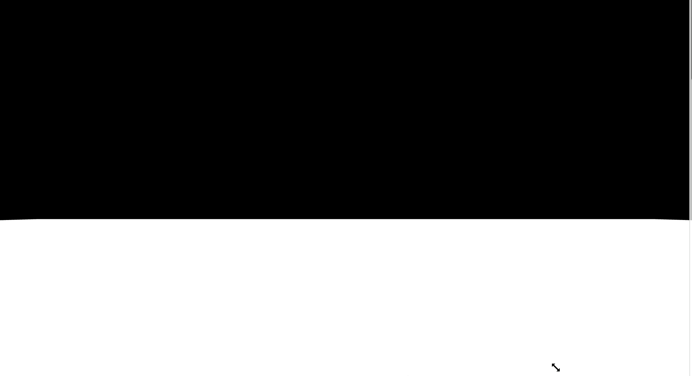
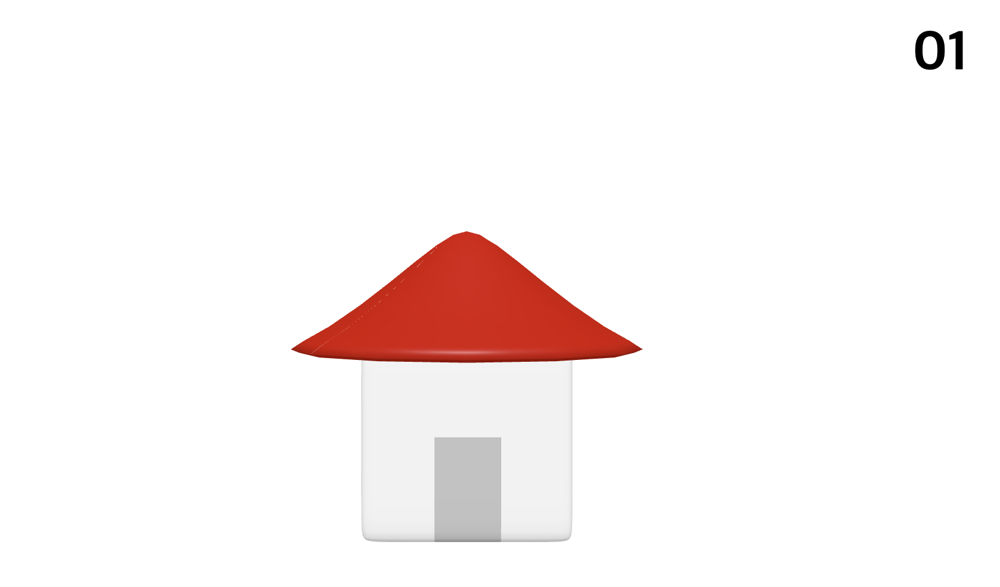
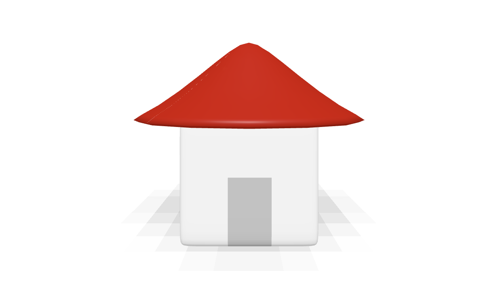
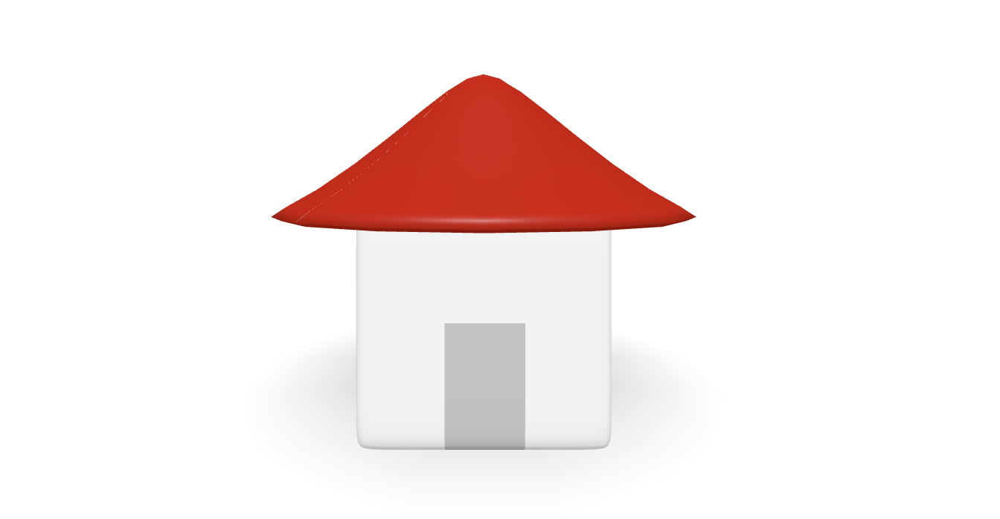

## 스크롤 기반의 3D 랜딩 페이지 구현

# 예제 - 스크롤 기반의 3D 랜딩 페이지

스크롤에 따라 3D 애니메이션이 구현되는 예제를 만들어본다.

### 기본 구조 잡기

우선 아래의 기본 구조에서 시작해본다.

`scroll_page/src/main.js`

```jsx
import * as THREE from "three";

// ----- 주제: 스크롤에 따라 움직이는 3D 페이지

// Renderer
const canvas = document.querySelector("#three-canvas");
const renderer = new THREE.WebGLRenderer({
  canvas,
  antialias: true
});
renderer.setSize(window.innerWidth, window.innerHeight);
renderer.setPixelRatio(window.devicePixelRatio > 1 ? 2 : 1);

// Scene
const scene = new THREE.Scene();

// Camera
const camera = new THREE.PerspectiveCamera(75, window.innerWidth / window.innerHeight, 0.1, 1000);
camera.position.y = 1.5;
camera.position.z = 4;
scene.add(camera);

// Light
const ambientLight = new THREE.AmbientLight("white", 0.5);
scene.add(ambientLight);

// Light ..
// Mesh ..

// 그리기
const clock = new THREE.Clock();

function draw() {
  const delta = clock.getDelta();

  renderer.render(scene, camera);
  renderer.setAnimationLoop(draw);
}

function setSize() {
  camera.aspect = window.innerWidth / window.innerHeight;
  camera.updateProjectionMatrix();
  renderer.setSize(window.innerWidth, window.innerHeight);
  renderer.render(scene, camera);
}

// 이벤트
window.addEventListener("resize", setSize);

draw();
```

우선 Light는 기존 DirectionalLight를 사용하지 않고 spotLight를 적용한다.

```jsx
// Renderer, Scene, Camera, Light
const ambientLight = new THREE.AmbientLight("white", 0.5);
scene.add(ambientLight);

// spot Light 추가
const spotLight = new THREE.SpotLight("white", 0.7);
spotLight.position.set(0, 150, 100);
spotLight.castShadow = true; // 그림자 효과
spotLight.shadow.mapSize.width = 1024; // 그림자의 Quality
spotLight.shadow.mapSize.height = 1024; // 그림자의 Quality
spotLight.shadow.camera.near = 1; // 그림자를 찍을 카메라의 Near
spotLight.shadow.camera.far = 200; // 그림자를 찍을 카메라의 Far
scene.add(spotLight);

// Mesh ..
```

다음으로는 Mesh를 그려주는데, 땅 위에 집이 있는 구조이므로 땅을 먼저 그려주면 아래와 같음.

```jsx
// Renderer, Scene..
const scene = new THREE.Scene();
scene.background = new THREE.Color("white"); // background Scene 추가

// Camera, Light, SpotLight..

// Mesh
const floorMesh = new THREE.Mesh(new THREE.PlaneGeometry(100, 100), new THREE.MeshStandardMaterial({ color: "white" }));
floorMesh.rotation.x = -Math.PI / 2;
scene.add(floorMesh);
```

위와 같이 추가해주면 바닥면과 하얀색 하늘이 표현됨. 바닥을 굳이 넣는 이유는 그림자 표현을 위해서이다.
이제 스크롤에 따라 보여줄 html을 추가해준다.

`src/index.html`

```html
<!DOCTYPE html>
<html lang="en">
  <head>
    <meta charset="UTF-8" />
    <meta http-equiv="X-UA-Compatible" content="IE=edge" />
    <meta name="viewport" content="width=device-width, initial-scale=1.0" />
    <title>Document</title>
    <link rel="stylesheet" href="./main.css" />
  </head>

  <body>
    <canvas id="three-canvas"></canvas>
    <div class="sections">
      <section class="section">
        <h2>01</h2>
      </section>
      <section class="section">
        <h2>02</h2>
      </section>
      <section class="section">
        <h2>03</h2>
      </section>
      <section class="section">
        <h2>04</h2>
      </section>
      <section class="section">
        <h2>05</h2>
      </section>
    </div>
  </body>
</html>
```

`src/main.css`

```css
body {
  margin: 0;
}

#three-canvas {
  position: fixed;
  left: 0;
  top: 0;
}

.sections {
  position: relative;
  z-index: 1;
}

.section {
  height: 100vh;
  padding: 5rem;
  box-sizing: border-box;
}

.section h2 {
  margin: 0;
  font-size: 7vmin; /* vmin = viewport minimum, 가로, 세로 사이즈 중 작은 값 */
}

.section:nth-child(odd) {
  text-align: right;
}
```



### House 클래스 구현

이제 배경을 흰색으로 돌려주고, 집을 놓아보자. 모듈로 집을 구현하려고 한다.
먼저 집을 구현해야할 때 전달해야 하는 인자가 어떤 것들이 있을지 생각해보자.

`src/main.js`

```jsx
import { GLTFLoader } from "three/examples/jsm/loaders/GLTFLoader";
import { House } from "./House";

// Renderer, Scene, Camera, Light, SpotLight..

// Mesh ..
scene.add(floorMesh);

const gltfLoader = new GLTFLoader();
const houses = [];
houses.push(
  new House({
    gltfLoader, // house.glb 로드를 위함
    scene, // scene에 추가를 위함
    modelSrc: "/models/house.glb", // House 객체에 적용될 glb 이미지
    x: 0, // x 좌표
    z: 0, // z 좌표
    height: 2 // mesh 별 height 별도로 주입
  })
);
```

위와 같이 전달인자를 세팅해주었다. House 클래스를 구현해본다.

`src/House.js`

```jsx
export class House {
  constructor(info) {
    this.x = info.x;
    this.z = info.z;

    this.height = info.height || 2;

    info.gltfLoader.load(info.modelSrc, (glb) => {
      this.mesh = glb.scene.children[0];
      this.mesh.position.set(this.x, this.height / 2, this.z);
      info.scene.add(this.mesh);
    });
  }
}
```

집 하나를 일단 넣어보았음



그림자가 없어서 허전하다.

```jsx
// Renderer ..
renderer.shadowMap.enabled = true; // 그림자 효과

// Scene, Camera, Light..

// Mesh..
floorMesh.receiveShadow = true; // 그림자 효과
scene.add(floorMesh);

const gltfLoader = new GLTFLoader();
const houses = [];
houses.push(new House({ gltfLoader, scene, modelSrc: "/models/house.glb", x: 0, z: 0, height: 2 }));

// ..
```

`src/House.js`

```jsx
export class House {
  constructor(info) {
    // ..

    info.gltfLoader.load(info.modelSrc, (glb) => {
      this.mesh = glb.scene.children[0];
      this.mesh.castShadow = true; // 그림자 효과
      // ..
    });
  }
}
```

위처럼 renderer, floorMesh, gltfMesh에 Shadow 효과를 적용해주면 아래와 같이 된다.



그림자가 픽셀처럼 깨져보이는 현상.. 빛이 넓은 범위에서 비추기 때문인데, 빛이 가깝게 비추도록 설정할 수도 있고, renderer의 shadowMap type을 부드러운 타입으로 바꿔주는 방법도 있다.

```jsx
// Renderer ..
renderer.shadowMap.enabled = true;
renderer.shadowMap.type = THREE.PCFSoftShadowMap; // 추가

// ..
```

그럼 이렇게 부드럽게 노출됨


