## 징검다리 게임 구현

### 기본 장면 구성

이번 예제에서는 기존과는 조금 다른 방식으로 작업해본다.
Scene, Camera를 공통 모듈로 만든 뒤 거기에 넣고 사용하려함

`src/common.js`

```jsx
import { Scene } from "three";

// 공통 객체 정의
export const cm1 = {
  canvas: document.querySelector("#three-canvas"),
  scene: new Scene()
};

// 커스텀 데이터 정의
export const cm2 = {
  backgroundColor: "#3e1322"
};
```

`src/main.js`

```jsx
// ..
import { cm1, cm2 } from "./common";

// ----- 주제: The Bridge 게임 만들기

// Renderer
const renderer = new THREE.WebGLRenderer({
  canvas: cm1.canvas, // cm1 적용
  antialias: true
});
// ..

// scene
cm1.scene.background = new THREE.Color(cm2.backgroundColor); // cm1, cm2 적용

// Camera..
cm1.scene.add(camera); // cm1 적용

// Light..
cm1.scene.add(directionalLight); // cm1 적용

// Controls

// Mesh..
cm1.scene.add(mesh); // cm1 적용

// ..
```

위와 같이 기존 소스에 정의한 데이터를 적용하여 기본 장면을 구성하였다.

### 조명 설치

다음으로는 조명 설치를 해본다. 만들 징검다리 UI를 보면 아래와 같음

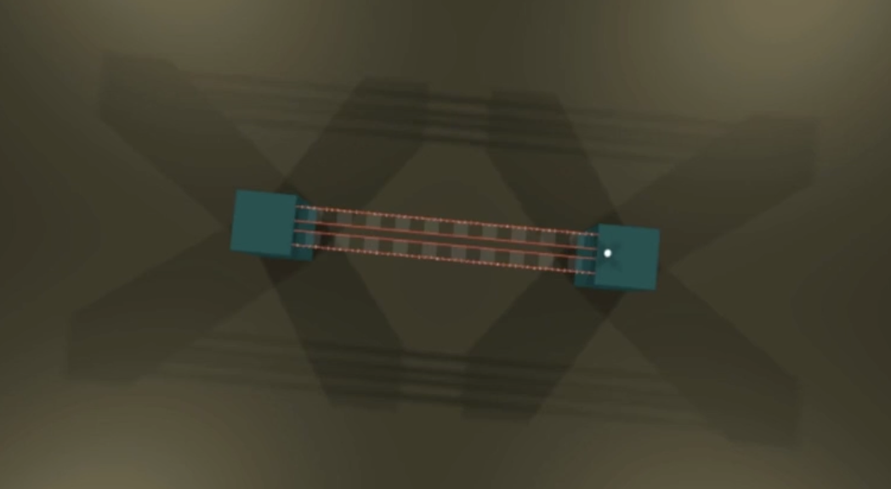

빛이 4군데에서 비춰지고 있다는 것을 알 수 있다. spotLight를 네 귀퉁이에서 가운데로 쏴서 구현
현재는 이러하다.

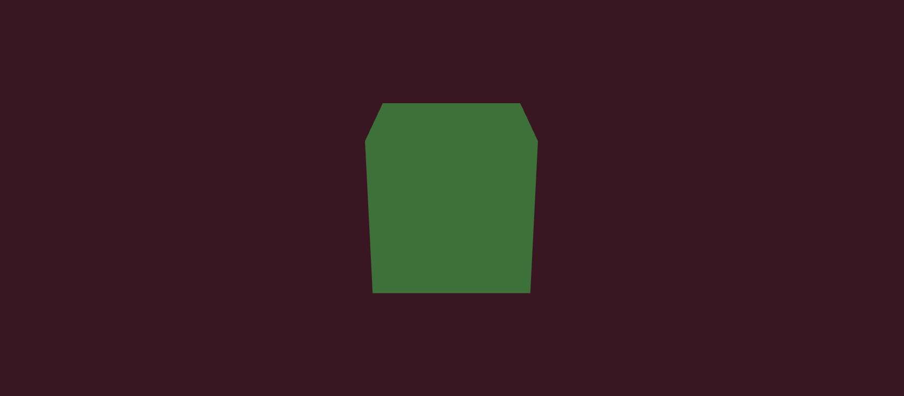

`src/common.js`

```jsx
// ..

export const cm2 = {
  backgroundColor: "#3e1322",
  lightColor: "#ffe9ac" // lightColor 추가
};
```

`src/main.js`

```jsx
// ..
import { cm1, cm2 } from "./common";

// Renderer ..
renderer.shadowMap.enabled = true; // 그림자 속성 추가
renderer.shadowMap.type = THREE.PCFSoftShadowMap; // 그림자를 부드럽게 보이게 함

// scene, Camera..

// Light..
const ambientLight = new THREE.AmbientLight(cm2.lightColor, 0.8);
cm1.scene.add(ambientLight);

const spotLightDistance = 50;
const spotLight1 = new THREE.SpotLight(cm2.lightColor, 1);
spotLight1.castShadow = true; // 그림자
const spotLight2 = spotLight1.clone(); // spotLight1을 복제
const spotLight3 = spotLight1.clone(); // spotLight1을 복제
const spotLight4 = spotLight1.clone(); // spotLight1을 복제

spotLight1.position.set(-spotLightDistance, spotLightDistance, spotLightDistance);
spotLight2.position.set(spotLightDistance, spotLightDistance, spotLightDistance);
spotLight3.position.set(-spotLightDistance, spotLightDistance, -spotLightDistance);
spotLight4.position.set(spotLightDistance, spotLightDistance, -spotLightDistance);

cm1.scene.add(spotLight1, spotLight2, spotLight3, spotLight4);

// Controls, Mesh..
```

위와 같이 spotLight를 4군데에서 동일한 거리 간격으로 쏴주도록 구현함

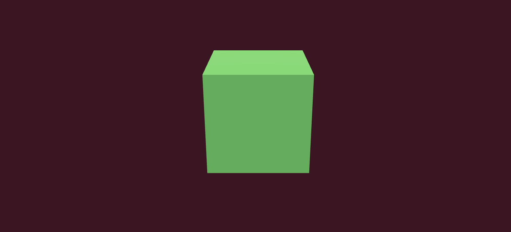

한층 밝아졌다. 바닥을 두고 화면 확장을 하면 더 확실히 빛의 영향을 확인할 수 있음

### 무대 설치1

다음에는 기둥 다리 등의 무대를 설치해본다. 먼저 기둥 다리의 각도를 아래와 같이 설정해준다. 위에서 바라보도록 각도 조정

`src/main.js`

```jsx
// ..
import { cm1, cm2 } from "./common";

// Renderer, scene ..
// Camera..
const camera = new THREE.PerspectiveCamera(75, window.innerWidth / window.innerHeight, 0.1, 1000);
camera.position.x = -4;
camera.position.y = 19;
camera.position.z = 14;
cm1.scene.add(camera);

// Light, Controls
```

기존 Mesh 코드를 모두 삭제한 뒤 바닥, 기둥까지 모듈로 생성하여 추가해본다.
아래와 같이 동일한 메쉬로 사용될 것은 클래스를 상속받아 처리하도록 할 수 있다.

`src/Stuff.js`

```jsx
// Stuff.js는 물체를 생성하는 클래스임
// 물체를 생성하는 클래스를 따로 만들어서 사용하는 이유는 물체를 생성하는 코드를 따로 모아서 관리하기 위함
// 물체를 생성하는 코드를 따로 모아서 관리하면 물체를 생성하는 코드를 재사용하기 쉬움

export class Stuff {
  constructor(info = {}) {
    this.name = info.name || "";
    this.x = info.x || 0;
    this.y = info.y || 0;
    this.z = info.z || 0;

    this.rotationY = info.rotationY || 0;
    this.rotationX = info.rotationX || 0;
    this.rotationZ = info.rotationZ || 0;
  }
}
```

일단 기본적인 물체를 생성하는 클래스 개념으로 Stuff 객체를 위와 같이 생성한다.
그리고 pillar(기둥)과 floor(바닥)에 사용할 geometry, material 요소들을 common.js 안에 추가해줌

`src/common.js`

```jsx
import { BoxGeometry, MeshPhongMaterial, Scene } from "three";

// ..

export const cm2 = {
  backgroundColor: "#3e1322",
  lightColor: "#ffe9ac",
  pillarColor: "#071d28", // add
  floorColor: "#111" // add
};

export const geo = {
  pillar: new BoxGeometry(5, 10, 5),
  floor: new BoxGeometry(200, 1, 200)
};

export const mat = {
  pillar: new MeshPhongMaterial({ color: cm2.pillarColor }),
  floor: new MeshPhongMaterial({ color: cm2.floorColor })
};
```

위와 같이 하나의 데이터 안에서 관리되도독 하면 유지보수에 편리함

`src/Pillar.js`

```jsx
import { Mesh } from "three";
import { Stuff } from "./Stuff";
import { cm1, geo, mat } from "./common";

export class Pillar extends Stuff {
  constructor(info) {
    super(info);

    this.geometry = geo.pillar;
    this.material = mat.pillar;

    this.mesh = new Mesh(this.geometry, this.material);
    this.mesh.position.set(this.x, this.y, this.z);
    this.mesh.castShadow = true;
    this.mesh.receiveShadow = true;

    cm1.scene.add(this.mesh);
  }
}
```

`src/Floor.js`

```jsx
import { Mesh } from "three";
import { Stuff } from "./Stuff";
import { cm1, geo, mat } from "./common";

export class Floor extends Stuff {
  constructor(info) {
    super(info);

    this.geometry = geo.floor;
    this.material = mat.floor;

    this.mesh = new Mesh(this.geometry, this.material);
    this.mesh.position.set(this.x, this.y, this.z);

    this.mesh.receiveShadow = true; //castShadow는 필요없음

    cm1.scene.add(this.mesh);
  }
}
```

위와 같이 입맛대로 클래스를 구현해 준 다음 실제 위 클래스 객체들을 main.js에서 아래와 같이 사용함

`src/main.js`

```jsx
// ..
import { cm1, cm2 } from "./common";
import { Pillar } from "./Pillar";
import { Floor } from "./Floor";

// Renderer, scene, Camera, Light, Controls

// 물체 만들기
const glassUnitSize = 1.2; // 유리칸의 사이즈

// 기둥
const pillar1 = new Pillar({
  name: "pillar",
  x: 0,
  y: 5.5, // pillar의 높이가 10이라서 절반으로 조정
  z: -glassUnitSize * 12 - glassUnitSize / 2 // 1.2는 다리의 유리칸 하나의 사이즈, 12는 다리의 유리칸 개수, 0.6은 다리의 유리칸 사이의 간격
});

const pillar2 = new Pillar({
  name: "pillar",
  x: 0,
  y: 5.5,
  z: glassUnitSize * 12 + glassUnitSize / 2 // 1.2는 다리의 유리칸 하나의 사이즈, 12는 다리의 유리칸 개수, 0.6은 다리의 유리칸 사이의 간격
});

// 바닥
const floor = new Floor({ name: "floor" });
```

위와 같이 기둥 2개 클래스와 바닥면에 대해 객체 데이터를 넣어주면 아래와 같이 정상적으로 노출된다.

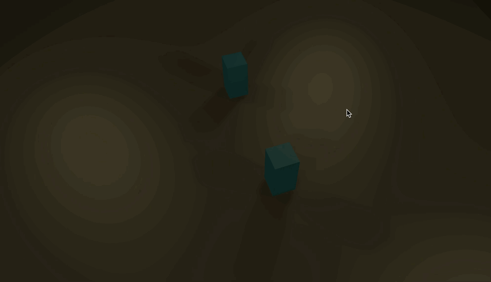

### 무대 설치 2

다음에는 사이를 이어주는 다리를 그려본다.

`src/Bar.js`

```jsx
import { Mesh } from "three";
import { Stuff } from "./Stuff";
import { cm1, geo, mat } from "./common";

export class Bar extends Stuff {
  constructor(info) {
    super(info);

    this.geometry = geo.bar;
    this.material = mat.bar;

    this.mesh = new Mesh(this.geometry, this.material);
    this.mesh.position.set(this.x, this.y, this.z);
    this.mesh.castShadow = true;
    this.mesh.receiveShadow = true;
    cm1.scene.add(this.mesh);
  }
}
```

`src/common.js`

```jsx
// ..

export const cm2 = {
  // ..
  barColor: "#441c1d"
};

export const geo = {
  // ..
  bar: new BoxGeometry(0.1, 0.3, 1.2 * 21)
};

export const mat = {
  // ..
  bar: new MeshPhongMaterial({ color: cm2.barColor })
};
```

`src/main.js`

```jsx
// ..
import { Bar } from "./Bar";

// Renderer, scene, Camera, Light, Controls

// 기둥, 바닥..

// 바 - x 값만 바뀐다/
const bar1 = new Bar({ name: "bar", x: -1.6, y: 10.3, z: 0 });
const bar2 = new Bar({ name: "bar", x: -0.4, y: 10.3, z: 0 });
const bar3 = new Bar({ name: "bar", x: 0.4, y: 10.3, z: 0 });
const bar4 = new Bar({ name: "bar", x: 1.6, y: 10.3, z: 0 });
```

위와 같이 설정해주면 아래와 같이 4개의 바가 생성됨

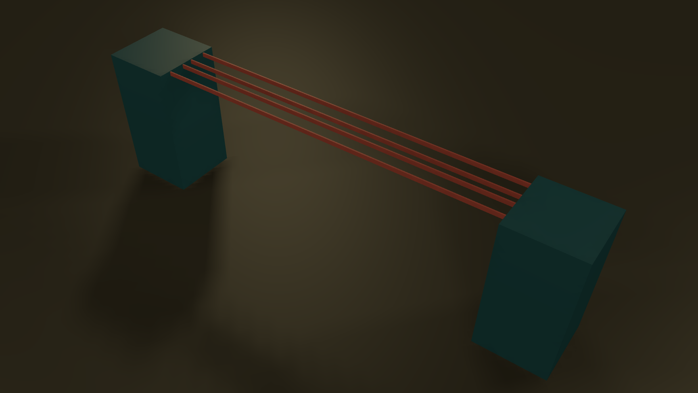

그 다음에는 바에 달린 불빛을 추가해본다. 본 기능과 다르므로 Stuff 객체에 상속받지 않는 SideLight 객체를 생성하도록 한다.

`src/SideLight.js`

```jsx
import { Mesh } from "three";
import { cm1, geo, mat } from "./common";

export class SideLight {
  constructor(info) {
    const container = info.container || cm1.scene;

    this.name = info.name || "";
    this.x = info.x || 0;
    this.y = info.y || 0;
    this.z = info.z || 0;

    this.geometry = geo.sideLight;
    this.material = mat.sideLight;

    this.mesh = new Mesh(this.geometry, this.material);
    this.mesh.position.set(this.x, this.y, this.z);

    // cm1.scene.add(this.mesh); // scene에 추가하지 않음
    container.add(this.mesh); // container에 종속적 객체로 처리
  }
}
```

`src/common.js`

```jsx
// ..

export const geo = {
  // ..
  sideLight: new SphereGeometry(0.1, 6, 6)
};

export const mat = {
  // ..
  sideLight: new MeshPhongMaterial({ color: cm2.lightColor })
};
```

`src/main.js`

```jsx
// ..
import { Bar } from "./Bar";

// Renderer, scene, Camera, Light, Controls

// 기둥, 바닥..
// 바
const bar1 = new Bar({ name: "bar", x: -1.6, y: 10.3, z: 0 });
const bar2 = new Bar({ name: "bar", x: -0.4, y: 10.3, z: 0 });
const bar3 = new Bar({ name: "bar", x: 0.4, y: 10.3, z: 0 });
const bar4 = new Bar({ name: "bar", x: 1.6, y: 10.3, z: 0 });

// 사이드 라이트 - 추가
for (let i = 0; i < 49; i++) {
  new SideLight({ name: "sideLight", container: bar1.mesh, z: i * 0.5 - glassUnitSize * 10 });
}
for (let i = 0; i < 49; i++) {
  new SideLight({ name: "sideLight", container: bar4.mesh, z: i * 0.5 - glassUnitSize * 10 });
}
```

위와 같이 처리해주면 1번째, 4번째 바에 불빛이 잘 들어오는 것 확인 가능

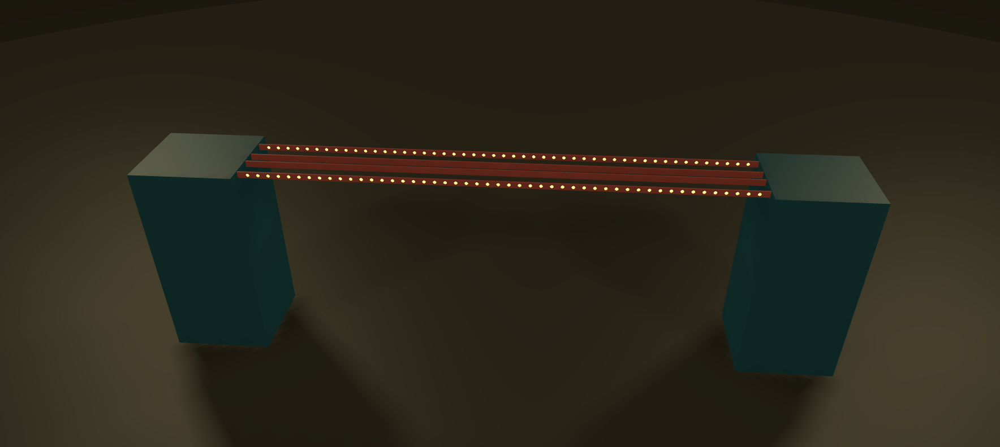

### 일반 유리, 강화 유리 설치

이제 유리판을 만들어본다. 유리판은 다른 애들보다 기능이 복잡하다. 강화유리, 일반유리에 따라 물리엔진이나 소리 등의 추가 애니메이션이 들어가기 때문.. Stuff를 상속한 기본 개념은 같다.

`src/Glass.js`

```jsx
import { Mesh } from "three";
import { Stuff } from "./Stuff";
import { cm1, geo, mat } from "./common";

export class Glass extends Stuff {
  constructor(info) {
    super(info);

    this.type = info.type;

    this.geometry = geo.glass;
    this.material = mat.glass;

    this.mesh = new Mesh(this.geometry, this.material);
    this.mesh.position.set(this.x, this.y, this.z);
    this.mesh.castShadow = true;
    this.mesh.receiveShadow = true;

    cm1.scene.add(this.mesh);
  }
}
```

`src/common.js`

```jsx
// ..

export const cm2 = {
  // ..
  glassColor: "#9fdfff"
};

export const geo = {
  // ..
  glass: new BoxGeometry(1.2, 0.1, 1.2)
};

export const mat = {
  // ..
  glass: new MeshPhongMaterial({ color: cm2.glassColor, transparent: true, opacity: 0.1 })
};
```

위와 같이 Glass 클래스 객체를 만들어 준 뒤 아래와 같이 사용

`src/main.js`

```jsx
// ..
import { Glass } from "./Glass";

// Renderer, scene, Camera, Light, Controls

// 기둥, 바닥, 바, 사이드 라이트..

const numberOfGlass = 10; // 추가

// 유리판
for (let i = 0; i < numberOfGlass; i++) {
  const glass1 = new Glass({
    name: "glass",
    x: -1,
    y: 10.3,
    z: i * glassUnitSize * 2 - glassUnitSize * 9
  });
  const glass2 = new Glass({
    name: "glass",
    x: 1,
    y: 10.3,
    z: i * glassUnitSize * 2 - glassUnitSize * 9
  });
}
```

위와 같이 넣으면 유리판 설치가 완료된다.

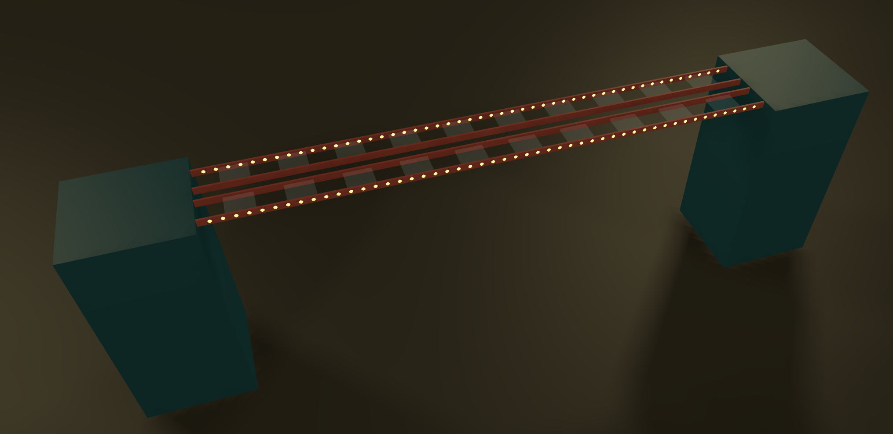

다음으로는 랜덤하게 일반 유리, 강화 유리로 나눠야 함. 이건 0~1 숫자를 반환하는 `Math.random`에 반올림(round)하여 처리하면 된다.

```jsx
// ..
import { Glass } from "./Glass";

// Renderer, scene, Camera, Light, Controls

// 기둥, 바닥, 바, 사이드 라이트..

const numberOfGlass = 10; // cnrk

// 유리판 - 아래와 같이 수정한다.
let glassTypeNumber = 0;
let glassTypes = [];
for (let i = 0; i < numberOfGlass; i++) {
  glassTypeNumber = Math.round(Math.random());
  switch (glassTypeNumber) {
    case 0:
      glassTypes = ["normal", "strong"];
      break;
    case 1:
      glassTypes = ["strong", "normal"];
      break;
  }

  const glass1 = new Glass({
    name: `glass-${glassTypes[0]}`,
    x: -1,
    y: 10.3,
    z: i * glassUnitSize * 2 - glassUnitSize * 9,
    type: glassTypes[0]
  });
  const glass2 = new Glass({
    name: `glass-${glassTypes[1]}`,
    x: 1,
    y: 10.3,
    z: i * glassUnitSize * 2 - glassUnitSize * 9,
    type: glassTypes[1]
  });
}
```

다음 랜덤하게 들어온 값에 대한 표현 처리를 다르게 하기 위해 common.js에 아래 코드 추가

```jsx
// ..

export const mat = {
  // ..
  glass1: new MeshPhongMaterial({ color: cm2.glassColor, transparent: true, opacity: 0.1 }),
  glass2: new MeshPhongMaterial({ color: cm2.glassColor, transparent: true, opacity: 0.5 })
};
```

위 glass1, glass2에 대한 material을 Glass 객체에 적용

```jsx
// ..

export class Glass extends Stuff {
  constructor(info) {
    super(info);

    this.type = info.type; // 타입 추가
    this.geometry = geo.glass;

    // type에 따른 추가
    switch (this.type) {
      case "normal":
        this.material = mat.glass1;
        break;
      case "strong":
        this.material = mat.glass2;
        break;
    }
    // this.material = mat.glass;

    this.mesh = new Mesh(this.geometry, this.material);
    this.mesh.position.set(this.x, this.y, this.z);
    this.mesh.castShadow = true;
    this.mesh.receiveShadow = true;
    this.mesh.name = this.name;

    cm1.scene.add(this.mesh);
  }
}
```

위와 같이 glass1은 normal 유리, glass2는 strong 유리로 노출되도록 코드를 추가되면 랜덤한 다리가 섞인 ui가 잘 그려진다.

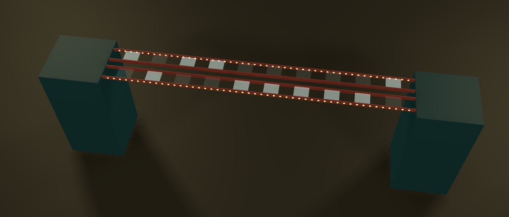

그럴싸해졌다.

### 플레이어 만들기

플레이어를 만들어보자. 일분이를 넣는 것임..! 이 경우 블렌더의 glb 파일을 불러와야 함
glb 파일을 로드하기 위해서는 gltfLoader를 사용해야 함. 이것도 common.js에서 가져와 사용하는 걸로 만듦

`src/commons.js`

```jsx
//..
import { GLTFLoader } from "three/examples/jsm/loaders/GLTFLoader";

export const cm1 = {
  // ..
  gltfLoader: new GLTFLoader()
};

// ..
```

위 내용을 Player 클래스에서 가져와 사용

`src/Player.js`

```jsx
import { Mesh } from "three";
import { Stuff } from "./Stuff";
import { cm1 } from "./common";

export class Player extends Stuff {
  constructor(info) {
    super(info);

    cm1.gltfLoader.load("/models/ilbuni.glb", (glb) => {
      console.log(glb);
    });
  }
}
```

그러면 콘솔에 glb가 잘 담기는 것을 확인할 수 있음. animations에 3가지 액션도 잘담겨이따

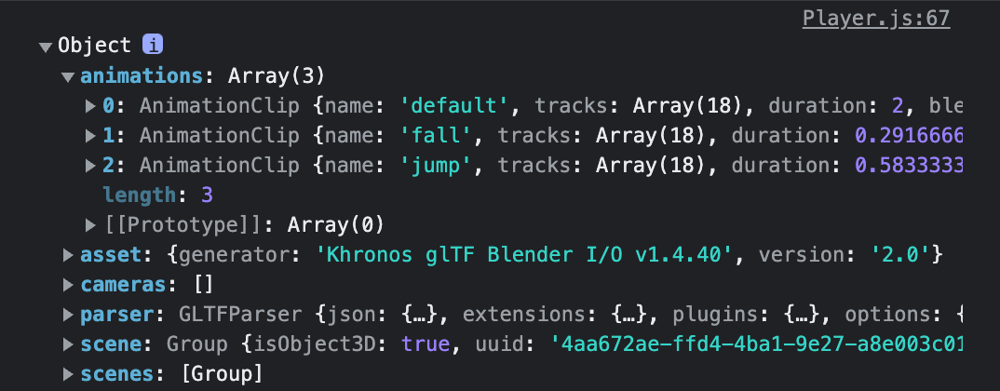

얠 다리에 얹어보자.

`src/Player.js`

```jsx
import { Mesh } from "three";
import { Stuff } from "./Stuff";
import { cm1 } from "./common";

export class Player extends Stuff {
  constructor(info) {
    super(info);

    cm1.gltfLoader.load("/models/ilbuni.glb", (glb) => {
      this.modelMesh = glb.scene.children[0];
      this.modelMesh.position.set(this.x, this.y, this.z);
      cm1.scene.add(this.modelMesh);
    });
  }
}
```

`src/main.js`

```jsx
// ..
import { Player } from "./Player";

// Renderer, scene, Camera, Light, Controls
// 기둥, 바닥, 바, 사이드 라이트, 유리판

// 플레이어
new Player({ name: "player", x: 0, y: 10.8, z: 13 });
```

요로코롬 팔벌려서 서있는다. 아마 첫번째 애니메이션이 적용된 채로 멈춰있는 듯.. 이를 수정해보자

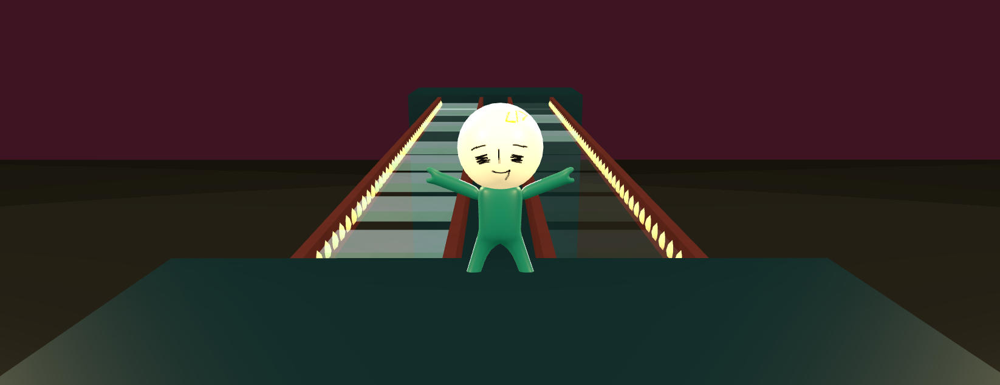

`src/commons.js`

```jsx
export const cm1 = {
  // ..
  gltfLoader: new GLTFLoader(),
  mixer: undefined
};

// ..
```

`src/Player.js`

```jsx
import { Mesh } from "three";
import { Stuff } from "./Stuff";
import { cm1 } from "./common";

export class Player extends Stuff {
  constructor(info) {
    super(info);

    cm1.gltfLoader.load("/models/ilbuni.glb", (glb) => {
      this.modelMesh = glb.scene.children[0];
      this.modelMesh.position.set(this.x, this.y, this.z);
      this.modelMesh.rotation.set(this.rotationX, this.rotationY, this.rotationZ); // 방향 돌려준다.
      cm1.scene.add(this.modelMesh);

      this.modelMesh.animations = glb.animations; // 임의로 설정
      cm1.mixer = new AnimationMixer(this.modelMesh); // 재활용 하기 위해 cm1.mixer에 저장
      this.actions = [];
      this.actions.push(cm1.mixer.clipAction(this.modelMesh.animations[0])); // default
      this.actions.push(cm1.mixer.clipAction(this.modelMesh.animations[1])); // fall
      this.actions.push(cm1.mixer.clipAction(this.modelMesh.animations[2])); // jump

      this.actions[0].play(); // default action 실행 - draw 함수에도 적용 필요
    });
  }
}
```

`src/main.js`

```jsx
ㅇ; // Renderer, scene, Camera, Light, Controls
// 기둥, 바닥, 바, 사이드 라이트, 유리판

// 플레이어 - rotationY로 glb 파일 뒤돌기
new Player({ name: "player", x: 0, y: 10.9, z: 13, rotationY: Math.PI });

// 그리기
const clock = new THREE.Clock();
function draw() {
  const delta = clock.getDelta();

  cm1.mixer?.update(delta); // cm1.mixer가 있으면 update를 실행
  // ..
}

// ..
draw();
```

위와 같이 처리하면 오뚝이처럼 준비자세로 변신한 + 돌아선 플레이어 발견

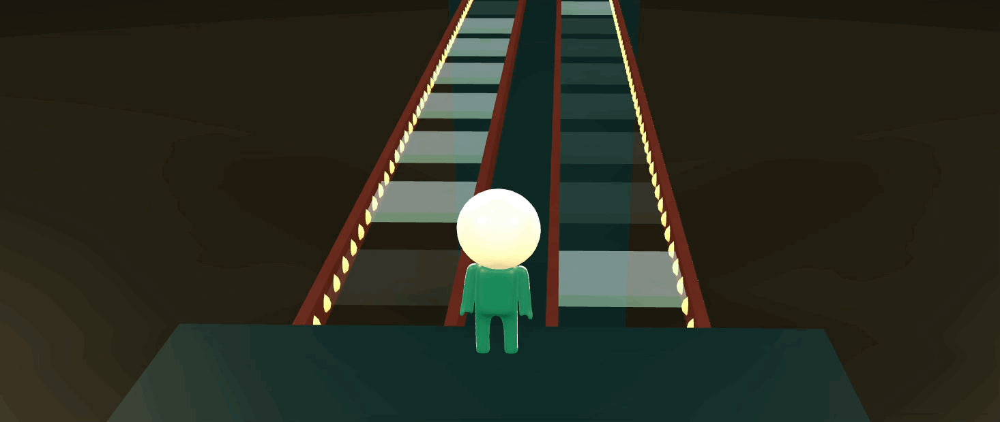

그림자 효과도 추가해준다.

`src/Player.js`

```jsx
import { Mesh } from "three";
import { Stuff } from "./Stuff";
import { cm1 } from "./common";

export class Player extends Stuff {
  constructor(info) {
    super(info);

    // 그림자 효과를 위한 추가
    this.mesh = new Mesh(new BoxGeometry(0.5, 0.5, 0.5), new MeshBasicMaterial({ transparent: true, opacity: 0 }));
    this.mesh.castShadow = true;
    this.mesh.position.set(this.x, this.y, this.z);
    cm1.scene.add(this.mesh);

    cm1.gltfLoader.load("/models/ilbuni.glb", (glb) => {
      // ..
      this.actions[2].repetitions = 1; // jump 애니메이션은 한번만 수행하도록 추가
    });
  }
}
```

`src/main.js`

```jsx
// Renderer, scene, Camera,

// Light ..
const spotLightDistance = 50;
const spotLight1 = new THREE.SpotLight(cm2.lightColor, 1);
spotLight1.castShadow = true;
spotLight1.shadow.mapSize.width = 2048; // mapSize 크게해서 그림자 효과 주기
spotLight1.shadow.mapSize.height = 2048; // mapSize 크게해서 그림자 효과 주기

// Controls, 기둥, 바닥, 바, 사이드 라이트, 유리판, 플레이어...
```

위와 같이 처리하면 그림자도 잘 적용된 것으로 보인다.

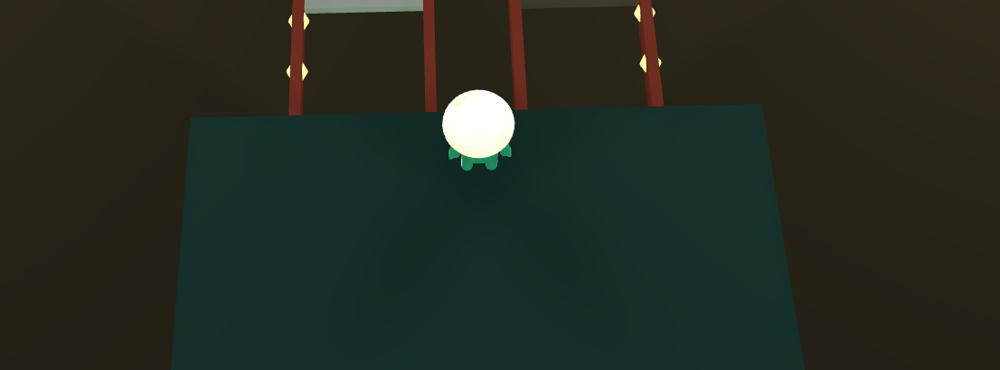

### 클릭 처리(Raycaster)

이번에는 Raycaster를 이용해 클릭 처리를 해본다.

`src/commons.js`

```jsx
export const cm1 = {
  // canvas: document.querySelector("#three-canvas"), // 제거
  scene: new Scene(),
  gltfLoader: new GLTFLoader(),
  mixer: undefined
};

// ..
```

`src/main.js`

```jsx
// Renderer
const canvas = document.querySelector("#three-canvas"); // canvas 정의 이동
const renderer = new THREE.WebGLRenderer({
  canvas,
  antialias: true
});

// ..
// scene, Camera, Light ..
// Controls, 기둥, 바닥, 바, 사이드 라이트, 유리판, 플레이어...

// Raycaster
const raycaster = new THREE.Raycaster();
const mouse = new THREE.Vector2(); // 마우스 좌표를 저장할 벡터

function checkIntersects() {
  raycaster.setFromCamera(mouse, camera);

  const intersects = raycaster.intersectObjects(cm1.scene.children, true);
  for (const item of intersects) {
    checkClickedObject(item.object.name);
    break; // 처음 맞는 mesh만 처리
  }
}

function checkClickedObject(objectName) {
  if (objectName.indexOf("glass") >= 0) {
    // 유리판을 클릭했을 때
  }
}

// 그리기..

// 이벤트 ..
canvas.addEventListener("click", (e) => {
  mouse.x = (e.clientX / canvas.clientWidth) * 2 - 1;
  mouse.y = -((e.clientY / canvas.clientHeight) * 2 - 1);
  checkIntersects();
});
```

- 기존 common에서 관리하던 canvas 엘리먼트를 그냥 main.js에서 정의해서 사용하도록 기능 변경
- Raycaster 기본 정의 추가
- canvas 클릭 이벤트에 실행되는 checkIntersects 함수 구현

### 물리 엔진 기본 설정

이제 유리판을 클릭했을 때 이벤트에 대한 물리엔진을 설정해본다. cannon 설치 먼저..

```jsx
> npm i cannon-es
```

기본 world와 metarial 설정은 common.js에서 해준다.

`src/commons.js`

```jsx
import { Material, World } from "cannon-es";

export const cm1 = {
  //..
  world: new World(), // CANNON
  defaultMaterial: new Material("default"),
  glassMaterial: new Material("glass"),
  playerMaterial: new Material("player")
};

// ..
```

다음 실제 CANNON 구현을 해본다.

`src/main.js`

```jsx
// Renderer, scene, Camera, Light, Controls ...

// 물리 엔진 CANNON
cm1.world.gravity.set(0, -10, 0); // 중력 설정
const defaultContackMaterial = new CANNON.ContactMaterial(cm1.defaultMaterial, cm1.defaultMaterial, {
  friction: 0.3, // 마찰
  restitution: 0.3 // 반발
});
const glassDefaultContackMaterial = new CANNON.ContactMaterial(cm1.glassMaterial, cm1.defaultMaterial, {
  friction: 1, // 마찰
  restitution: 0 // 반발 - 튕기지 않도록
});
const playerGlassContackMaterial = new CANNON.ContactMaterial(cm1.playerMaterial, cm1.glassMaterial, {
  friction: 1, // 마찰
  restitution: 0 // 반발 - 튕기지 않도록
});
cm1.world.defaultContactMaterial = defaultContackMaterial;
cm1.world.addContactMaterial(glassDefaultContackMaterial);
cm1.world.addContactMaterial(playerGlassContackMaterial);
```

위와 같이 기본 world의 중력 설정 + defaultMaterial 충돌에 대한 설정, glass-Player간, glass-default 간 충돌 설정을 위와 같이 해주면 기본 설정은 완료!

### 각 객체들에 물리 엔진 적용하기

이제 각 object에 물리엔진의 적용을 받아야하므로, cannon에서 body를 만들어준다.
각 Object 들은 Stuff의 영향을 받으므로 Stuff 클래스에서 CannonBody 설정을 해준다!

`src/Stuff.js`

```jsx
export class Stuff {
  constructor(info = {}) {
    // ..
    this.cannonMaterial = info.cannonMaterial || cm1.defaultMaterial;
  }
  setCannonBody() {
    const material = this.cannonMaterial;
  }
}
```

위와 같이 값이 없으면 기본 defaultMaterial을, 값이 있을 경우 해당 material을 전달받도록 하는 material 코드를 넣어준다. 그 이후 물체 생성 시 설정에 전달인자를 아래와 같이 추가함

`src/main.js`

```jsx
// Renderer, scene, Camera, Light, Controls, CANNON..

// 물체 만들기
// 기둥, 바닥, 바, 사이드 라이트 ..
// 유리판
let glassTypeNumber = 0;
let glassTypes = [];
for (let i = 0; i < numberOfGlass; i++) {
  // ..

  const glass1 = new Glass({
    // ..
    cannonMaterial: cm1.glassMaterial // 추가
  });
  const glass2 = new Glass({
    // ..
    cannonMaterial: cm1.glassMaterial // 추가
  });
}

// 플레이어
const player = new Player({
  // ..
  cannonMaterial: cm1.playerMaterial // 추가
});
```

그러면 잘 적용될 것이다. 다음으로 shape 설정도 추가한다. shape는 중심축에서부터 사이즈를 측정하므로 가로값이 1이라면 shape 설정 시에는 0.5로 해줘야 함. 이 사이즈는 각 material마다 다 다르기 때문에 각 클래스 객체에서 설정해주기로 한다.

`src/Bar.js, Floor.js, Glass.js, Pillar.js`

```jsx
// Bar, Floor, Glass, Pillar 모두 동일
export class Bar extends Stuff {
  constructor(info) {
    super(info);

    this.geometry = geo.bar;
    this.material = mat.bar;

    // 추가 - geometry의 내부 속성을 사용해서 사이즈를 설정
    this.width = this.geometry.parameters.width;
    this.height = this.geometry.parameters.height;
    this.depth = this.geometry.parameters.depth;
  }
}
```

`src/Player.js`

```jsx
export class Player extends Stuff {
  constructor(info) {
    super(info);

    this.width = 0.5;
    this.height = 0.5;
    this.depth = 0.5;

    this.mesh = new Mesh(new BoxGeometry(this.width, this.height, this.depth), new MeshBasicMaterial({ transparent: true, opacity: 0 }));
    // ..
  }
}
```

위와 같이 모든 클래스 객체에 사이즈 설정(width, height, depth)을 해준 뒤 아래와 같이 Stuff 클래스에 추가해준다.

`src/Stuff.js`

```jsx
import { Box, Vec3 } from "cannon-es";

export class Stuff {
  // ..
  setCannonBody() {
    const material = this.cannonMaterial;
    // 추가
    const shape = new Box(new Vec3(this.width / 2, this.height / 2, this.depth / 2));
  }
}
```

이제 cannonBody 설정을 마저해준다.

`src/Stuff.js`

```jsx
import { Box, Vec3 } from "cannon-es";

export class Stuff {
	constructor(info = {}) {
    // ..

    this.mass = info.mass || 1;
  }
  setCannonBody() {
    const material = this.cannonMaterial;
    const shape = new Box(new Vec3(this.width / 2, this.height / 2, this.depth / 2));
		this.cannonBody = new Body({
      mass: this.mass,
      position: new Vec3(this.x, this.y, this.z),
      shape,
      material
    });
    cm1.world.addBody(this.ca nnonBody);
  }
}
```

Bar, Floor, Glass, Pillar 에도 setCannonBody 메서드를 실행해준다.

`src/Bar.js, Floor.js, Glass.js, Pillar.js`

```jsx
// Bar, Floor, Glass, Pillar 모두 동일
export class Bar extends Stuff {
  constructor(info) {
    super(info);

    //..
    this.setCannonBody(); // 추가
  }
}
```

Player도 동일

`src/Player.js`

```jsx
import { AnimationMixer, BoxGeometry, Mesh, MeshBasicMaterial } from "three";
import { Stuff } from "./Stuff";
import { cm1 } from "./common";

export class Player extends Stuff {
  constructor(info) {
    //..

    cm1.gltfLoader.load("/models/ilbuni.glb", (glb) => {
      // ..
      this.actions[0].play();

      this.setCannonBody();
    });
  }
}
```

이제 액션이 되도록 draw 함수를 조작해본다.
우선 cannonBody의 값과 mesh의 값을 동기화 시켜줘야하므로 objects란 배열에 영향을 받을 물체들을 추가해준 뒤 draw함수 설정을 해준다.

`src/main.js`

```jsx
// Renderer, scene, Camera, Light, Controls, CANNON..

// 물체 만들기
const glassUnitSize = 1.2;
const numberOfGlass = 10;
const objects = []; // 추가

// 기둥..
objects.push(pillar1, pillar2);
// 바닥, 바, 사이드 라이트,

// 유리판..
for (let i = 0; i < numberOfGlass; i++) {
  // ..
  objects.push(glass1, glass2);
}

// 플레이어..
objects.push(player);

// ..
function draw() {
  // ..
  cm1.world.step(1 / 60, delta, 3); // 1/60초마다 물리엔진을 업데이트
  objects.forEach((item) => {
    if (item.cannonBody) {
      item.mesh.position.copy(item.cannonBody.position); // mesh의 위치를 cannonBody의 위치와 동기화
      item.mesh.quaternion.copy(item.cannonBody.quaternion); // mesh의 회전값을 cannonBody의 회전값과 동기화
    }
  });

  // ..
}
```

위와 같이 한뒤 기본 mass 설정을 1으로 해주면 cannonBody가 mesh와 동기화되는 것을 확인할 수 있음

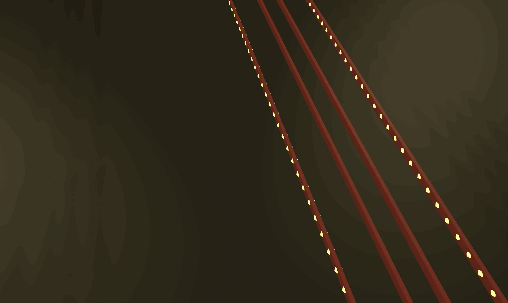

그런데 위 이미지를 보면 기둥 같은 것들도 다 mass에 영향을 받음.
그런데 Player는 떨어지지 않는다. 왜? this.mesh는 일반 boxGeometry, this.modelMesh는 cannonBody에 따라가도록 설정되어있지 않기 때문이다. 따라서 아래 설정을 추가한다.

`src/main.js`

```jsx
// Renderer, scene, Camera, Light, Controls, CANNON..

// ..
function draw() {
  // ..
  cm1.world.step(1 / 60, delta, 3);
  objects.forEach((item) => {
    if (item.cannonBody) {
      item.mesh.position.copy(item.cannonBody.position);
      item.mesh.quaternion.copy(item.cannonBody.quaternion);

      // 추가
      if (item.modelMesh) {
        item.modelMesh.position.copy(item.cannonBody.position); // modelMesh 위치를 cannonBody의 위치와 동기화
        item.modelMesh.quaternion.copy(item.cannonBody.quaternion); // modelMesh 회전값을 cannonBody의 회전값과 동기화
      }
    }
  });

  // ..
}
```

위와 같이 설정 후 다시 화면을 확인해보면 player도 중력의 영향을 받는 것을 확인해볼 수 있다.

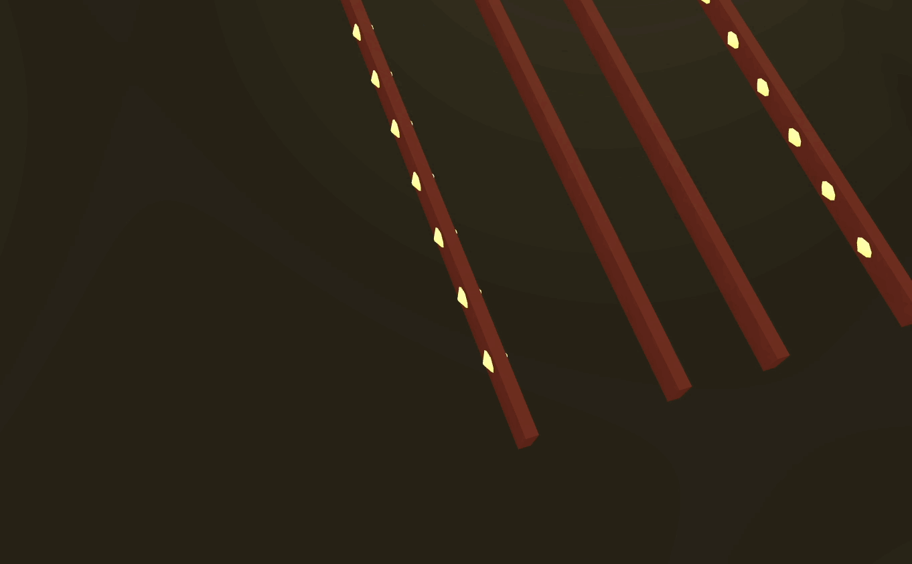

그런데, player가 다시 뒤돌아있음. 아래의 설정을 추가해줘야한다.

`src/Stuff.js`

```jsx
import { Body, Box, Vec3 } from "cannon-es";
// ..

export class Stuff {
  constructor(info = {}) {
    // ..
    this.rotationY = info.rotationY || 0;

    //..
  }
  setCannonBody() {
    // ..
    // player 회전을 위한 Y축 회전 설정
    this.cannonBody.quaternion.setFromAxisAngle(new Vec3(0, 1, 0), this.rotationY);

    cm1.world.addBody(this.cannonBody);
  }
}
```

player 생성시 회전값 설정을 rotationY로 줬기 때문에 위와 같이 값을 줬다.

다음으로, Glass, Player를 제외한 Bar, Floor 등은 고정되어야 하므로 기본값은 `mass: 0`으로 설정을 돌려준 뒤 Glass에 중력 설정을 별도로 해본다.

`src/main.js`

```jsx
// Renderer, scene, Camera, Light, Controls, CANNON..

// 플레이어
const player = new Player({
  name: "player",
  x: 0,
  y: 10.9,
  z: 13,
  rotationY: Math.PI,
  cannonMaterial: cm1.playerMaterial,
  mass: 30 // mass 설정
});
objects.push(player);

// ..

function draw() {
  // ..
  cm1.world.step(1 / 60, delta, 3);
  objects.forEach((item) => {
    if (item.cannonBody) {
      item.mesh.position.copy(item.cannonBody.position);
      item.mesh.quaternion.copy(item.cannonBody.quaternion);

      // 추가
      if (item.modelMesh) {
        item.modelMesh.position.copy(item.cannonBody.position);
        item.modelMesh.quaternion.copy(item.cannonBody.quaternion);

        if (item.name === "player") {
          item.modelMesh.position.y += 0.2; // 파뭍힌 다리를 위로 올려주는 설정 추가
        }
      }
    }
  });

  // ..
}
```

중력 30으로 player의 물리엔진을 설정함

### 스텝(단계) 설정

이제 앞전에 작업하던 checkClickedObject 액션을 작업해보자. 원하는 유리판을 클릭하면 해당 유리판으로 이동해야 한다. 여기서 이동은 x, y, z 좌표가 모두 이동하는 것을 의미한다. 타겟 위치는 유리판 위만 해당함

이를 스텝 즉, 단계로 설정해보면 어떨까? 이동 시, x, y 좌표는 큰 변화가 있지 아니할 것으로 보이나, z는 유리판의 스텝과 같으므로 생각할 부분이 많다. 따라서 glass의 z 좌표를 따로 저장해놓으면 이동 위치를 쉽게 체크할 수 있을 것으로 보이므로 아래와 같이 glassZ 값을 추가한다.

`src/main.js`

```jsx
// Renderer, scene, Camera, Light, Controls, CANNON..

// 유리판
let glassTypeNumber = 0;
let glassTypes = [];
const glassZ = []; // 10.8 ~ -10.8
for (leti = 0; i < numberOfGlass; i++) {
  glassZ.push(-(i * glassUnitSize * 2 - glassUnitSize * 9)); // Z 위치를 저장
}
for (let i = 0; i < numberOfGlass; i++) {
  glassTypeNumber = Math.round(Math.random());
  switch (glassTypeNumber) {
    case 0:
      glassTypes = ["normal", "strong"];
      break;
    case 1:
      glassTypes = ["strong", "normal"];
      break;
  }

  const glass1 = new Glass({
    step: i + 1, // 현 step 체크를 위한 값 추가
    name: `glass-${glassTypes[0]}`,
    x: -1,
    y: 10.3,
    z: glassZ[i], // glassZ 값으로 적용
    type: glassTypes[0],
    cannonMaterial: cm1.glassMaterial
  });
  const glass2 = new Glass({
    step: i + 1,
    name: `glass-${glassTypes[1]}`,
    x: 1,
    y: 10.3,
    z: glassZ[i], // glassZ 값으로 적용
    type: glassTypes[1],
    cannonMaterial: cm1.glassMaterial
  });

  objects.push(glass1, glass2);
}

// ..
```

위처럼 glassZ 값을 별도로 관리하도록 수정하였는데, 10.8 ~ -10.8까지의 값이 담긴다. 또한 Glass 객체 생성 시 현 step 정보도 추가로 넣어주었다.

`src/Glass.js`

```jsx
// ..
export class Glass extends Stuff {
  constructor(info) {
    super(info);

    this.type = info.type;
    this.step = info.step; // 추가

    // ..
    this.mesh.name = this.name;
    this.mesh.step = this.step; // 추가
    cm1.scene.add(this.mesh);

    this.setCannonBody();
  }
}
```

다음으로 checkClicedObject에서 사용할 step 변수를 cm2 에 추가한다.

`src/common.js`

```jsx
export const cm2 = {
  //..
  step: 0 // 추가
};
```

`src/main.js`

```jsx
// Renderer, scene, Camera, Light, Controls, CANNON..

function checkIntersects() {
  raycaster.setFromCamera(mouse, camera);

  const intersects = raycaster.intersectObjects(cm1.scene.children, true);
  for (const item of intersects) {
    checkClickedObject(item.object);
    break; // 처음 맞는 mesh만 처리
  }
}

function checkClickedObject(mesh) {
  if (mesh.name.indexOf("glass") >= 0) {
    // 유리판을 클릭했을 때
    if (mesh.step - 1 === cm2.step) cm2.step++;
  }
}

// ..
```

### 점프 동작 구현

이제 step을 가져왔으니 step에 맞는 위치로 이동을 시켜본다! gsap 설치한다.

```
> npm i gsap
```

`src/main.js`

```jsx
import gsap from "gsap";

// Renderer, scene, Camera, Light, Controls, CANNON..
// ..

function checkClickedObject(mesh) {
  if (mesh.name.indexOf("glass") >= 0) {
    // 유리판을 클릭했을 때
    if (mesh.step - 1 === cm2.step) {
      cm2.step++;
      gsap.to(player.cannonBody.position, { duration: 1, z: glassZ[cm2.step - 1], x: mesh.position.x });
      gsap.to(player.cannonBody.position, { duration: 0.4, y: 12 });
    }
  }
}

// ..
```

위와 같이 gsap 애니메이션을 2개 만들어주었다. y축 즉, 위로 점프하는 애니메이션은 duration이 짧게 진행되어야 하기 때문임. z축 이동은 glassZ를 사용해 구현.

위와 같이 하면 실제 스텝으로 이동까지는 완성된다. 떨어지는 애니메이션은 어떻게 하면 좋을까?
Glass 컴포넌트에서 유리판의 mass 값을 수정해주면 된다.

`src/Glass.js`

```jsx
import { Mesh } from "three";
import { Stuff } from "./Stuff";
import { cm1, geo, mat } from "./common";

export class Glass extends Stuff {
  constructor(info) {
    super(info);

    this.type = info.type;
    this.step = info.step;

    this.geometry = geo.glass;
    switch (this.type) {
      case "normal":
        this.material = mat.glass1;
        this.mass = 1; // normal이면 깨지도록
        break;
      case "strong":
        this.material = mat.glass2;
        this.mass = 1000; // strong이면 안깨지도록
        break;
    }

    this.width = this.geometry.parameters.width;
    this.height = this.geometry.parameters.height;
    this.depth = this.geometry.parameters.depth;

    this.mesh = new Mesh(this.geometry, this.material);
    this.mesh.position.set(this.x, this.y, this.z);
    this.mesh.castShadow = true;
    this.mesh.receiveShadow = true;
    this.mesh.name = this.name;
    this.mesh.step = this.step;
    this.mesh.type = this.type; // 어떤 타입의 glass를 클릭했는지 알기 위해 mesh.type값 추가
    cm1.scene.add(this.mesh);

    this.setCannonBody();
  }
}
```

위와 같이 switch 문에 type별로 유리판 중량을 달리하면 아래로 떨어지는 애니메이션이 완성된다.

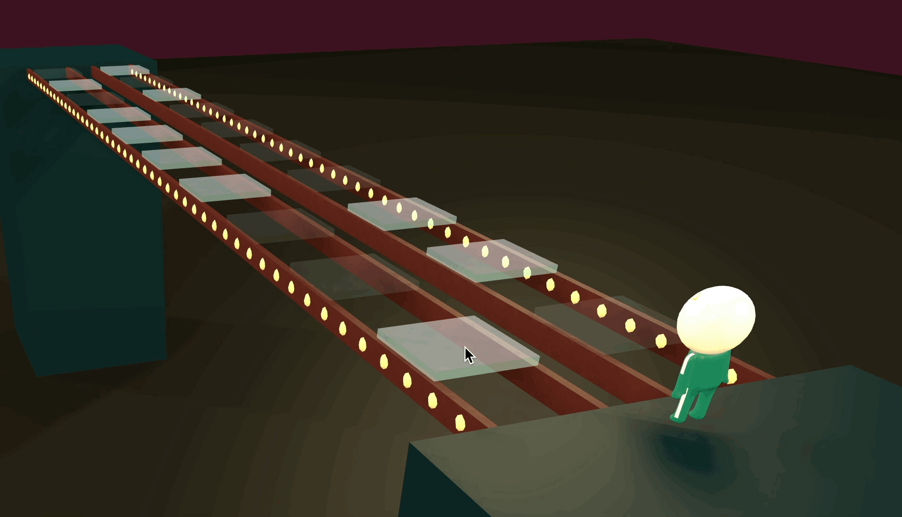

### 동작 조건 제어

추가적인 동작 제어를 해보자. 마구잡이 식으로 클릭을 할 경우 넘어지는 경우가 생김.
먼저 안넘어지게 아래와 같이 수정한다. 넘어진다는 건 cannonBody.quaternion이 복제가 되기 때문이다. 따라서 위에 있을 때에는 quaternion 변동을 주지 않고, 떨어졌을 때에만 즉, 실패했을 때만 변동을 주도록 한다.

`src/main.js`

```jsx
// Renderer, scene, Camera, Light, Controls, CANNON..

let fail = false; // fail 변수 추가

function checkClickedObject(mesh) {
  if (mesh.name.indexOf("glass") >= 0) {
    if (mesh.step - 1 === cm2.step) {
      cm2.step++;
      switch (mesh.type) {
        case "normal":
          // normal을 클릭한 경우 fail이 true이 상태
          setTimeout(() => (fail = true), 700);
          break;
        case "strong":
          break;
      }
      // ..
    }
  }
}

// ..
function draw() {
  //..

  objects.forEach((item) => {
    if (item.cannonBody) {
      if (item.name === "player") {
        item.mesh.position.copy(item.cannonBody.position);
        // player가 fail 했을 때에만 mesh.quaternion을 copy하도록 처리
        if (fail) item.mesh.quaternion.copy(item.cannonBody.quaternion);

        if (item.modelMesh) {
          item.modelMesh.position.copy(item.cannonBody.position);
          // player가 fail 했을 때에만 mesh.quaternion을 copy하도록 처리
          if (fail) item.modelMesh.quaternion.copy(item.cannonBody.quaternion);
        }
        item.modelMesh.position.y += 0.15;
      } else {
        item.mesh.position.copy(item.cannonBody.position);
        item.mesh.quaternion.copy(item.cannonBody.quaternion);

        if (item.modelMesh) {
          item.modelMesh.position.copy(item.cannonBody.position);
          item.modelMesh.quaternion.copy(item.cannonBody.quaternion);
        }
      }
    }
  });

  // ..
}
```

위와 같이 player의 동작이 fail일 때만 quaternion이 동작하도록 수행하면 떨어질 때만 휘리릭 회전함

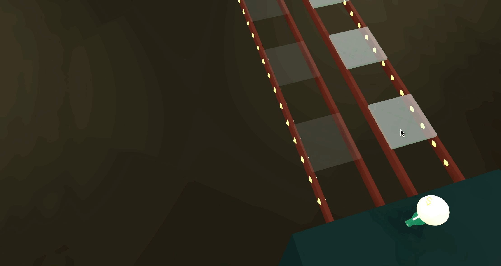

그 다음으로는 점프 동작이 끝났을 때 다음 점프가 실행되도록 코드를 추가해준다.

`src/main.js`

```jsx
// Renderer, scene, Camera, Light, Controls, CANNON..

let fail = false;
let jumping = false;

function checkClickedObject(mesh) {
  if (mesh.name.indexOf("glass") >= 0) {
    // 점프 중이면 클릭이벤트를 막는다.
    if (jumping) return;

    if (mesh.step - 1 === cm2.step) {
      jumping = true; // jumping 중으로 표현
      cm2.step++;
      switch (mesh.type) {
        case "normal":
          setTimeout(() => (fail = true), 700);
          break;
        case "strong":
          break;
      }
      // 1초 후 jumping 변수를 종료상태로 변경
      setTimeout(() => (jumping = false), 1000);
      // ..
    }
  }
}
```

위와 같이 하면 점프는 1초 이후에 실행되도록 바뀜.
그리고 떨어진 이후 다음 스텝으로 이동하는 현상이 발생(부활같이..) 이를 아래와 같이 개선해준다.

`src/main.js`

```jsx
// Renderer, scene, Camera, Light, Controls, CANNON..

let fail = false;
let jumping = false;

function checkClickedObject(mesh) {
  if (mesh.name.indexOf("glass") >= 0) {
    // 점프 중이거나 실패 상태면 클릭 중단
    if (jumping || fail) return;
    // ..
  }
}
```

점프중이거나 실패상태면 클릭이벤트를 return 해버린다.

### glb 애니메이션

점프하는 순간에는 점프 애니메이션, 추락 시에는 추락 애니메이션을 구현하도록 코드를 추가해본다.

`src/main.js`

```jsx
// Renderer, scene, Camera, Light, Controls, CANNON..

let fail = false;
let jumping = false;

function checkClickedObject(mesh) {
  if (mesh.name.indexOf("glass") >= 0) {
    if (jumping || fail) return;

    if (mesh.step - 1 === cm2.step) {
      // 점프 동작 실행(1회 이상 사용하므로 stop(reset) 후 play)
      player.actions[2].stop();
      player.actions[2].play();

      jumping = true;
      cm2.step++;
      switch (mesh.type) {
        case "normal":
          setTimeout(() => {
            fail = true;
            player.actions[0].stop(); // 기존 동작 중지
            player.actions[1].play(); // 파닥파닥 동작 실행
          }, 700);
          break;
        case "strong":
          // console.log("strong");
          break;
      }
      setTimeout(() => (jumping = false), 1000);
      gsap.to(player.cannonBody.position, { duration: 1, z: glassZ[cm2.step - 1], x: mesh.position.x });
      gsap.to(player.cannonBody.position, { duration: 0.4, y: 12 });
    }
  }
}
```

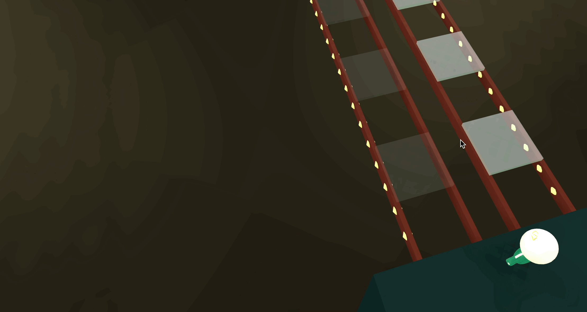

### 실패 시 조명 끄기

다음으로 실패 시 조명을 꺼주겠다. SideLight 클래스를 조금 수정해본다.

`src/common.js`

```jsx
export const cm2 = {
  backgroundColor: "#3e1322",
  lightColor: "#ffe9ac",
  lightOffColor: "#222222" // 추가
  // ..
};
```

`src/SideLight.js`

```jsx
export class SideLight {
  //..

  // 추가
  turnOff() {
    this.mesh.material.color.set(cm2.lightOffColor);
  }
}
```

`src/main.js`

```jsx
// Renderer, scene, Camera, Light, Controls, CANNON..

// 사이드 라이트
const sideLights = []; // 일괄적 관리를 위해 추가

for (let i = 0; i < 49; i++) {
  // sideLights 배열에 추가
  sideLights.push(new SideLight({ name: "sideLight", container: bar1.mesh, z: i * 0.5 - glassUnitSize * 10 }));
}
for (let i = 0; i < 49; i++) {
  // sideLights 배열에 추가
  sideLights.push(new SideLight({ name: "sideLight", container: bar4.mesh, z: i * 0.5 - glassUnitSize * 10 }));
}

// ..
function checkClickedObject(mesh) {
  if (mesh.name.indexOf("glass") >= 0) {
    if (jumping || fail) return;
    if (mesh.step - 1 === cm2.step) {
      // ..

      switch (mesh.type) {
        case "normal":
          setTimeout(() => {
            fail = true;
            player.actions[0].stop();
            player.actions[1].play();

            // 실패 시 sideLights 불 Off
            sideLights.forEach((light) => light.turnOff());
          }, 700);
          break;
        case "strong":
          break;
      }
      // ..
    }
  }
}
```

fail 일 때 sideLight 정상 off되는 것 확인 완료!

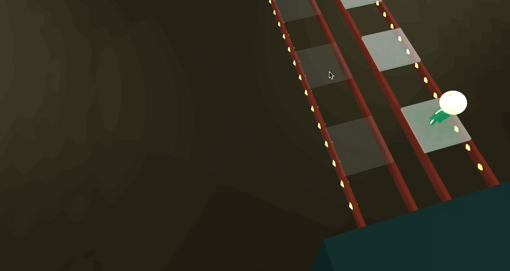
