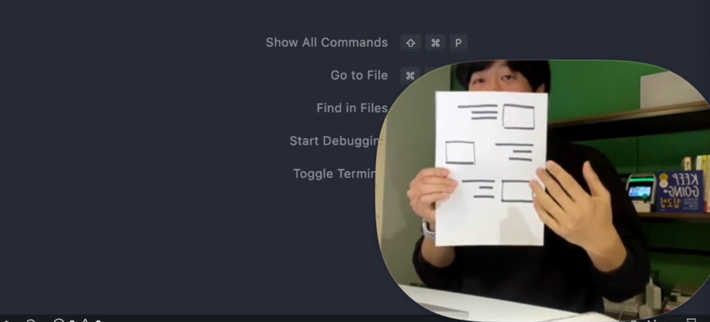
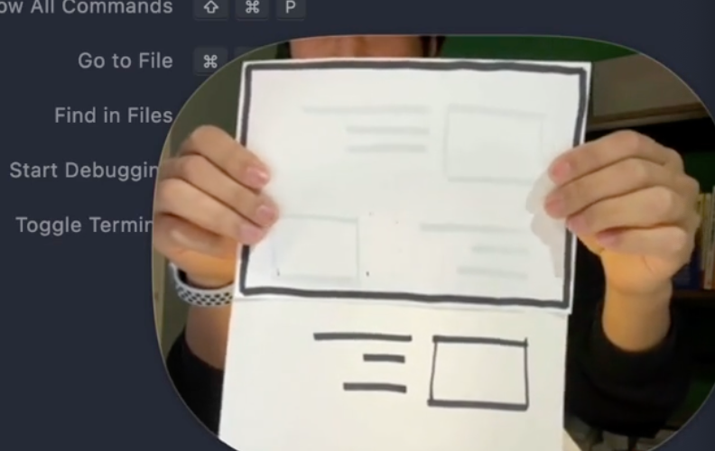
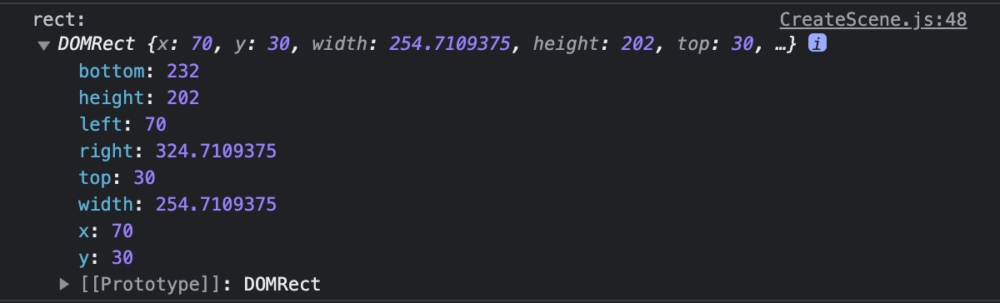
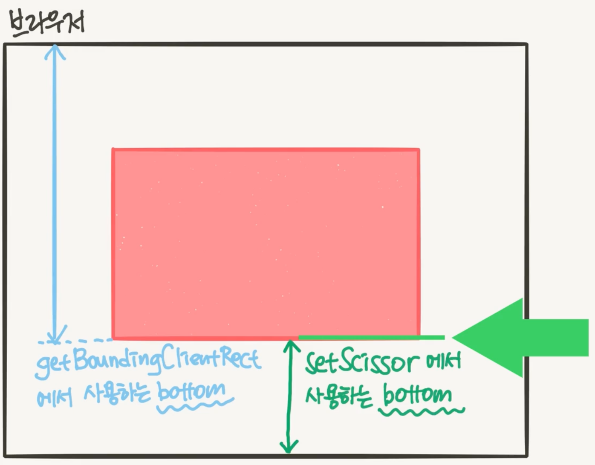
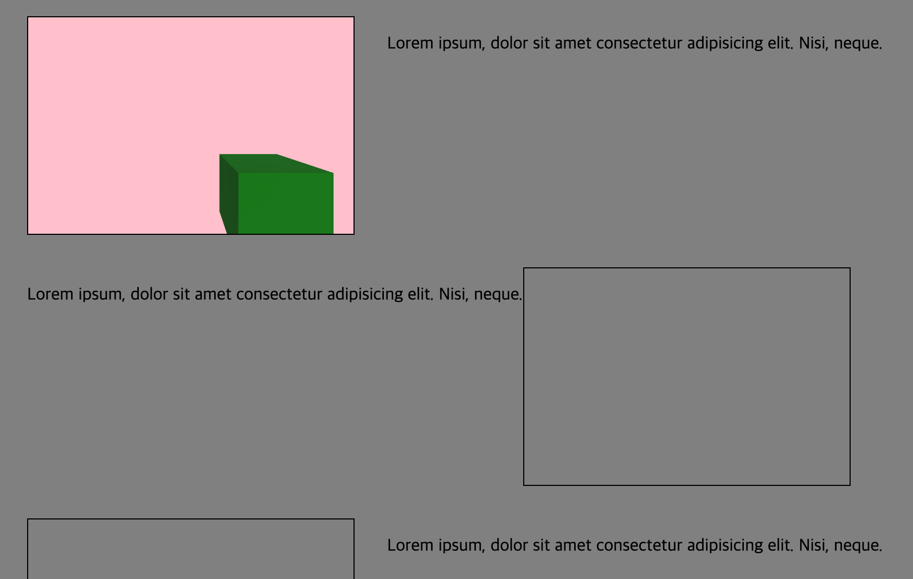
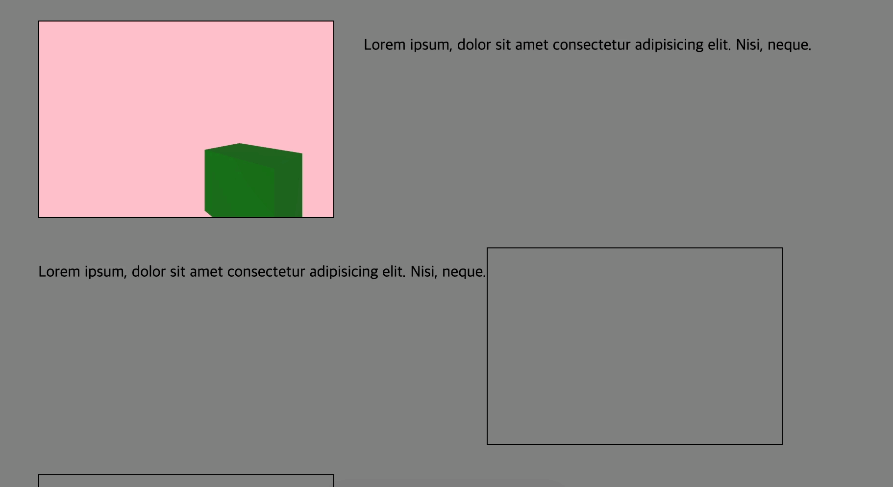
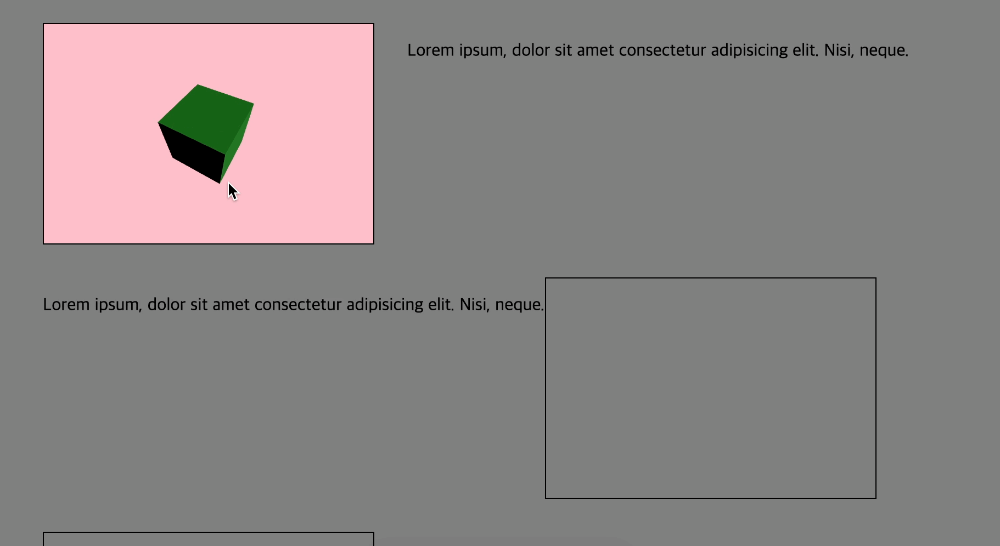
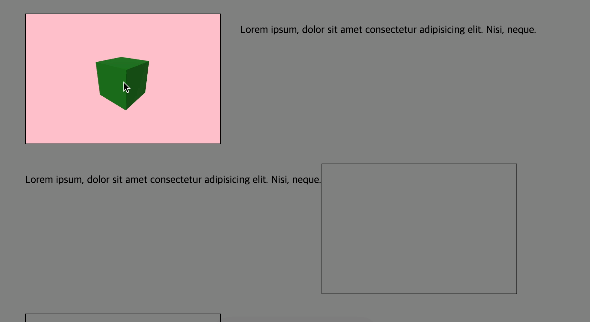
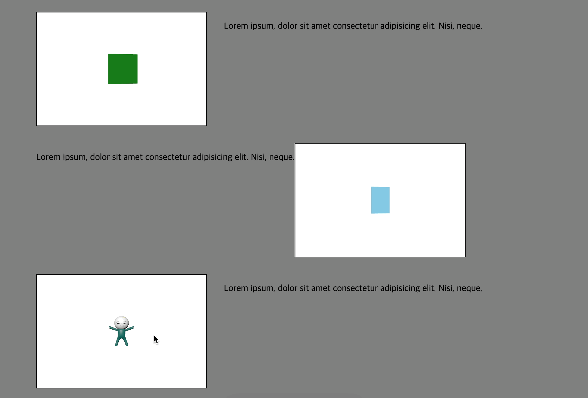
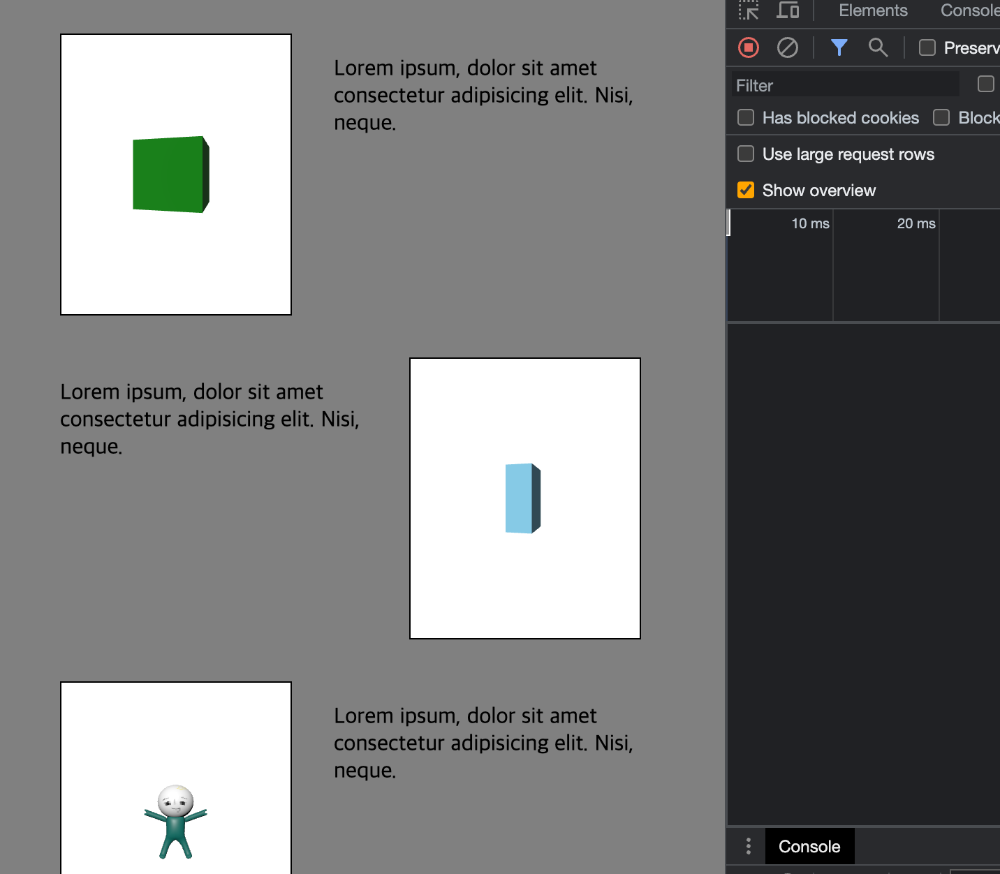

## 여러 개의 Scene 동시에 사용하기

### 다중 장면, 다중 캔버스 만들기



여러 개의 캔버스가 위와 같은 사각형 내에 각각 들어간다고 상상해보자 어떻게 만들 수 있을까?
언뜻 보기에는 3개의 canvas 위에 three.js를 입히면 되지않을까? 싶지만 각 캔버스마다 자원을 공유할 수 없어서 3개의 별도 three.js가 굴러가게 된다. 즉 엄청 무거워진다. 비효율적.. 따라서 여러 개를 사용하면서 효율적인 방법을 찾아야 한다.

한 판에 여러 개의 Three.js 즉, 여러 개의 Scene을 넣어보자. ([다중 캔버스, 다중 장면 만들기](https://threejs.org/manual/#en/multiple-scenes) 참고)
우리가 사용할 방법은 html 엘리먼트로 위치와 크기를 잡아 놓은 뒤 하나의 canvas에 해당하는 위치와 크기를 이용해 영역을 지정해서 해당하는 영역만 렌더링 시켜주는 방법이다. 각각의 조명과 mesh들을 가지고 있겠지만, 하나의 renderer를 사용할 수 있게 되고, 자원을 공유할 수 있게되어서 효율적이라고 할 수 있음



multicanvas 프로젝트 환경 세팅을 마친 뒤 초기 코드는 아래와 같다.

`multicanvas/src/index.html`

```html
<!DOCTYPE html>
<html lang="en">
  <head>
    <meta charset="UTF-8" />
    <meta http-equiv="X-UA-Compatible" content="IE=edge" />
    <meta name="viewport" content="width=device-width, initial-scale=1.0" />
    <title>three.js</title>
    <link rel="stylesheet" href="./main.css" />
  </head>
  <body>
    <canvas id="three-canvas"></canvas>
    <ul class="view-list">
      <li class="view-item">
        <div class="canvas-placeholder a"></div>
        <p>Lorem ipsum, dolor sit amet consectetur adipisicing elit. Nisi, neque.</p>
      </li>
      <li class="view-item">
        <div class="canvas-placeholder b"></div>
        <p>Lorem ipsum, dolor sit amet consectetur adipisicing elit. Nisi, neque.</p>
      </li>
      <li class="view-item">
        <div class="canvas-placeholder c"></div>
        <p>Lorem ipsum, dolor sit amet consectetur adipisicing elit. Nisi, neque.</p>
      </li>
    </ul>
  </body>
</html>
```

`multicanvas/src/main.js`

```jsx
import * as THREE from "three";

// ----- 주제: 여러개의 캔버스 사용하기

// Renderer
const canvas = document.querySelector("#three-canvas");
const renderer = new THREE.WebGLRenderer({
  canvas,
  antialias: true
});
renderer.setSize(window.innerWidth, window.innerHeight);
renderer.setPixelRatio(window.devicePixelRatio > 1 ? 2 : 1);

// 그리기
const clock = new THREE.Clock();

function draw() {
  const delta = clock.getDelta();

  renderer.render(scene, camera);
  renderer.setAnimationLoop(draw);
}

function setSize() {
  camera.aspect = window.innerWidth / window.innerHeight;
  camera.updateProjectionMatrix();
  renderer.setSize(window.innerWidth, window.innerHeight);
  renderer.render(scene, camera);
}

// 이벤트
window.addEventListener("resize", setSize);

draw();
```

위 코드는 scene, light, mesh 등이 설정되어있지 않은 상태이다.
우선 위 이미지의 배치를 위해 css 부터 추가해보고자 한다.

`src/main.css`

```css
body {
  margin: 0;
}

li {
  list-style: none;
}

#three-canvas {
  position: absolute;
  left: 0;
  top: 0;
  z-index: -1; /* canvas는 html보다 뒤에 있어야 하므로 */
  background: gray; /* canvas 확인을 위해 색깔 추가 */
}

.view-item {
  display: flex;
  margin: 30px;
}

.view-item:nth-child(even) .canvas-placeholder {
  order: 2;
}

.canvas-placeholder {
  width: 300px;
  height: 200px;
  margin-right: 30px;
  border: 1px solid black;
}
```

이제 스크립트를 본격적으로 작성해본다. 위 main.js에서 renderer는 한개만 쓰지만 들어갈 박스마다 scene은 각각 생성할 것이다. 이를 공통 모듈로 만들어보고자 함

scene을 따로 만든다는 것은 각 scene마다 카메라도 각각 배치되어야 하므로 setSize 안에 존재하는 camera 설정도 삭제해준다. 즉, setSize 에는 `renderer.setSize(window.innerWidth, window.innerHeight)`만 존재하게됨. draw 함수의 camera 설정도 제거해준다.

`/src/main.js`

```jsx
// ..

function draw() {
  const delta = clock.getDelta();

  // renderer.render(scene, camera);
  renderer.setAnimationLoop(draw);
}

function setSize() {
  // camera.aspect = window.innerWidth / window.innerHeight;
  // camera.updateProjectionMatrix();
  renderer.setSize(window.innerWidth, window.innerHeight);
  // renderer.render(scene, camera);
}
```

이제 정말 각 scene을 CreateScene이라는 클래스 모듈로 구현해본다.
먼저 해당 클래스에 어떤 값이 들어가야할까 고민해보면 아래와 같다.

`src/main.js`

```jsx
import { CreateScene } from "./CreateScene";

// Renderer..
const scene1 = new CreateScene({
  renderer,
  bgColor: "pink",
  placeholder: ".canvas-placeholder.a"
});

// ...
```

위와 같이 renderer는 기본적으로 포함, scene과 camera 생성에 필요한 최소한의 것을 넣었다.
placeholder를 넣은 것은 camera 설정 시 해당 엘리먼트에 대한 width, height 값을 가져오기 위해 엘리먼트의 클래스 값을 직접 주입함..

`src/CreateScene.js`

```jsx
import { Color, PerspectiveCamera, Scene } from "three";

export class CreateScene {
  constructor(info) {
    this.renderer = info.renderer;
    this.el = document.querySelector(info.placeholder);
    const rect = this.el.getBoundingClientRect(); // DOMRect {x: 8, y: 8, width: 784, …}

    const bgColor = info.bgColor || "white";
    const fov = info.fov || 75; // field of view
    const aspect = rect.width / rect.height;
    const near = info.near || 0.1;
    const far = info.far || 100;
    const cameraPosition = info.cameraPosition || { x: 0, y: 0, z: 3 };

    // Scene
    this.scene = new Scene();
    this.scene.background = new Color(bgColor);

    // Camera
    this.camera = new PerspectiveCamera(fov, aspect, near, far);
    this.camera.position.set(cameraPosition.x, cameraPosition.y, cameraPosition.z);

    this.scene.add(this.camera);
  }
}
```

위 기본 내용을 통해 CreateScene에서 Scene과 Camera를 직접 생성해보았다.
위에서 참고할 사항은 element를 placeholder 값으로 가져와서 getBoundingClientRect 메서드로 필요한 데이터를 가져다 쓰는 부분과, camera 설정 시 fov, aspect, near, far 설정하는 부분에 주목한다.



scene에서 돌아갈 mesh와 조명 설정을 해보자. mesh와 조명은 각 씬마다 달라질 것이므로 CreateScene과 같은 공통적인 코드가 들어가는 곳에는 안넣는게 좋을 것 같다. 일단 설정을 위한 set 메서드 정의는 CreateScene에서 함

`src/CreateScene.js`

```jsx
export class CreateScene {
  constructor(info) {
    //..
  }

  set(func) {
    func();
  }

  //..
}
```

`src/main.js`

```jsx
// ..

const scene1 = new CreateScene({
  renderer,
  bgColor: "pink",
  placeholder: ".canvas-placeholder.a",
  cameraPosition: {
    x: -1,
    y: 1,
    z: 2
  }
});

// light, mesh 설정
scene1.set(() => {
  // 조명
  const light = new THREE.DirectionalLight("white", 1);
  light.position.set(-1, 2, 3);
  scene1.scene.add(light);

  // Mesh
  const geometry = new THREE.BoxGeometry(1, 1, 1);
  const material = new THREE.MeshStandardMaterial({ color: "green" });
  const cube = new THREE.Mesh(geometry, material);
  scene1.scene.add(cube);
});

// ..
```

위와 같이 set 메서드 안에서 light, mesh에 대한 설정을 해준다. 하지만 아직 화면으로 확인이 안됨.
Renderer를 구현해주지 않았기 때문! 따라서 render 메서드도 마저 CreateScene에서 구현해준다.

`src/CreateScene.js`

```jsx
export class CreateScene {
  // ..

  render() {
    const renderer = this.renderer;
    const rect = this.el.getBoundingClientRect();

    // 영역이 화면에 포함되지 않은 경우 함수 종료
    const isOffScreen =
      rect.top > renderer.domElement.clientHeight || rect.bottom < 0 || rect.left > renderer.domElement.clientWidth || rect.right < 0;
    if (isOffScreen) return;

    // setScissor: true로 설정하면, 캔버스의 영역을 벗어나는 부분은 그리지 않는다.
    const canvasBottom = renderer.domElement.clientHeight - rect.bottom;
    renderer.setScissor(rect.left, canvasBottom, rect.width, rect.height);
    renderer.setViewport(rect.left, canvasBottom, rect.width, rect.height);
    renderer.setScissorTest(true);

    renderer.render(this.scene, this.camera);
  }
}
```

render함수는 draw 내에서 계속 돌아가기 때문에 위치가 스크롤에 따라 항상 변하므로 rect 변수를 안에서 새로 가져와서 쓴다. 또한 영역에 박스가 100개쯤 된다고 했을 때 한번에 모두 렌더링하는 것이 매우 큰 부하이므로.. 스크롤 즉, 화면 내에 보이는 영역만 렌더링을 하도록 처리해주는 코드를 위처럼 넣었다. (isOffScreen 참고) setScissor라는 메서드로 원하는 영역에만 노출하도록 설정함

setScissor의 bottom값은 아래와 같은 특징을 가지므로 별도의 canvasBottom이라는 값으로 계산해주었다.



위와 같이 모두 설정 후 해당 값을 main.js의 draw 내에서 실행해본다.

`src/main.js`

```jsx
// ..

// 그리기
const clock = new THREE.Clock();

function draw() {
  const delta = clock.getDelta();

  scene1.render(); // render 메서드 실행
  renderer.setAnimationLoop(draw);
}
```

그러면 짜잔 화면 리사이즈에도 모두 반응하는 첫번째 박스 렌더링이 잘 구현되는 것을 확인해볼 수 있음



이제 내부에서 저 cube를 회전 시켜보자. 이를 조작하기 위해서는 draw 함수 내에서 각 mesh 들을 조작할 수 있도록 CreateScene에서 별도 정의를 추가해야 한다.

`src/CreateScene.js`

```jsx
export class CreateScene {
  constructor(info) {
    // ..

    this.scene.add(this.camera);
    this.meshes = []; // mesh들을 담아놓을 배열공간 추가
  }

  // ..
}
```

`src/main.js`

```jsx
//..
scene1.set(() => {
  //..
  const geometry = new THREE.BoxGeometry(1, 1, 1);
  const material = new THREE.MeshStandardMaterial({ color: "green" });
  const cube = new THREE.Mesh(geometry, material);

  scene1.meshes.push(cube); // scene1의 meshes 배열에 추가
  scene1.meshes.forEach((mesh) => scene1.scene.add(mesh)); // 각 meshes를 순회하며 scene.add
});

// 그리기
const clock = new THREE.Clock();
function draw() {
  const delta = clock.getDelta();

  // scene1.meshes를 돌면서 rotation 값을 수정해주면 회전함
  scene1.meshes.forEach((mesh) => {
    mesh.rotation.y += delta;
  });

  scene1.render();
  renderer.setAnimationLoop(draw);
}

// ..
```

위와 같이 this.meshes라는 배열을 추가하여 회전을 구현할 수 있다.



그러면 위 상태에서 OrbitControl도 구현해본다.

`src/main.js`

```jsx
import { OrbitControls } from "three/examples/jsm/controls/OrbitControls";

//..
scene1.set(() => {
  //..

  // Controls
  scene1.controls = new OrbitControls(scene1.camera, scene1.el);
});
```



위와 같이 scene1에서 controls를 추가 속성으로 붙여주면 마우스로 핸들링도 가능해진다. 크..

그런데 큐브에 빛이 카메라 위치를 안따라와서 빛이 비추지 않는 부분은 어둡게 노출됨.. 이걸 고쳐본다.
light를 scene에 붙어있던 것을 camera에 대입하면 된다.

`src/main.js`

```jsx
import { OrbitControls } from "three/examples/jsm/controls/OrbitControls";

//..
scene1.set(() => {
  // 조명
  const light = new THREE.DirectionalLight("white", 1);
  light.position.set(-1, 2, 3);
  // scene1.scene.add(light);
  scene1.camera.add(light);

  // ..
});
```

`scene1.scene` → `scene1.camera`



잘 고쳐졌다. scene2도 비슷한 느낌으로 하나 더 추가해본 뒤, scene3에서는 glb 파일을 로드해서 사용한다.
`model/glb` 파일 import 후 webpack 설정 추가한다.

`multicanvas/webpack.config.js`

```jsx
// ..

module.exports = {
  //..
    new CopyWebpackPlugin({
      patterns: [
        { from: "./src/main.css", to: "./main.css" },
        { from: "./src/models", to: "./models" } // 추가
      ]
    })
  ]
};
```

`src/main.js`

```jsx
import { GLTFLoader } from "three/examples/jsm/loaders/GLTFLoader.js";

//..
const scene2 = new CreateScene({
  renderer,
  placeholder: ".canvas-placeholder.b"
});
scene2.set(() => {
  // 조명
  const light = new THREE.DirectionalLight("white", 1);
  light.position.set(-1, 2, 3);
  scene2.camera.add(light);

  scene2.controls = new OrbitControls(scene2.camera, scene2.el);

  // Mesh
  const geometry = new THREE.BoxGeometry(0.4, 1, 0.7);
  const material = new THREE.MeshStandardMaterial({ color: "skyblue" });
  const cube = new THREE.Mesh(geometry, material);

  scene2.meshes.push(cube);
  scene2.meshes.forEach((mesh) => scene2.scene.add(mesh));
});

// gltf 파일 로드
const gltfLoader = new GLTFLoader();

const scene3 = new CreateScene({
  renderer,
  placeholder: ".canvas-placeholder.c"
});
scene3.set(() => {
  // 조명
  const light = new THREE.DirectionalLight("white", 1);
  light.position.set(-1, 2, 3);
  scene3.camera.add(light);

  scene3.controls = new OrbitControls(scene3.camera, scene3.el);

  // glb 파일 로드
  gltfLoader.load("./models/ilbuni.glb", (gltf) => {
    const mesh = gltf.scene.children[0];
    scene3.meshes.push(mesh);
    scene3.scene.add(mesh);
  });
});

// 그리기
const clock = new THREE.Clock();

function draw() {
  // ..
  scene2.meshes.forEach((mesh) => {
    mesh.rotation.y += delta;
  });

  scene1.render();
  scene2.render();
  scene3.render();
}
```



이렇게 한 판 안에서 여러 개의 scene을 독립적으로 구현하는 작업이 완료되었다!
그런데 화면 해상도의 가로가 줄어들면 사물의 비율이 깨져보인다.. 이를 CreateScene의 render 시 카메라의 aspect를 수정 후 `updateProjectionMatrix`되도록 처리하여 개선할 수 있다.

`src/CreateScene.js`

```jsx
import { Color, PerspectiveCamera, Scene } from "three";

export class CreateScene {
  // ..

  render() {
    // ..

    // 카메라 비율 조정해준다.
    this.camera.aspect = rect.width / rect.height;
    this.camera.updateProjectionMatrix();

    // ..
    renderer.render(this.scene, this.camera);
  }
}
```

가로가 작아도 render 실행 시 해당 비율을 새롭게 업데이트 하므로 문제 없음


