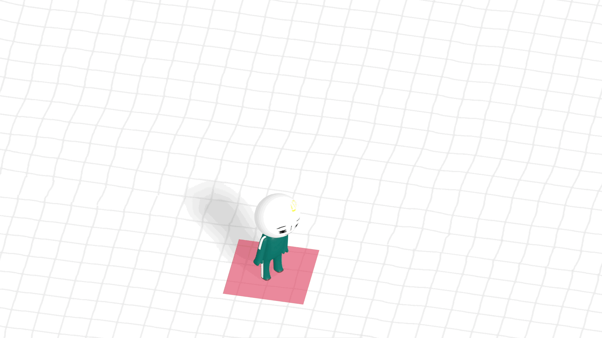

## 3D 공간에서 캐릭터 움직이기

[춘식이 관찰일기 사이트](https://choonsikdiary.com/)처럼 캐릭터를 움직여본다.



위와 같이 원하는 위치로 이동 시 이벤트가 발생하도록 구현한다. 구현한 기능을 설명하는 것 위주로 작업해봄.

`ilbunidiary/src/main.js`

```jsx
import * as THREE from 'three';

// Texture
const textureLoader = new THREE.TextureLoader();
const floorTexture = textureLoader.load('/images/grid.png');
floorTexture.wrapS = THREE.RepeatWrapping;
floorTexture.wrapT = THREE.RepeatWrapping;
floorTexture.repeat.x = 10;
floorTexture.repeat.y = 10;
```

먼저 텍스쳐 설정을 해본다. 밑 바닥 grid를 설정한 것임. repeat 메서드를 사용해서 반복 정도를 조절할 수 있음

```jsx
// ..

// Renderer
const canvas = document.querySelector('#three-canvas');
const renderer = new THREE.WebGLRenderer({
  canvas,
  antialias: true
});
renderer.setSize(window.innerWidth, window.innerHeight);
renderer.setPixelRatio(window.devicePixelRatio > 1 ? 2 : 1);
renderer.shadowMap.enabled = true;
renderer.shadowMap.type = THREE.PCFSoftShadowMap;
```

Renderer에서는 기본 Renderer 설정 후 shadowMap.type을 PCFSoftShadowMap을 사용해 부드러운 그림자를 표현하도록 설정해주었음

```jsx
// ..
// Scene
const scene = new THREE.Scene();

// Camera - 직교 카메라 사용, 객체가 어디있던 동일한 크기로 보여준다. (2D와 비슷함)
const camera = new THREE.OrthographicCamera(
  -(window.innerWidth / window.innerHeight), // left
  window.innerWidth / window.innerHeight, // right,
  1, // top
  -1, // bottom
  -1000, // near
  1000 // far
);

const cameraPosition = new THREE.Vector3(1, 5, 5);
camera.position.set(cameraPosition.x, cameraPosition.y, cameraPosition.z);
camera.zoom = 0.2;
camera.updateProjectionMatrix();
scene.add(camera);

// Light
const ambientLight = new THREE.AmbientLight('white', 0.7);
scene.add(ambientLight);

const directionalLight = new THREE.DirectionalLight('white', 0.5);
const directionalLightOriginPosition = new THREE.Vector3(1, 1, 1);
directionalLight.position.x = directionalLightOriginPosition.x;
directionalLight.position.y = directionalLightOriginPosition.y;
directionalLight.position.z = directionalLightOriginPosition.z;
directionalLight.castShadow = true;

// mapSize 세팅으로 그림자 퀄리티 설정
directionalLight.shadow.mapSize.width = 2048;
directionalLight.shadow.mapSize.height = 2048;
// 그림자 범위
directionalLight.shadow.camera.left = -100;
directionalLight.shadow.camera.right = 100;
directionalLight.shadow.camera.top = 100;
directionalLight.shadow.camera.bottom = -100;
directionalLight.shadow.camera.near = -100;
directionalLight.shadow.camera.far = 100;
scene.add(directionalLight);
```

기본 Scene 추가 후 Camera는 OrthographicCamera를 사용함.
이는 직교 카메라로 객체가 어디있던 동일한 크기로 보여주는 특징을 가진다. 마우스 컨트롤에 따라 확대되지 않으므로 2D와 비슷하게 보여지게 해줌. 각 인자로 left, right, top, bottom, near, far 등의 정보를 추가해주었다.

다음은 Mesh Mesh는 floor와 pointer, spot Mesh로 구성된다. 셋 다 Plan Mesh임

```jsx
// Mesh
const meshes = [];
const floorMesh = new THREE.Mesh(
  new THREE.PlaneGeometry(100, 100),
  new THREE.MeshStandardMaterial({
    map: floorTexture
  })
);
floorMesh.name = 'floor';
floorMesh.rotation.x = -Math.PI / 2; // 바닥이어야 하므로 -90도
floorMesh.receiveShadow = true;
scene.add(floorMesh);
meshes.push(floorMesh);

const pointerMesh = new THREE.Mesh(
  new THREE.PlaneGeometry(1, 1),
  new THREE.MeshBasicMaterial({
    color: 'crimson',
    transparent: true,
    opacity: 0.5
  })
);
pointerMesh.rotation.x = -Math.PI / 2; // 바닥이어야 하므로 -90도
pointerMesh.position.y = 0.01;
pointerMesh.receiveShadow = true;
scene.add(pointerMesh);

const spotMesh = new THREE.Mesh(
  new THREE.PlaneGeometry(3, 3),
  new THREE.MeshStandardMaterial({
    color: 'yellow',
    transparent: true,
    opacity: 0.5
  })
);
spotMesh.position.set(5, 0.005, 5);
spotMesh.rotation.x = -Math.PI / 2; // 바닥이어야 하므로 -90도
spotMesh.receiveShadow = true;
scene.add(spotMesh);
```

다음으로는 캐릭터와 집은 gltf 로더로 로드해온 파일이다.

```jsx
const gltfLoader = new GLTFLoader();

const house = new House({
  gltfLoader,
  scene,
  modelSrc: '/models/house.glb',
  x: 5,
  y: -1.3,
  z: 2
});

const player = new Player({
  scene,
  meshes,
  gltfLoader,
  modelSrc: '/models/ilbuni.glb'
});
```

House 클래스는 아래와 같이 구현한다.

`src/House.js`

```jsx
export class House {
  constructor(info) {
    this.x = info.x;
    this.y = info.y;
    this.z = info.z;

    this.visible = false; // 처음엔 안보이게

    info.gltfLoader.load(info.modelSrc, (glb) => {
      this.modelMesh = glb.scene.children[0];
      this.modelMesh.castShadow = true;
      this.modelMesh.position.set(this.x, this.y, this.z);
      info.scene.add(this.modelMesh);
    });
  }
}
```

Player 클래스도 아래와 같이 구현함

```jsx
import { AnimationMixer } from 'three';

export class Player {
  constructor(info) {
    this.moving = false; // 걸어가는 상태 체크를 위해 생성

    info.gltfLoader.load(info.modelSrc, (glb) => {
      // 그림자 표현 traverse로 구현
      glb.scene.traverse((child) => {
        if (child.isMesh) {
          child.castShadow = true;
        }
      });

      this.modelMesh = glb.scene.children[0];
      this.modelMesh.position.y = 0.3;
      this.modelMesh.name = 'ilbuni';
      info.scene.add(this.modelMesh);
      info.meshes.push(this.modelMesh);

      this.actions = [];

      this.mixer = new AnimationMixer(this.modelMesh);
      this.actions[0] = this.mixer.clipAction(glb.animations[0]); // 일반 애니메이션
      this.actions[1] = this.mixer.clipAction(glb.animations[1]); // 걷기 애니메이션
      this.actions[0].play(); // 까딱까닥 움직임은 기본적으로 적용
    });
  }
}
```

다음으로 raycaster 코드를 추가한다. raycaster는 마우스 클릭 시 해당 좌표로 캐릭터가 이동시켜야하므로 필요함

```jsx
const raycaster = new THREE.Raycaster();
let mouse = new THREE.Vector2();
let destinationPoint = new THREE.Vector3();
let angle = 0;
let isPressed = false; // 마우스를 누르고 있는 상태
```

다음으로는 마우스 이벤트부터 확인하자

```jsx
// 마우스 좌표를 three.js에 맞게 변환
function calculateMousePosition(e) {
  mouse.x = (e.clientX / canvas.clientWidth) * 2 - 1;
  mouse.y = -((e.clientY / canvas.clientHeight) * 2 - 1);
}

// 마우스 이벤트
canvas.addEventListener('mousedown', (e) => {
  isPressed = true;
  calculateMousePosition(e); // 클릭한 지점 체크, e 객체 그대로 사용
});
canvas.addEventListener('mouseup', () => {
  isPressed = false;
});
canvas.addEventListener('mousemove', (e) => {
  // 드래그 상태
  if (isPressed) {
    calculateMousePosition(e); // 클릭한 지점 체크
  }
});
```

터치 이벤트도 위와 유사한데, 이는 모바일 기기에서도 동작를 위해 추가함

```jsx
// 터치 이벤트
canvas.addEventListener('touchstart', (e) => {
  isPressed = true;
  calculateMousePosition(e.touches[0]); // e.touches로 데이터 가져올 수 있다.
});
canvas.addEventListener('touchend', () => {
  isPressed = false;
});
canvas.addEventListener('touchmove', (e) => {
  if (isPressed) {
    calculateMousePosition(e.touches[0]);
  }
});
```
