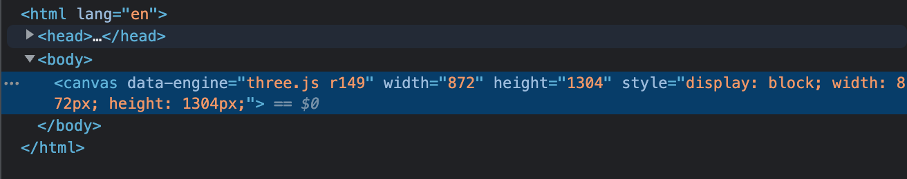
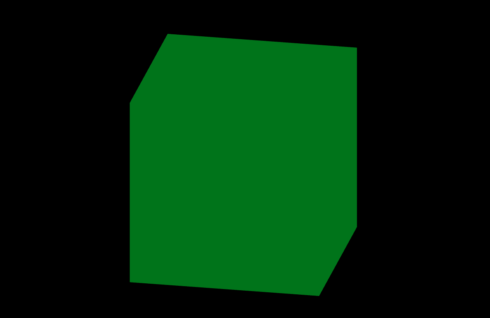
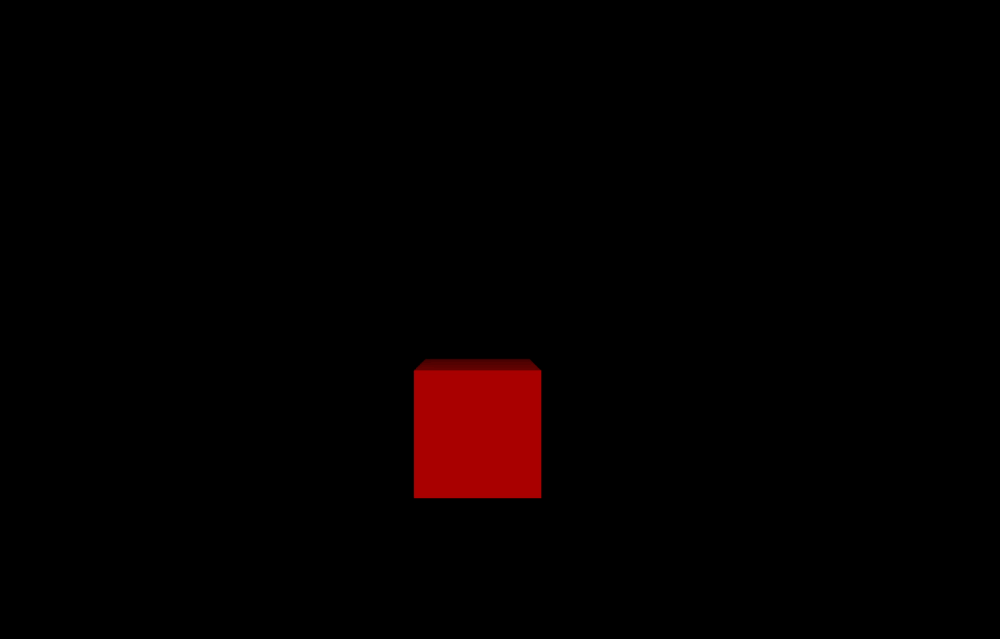

## three.js 기본 요소

### 기본 장면 구성요소 살펴보기

본격적으로 기본 요소에 대해 살펴본다.


three.js로 구현된 장면을 무대라고 생각해보자. 여기서 무대는 Scene이다.
무대 위에는 아바타가 서있는데 이렇게 무대 위에 올려진 객체들을 Mesh라고 한다.
이 메쉬는 모양 Geometry과 재질 Material로 구성된다.
모양은 전체 형태, 재질은 색깔, 거친 표현 등의 느낌을 나타냄

연극무대를 촬영하는 카메라 Camera는 시야각 Field of view를 가지는데, 어느정도 시야로 보여줄 것인지를 설정하는 부분을 담당한다. (시야각에 따라 사물이 다르게 보이므로), 조명 Light는 재질 Material을 어떻게 사용하느냐에 따라 필요/불필요가 결정되어진다.

이러한 위의 모든 내용을 화면으로 보여주는 것은 렌더러 Renderer가 담당한다.

위 무대는 3차원이므로 축의 방향이 매우 중요하다. x, y, z축을 다룰 수 있는데,
x축은 객체를 기준으로 좌(-)-우(+)를 의미한다. y 축은 위(+)-아래(-)를 의미한다. z 축은 앞(+)-뒤(-)를 의미

### 기본 장면 만들기 - Renderer

위 그림에서 살펴본 걸 코드로 직접 구현해본다.
가장 먼저 이전 시간 webpack 설정을 토대로 기본 three 프로젝트 환경을 구성해 줌

```bash
> npm i -D @babel/cli @babel/core @babel/preset-env babel-loader clean-webpack-plugin copy-webpack-plugin core-js cross-env html-webpack-plugin source-map-loader terser-webpack-plugin webpack webpack-cli webpack-dev-server
> npm i three
> npm start
> npm run build
```

src 하위에 `index.html`, `main.css`, `main.js`를 모두 생성 후 데브 서버가 정상 동작함을 기준으로 한다.
이제 main.js에 three.js를 import 해서 하나씩 테스트할 일만 남았다.

가장 먼저 화면에 그림을 그려주는 렌더러Renderer를 만들어본다.

`./src/main.js`

```jsx
import * as THREE from "three";

// 동적으로 캔버스 조립하기
const renderer = new THREE.WebGLRenderer();
renderer.setSize(window.innerWidth, window.innerHeight);
document.body.appendChild(renderer.domElement); // renderer.domElement는 캔버스를 의미
```

위와 같이 기본적인 렌더러를 생성 후 body에 복붙해주는 코드를 넣으면 아래와 같이 화면에 반영된다.



canvas가 body 에 그려짐. 위 코드에서 `renderer.domElement`는 캔버스를 의미한다.

위 방법은 js 파일에서 직접 canvas를 생성해서 붙여주는 방법으로 구현했는데, canvas를 html 내에 위치시켜놓고 필요한 엘리먼트를 가져와서 렌더링하는 방식도 있음. 어떻게 하느냐 모두 장단점이 있는데 canvas를 html 상에 미리 만들어놓고 사용하는 방식으로 주로 진행함

`src/index.html`

```html
<!DOCTYPE html>
<html lang="en">
  <head>
    <!-- ... -->
    <link rel="stylesheet" href="./main.css" />
  </head>

  <body>
    <canvas id="three-canvas"></canvas>
  </body>
</html>
```

`src/main.css`

```css
/* ... */
#three-canvas {
  position: absolute;
  left: 0;
  top: 0;
}
```

`src/main.js`

```jsx
import * as THREE from "three";

// html에서 캔버스 가져와서 사용하기
const canvas = document.querySelector("#three-canvas");
const renderer = new THREE.WebGLRenderer({ canvas });
renderer.setSize(window.innerWidth, window.innerHeight);
```

위와 같이 코드를 넣어주면 위 동적 캔버스 조립 코드와 같은 결과를 확인할 수 있다.

### 기본장면 만들기 - Camera

이제 Scene을 만들자. Scene은 전체 요소들이 포함되는 공간을 의미함

`src/main.js`

```jsx
import * as THREE from "three";

// ..
// scene 생성
const scene = new THREE.Scene();
```

간단하게 위와 같이 만들면 끝. 다음으로 Camera를 만들어본다.
카메라는 여러 종류가 있는데 대표적으로 2가지를 많이 쓴다. 그 중 원근 카메라 PerspectiveCamera라는 가장 간단한 카메라를 사용해본다. (3D 장면 렌더링 시 가장 널리 쓰이는 투영모드임

자세한 사항은 [문서](https://threejs.org/docs/index.html?q=camera#api/ko/cameras/PerspectiveCamera)에서 확인해볼 수 있으며 생성자는 아래와 같다. 매개변수 자리에 4가지의 인자가 들어감.

**PerspectiveCamera( fov : Number, aspect : Number, near : Number, far : Number )**

`fov` — 카메라 절두체 수직 시야. 아래 그림의 시야각Field of View을 의미
`aspect` — 카메라 절두체 종횡비. 가로, 세로 화면 비율
`near` — 카메라 절두체 근평면. 얼마나 가까우면 안보이게 할 것인가?
`far` — 카메라 절두체 원평면. 얼마나 멀면 안보이게 할 것인가?


위 그림에 카메라와 가장 가까운 똥은 near보다 더 앞에 있으므로 화면에 담기지 않고, 가장 마지막에 있는 똥도 far 보다 더 멀리 있으므로 화면에 담기지 않음.. mesh가 near와 far 사이에 있고 시야각(feld of view)안에 들어와야 보인다는 컨셉! 이해하자

`src/main.js`

```jsx
import * as THREE from "three";

// ..
// camera 생성 - PerspectiveCamera(시야각fov, 종횡비aspect, near, far)
const camera = new THREE.PerspectiveCamera(75, window.innerWidth / window.innerHeight, 0.1, 1000);
// 무대에 올리기
scene.add(camera);
```

위와 같이 카메라를 scene에 붙였다. 여기서 camera를 scene에 붙이기만 했을 뿐 위치 설정을 하지 않았는데,
위치 설정을 안했을 때에는 기본 값 x=0, y=0, z=0으로 설정되어 있다.

따라서, 이 상태에 있으면 물체도 0, 0, 0 좌표에, 카메라도 0, 0, 0 좌표에 존재하므로 아무것도 보이지 않음
그래서 보통 카메라를 약간 뒤로 빼주어서 (z축으로) 물체가 보이도록 해준다.

```jsx
// ..
// 추가! 카메라를 뒤로..
camera.position.z = 5;

// 무대에 올리기
scene.add(camera);
```

위에서 5라는 숫자는 사물의 크기에 비례해서 작업자가 설정한 값이다.
만약 카메라의 위치를 물체로 부터 5미터 뒤라고 했을 때 사람의 크기는 1.8미터라고 가정한다면 우리가 상상하는 사람을 바라보는 기준이 될 것임.. 이처럼 비율에 근거해서 가정하는 값

### 기본 장면 만들기 - Mesh

다음에는 물체를 만들어본다. mesh는 무대 위에 올려져있는 객체 하나하나를 의미한다.
Geometry모양과 Material재질을 조합함

`src/main.js`

```jsx
// Mesh 설정 - Geometry + Material
const geometry = new THREE.BoxGeometry(1, 1, 1); // 1 * 1 * 1 정육면체 생성
const material = new THREE.MeshBasicMaterial({
  // color: 0x00ff00,
  // color: "#00ff00",
  color: "green",
}); // 재질에 대한 속성을 객체에 설정함. 위와 같이 다양한 방법으로 넣을 수 있다.

// Mesh 생성
const mesh = new THREE.Mesh(geometry, material);
// 무대에 올리기
scene.add(mesh);
```

위 BoxGeometry, MeshBasicMaterial 는 모양과 재질을 표현하는 가장 기본적인 메서드임
각 모양과 재질을 따로 설정해준 뒤 Mesh를 생성해서 Scene에 연결시키는 개념

위와 같이 설정하여도 화면에는 아무것도 보이지 않는다. 바로 Renderer가 해당 코드를 렌더링시키지 않았기 때문
따라서 아래와 같이 렌더러에게 연결시켜준다.

`src/main.js`

```jsx
// ..

// 그리기
renderer.render(scene, camera);
```

앞서 설정한 scene과 camera를 연결시켜주는 개념임. 그러면 화면에 아래와 같이 보인다.


직육면체를 만들었는데 그냥 2D 네모로만 보인다. 카메라의 위치가 정면을 바라보고 있어서 그렇다.
z 축으로만 뒤로 5 당겨놓음. y 축을 조정해서 위에서 바라보도록, x 축을 조정해서 오른쪽에서 바라보도록 설정해본다.

`src/main.js`

```jsx
// ..
// camera 위치 추가
camera.position.x = 1;
camera.position.y = 2;
camera.position.z = 5;

scene.add(camera);
```


위와 같이 보인다 ㅋㅋ 위 내용이 three.js 아주 기본 내용을 조합한 것이다.
매우 단순해 보일 수 있으나 그러하다. 재질 표현에서 사용한 MeshBasicMaterial의 경우 빛Light에 영향을 안받는 메서드이므로, 이 때문에 별도의 조명이 없어도 박스를 확인할 수 있는 것이다.

그런데 자세히보면 물체의 아웃라인이 살짝 깨져보인다.
계단식으로 거칠게 표현됨. 이는 렌더러 설정으로 부드럽게antialiasing 보이도록 설정할 수 있다.

`src/main.js`

```jsx
// ..
const renderer = new THREE.WebGLRenderer({
  canvas,
  antialias: true, // 추가
});

renderer.setSize(window.innerWidth, window.innerHeight);
```

추가적인 연산이 필요하므로 성능저하는 발생할 수 있다. 부드럽게 보이는 것이 필요할 때는 해당 옵션을 추가해서 노출해준다.

### 직교 카메라(Orthographic Camera)

이번에는 직교 카메라를 배워보자. 기존의 원근 카메라PerspectiveCamera 코드는 주석처리 해준다.
우선 이 둘의 차이를 먼저 짚고 넘어가보자


PerspectiveCamera는 자연스럽게 사람의 눈으로 보는 것처럼 원근이 적용되어 있다.
반면에 OrthographicCamera는 원근에 따라 물체의 크기가 다르게 표현되지 않는다. 거리에 상관없이 크기가 동일하게 표현

OrthographicCamera 이를 가장 대표적으로 사용하는 케이스가 디아블로나 롤, 룰더스카이 같은 게임들에서 사용한다.
기본적으로 사용하지는 않고 특정 조건에서만 사용하는 카메라라고 볼 수 있다.

OrthographicCamera에 대한 [문서에서 설명](https://threejs.org/docs/index.html?q=camera#api/ko/cameras/OrthographicCamera)도 [렌더링된 이미지에서 객체의 크기는 카메라와의 거리에 관계없이 일정하게 유지된다.] 라고 적혀 있음. 생성자는 아래와 같다.

**OrthographicCamera( left : Number, right : Number, top : Number, bottom : Number, near : Number, far : Number )**

- `left` — 카메라 절두체 좌평면.
- `right` — 카메라 절두체 우평면.
- `top` — 카메라 절두체 상평면.
- `bottom` — 카메라 절두체 하평면.
- `near` — 카메라 절두체 근평면.
- `far` — 카메라 절두체 원평면.

ㅊ

`src/main.js`

```jsx
// camera 생성 - 직교 카메라 OrthographicCamera(left, right, top, bottom, near, far)
const camera = new THREE.OrthographicCamera(
  -(window.innerWidth / window.innerHeight), // left
  window.innerWidth / window.innerHeight, // right
  1, // top
  -1, // bottom
  0.1, // near
  1000
);

// camera 위치 설정
camera.position.x = 1;
camera.position.y = 2;
camera.position.z = 5;

// 카메라가 바라보는 위치 설정 - 큐브 원점을 바라보도록 설정
camera.lookAt(0, 0, 0);

// 무대에 올리기
scene.add(camera);
```

기존 원근카메라와 동일한 조건으로 x, y, z 축의 위치를 설정하면 화면에 물체가 보이지 않는다.
카메라가 너무 위에서 바라보고 있기 때문인데, 이를 큐브 원점(0, 0, 0)을 바라보도록 lookAt 메서드를 이용해 설정해준다.



뭔가 굉장히 무시무시하고, 이해하기 어려운 직육면체가 나타났다. 뚜둥.. 어색한 3D 같음
이를 개선하기 위해 camera의 zoom 설정을 추가해준 뒤 update 해준다.

`src/main.js`

```jsx
// ..
camera.position.x = 1;
camera.position.y = 2;
camera.position.z = 5; // 직교 카메라에서는 원근을 z 값으로 조정하지 않는다.

camera.lookAt(0, 0, 0);

// 카메라 zoom 설정
camera.zoom = 0.5;

// 카메라 설정 업데이트
camera.updateProjectionMatrix();

scene.add(camera);
```

OrthographicCamera의 경우 특정한 상황에서만 사용하게 되므로, 주로 원근 카메라를 이용한다고 가정하고 진행함

이해를 높기 위한 이미지 추가.. ([https://www.oreilly.com/library/view/learn-threejs/9781788833288/75c09eef-2a7d-47b2-8965-e3cd1fe1e6fe.xhtml](https://www.oreilly.com/library/view/learn-threejs/9781788833288/75c09eef-2a7d-47b2-8965-e3cd1fe1e6fe.xhtml))


### 소스코드 구조 잡기

좀 더 깊이 있는 배움을 위해 프로젝트 구조를 조금 변경해본다.

`src/ex01.js` (신규 파일 생성)

```jsx
import * as THREE from "three";

// --- 주제: 기본 장면
export default function example() {
  // main.js source 여기에 복붙
}
```

`src/main.js`

```jsx
import example from "./ex01";

example();
```

위와 같은 모듈 구조로 변경

### 브라우저 창 사이즈 변경에 대응하기

이번에는 창 사이즈 변경 시 거기에 맞춰서 대응되도록 개선해본다. 지금은 그대로 있음..
일단 기본 소스코드를 ex02.js 파일로 생성하여 위치시킨다.

`src/ex02.js`

```jsx
import * as THREE from "three";

// --- 주제: 브라우저 창 사이즈 변경에 대응하기

export default function example() {
  // renderer
  const canvas = document.querySelector("#three-canvas");
  const renderer = new THREE.WebGLRenderer({ canvas, antialias: true });
  renderer.setSize(window.innerWidth, window.innerHeight);

  // scene
  const scene = new THREE.Scene();
  // camera
  const camera = new THREE.PerspectiveCamera(75, window.innerWidth / window.innerHeight, 0.1, 1000);

  camera.position.x = 1;
  camera.position.y = 2;
  camera.position.z = 5;
  scene.add(camera);

  // Mesh
  const geometry = new THREE.BoxGeometry(1, 1, 1);
  const material = new THREE.MeshBasicMaterial({ color: "green" });
  const mesh = new THREE.Mesh(geometry, material);
  scene.add(mesh);

  // 그리기
  renderer.render(scene, camera);
}
```

초기 renderer.render 이후 resize에 대한 이벤트를 아래와 같이 그려준다.

```jsx
export default function example() {
  // ...
  renderer.render(scene, camera);

  // resize 시 변화하는 것들을 새로 설정해준다.
  function setSize() {
    // camera
    camera.aspect = window.innerWidth / window.innerHeight;
    // updateProjectionMatrix 카메라 투영에 관련된 값에 변화가 있을 때는 실행해야 함
    camera.updateProjectionMatrix();
    renderer.setSize(window.innerWidth, window.innerHeight);
    renderer.render(scene, camera);
  }

  // Event
  window.addEventListener("resize", setSize); // setSize 적용
}
```

위처럼 처리하면 브라우저 리사이즈 시 알아서 규격이 대응되는 것을 확인할 수 있다.
그런데 실제 적용된 캔버스 사이즈를 보면 초기에 적용된 가로, 세로 값이 그대로 적용되어 있음


캔버스도 고해상도 표현을 위해서는 크기를 크게 만든 뒤 줄여서 표현해주어야 한다.
어떻게? 뷰포트에서 표현하는 사이즈와 실제 물리적인 픽셀 개수가 다르게 처리하는 방법으로 고해상도 표현이 가능함.
만약 픽셀 밀도 즉, 집적도가 2배인 디스플레이라면 가로가 100px인 이미지를 표현 시
실제 이미지의 크기를 2배 크기인 200px로 만든 뒤 100px로 줄여 표현하면 훨씬 더 고해상도로 보여지게 할 수 있다.
캔버스도 마찬가지임. 캔버스 크기를 2배로 잡아주면 훨씬 더 고해상도로 구현할 수 있을 것이다.

이를 구현하기 위해서는 현재 나의 기기의 픽셀 밀도가 몇인지 알면 좋다.

```jsx
export default function example() {
  // ..
  console.log(window.devicePixelRatio); // 해당 기기의 픽셀 밀도를 나타냄
}
```

위와 같이 window.devicePixelRatio라는 메서드를 통해 해당 기기의 픽셀 밀도(비율)를 숫자로 나타낼 수 있는데, 현재 맥북을 사용하므로 2가 출력되고 있다. 현재 나의 기기가 100px를 표현할 때 200px를 사용한다는 것을 의미함.

이 메서드를 왜 이용할까? 사람마다 각자 디바이스의 픽셀 밀도는 다를것이므로 각 디바이스별 값으로 세팅을 해주도록 하면 모든 기기에 최적화가 될 수 있을 것이기 때문이다.

`src/ex02.js`

```jsx
export default function example() {
  const canvas = document.querySelector("#three-canvas");
  const renderer = new THREE.WebGLRenderer({ canvas, antialias: true });
  renderer.setSize(window.innerWidth, window.innerHeight);
  // 렌더링 품질을 높이기 위해 픽셀 밀도를 설정함
  // 비율이 1인 경우 그냥 1을 쓰고, 그 이상일 경우 2배로 처리하는 삼항 조건자 추가 - 성능에 유리함
  renderer.setPixelRatio(window.devicePixelRatio > 1 ? 2 : 1);

  // ..
}
```

위와 같이 적용해준 뒤 화면을 확인해보면 canvas 사이즈가 2배로 커져서 적용된 것을 확인할 수 있다.


위와 같이 처리하면 크기는 달라지지 않으나 훨씬 더 고밀도의 화면을 구현할 수 있게 된다.


### 배경의 색, 투명도 설정하기

시커먼 배경색을 좀 수정해보자.

`src/ex03.js`

```jsx
import * as THREE from "three";

// --- 주제: 배경의 색, 투명도 설정하기

export default function example() {
  const canvas = document.querySelector("#three-canvas");
  // alpha 화면을 투명하게 처리
  const renderer = new THREE.WebGLRenderer({ canvas, antialias: true, alpha: true });
  renderer.setSize(window.innerWidth, window.innerHeight);
  renderer.setPixelRatio(window.devicePixelRatio > 1 ? 2 : 1);
  // 배경색 불투명도 설정 - 0.5만큼 불투명하게!
  renderer.setClearAlpha(0.5);

  // ..
}
```

위와 같이 배경색을 투명하게, 불투명도를 50%로 줬더니 아래와 같이 노출된다.


이번엔 색을 지정해보자.

```jsx
import * as THREE from "three";

// --- 주제: 배경의 색, 투명도 설정하기

export default function example() {
  // ..

  const renderer = new THREE.WebGLRenderer({ canvas, antialias: true, alpha: true });
  // ..

  // renderer.setClearColor(0x00ff00); // 아래와 같은 표현
  renderer.setClearColor("#00ff00");
  renderer.setClearAlpha(0.5);
}
```


이번에는 다른 방법으로 바꿔본다. renderer 설정이 아닌 scene에 설정해본다.
renderer 위에 scene이 존재하므로 scene에 배경색을 설정하면 renderer 설정은 무시된다.

```jsx
import * as THREE from "three";

// --- 주제: 배경의 색, 투명도 설정하기

export default function example() {
  // ..

  const renderer = new THREE.WebGLRenderer({ canvas, antialias: true, alpha: true });
  renderer.setClearColor("#00ff00");
  renderer.setClearAlpha(0.5);

  // scene
  const scene = new THREE.Scene();
  scene.background = new THREE.Color("blue"); // 위 renderer 설정은 무시됨
}
```

위와 같이 배경색을 파란색으로 처리해버린 뒤 화면을 보면 위 renderer 설정은 완전 무시되어 덮여진 것을 알 수 있다.


배경색에 투명도 등의 설정을 할 경우 renderer 메서드를 사용하고, 간단한 색감만 사용할 경우 scene에서 처리해준다.

### 빛(조명, Light)

이번에는 조명light을 추가해본다. 빛의 여러가지가 있는데 DirectionalLight를 사용함

`src/ex04.js`

```jsx
import * as THREE from "three";

// --- 주제: 조명 추가하기

export default function example() {
  // ..

  // 추가
  const light = new THREE.DirectionalLight(0xffffff, 1);
  scene.add(light);

  const geometry = new THREE.BoxGeometry(1, 1, 1);
  // const material = new THREE.MeshBasicMaterial({ color: "red" });
  const material = new THREE.MeshStandardMaterial({ color: "red" }); // material 변경
  const mesh = new THREE.Mesh(geometry, material);
  scene.add(mesh);

  renderer.render(scene, camera);
}
```

위와 같이 DirectionalLight로 조명을 설정 후 scene.add로 조명을 적용해주면 됨.
하지만 화면에 조명은 추가되지 않는다. 왜? MeshBasicMaterial 메서드를 사용했기 때문이다.
MeshBasicMaterial은 빛에 반응을 하지 않는 객체이다. 영향을 받지 않음.

따라서 위 material을 빛에 영향을 받는 MeshStandardMaterial 메서드로 변경해준다.


그럼 이렇게 보여진다. 갑자기 위에서 바라보는 사각형처럼 보인다. three.js에서 DirectionalLight는 태양빛과 비슷하다. 무대에 존재하는 객체들에게 빛을 전체적으로 비춰주는데 빛의 위치가 위에 있는 상태라고 보면 됨

정육면체가 살짝 좌측으로 이동되어 있는 것 같은 것은 camera의 x 축이 1만큼 이동되어 있기 때문이다.
해당 적용을 제외하면 아래와 같이 변경된다.


이번에는 빛도 포지션을 좀 움직여줘본다.

```jsx
import * as THREE from "three";

// --- 주제: 조명 추가하기

export default function example() {
  // ..
  const light = new THREE.DirectionalLight(0xffffff, 1);
  light.position.z = 2;
  scene.add(light);

  // ..
  renderer.render(scene, camera);
}
```


camera의 위치와 light의 위치를 커스텀하여 좌측면도 비치게 할 수 있다.

```jsx
import * as THREE from "three";

// --- 주제: 조명 추가하기

export default function example() {
  // ..
  // camera
  const camera = new THREE.PerspectiveCamera(75, window.innerWidth / window.innerHeight, 0.1, 1000);

  camera.position.x = 2; // 추가
  camera.position.y = 2;
  camera.position.z = 5;
  scene.add(camera);

  const light = new THREE.DirectionalLight(0xffffff, 1);
  light.position.x = 1; // 추가
  light.position.z = 2;
  scene.add(light);

  // ..
  renderer.render(scene, camera);
}
```


빛의 강도도 DirectionalLight의 인자 숫자를 변경해서 다양하게 바꿀 수 있음

```jsx
import * as THREE from "three";

// --- 주제: 조명 추가하기

export default function example() {
  // ..

  // const light = new THREE.DirectionalLight(0xffffff, 1);
  // const light = new THREE.DirectionalLight(0xffffff, 0.1);
  // const light = new THREE.DirectionalLight(0xffffff, 10);
  const light = new THREE.DirectionalLight(0xffffff, 0.5);
  // ..

  renderer.render(scene, camera);
}
```


이러한 조명은 많이 넣을 수 있다. (너무 많이 넣음 성능에 좋지 않으니 적당히 사용)

### 애니메이션 기본

이번에는 움직임. 애니메이션을 만들어본다.
three.js도 캔버스와 마찬가지로 애니메이션을 구현할 때 requestAnimationFrame 메서드를 사용한다.
window 전역 객체가 가진 메서드로 브라우저에게 수행하길 원하는 애니메이션을 알리고, 다음 repaint(브라우저의 연산이 완료되어 object의 위치가 결정되어 실제 브라우저에 그림이 그려지는 과정)가 진행되기 전에 해당 애니메이션을 업데이트하는 함수를 호출하도록 한다.

[https://www.youtube.com/watch?v=9XnqDSabFjM](https://www.youtube.com/watch?v=9XnqDSabFjM)

먼저 renderer.render를 draw라는 이름의 함수로 가둬준 뒤 실행시키는 구조로 바꾼다.

`src/ex05.js`

```jsx
import * as THREE from "three";

// --- 주제: 애니메이션 기본

export default function example() {
  // ..

  // 그리기
  function draw() {
    renderer.render(scene, camera);
  }

  draw();
}
```

여기에 애니메이션을 아래와 같이 적용시켜준다.

```jsx
export default function example() {
  // ..

  // 그리기
  function draw() {
    mesh.rotation.y += 0.1;
    renderer.render(scene, camera);
    window.requestAnimationFrame(draw); // requestAnimationFrame(draw);
  }

  draw();
}
```

그럼 주르르륵 y 축을 기준으로 잘 돌아간다.


위에서 0.1이라고 함은 360도 기반이 아닌 초도각Radian(2π) 기준이다.
360도는 2π임. 3.14159 \* 2 = 약 6.28

위 값 이용이 어렵다면 three.js 내장 기능을 이용해 각도를 직접 넣어줄 수있다.

```jsx
export default function example() {
  // ..

  // 그리기
  function draw() {
    // mesh.rotation.y += 0.1;
    mesh.rotation.y += THREE.MathUtils.degToRad(1); // three.js 내장 기능 - 각도를 라디안으로 변환
    renderer.render(scene, camera);
    window.requestAnimationFrame(draw);
  }

  draw();
}
```


이러면 정말 1도씩 돌아가게 된다. 좀 더 활용해보자

```jsx
export default function example() {
  // ..

  // 그리기
  function draw() {
    // mesh.rotation.y += 0.1;
    mesh.rotation.y += THREE.MathUtils.degToRad(1);
    mesh.position.y += 0.05;
    if (mesh.position.y > 3) {
      mesh.position.y = 0;
    }
    renderer.render(scene, camera);
    window.requestAnimationFrame(draw);
  }

  draw();
}
```

위와 같이 회전을 하면서 y 축으로 이동하는 효과를 주고, 일정한 값을 초과하면 다시 리셋을 시켜주면


이렇게 됨. requestAnimationFrame에 draw가 계속 호출되므로 애니메이션이 반복된다.
위 방법말고도 three.js에서 제공하는 애니메이션 메서드가 있다.

```jsx
export default function example() {
  // ..
  function draw() {
    // mesh.rotation.y += 0.1;
    mesh.rotation.y += THREE.MathUtils.degToRad(1);
    mesh.position.y += 0.05;
    if (mesh.position.y > 3) {
      mesh.position.y = 0;
    }
    renderer.render(scene, camera);

    // window.requestAnimationFrame(draw);
    renderer.setAnimationLoop(draw); // setAnimtaionLoop
  }

  draw();
}
```

requestAnimationFrame와 호환되지만 WebXR(VR, AI 컨텐츠)를 만들 때에는 일반적인 웹 개발 환경과는 다르므로 그땐 setAnimationLoop를 써줘야 한다.

### 애니메이션 성능 보정

위처럼 애니메이션을 기본적으로 구현해봤는데, 위 코드는 살짝 문제가 있을 수 있음
디바이스별로 성능 차이가 발생할 수 있다는 점. 좋은 컴터에서는 잘돌아가고, 안좋은 컴터는 버벅일 것이다.

따라서 이런 성능 관련은 보정을 해줘야 한다. clock을 활용해서 보정함
아까 draw 함수에 아래의 코드를 추가해준다.

`src/ex05.js`

```jsx
export default function example() {
  // ..

  const clock = new THREE.Clock(); // 시간을 측정하는 기능

  // 그리기
  function draw() {
    console.log(clock.getElapsedTime()); // 시간이 흘러가는 것이 log에 찍힌다.
    // ..
  }

  draw();
}
```

성능이 좋은 컴퓨터, 예를 들어 1초에 10회 돌아가는 컴퓨터라면 0초부터 1초까지 10번의 로그가 찍힐 것임. 1초에 5회 돌아가는 성능이라면? 0초부터 1초까지 5번의 로그가 찍히게 된다. 이 값을 활용하여 y값을 부여하면 디바이스별 성능 차이를 없앨 수 있다.

```jsx
export default function example() {
  // ..

  const clock = new THREE.Clock(); // 시간 측정, 경과시간을 나타냄

  // 그리기
  function draw() {
    const time = clock.getElapsedTime();

    // mesh.rotation.y += THREE.MathUtils.degToRad(time); // 각도를 라디안으로 변환
    mesh.rotation.y = time * 2; // time은 시간에 따라 증가하는 값이므로 +=가 아닌 time을 그대로 넣어줌
    mesh.position.y = time;

    if (mesh.position.y > 3) {
      mesh.position.y = 0; // 여기서 문제 발생!
    }
    // ..
  }

  draw();
}
```

위처럼 하면 브라우저별로 들어가는 성능과 상관없이 경과시간에 따라 애니메이션이 구현될 것이다. (물론 1초에 10회와 1초에 5회의 움직임은 훨씬 다르겠지만 결과는 같아지도록 할 수 있음) 그런데, 문제는 position값이 3이상이면 0으로 회귀하는 로직이 무한 반복된다는 점에 있다. time은 계속 증가하므로..

이를 개선하는 두번째 방법도 있다.

```jsx
export default function example() {
  // ..

  const clock = new THREE.Clock(); // 시간 측정, 경과시간을 나타냄

  // 그리기
  function draw() {
    // const time = clock.getElapsedTime();
    // draw 프레임 실행마다 시간을 측정(이전 draw에서 현재 draw까지의 시간차)
    // getElapsedTime와 혼용하지 않아야 함
    const delta = clock.getDelta();

    mesh.rotation.y += delta * 2;
    mesh.position.y += delta;

    if (mesh.position.y > 3) {
      // 정상 동작함
      mesh.position.y = 0;
    }
    // ..
  }

  draw();
}
```

getElapsedTime의 경우 총 경과시간을 나타내는 반면 getDelta는 이전 draw 함수에서 현재 draw 함수가 생성되는 시간 차를 의미한다. 각 프레임 실행마다 시간을 측정하는 것으로 계속 증가하는 값이 아님

이를 활용해 코드를 구현하면, 이상없는 애니메이션을 구현할 수 있다. 단, getElapsedTime과 함께 사용할 수 없으므로 프로젝트에 적절한 것을 선택적으로 사용하여야 함 (프로젝트에서 getDelta를 많이 사용함)

3번째 개선방법이 있다. 이 방법은 javaScript의 내장 객체인 Date를 활용함

```jsx
export default function example() {
  // ..

  let oldTime = Date.now(); // javaScript 내장객체 사용

  // 그리기
  function draw() {
    const newTime = Date.now();
    const deltaTime = newTime - oldTime;
    oldTime = newTime; // initialize

    mesh.rotation.y += deltaTime * 0.005; // deltaTime 적용
    mesh.position.y += deltaTime * 0.001; // deltaTime 적용

    if (mesh.position.y > 3) {
      mesh.position.y = 0;
    }
    // ..
  }

  draw();
}
```

위와 같이하면 찍히는 숫자에 따른 적절한 움직임이 예상된다. 위 방법이 좋은 점은 굳이 three.js를 쓰지 않고도 캔버스 애니메이션에서 동일하게 구현할 수 있다는 점임. 각 상황에서 적절한 걸 가져다 쓰자

### 안개(Fog)

안개 효과를 내기 위해 기본 소스를 조금 변경해본다. 위에서 만들었던 draw 애니메이션은 삭제처리. 사각형을 여러 개 만들어준다.

`src/ex07.js`

```jsx
import * as THREE from "three";

// --- 주제: 안개(Fog) 효과

export default function example() {
  // ..
  const scene = new THREE.Scene();

  const camera = new THREE.PerspectiveCamera(75, window.innerWidth / window.innerHeight, 0.1, 1000);
  camera.position.y = 1;
  camera.position.z = 5;
  scene.add(camera);

  const light = new THREE.DirectionalLight(0xffffff, 1);
  light.position.x = 1;
  light.position.y = 3;
  light.position.z = 5;
  scene.add(light);

  const geometry = new THREE.BoxGeometry(1, 1, 1);
  const material = new THREE.MeshStandardMaterial({ color: "red" });

  // 반복문으로 10개의 박스를 만들어준다.
  const meshes = [];
  let mesh;
  for (let i = 0; i < 10; i++) {
    mesh = new THREE.Mesh(geometry, material);
    mesh.position.x = Math.random() * 5 - 2.5;
    mesh.position.z = Math.random() * 5 - 2.5;
    scene.add(mesh);
    meshes.push(mesh);
  }

  // ..
}
```

위와 같이 하면 새로고침할 때마다 위치가 다른 10개의 박스들이 노출된다.


이제 안개 효과를 줘보자. scene에 fog 메서드를 추가해주면 된다.

```jsx
export default function example() {
  // ..
  const scene = new THREE.Scene();

  // Fog
  scene.fog = new THREE.Fog("black", 3, 7); // fog(color, near, far)

  // ..
}
```

위와 같이 하면 검정색 그라데이션이 3 - 7 정도로 퍼져있는 그라데이션이 생성된다. 그럴 듯한 ui가 만들어짐


원근감이 더 살아나면서 완성도가 높아진다. 다음으로 아까 중단한 애니메이션도 meshes 배열에 적용시켜본다.

```jsx
export default function example() {
  const meshes = [];
  let mesh;
  for (let i = 0; i < 10; i++) {
    mesh = new THREE.Mesh(geometry, material);
    mesh.position.x = Math.random() * 5 - 2.5;
    mesh.position.z = Math.random() * 5 - 2.5;
    scene.add(mesh);
    meshes.push(mesh);
  }

  let oldTime = Date.now();
  function draw() {
    const newTime = Date.now();
    const deltaTime = newTime - oldTime;
    oldTime = newTime;

    // meshes에 애니메이션 부여
    meshes.forEach((mesh) => {
      mesh.rotation.y += deltaTime * 0.001;
    });

    renderer.render(scene, camera);
    renderer.setAnimationLoop(draw);
  }

  // ..

  draw();
}
```


### 라이브러리를 이용한 애니메이션

앞서 적절한 값을 Date 객체나 getDelta 메서드를 사용해 도출해서 애니메이션을 구현했다면 이번에는 애니메이션 구현을 돕는 외부 라이브러리를 이용해 구현해본다.

라이브러리를 직접 애니메이션을 구현하지 않아도 되므로 퀄리티가 매우 좋다. 굳이 고생하지 않아도 됨.
라이브러리로 구현이 어려운 것은 직접 구현해줘야 하지만, 웬만한 애니메이션은 만들어진 것을 참고하는 편이 좋다.

라이브러리는 GreenSock을 사용할 것임. 유료, 무료 나뉘어져있음

```jsx
> npm i gsap
> npm start
```

gsap는 기존 애니메이션과 별개로 움직이는 코드임

```jsx
import * as THREE from "three";
import gsap from "gsap"; // import

// --- 주제: 라이브러리를 이용한 애니메이션

export default function example() {
  // ..
  // Mesh
  const geometry = new THREE.BoxGeometry(1, 1, 1);
  const material = new THREE.MeshStandardMaterial({ color: "red" });

  const mesh = new THREE.Mesh(geometry, material); // mesh 1개 생성
  scene.add(mesh);

  // gsap: duration 재생시간, y, x: y, x축으로 2만큼 이동
  gsap.to(mesh.position, { y: 2, x: 3, duration: 1, delay: 1 });

  // ..
}
```

위와 같이 코드를 동작시키면 부드러운 애니메이션 이동이 가능함



다양한 애니메이션은 [문서](https://greensock.com/docs/) 참고
