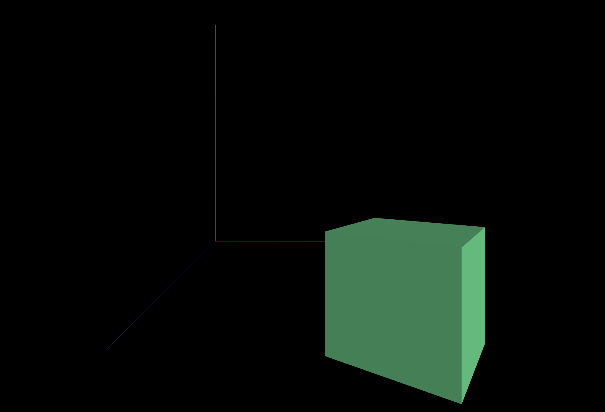
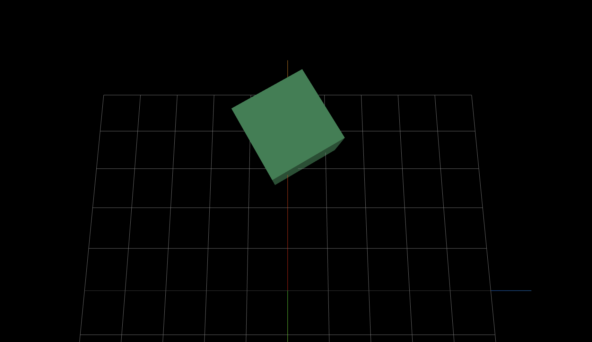
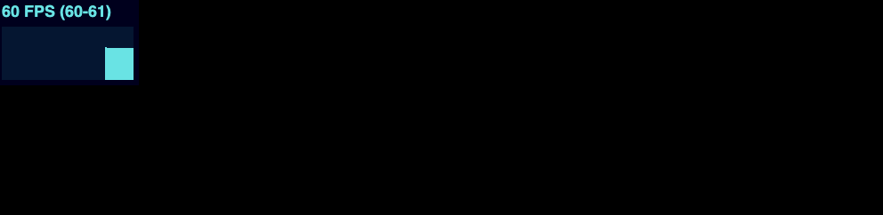
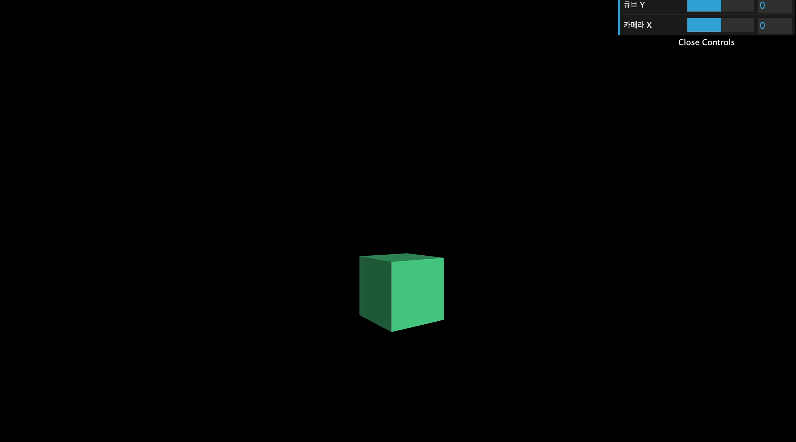
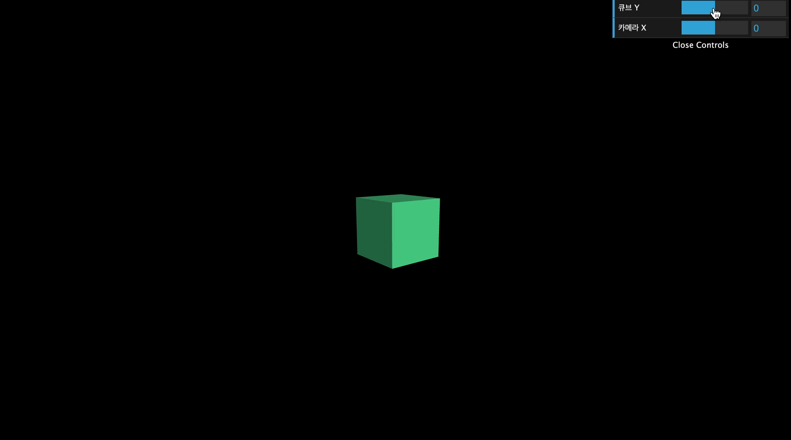

## Three.js 개발 편의 도구

이번에는 three.js 개발 시 도움을 받을 수 있는 유틸리티 도구에 대해 살펴봄

### 축, 그리드 헬퍼

`src/ex01.js`

```jsx
import * as THREE from "three";

// ----- 주제: AxesHelper(축), GridHelper(그리드)

export default function example() {
  // ..

  // Camera
  const camera = new THREE.PerspectiveCamera(75, window.innerWidth / window.innerHeight, 0.1, 1000);
  camera.position.x = 1; // 축을 잘 보기 위해 카메라 위치 수정
  camera.position.y = 1; // 축을 잘 보기 위해 카메라 위치 수정
  camera.position.z = 5; // 축을 잘 보기 위해 카메라 위치 수정
  scene.add(camera);

  // 은은한 조명 추가
  const ambientLight = new THREE.AmbientLight(0xffffff, 0.5);
  scene.add(ambientLight);

  const directionalLight = new THREE.DirectionalLight(0xffffff, 1);
  directionalLight.position.x = 1;
  directionalLight.position.z = 2;
  scene.add(directionalLight);

  // AxesHelper - 축 헬퍼 scene에 추가
  const axesHelper = new THREE.AxesHelper(3);
  scene.add(axesHelper);

  // Mesh
  const geometry = new THREE.BoxGeometry(1, 1, 1);
  const material = new THREE.MeshStandardMaterial({
    color: "seagreen",
  });
  const mesh = new THREE.Mesh(geometry, material);
  mesh.position.x = 2; // 위치 조정
  mesh.position.z = 2; // 위치 조정
  scene.add(mesh);

  // ..
}
```

위와 같이 은은한 조명을 추가하여 사물이 잘보이도록 처리한 다음 `THREE.AxesHelper`를 3 크기로 부여하면 x, y, z 축을 볼 수 있는 축 헬퍼 ui를 확인할 수 있다.



다음 그리드 헬퍼도 넣어보자

```jsx
import * as THREE from "three";

// ----- 주제: AxesHelper(축), GridHelper(그리드)

export default function example() {
  // ..
  // Camera
  const camera = new THREE.PerspectiveCamera(75, window.innerWidth / window.innerHeight, 0.1, 1000);
  camera.position.x = 1; // 위치 수정 - 위에서 바라보도록
  camera.position.y = 3; // 위치 수정 - 위에서 바라보도록
  camera.position.z = 0; // 위치 수정 - 위에서 바라보도록
  scene.add(camera);

  // ..
  // AxesHelper
  const axesHelper = new THREE.AxesHelper(3);
  scene.add(axesHelper);

  const gridHelper = new THREE.GridHelper(5);
  scene.add(gridHelper);

  // Mesh..
  camera.lookAt(mesh.position); // 카메라가 위에서 바라보도록 수정

  // ..
}
```



### 초당 프레임 수(FPS) 체크하기

이번에는 초당 프레임 수(FPS)를 체크하는 유틸리티를 구현해본다.
이는 three.js 내장 기능이 아니므로 따로 설치해줘야 한다.

```
> npm i stats.js
```

`src/ex02.js`

```jsx
import * as THREE from "three";
import Stats from "stats.js";

// ----- 주제: 초당 프레임 수 보기(Stats)

export default function example() {
  // ..

  // Stats
  const stats = new Stats();
  document.body.appendChild(stats.domElement); // 화면에 프레임 수 노출

  // 그리기
  const clock = new THREE.Clock();

  function draw() {
    const time = clock.getElapsedTime();
    stats.update(); // update를 시켜줘야 함

    mesh.rotation.y = time;

    renderer.render(scene, camera);
    renderer.setAnimationLoop(draw);
  }

  draw();
}
```



화면에 정상적으로 FPS 노출. 콘솔로 찍어보는 것은 성능 저하를 일으킬 가능성이 있으므로 얠 이용하면 실제 이용 화면과 가장 비슷하게 확인 가능

### GUI 컨트롤

이번에는 카메라 위치 수정 시 테스트하는 것이 편하도록 마우스 조절로 가능한 GUI 컨트롤러를 설치해본다. 설치가 필요함

```
> npm i dat.gui
```

`src/ex03.js`

```jsx
import * as THREE from "three";
import dat from "dat.gui";

// ----- 주제: GUI 컨트롤(from. dat.gui)

export default function example() {
  // Renderer, Scene, Camera, Mesh ..

  // Dat.GUI
  const gui = new dat.GUI();
  // 어떤 것을 조절할지, 변경할 값, 최소값, 최대값, 단계
  gui.add(mesh.position, "y", -5, 5, 0.01).name("큐브 Y");
  gui.add(camera.position, "x", -10, 10, 0.01).name("카메라 X");

  // 아래와 같이 써줘도 된다.
  // gui.add(mesh.position, "z").min(-5).max(5).step(0.01).name("mesh의 위치");

  // ..
}
```

위와 같이 넣으면 아래와 같이 조절할 수 있게됨.



그런데 움직일 때마다 박스의 위치가 고정되지 않으므로 mesh를 바라보도록 아래와 같이 코드를 추가해줄 수도 있다.

```jsx
export default function example() {
  // Renderer, Scene, Camera, Mesh ..

  // Dat.GUI
  const gui = new dat.GUI();
  gui.add(mesh.position, "y", -5, 5, 0.01).name("큐브 Y");
  gui.add(camera.position, "x", -10, 10, 0.01).name("카메라 X");
  camera.lookAt(mesh.position); // 추가

  const clock = new THREE.Clock();
  function draw() {
    const time = clock.getElapsedTime();

    mesh.rotation.y = time;
    camera.lookAt(mesh.position); // 추가

    renderer.render(scene, camera);
    renderer.setAnimationLoop(draw);
  }

  // ..
}
```

위와 같이 넣어주면 계속 mesh를 바라보면서 위치가 조정되도록 구현 가능


