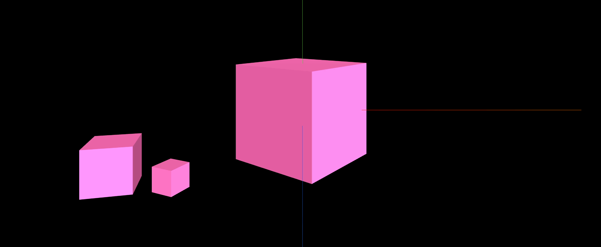

## Transform(변환)

### 위치 이동

이번 시간에는 변환에 대해 알아본다. 형태의 변화 중 위치 이동을 먼저 해보자
가장 간단하게 위치를 이동 시키는 건 mesh의 position을 조절하는 방법이 있음

`src/ex01.js`

```jsx
import * as THREE from "three";
import dat from "dat.gui";

// ----- 주제: 위치 이동

export default function example() {
  // ..

  function draw() {
    mesh.position.y = 2; // 위치 설정

    renderer.render(scene, camera);
    renderer.setAnimationLoop(draw);
  }

  draw();
}
```

위와 같이 해주면 mesh가 2만큼 y축으로 증가한 위치에 이동됨. 위 코드는 아래와 같이 쓸 수 있다.

```jsx
import * as THREE from "three";
import dat from "dat.gui";

// ----- 주제: 위치 이동

export default function example() {
  // ..

  function draw() {
    // mesh.position.y = 2; // 위치 설정
    mesh.position.set(-1, 2, -5); // x, y, z

    renderer.render(scene, camera);
    renderer.setAnimationLoop(draw);
  }

  draw();
}
```

`position.set` 메서드를 쓰면 x, y, z 축에 대한 위치를 한번에 설정할 수 있음

실제 이동한 mesh가 원점으로부터 거리가 얼마정도인지 알고 싶다면 아래와 같이 측정할 수 있다.

```jsx

import * as THREE from "three";
import dat from "dat.gui";

// ----- 주제: 위치 이동

export default function example() {
  // ..

  function draw() {
    // mesh.position.y = 2; // 위치 설정
		mesh.position.set(-1, 2, -5); // x, y, z
		console.log(mesh.position.length()); // 원점에서부터 거리를 측정
    console.log(mesh.position.distanceTo(camera.position)); // 카메라까지 거리를 측정
		console.log(mesh.position.distanceTo(new THREE.Vector3(1, 2, 0)); // 새로운 vector까지 거리를 측정

    renderer.render(scene, camera);
    renderer.setAnimationLoop(draw);
  }

  draw();
}
```

### 크기 조정

이번에는 크기를 조정해봄 mesh.scale로 변경하거나 mesh.scale.set 메서드로 변경가능

`src/ex02.js`

```jsx
import * as THREE from "three";
import dat from "dat.gui";

// ----- 주제: 크기 조정

export default function example() {
  // ..

  function draw() {
    mesh.scale.x = 2;
    mesh.scale.y = 0.5;

    // 혹은
    mesh.scale.set(2, 0.5, 1); // x, y, z

    renderer.render(scene, camera);
    renderer.setAnimationLoop(draw);
  }

  draw();
}
```

위와 같이 설정하면 아래와 같은 납작한 박스의 크기를 가진 mesh가 노출됨


### 회전

`src/ex03.js`

```jsx
import * as THREE from "three";
import dat from "dat.gui";

// ----- 주제: 회전

export default function example() {
  // ..

  function draw() {
    const delta = clock.getDelta();

    // Math.PI(3.14) = 180도
    mesh.rotation.x = THREE.MathUtils.degToRad(45); // 45도를 x축 기준으로 회전
    mesh.rotation.x = Math.PI / 4; // 위와 동일한 효과, 45도를 x축 기준으로 회전
    mesh.rotation.x = 1; // 30도 정도 회전
    mesh.rotation.y += delta; // 30도씩 회전

    renderer.render(scene, camera);
    renderer.setAnimationLoop(draw);
  }

  draw();
}
```

위와 같이 draw에 넣지 않고, 사물을 바깥에서 위치를 변경시켜보자.

```jsx
import * as THREE from "three";
import dat from "dat.gui";

// ----- 주제: 회전

export default function example() {
  // ..

  mesh.rotation.reorder("YXZ"); // 축 중심을 reorder로 설정
  mesh.rotation.y = THREE.MathUtils.degToRad(45);
  mesh.rotation.x = THREE.MathUtils.degToRad(10);

  // ..
}
```

위와 같이 y, x 축을 45, 10도씩 각 회전시키고 reorder로 x축 회전을 잘 잡아줌


만약 `mesh.rotation.reorder(”YXZ”)`가 없다면 아래와 같은 결과가 도출됨


축 이동을 적절히 해주어야 함

### 그룹 만들기(Scene Graph)

이번에는 그룹 만들기에 대해 알아본다. 여러 개의 mesh를 그룹으로 만들 수 있는 개념이다.
세트로 관리할 수 있다는 이점이 있음. 팔을 올리는 것을 구현한다고 했을 때 팔목과, 팔뚝이 그룹으로 묶여 움직인다면 훨씬 자연스러울 것이다. 이를 하나하나 따로 움직임을 구현해준다고 하면.. 어딘가 어색해질 수 있음

좋은 예로 태양과 지구, 달의 공전을 예시로 구현해본다.

`src/ex04.js`

```jsx
import * as THREE from "three";
import dat from "dat.gui";

// ----- 주제: 그룹 만들기(Scene Graph)

export default function example() {
  // ..
  const geometry = new THREE.BoxGeometry(1, 1, 1);
  const material = new THREE.MeshStandardMaterial({ color: "hotpink" });

  // 그룹 만들기
  const group1 = new THREE.Group();
  const box1 = new THREE.Mesh(geometry, material); // 태양

  const group2 = new THREE.Group();
  const box2 = box1.clone(); // 지구
  box2.scale.set(0.3, 0.3, 0.3); // 태양의 0.3 크기로 만들어준다.
  group2.position.x = 2; // box1로부터 거리를 2만큼

  // const group3 = new THREE.Object3D(); // Object3D로도 만들 수 있음
  const group3 = new THREE.Group();
  const box3 = box2.clone(); // 달
  box3.scale.set(0.15, 0.15, 0.15); // 지구의 0.15 크기로 만들어준다.
  box3.position.x = 0.5; // box2로부터 거리를 0.5만큼

  group3.add(box3); // group3에 box3 추가
  group2.add(box2, group3); // group2에 box2와 group3 추가
  group1.add(box1, group2); // group1에 box1과 group2 추가
  scene.add(group1);

  // ..
  // 그리기
  const clock = new THREE.Clock();

  function draw() {
    const delta = clock.getDelta();

    group1.rotation.y += delta; // group1 회전
    group2.rotation.y += delta; // group2 회전
    group3.rotation.y += delta; // group3 회전

    renderer.render(scene, camera);
    renderer.setAnimationLoop(draw);
  }
  // ..
}
```

그룹 만드는 순서는 위를 참고하자. group1 > group2 > group3이 해당 그룹을 포함하도록 작업함
최종 scene에 add는 group1만 넣으면 자동으로 group2, group3이 반영되고, draw 함수에서 각 그룹별로 회전하도록 설정해주면 각 그룹이 공전하고, 스스로 자전하는 구조를 구현할 수 있게된다.


