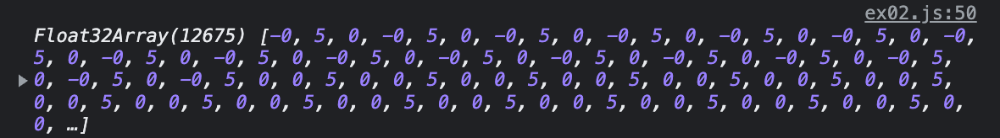

## Geometry(모양)

Geometry에 대해 더 자세히 살펴본다. 점, 선, 면으로 이루어진 모양을 의미함

### 여러가지 Geometry 살펴보기

여태 큐브(박스) 형태의 박스만 작업해봤는데, 다양한 모양으로 구현할 수 있다.
다 살펴볼 필요는 없고, 기본적으로 어떤 것들을 쓰는지 위주로 알아본다.

먼저 모양을 여러 각도에서 확인하기 위해 카메라 컨트롤을 코드에 추가해본다.

`geometry/src/ex01.js`

```jsx
import * as THREE from "three";
// 별도 import 필요
import { OrbitControls } from "three/examples/jsm/controls/OrbitControls";

// ----- 주제: Geometry 기본

export default function example() {
  // ..
  // Controls - 카메라 컨트롤 추가
  const controls = new OrbitControls(camera, renderer.domElement);

  // Mesh
  const geometry = new THREE.BoxGeometry(1, 1, 1);
  const material = new THREE.MeshStandardMaterial({ color: "hotpink" });
  const mesh = new THREE.Mesh(geometry, material);
  scene.add(mesh);

  // ..
}
```

위와 같이 OrbitControls 를 Import해서 적용해주면 마우스 휠에 반응하며 여러각도에서 모형을 확인할 수 있게된다. like this..


내부 구조를 자세히 보고싶다면 MeshStandardMaterial 속성에 wireframe 옵션을 활성화해준다.

```jsx
export default function example() {
  // ..
  const controls = new OrbitControls(camera, renderer.domElement);

  const geometry = new THREE.BoxGeometry(1, 1, 1);
  // wireframe 속성 추가
  const material = new THREE.MeshStandardMaterial({ color: "hotpink", wireframe: true });
  const mesh = new THREE.Mesh(geometry, material);
  scene.add(mesh);

  // ..
}
```


위 프레임을 바탕으로 스타일을 줄수도 있겠다. 활용할 수 있음. 우선 wireframe 속성을 꺼준다.

마우스를 계속 확대해서 박스 안으로 카메라가 들어오면 아무것도 보이지 않는 검정색 배경만 보인다. 기본적으로 three.js는 앞면만 보이고, 뒷면이 보이지 않도록 설정되어 있기 때문
때문에, 안을 보려면 설정을 조금 바꿔줘야 한다. 이것도 MeshStandardMaterial 설정으로 할 수 있다.

```jsx
export default function example() {
  // ..
  const controls = new OrbitControls(camera, renderer.domElement);

  const geometry = new THREE.BoxGeometry(1, 1, 1);
  const material = new THREE.MeshStandardMaterial({
    color: "hotpink",
    side: THREE.DoubleSide, // side 속성 추가
  });
  const mesh = new THREE.Mesh(geometry, material);
  scene.add(mesh);

  // ..
}
ㅇ;
```


이외에도 여러 속성이 있다.
아래처럼 geometry에 segment를 x, y, z 16씩 추가해주면 아래처럼 16개 segment를 가진 큐브가 생성된다.

```jsx
export default function example() {
  // ..
  const controls = new OrbitControls(camera, renderer.domElement);

  const geometry = new THREE.BoxGeometry(1, 1, 1, 16, 16, 16); // segment 추가
  const material = new THREE.MeshStandardMaterial({ color: "hotpink", wireframe: true });
  const mesh = new THREE.Mesh(geometry, material);
  scene.add(mesh);

  // ..
}
```


segment는 wireframe 속성을 off 하면 보이지 않음. 그런데 이걸 왜 쓸까? segment를 만든다는 것은 점들을 다양하게 추가한다는 것이다. 이러한 점의 좌표를 바꾸면 멋있는 것들을 많이 만들 수 있다.

[문서](https://threejs.org/docs/index.html?q=geometry#api/en/geometries/BoxGeometry)를 보고 확인해보자. CircleGeometry(원 모양), ConeGeometry (콘 모양), CylinderGeometry(원기둥 모양) 등 다양한 기본 모양들이 존재한다. 모두 다 익히려고 하지 말고 이런게 있구나 확인 위주로 이해하자

### Geometry 형태 조작하기 1

지난 시간에 알아본 segment를 통해 만들어진 정점(vertex)를 이용해 다양하게 Geometry 형태를 조작해본다.
이번에는 [SphereGeometry](https://threejs.org/docs/index.html?q=SphereGeometry#api/en/geometries/SphereGeometry)를 이용해서 만들어본다.

`src/ex02.js`

```jsx
import * as THREE from "three";
import { OrbitControls } from "three/examples/jsm/controls/OrbitControls";

// ----- 주제: Geometry 정점(Vertex) position 이용하기

export default function example() {
  // ..
  // Controls
  const controls = new OrbitControls(camera, renderer.domElement);

  // Mesh
  const geometry = new THREE.SphereGeometry(5, 64, 64); // 원모양 구 생성
  const material = new THREE.MeshStandardMaterial({
    color: "orangered",
    side: THREE.DoubleSide,
    flatShading: true,
  });
  const mesh = new THREE.Mesh(geometry, material);
  scene.add(mesh);

  console.log(geometry.attributes.position.array);

  // ..
}
```

우선 64개의 segment를 가진 원형 구를 만들었다.


위 geometry를 console로 찍어보면 attribute 내용이 나오는데 그 안에 position 속성을 이용해서 애니메이션을 주려고 한다. position의 값은 Float32Array로 담겨있음. 위 값이 이미지에서 `geometry.attributes.position.array` 값을 콘솔로 찍으면 아래와 같음



총 12,675개의 배열 값으로 존재. 위 값은 3개 묶음이 [x, y, z] 라는 점 하나의 값을 이룬다.

이제 배열을 이용해 각 점의 좌표를 변경하여 모양을 변경해본다.

`src/ex02.js`

```jsx
export default function example() {
  // ..
  const controls = new OrbitControls(camera, renderer.domElement);

  // Mesh
  const geometry = new THREE.SphereGeometry(5, 64, 64); // 원모양 구 생성
  const material = new THREE.MeshStandardMaterial({
    color: "orangered",
    side: THREE.DoubleSide,
    flatShading: true,
  });
  const mesh = new THREE.Mesh(geometry, material);
  scene.add(mesh);

  // console.log(geometry.attributes.position.array);
  const positionArray = geometry.attributes.position.array;

  // loop 한번 돌 때마다 정점(vertex) 한 개의 x, y, z 좌표를 랜덤 조정
  for (let i = 0; i < positionArray.length; i += 3) {
    // 값들이 [ x, y, z, x, y, z, ... ]이므로 3의 배수로 처리 후 i, i+1, i+2로 값 변경
    // 음, 양이 조화롭도록 0.5를 빼준다. 0이면 -0.5, 1이면 0.5
    positionArray[i] = positionArray[i] + (Math.random() - 0.5) * 0.2; // x축
    positionArray[i + 1] = positionArray[i + 1] + (Math.random() - 0.5) * 0.2; // y축
    positionArray[i + 2] = positionArray[i + 2] + (Math.random() - 0.5) * 0.2; // z축
  }
  // ..
}
```

위 코드에서 `Math.random()`만 넣어주면 구의 변형이 우측으로만 쏠리게 된다.
Math.random은 0~1 사이의 값이므로.. x축이 무조건 양수로 커짐. 이를 방지하기 위해 0.5를 빼준다.
그러면 값의 변화가 양 쪽으로 평균을 이루게 됨. `0.2`를 곱한 것은 변화의 폭을 조정하기 위함.


