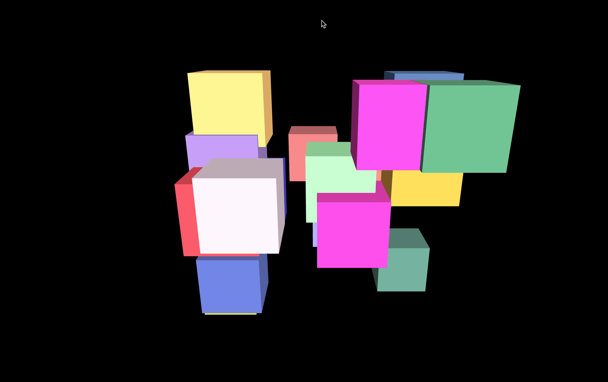

## Controls(카메라 컨트롤)

### OrbitControls

이번에는 카메라 컨트롤에 대해 알아본다. 기존에 OrbitControls를 써봤었음. 다시 살펴보자
기본 OrbitControls는 아래와 같이 구현할 수 있다.

`controls/src/ex01.js`

```jsx
import * as THREE from "three";
import { OrbitControls } from "three/examples/jsm/controls/OrbitControls";

// ----- 주제: OrbitControls

export default function example() {
  // Renderer, Scene, Camera, Light...

  // Controls
  const controls = new OrbitControls(camera, renderer.domElement);

  // Mesh, draw..
}
```

위와 같이 넣어주고 화면을 실행시키믄 마우스 움직임에 따라 박스를 이리저리 움직여볼 수 있다.


여러개의 mesh를 추가해보자.

`src/ex01.js`

```jsx
export default function example() {
  // Renderer, Scene, Camera, Light...

  // Controls
  const controls = new OrbitControls(camera, renderer.domElement);

  // Mesh
  const geometry = new THREE.BoxGeometry(1, 1, 1); // geometry는 하나 기준으로
  let mesh;
  let material;
  for (let i = 0; i < 20; i++) {
    material = new THREE.MeshStandardMaterial({
      color: `rgb(
				${50 + Math.floor(Math.random() * 205)}, 
				${50 + Math.floor(Math.random() * 205)}, 
				${50 + Math.floor(Math.random() * 205)}
			)`,
    });
    mesh = new THREE.Mesh(geometry, material);
    mesh.position.x = (Math.random() - 0.5) * 4;
    mesh.position.y = (Math.random() - 0.5) * 4;
    mesh.position.z = (Math.random() - 0.5) * 4;
    scene.add(mesh);
  }

  // ..
}
```

위 코드는 아래와 같은 같은 사이즈의 mesh를 랜덤한 색과 위치에 배치한다.


이제 카메라 옵션을 조금 수정해본다.

```jsx
export default function example() {
  // Renderer, Scene, Camera, Light...

  // Controls
  const controls = new OrbitControls(camera, renderer.domElement);
  controls.enableDamping = true; // 움직임을 부드럽게 만들어준다. 그냥 쓰면 안된다.

  // ..
  function draw() {
    const delta = clock.getDelta();

    controls.update(); // controls 매번 update해줘야 enableDamping 속성 활성화

    renderer.render(scene, camera);
    renderer.setAnimationLoop(draw);
  }
  // ..
}
```

위와 같이 enableDamping 속성을 활성화해준 뒤 draw 함수에서 update 해주면 움직임이 부드럽고, 비교적 자연스러워진 것을 확인할 수 있음. 각 컨트롤 속성마다 사용방법이 다르니 문서보면서 작업하면 됨


```jsx
export default function example() {
  // Renderer, Scene, Camera, Light...

  // Controls
  const controls = new OrbitControls(camera, renderer.domElement);
  controls.enableDamping = true;

  controls.enableZoom = false; // 줌 안되게, 마우스로 회전만 가능

  controls.maxDistance = 10; // 10 이하로는 줌 아웃이 안된다. 최대 거리(maxDistance) 설정 가능
  controls.minDistance = 2; // 2 이상으로는 줌 인이 안된다. 최소 거리(minDistance) 설정 가능

  // controls.minPolarAngle = Math.PI / 4; // 45도까지만 마우스로 돌려볼 수 있도록 고정
  controls.minPolarAngle = THREE.MathUtils.degToRad(45); // Math.PI / 4와 같음
  controls.maxPolarAngle = THREE.MathUtils.degToRad(135);

  controls.target.set(2, 2, 2); // 회전 중심 타겟을 2,2,2로 옮김

  controls.autoRotate = true; // 자동 회전 옵션
  controls.autoRotateSpeed = 20; // 회전 속도 설정
  // ..
}
```

enableZoom은 줌 이용 여부를 설정하는 옵션, maxDistance, minDistance는 줌 인/아웃 시 최대/최소 거리를 설정하는 옵션이다. minPolarAngle, maxPolarAngle은 마우스 회전 시 최대/최소 각도를 설정하는 옵션이다. target은 회전 중심 타겟을 x, y, z 좌표 기준으로 옮기는 설정이며, autoRotate, autoRotateSpeed는 자동 회전 및 속도를 설정하는 옵션임


이처럼 다양한 옵션이 있음. 문서를 보고 필요한 옵션을 적절히 활용하자!

### TrackballControls

이번에는 TrackballControls를 해본다. OrbitControls와 비슷한데 회전 방향이 세로도 가능하다는 점이다.

`src/ex02.js`

```jsx
import * as THREE from "three";
import { TrackballControls } from "three/examples/jsm/controls/TrackballControls";

// ----- 주제: TrackballControls

export default function example() {
  // Renderer, Scene, Camera, Light...

  // Controls
  // 기본적으로 enableDamping 효과는 적용되어 있다.
  const controls = new TrackballControls(camera, renderer.domElement);
  controls.maxDistance = 20; // 줌 아웃 최대
  controls.minDistance = 5; // 줌 인 최대
  controls.target.set(3, 3, 3); // draw에서 update를 해줘야 한다.

  function draw() {
    const delta = clock.getDelta();
    controls.update(); // update 꼭 해준다.

    renderer.render(scene, camera);
    renderer.setAnimationLoop(draw);
  }

  // ..
}
```

위와 같이 TrackballControls을 적용하면 위로도 360도 회전이 가능한 구조가 됨.



주로 쓰이는 옵션도 같이 체크해주자

### FlyControls

FlyControls는 키보드 자판키에 따라 움직이는 카메라 옵션이다.

`src/ex03.js`

```jsx
import * as THREE from "three";
import { FlyControls } from "three/examples/jsm/controls/FlyControls";

// ----- 주제: FlyControls

export default function example() {
  // Renderer, Scene, Camera, Light...

  // Controls
  const controls = new FlyControls(camera, renderer.domElement);
  controls.rollSpeed = 0.5; // 카메라 이동 속도
  controls.movementSpeed = 3; // 키보드 입력 시 카메라 이동 속도
  controls.dragToLook = true; // 드래그로만 카메라가 이동

  // ..

  // 그리기
  const clock = new THREE.Clock();

  function draw() {
    const delta = clock.getDelta();
    controls.update(delta); // FlyControls는 update 시 delta 값을 넣어줘야 한다.

    renderer.render(scene, camera);
    renderer.setAnimationLoop(draw);
  }

  // ..
}
```

W(앞), A(왼쪽), S(뒤), D(오른쪽), R(위로), F(아래로), 마우스 왼쪽 앞으로, 오른쪽 클릭하면 뒤로 이동하는 이벤트가 기본적으로 적용된 메서드임. rollSpeed, movementSpeed, dragToLook 등의 옵션이 있으므로 적절한 것을 찾아서 구현한다.

### FirstPersonControls

FirstPersonControls 앞서 구현한 FlyControls 대체 구현 메서드이다. 즉 비슷함
기능을 추가하거나 살짝 바꾼 느낌임

`src/ex04.js`

```jsx
import * as THREE from "three";
import { FirstPersonControls } from "three/examples/jsm/controls/FirstPersonControls";

// ----- 주제: FirstPersonControls

export default function example() {
  // Renderer, Scene, Camera, Light...

  // Controls
  const controls = new FirstPersonControls(camera, renderer.domElement);
  controls.movementSpeed = 10; // 키보드 입력 시 카메라 이동 속도
  controls.activeLook = false; // 주변을 둘러볼 수 있는지 유무. false면 각도 변경이 불가. 움직일 수만 있다.
  controls.lookSpeed = 0.05; // 카메라 이동 속도
  controls.autoForward = true; // 자동 앞으로 이동

  // 그리기
  const clock = new THREE.Clock();

  function draw() {
    const delta = clock.getDelta();
    controls.update(delta); // FirstPersonControls도 update 시 delta 값을 넣어줘야 함

    renderer.render(scene, camera);
    renderer.setAnimationLoop(draw);
  }

  // ..
}
```

이 밖에도 다양한 속성이 있으니 문서로 확인

### PointerLockControls

PointerLockControls는 유저액션을 정의하는 메서드임. 그냥 메서드만 적용하면 아무 움직임이 없다.

`src/ex05.js`

```jsx
import * as THREE from "three";
import { PointerLockControls } from "three/examples/jsm/controls/PointerLockControls";

// ----- 주제: PointerLockControls

export default function example() {
  // Renderer, Scene, Camera, Light...

  // Controls
  const controls = new PointerLockControls(camera, renderer.domElement);
  console.log(controls.domElement); // <canvas id="three-canvas" data-engine="three.js r149" width="2506" height="2608" style="width: 1253px; height: 1304px;"></canvas>
  console.log(controls.domElement === renderer.domElement); // true

  controls.domElement.addEventListener("click", () => {
    controls.lock(); // pointer lock api 활용함
  });

  controls.addEventListener("lock", () => {
    console.log("lock"); // pointer lock api 실행 시
  });
  controls.addEventListener("unlock", () => {
    console.log("unlock"); // pointer lock api 중단 시
  });

  // ..
}
```

PointerLockControls는 domElement에 유저 액션을 추가하여 사용하는데, 우선 controls.domElement는 canvas를 의미하며, 이는 renderer.domElement와 같은 아이를 바라보고 있음

여기에 클릭 이벤트를 넣어서 `controls.lock()` 메서드를 실행해주는데 이때 실행되는 것은 [pointer lock api](https://developer.mozilla.org/en-US/docs/Web/API/Pointer_Lock_API)로 자바스크립트에서 제공되는 메서드를 쉽게 구현할 수 있게된다.


esc 키를 누르면 빠져나올 수 있으며, 진입 시 이벤트를 `lock`으로, 중단 시 이벤트를 `unlock`으로 체크해서 원하는 이벤트를 수행하도록 할 수 있다.
