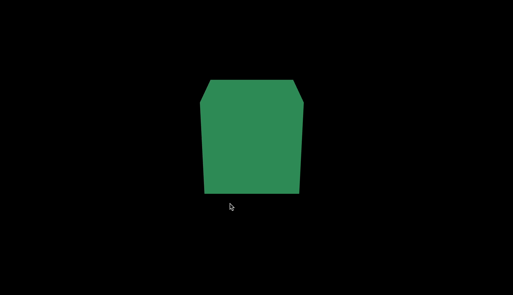
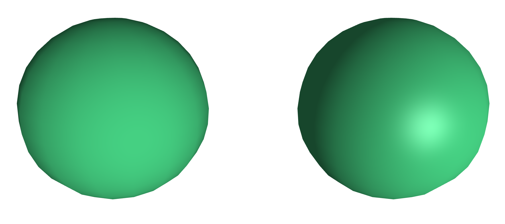
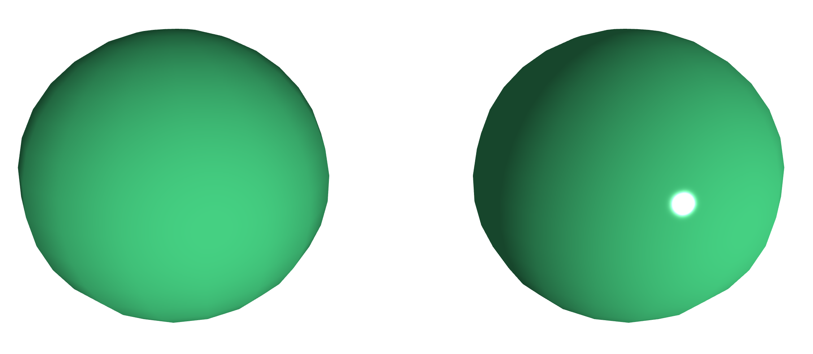

## Material(재질)

### MeshBasicMaterial

이번 섹션에서는 Material에 대해 알아본다. 재질도 다양한 종류와 기능을 가지고 있다.
MeshBasicMaterial은 입체감이 없는 기본적 Material이다.

`material/src/ex01.js`

```
import * as THREE from "three";
import { OrbitControls } from "three/examples/jsm/controls/OrbitControls";

// ----- 주제: MeshBasicMaterial

export default function example() {
  // Renderer, Scene, Camera ...
  // Controls - camera lookat으로 물체를 바라보므로 정중앙에 사물이 위치함
  const controls = new OrbitControls(camera, renderer.domElement);

  // Mesh
  const geometry = new THREE.BoxGeometry(1, 1, 1);

	// MeshBasicMaterial 적용
  const material = new THREE.MeshBasicMaterial({
    color: "seagreen",
  });

  const mesh = new THREE.Mesh(geometry, material);
  scene.add(mesh);

  // ..
}
```



별도의 빛이나 그림자의 영향을 받지 않으므로 Light도 필요가 없다.
단색으로 노출되는 기본적 기능이므로 성능도 가장 빠름

### MeshLambertMaterial, MeshPhongMaterial

이번에는 MeshLambertMaterial, MeshPhongMaterial를 배워본다.
두 개를 비교하면서 익혀봄. 즉 mesh를 두 개 만든다.

`src/ex02.js`

```jsx
// ----- 주제: MeshLambertMaterial, MeshPhongMaterial

export default function example() {
  // Renderer, Scene, Camera, Controls ...

  // Light - 빛이 필요하므로 Light 추가
  const ambientLight = new THREE.AmbientLight("white", 0.5);
  const directionalLight = new THREE.DirectionalLight("white", 1);
  directionalLight.position.set(1, 0, 2);
  scene.add(ambientLight, directionalLight);

  // Mesh
  const geometry = new THREE.SphereGeometry(1, 16, 16);

  // MeshLambertMaterial 하이라이트, 반사광 없는 재질
  const material1 = new THREE.MeshLambertMaterial({ color: "seagreen" });
  // MeshPhongMaterial 하이라이트, 반사광 표현 가능한 재질
  const material2 = new THREE.MeshPhongMaterial({ color: "seagreen" });

  const mesh1 = new THREE.Mesh(geometry, material1);
  const mesh2 = new THREE.Mesh(geometry, material2);
  mesh1.position.x = -1.5;
  mesh2.position.x = 1.5;
  scene.add(mesh1, mesh2);

  // ..
}
```

위와 같이 MeshLambertMaterial, MeshPhongMaterial를 넣어주면 두 개의 구를 확인할 수 있음



MeshPhongMaterial 는 하이라이트 정도를 조절할 수 있다.

```jsx
// ----- 주제: MeshLambertMaterial, MeshPhongMaterial

export default function example() {
  // Renderer, Scene, Camera, Controls ...

  // Mesh
  const geometry = new THREE.SphereGeometry(1, 16, 16);
  const material1 = new THREE.MeshLambertMaterial({ color: "seagreen" });
  const material2 = new THREE.MeshPhongMaterial({
    color: "seagreen",
    shininess: 1000, // shininess 정도 조절
  });

  const mesh1 = new THREE.Mesh(geometry, material1);
  const mesh2 = new THREE.Mesh(geometry, material2);
  mesh1.position.x = -1.5;
  mesh2.position.x = 1.5;
  scene.add(mesh1, mesh2);

  // ..
}
```

위와 같이 하면 두 Material 간 차이를 극명하게 확인할 수 있다.



위 shininess 값을 0으로 주면 해당 속성을 사용하지 않는 개념이므로 MeshLambertMaterial과 동일하게 노출
