## Material(재질)

### MeshBasicMaterial

이번 섹션에서는 Material에 대해 알아본다. 재질도 다양한 종류와 기능을 가지고 있다.
MeshBasicMaterial은 입체감이 없는 기본적 Material이다.

`material/src/ex01.js`

```
import * as THREE from "three";
import { OrbitControls } from "three/examples/jsm/controls/OrbitControls";

// ----- 주제: MeshBasicMaterial

export default function example() {
  // Renderer, Scene, Camera ...
  // Controls - camera lookat으로 물체를 바라보므로 정중앙에 사물이 위치함
  const controls = new OrbitControls(camera, renderer.domElement);

  // Mesh
  const geometry = new THREE.BoxGeometry(1, 1, 1);

	// MeshBasicMaterial 적용
  const material = new THREE.MeshBasicMaterial({
    color: "seagreen",
  });

  const mesh = new THREE.Mesh(geometry, material);
  scene.add(mesh);

  // ..
}
```


별도의 빛이나 그림자의 영향을 받지 않으므로 Light도 필요가 없다.
단색으로 노출되는 기본적 기능이므로 성능도 가장 빠름

### MeshLambertMaterial, MeshPhongMaterial

이번에는 MeshLambertMaterial, MeshPhongMaterial를 배워본다.
두 개를 비교하면서 익혀봄. 즉 mesh를 두 개 만든다.

`src/ex02.js`

```jsx
// ----- 주제: MeshLambertMaterial, MeshPhongMaterial

export default function example() {
  // Renderer, Scene, Camera, Controls ...

  // Light - 빛이 필요하므로 Light 추가
  const ambientLight = new THREE.AmbientLight("white", 0.5);
  const directionalLight = new THREE.DirectionalLight("white", 1);
  directionalLight.position.set(1, 0, 2);
  scene.add(ambientLight, directionalLight);

  // Mesh
  const geometry = new THREE.SphereGeometry(1, 16, 16);

  // MeshLambertMaterial 하이라이트, 반사광 없는 재질
  const material1 = new THREE.MeshLambertMaterial({ color: "seagreen" });
  // MeshPhongMaterial 하이라이트, 반사광 표현 가능한 재질
  const material2 = new THREE.MeshPhongMaterial({ color: "seagreen" });

  const mesh1 = new THREE.Mesh(geometry, material1);
  const mesh2 = new THREE.Mesh(geometry, material2);
  mesh1.position.x = -1.5;
  mesh2.position.x = 1.5;
  scene.add(mesh1, mesh2);

  // ..
}
```

위와 같이 MeshLambertMaterial, MeshPhongMaterial를 넣어주면 두 개의 구를 확인할 수 있음


MeshPhongMaterial 는 하이라이트 정도를 조절할 수 있다.

```jsx
// ----- 주제: MeshLambertMaterial, MeshPhongMaterial

export default function example() {
  // Renderer, Scene, Camera, Controls ...

  // Mesh
  const geometry = new THREE.SphereGeometry(1, 16, 16);
  const material1 = new THREE.MeshLambertMaterial({ color: "seagreen" });
  const material2 = new THREE.MeshPhongMaterial({
    color: "seagreen",
    shininess: 1000, // shininess 정도 조절
  });

  const mesh1 = new THREE.Mesh(geometry, material1);
  const mesh2 = new THREE.Mesh(geometry, material2);
  mesh1.position.x = -1.5;
  mesh2.position.x = 1.5;
  scene.add(mesh1, mesh2);

  // ..
}
```

위와 같이 하면 두 Material 간 차이를 극명하게 확인할 수 있다.


위 shininess 값을 0으로 주면 해당 속성을 사용하지 않는 개념이므로 MeshLambertMaterial과 동일하게 노출

### **MeshStandardMaterial**

앞서 배웠던 MeshPhongMaterial과 MeshStandardMaterial을 비교해본다.

`src/ex03.js`

```jsx
// ----- 주제: MeshStandardMaterial

export default function example() {
  // Renderer, Scene, Camera, Controls ...

  // Mesh
  const geometry = new THREE.SphereGeometry(1, 16, 16);

  // MeshPhongMaterial 하이라이트, 반사광 표현 가능한 재질
  const material1 = new THREE.MeshPhongMaterial({ color: "orangered" });
  // MeshStandardMaterial 하이라이트, 반사광 표현 가능한 재질
  const material2 = new THREE.MeshStandardMaterial({ color: "orangered" });

  // mesh.add...
  // ..
}
```


위 두 속성은 모두 하이라이트와 반사광 표현이 가능한 재질이다. 단, 사용방법과 노출되는 느낌이 살짝 다름

`src/ex03.js`

```jsx
// ----- 주제: MeshStandardMaterial

export default function example() {
  // Renderer, Scene, Camera, Controls ...

  // Mesh
  const geometry = new THREE.SphereGeometry(1, 16, 16);

  // MeshPhongMaterial 하이라이트, 반사광 표현 가능한 재질
  const material1 = new THREE.MeshPhongMaterial({
    color: "orangered",
    shininess: 800, // 재질 표현(shininess)
  });

  // MeshStandardMaterial 하이라이트, 반사광 표현 가능한 재질
  const material2 = new THREE.MeshStandardMaterial({
    color: "orangered",
    roughness: 0.5, // 재질 표현 (roughness)
    metalness: 0.5, // 재질 표현 - 쇠느낌(?)
  });

  // mesh.add...
  // ..
}
```

위와 같이 효과를 넣으면 아래와 같이 결과가 나온다.


성능은 MeshPhongMaterial이 살짝 빠른 편, 원하는 메서드를 골라서 사용한다.
이 밖에도 매우 다양한 메서드와 옵션 들이 있으니 그 중에서 필요한 걸로 골라쓴다.

### 각지게 표현하기, flatShading

각지게 표현하는 것에 대해 확인하고 넘어간다. 자주 쓰인다.

`src/ex04.js`

```jsx
// ----- 주제: flatShading

export default function example() {
  // Renderer, Scene, Camera, Controls ...

  // Mesh
  const geometry = new THREE.SphereGeometry(1, 16, 16);
  const material1 = new THREE.MeshPhongMaterial({
    color: "orangered",
    shininess: 800,
    flatShading: true,
  });
  const material2 = new THREE.MeshStandardMaterial({
    color: "orangered",
    roughness: 0.2,
    metalness: 0.3,
    flatShading: true,
  });

  // mesh.add...
  // ..
}
```

위와 같이 넣으면 각진 구 모양 생성! 요즘 다양하게 사용하는 스타일인 것 같당


### Mesh의 앞뒷면

이번에는 Mesh의 앞, 뒷면에 대해 알아본다. Meterial은 점(vertext), 선(edge), 면(face)으로 이루어져있다. 위 설정에 따라 앞, 뒷면을 다양하게 설정할 수 있음. 아래와 같은 mesh가 구현되어 있다고 하자.

`src/ex05.js`

```jsx
// ----- 주제: Side

export default function example() {
  // Renderer, Scene, Camera, Controls ...
  // Mesh
  const geometry = new THREE.BoxGeometry(2, 2, 2);
  const material = new THREE.MeshStandardMaterial({
    color: "orangered",
    roughness: 0.2,
    metalness: 0.3,
  });

  const mesh = new THREE.Mesh(geometry, material);
  scene.add(mesh);

  // ..
}
```

기본적인 BoxGeometry와 MeshStandardMaterial이 연결되어있음. 사물의 뒷면이 별도로 노출되지 않는다.
여기에 뒷면을 보이게 옵션을 추가해본다.


```jsx
export default function example() {
  // Renderer, Scene, Camera, Controls ...
  // Mesh
  const geometry = new THREE.BoxGeometry(2, 2, 2);
  const material = new THREE.MeshStandardMaterial({
    color: "orangered",
    roughness: 0.2,
    metalness: 0.3,
    // side: THREE.FrontSide, // default value
    // side: THREE.BackSide, // 뒷 면만 보이게
    side: THREE.DoubleSide, // 큐브 안쪽까지 모두 다 보이게
  });

  const mesh = new THREE.Mesh(geometry, material);
  scene.add(mesh);

  // ..
}
```

위와 같이 side란 옵션으로 큐브 안쪽, 혹은 뒷면만 보이도록 설정 가능


### 텍스쳐 이미지 로드하기

외부 이미지를 로드한 뒤 객체에 입혀본다. (포장)

이왕이면 3D 모델을 위해 만들어진 이미지를 가져다 쓰면 더 그럴싸해 보일 것 같다.
구글에 3d texture라고 검색하면 다양한 이미지들이 많이 나옴. 여기 [사이트](https://3dtextures.me/)를 참고했음

벽돌 텍스쳐 이미지를 [여기](https://3dtextures.me/2020/09/17/brick-wall-019/)에서 다운로드 한 뒤 src/textures/brick 폴더에 옮겨둔다.
코드 작업을 하기에 앞서 src 폴더 내부에 넣어둔 이미지를 사용하기 위해 webpack 설정을 추가한다.

`material/webpack.config.js`

```jsx
// ..
module.exports = {
  // ..
  plugins: [
    // ..
    // CopyWebpackPlugin: 그대로 복사할 파일들을 설정하는 플러그인
    // 아래 patterns에 설정한 파일/폴더는 빌드 시 dist 폴더에 자동으로 생성됩니다.
    // patterns에 설정한 경로에 해당 파일이 없으면 에러가 발생합니다.
    // 사용하는 파일이나 폴더 이름이 다르다면 변경해주세요.
    // 그대로 사용할 파일들이 없다면 CopyWebpackPlugin을 통째로 주석 처리 해주세요.
    new CopyWebpackPlugin({
      patterns: [
        { from: "./src/main.css", to: "./main.css" },
        { from: "./src/textures", to: "./textures" }, // textures 폴더 추가
      ],
    }),
  ],
};
```

`src/ex06.js`

```jsx
// ----- 주제: 텍스쳐 이미지 로드하기

export default function example() {
  // 텍스쳐 이미지 로드
  const textureLoader = new THREE.TextureLoader();
  // 이미지 호출 - 예시 1
  const texture = textureLoader.load("/textures/brick/Brick_Wall_019_basecolor.jpg");
  // 이미지 호출 - 예시 2
  const texture = textureLoader.load(
    "/textures/brick/Brick_Wall_019_basecolor123123.jpg"
    // () => console.log("로드 완료"),
    // () => console.log("로드 중"),
    // () => console.log("로드 실패")
  );

  // ..
}
```

텍스쳐 이미지 로드는 위와 같이 THREE.TextureLoader 메서드를 호출해서 사용한다. 기본적으로 이미지 경로만 적어줘도 되고, 조건에 따라 체크할 수 있는 함수를 로드 중, 로드 완료, 로드 실패 조건으로 3가지 함수를 넣을 수 있다. 위에서 생성한 texture를 material에 적용해본다.

`src/ex06.js`

```jsx
// ----- 주제: 텍스쳐 이미지 로드하기

export default function example() {
  // 텍스쳐 이미지 로드
  const textureLoader = new THREE.TextureLoader();
  // 이미지 호출
  const texture = textureLoader.load("/textures/brick/Brick_Wall_019_basecolor.jpg");

  // Mesh
  const geometry = new THREE.BoxGeometry(1, 1, 1);

  const material1 = new THREE.MeshStandardMaterial({ map: texture });
  const material2 = new THREE.MeshBasicMaterial({ map: texture });

  const mesh1 = new THREE.Mesh(geometry, material1);
  const mesh2 = new THREE.Mesh(geometry, material2);

  mesh1.position.x = -1;
  mesh2.position.x = 1;

  scene.add(mesh1, mesh2);

  // ..
}
```

위와 같이 MeshStandardMaterial, MeshBasicMaterial에 texture를 매핑해주면 각 속성을 그대로 유지한 채 texture만 매핑된 사물을 확인할 수 있다.

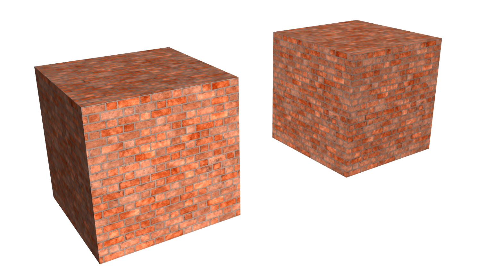

### 로딩 매니저(여러개의 텍스쳐 이미지)

여러개의 텍스쳐 이미지를 불러올 때는 three.js에서 제공하는 로딩 매니저를 사용하면 매우 유용하다.

`src/ex07.js`

```jsx
// ----- 주제: 로딩 매니저(여러개의 테스쳐 이미지를 로드할 때 사용)

export default function example() {
  // 텍스쳐 이미지 로더 생성
  const loadingManager = new THREE.LoadingManager();

  loadingManager.onStart = () => {
    console.log("로드 시작");
  };
  loadingManager.onProgress = (img) => {
    console.log(img + " 로드");
  };
  loadingManager.onLoad = () => {
    console.log("로드 완료");
  };
  loadingManager.onError = () => {
    console.log("로드 실패");
  };

  // 텍스쳐 로드 생성
  const textureLoader = new THREE.TextureLoader(loadingManager);
  const baseColorTex = textureLoader.load("/textures/brick/Brick_Wall_019_basecolor.jpg");
  const ambientTex = textureLoader.load("/textures/brick/Brick_Wall_019_ambientOcclusion.jpg");
  const normalTex = textureLoader.load("/textures/brick/Brick_Wall_019_normal.jpg");
  const roughnessTex = textureLoader.load("/textures/brick/Brick_Wall_019_roughness.jpg");
  const heightTex = textureLoader.load("/textures/brick/Brick_Wall_019_height.png");

  // ..

  // Mesh
  const geometry = new THREE.BoxGeometry(1, 1, 1);
  const material1 = new THREE.MeshStandardMaterial({ map: normalTex });
  const material2 = new THREE.MeshStandardMaterial({ map: heightTex });

  const mesh1 = new THREE.Mesh(geometry, material1);
  const mesh2 = new THREE.Mesh(geometry, material2);
  mesh1.position.x = -1;
  mesh2.position.x = 1;
  scene.add(mesh1, mesh2);

  // ..
}
```

위와 같이 코드를 넣으면 이미지 로드에 대한 정보를 각 onStart, onProgress, onLoad, onError 메서드를 통해서 가져올 수 있다.

```bash
로드 시작
/textures/brick/Brick_Wall_019_basecolor.jpg 로드
/textures/brick/Brick_Wall_019_ambientOcclusion.jpg 로드
/textures/brick/Brick_Wall_019_normal.jpg 로드
/textures/brick/Brick_Wall_019_roughness.jpg 로드
/textures/brick/Brick_Wall_019_height.png 로드
로드 완료
```

또한 각 메서드들이 잘 호출되어서 mesh에 입혀지는 것을 확인할 수 있음


### 텍스쳐 변환

이번에는 텍스쳐 이미지의 위치를 이동하거나 회전하는 등의 변환을 해본다.
해골 모양의 [새로운 텍스쳐 이미지](https://3dtextures.me/2021/03/11/ground-skull-001/)를 사용해본다.

`src/ex08.js`

```jsx
// ----- 주제: 텍스쳐 이미지 변환

export default function example() {
  const textureLoader = new THREE.TextureLoader();
  const texture = textureLoader.load("/textures/skull/Ground Skull_basecolor.jpg");

  // Renderer, Scene, Camera, Light, Controls ..

  // Mesh
  const geometry = new THREE.BoxGeometry(1, 1, 1);
  const material = new THREE.MeshStandardMaterial({ map: texture });

  const mesh = new THREE.Mesh(geometry, material);
  scene.add(mesh);

  // ..
}
```

위와 같이 새로운 텍스쳐를 적용하면 아래와 같다.

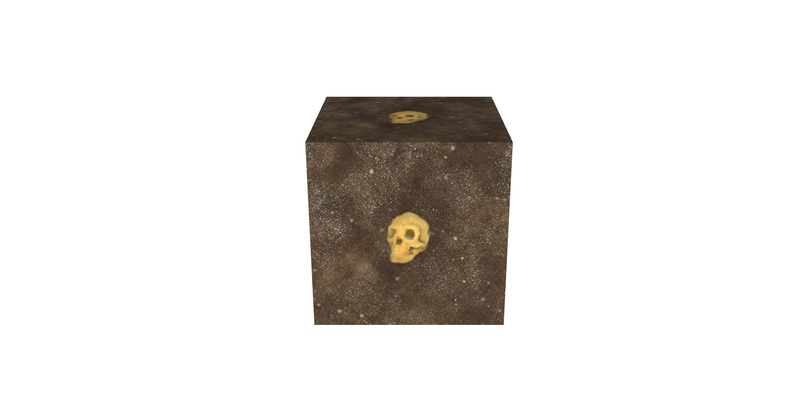

무시무시한 해골이 노출되었다. 이제 이 텍스쳐 이미지에 변환을 하나씩 해보자.
먼저 텍스쳐의 위치를 x 축 위치로 0.3만큼 이동시켜본다.

`src/ex08.js`

```jsx
export default function example() {
  const textureLoader = new THREE.TextureLoader();
  const texture = textureLoader.load("/textures/skull/Ground Skull_basecolor.jpg");
  texture.offset.x = 0.3; // 텍스쳐의 위치를 이동시킴

  // ..
}
```

위와 같이 offset으로 위치를 이동시키면 아래와 같이 노출된다.

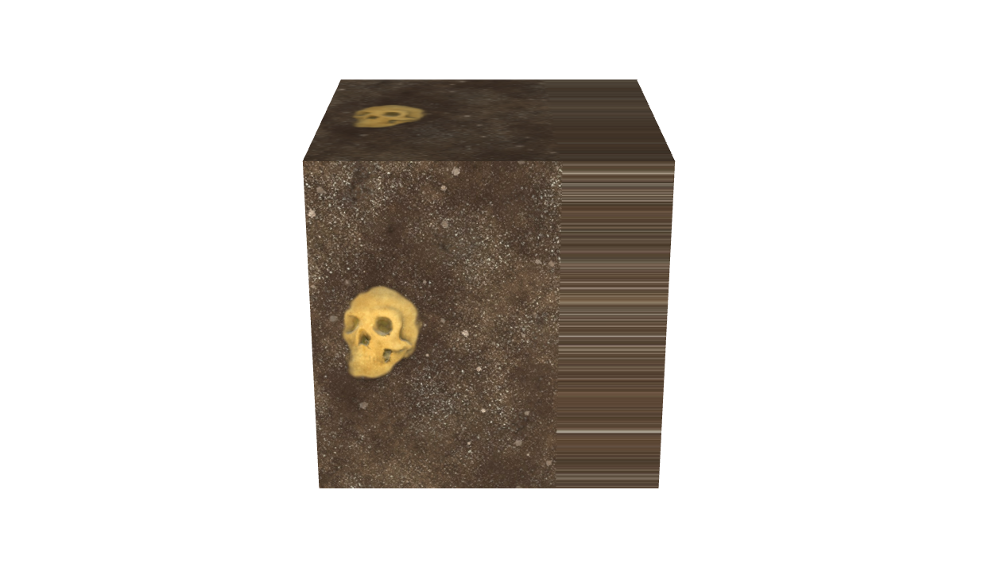

0.3만큼 이동 후 남은 부분이 이상함.. x 축에 대한 여백을 기존 텍스쳐로 노출되도록 아래와 같이 설정한다.

```jsx
export default function example() {
  const textureLoader = new THREE.TextureLoader();
  const texture = textureLoader.load("/textures/skull/Ground Skull_basecolor.jpg");

  texture.wrapS = THREE.RepeatWrapping; // 추가
  texture.offset.x = 0.3;

  // ..
}
```

그러면 원래대로 첫 번째 이미지와 동일하게 노출됨, offset.y로 0.3 움직여주면 아래와 위에 동일한 현상 발생

```jsx
export default function example() {
  const textureLoader = new THREE.TextureLoader();
  const texture = textureLoader.load("/textures/skull/Ground Skull_basecolor.jpg");

  texture.wrapS = THREE.RepeatWrapping; // 추가

  texture.offset.x = 0.3;
  texture.offset.y = 0.3;

  // ..
}
```

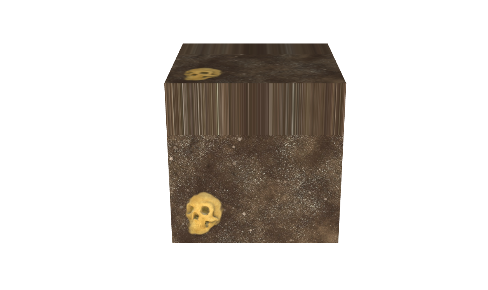

```jsx
export default function example() {
  const textureLoader = new THREE.TextureLoader();
  const texture = textureLoader.load("/textures/skull/Ground Skull_basecolor.jpg");

  texture.wrapS = THREE.RepeatWrapping; // x축
  texture.wrapT = THREE.RepeatWrapping; // y축

  texture.offset.x = 0.3;
  texture.offset.y = 0.3;

  // ..
}
```

위와 같이하면 모든 면이 첫 번째 이미지와 동일하게 노출된다. RepeatWrapping은 texture 변환 시 거의 기본적으로 넣어줘야하는 메서드임! 기억해두자.

```jsx
export default function example() {
  const textureLoader = new THREE.TextureLoader();
  const texture = textureLoader.load("/textures/skull/Ground Skull_basecolor.jpg");

  texture.wrapS = THREE.RepeatWrapping; // x축
  texture.wrapT = THREE.RepeatWrapping; // y축

  texture.offset.x = 0.3;
  texture.offset.y = 0.3;

  // ..
}
```

다음으로 repeat에 대해 배워본다.

```jsx
export default function example() {
  const textureLoader = new THREE.TextureLoader();
  const texture = textureLoader.load("/textures/skull/Ground Skull_basecolor.jpg");

  texture.wrapS = THREE.RepeatWrapping;
  texture.wrapT = THREE.RepeatWrapping;

  texture.offset.x = 0.3;
  texture.offset.y = 0.3;

  texture.repeat.x = 2; // repeat
  texture.repeat.y = 2; // repeat

  // ..
}
```

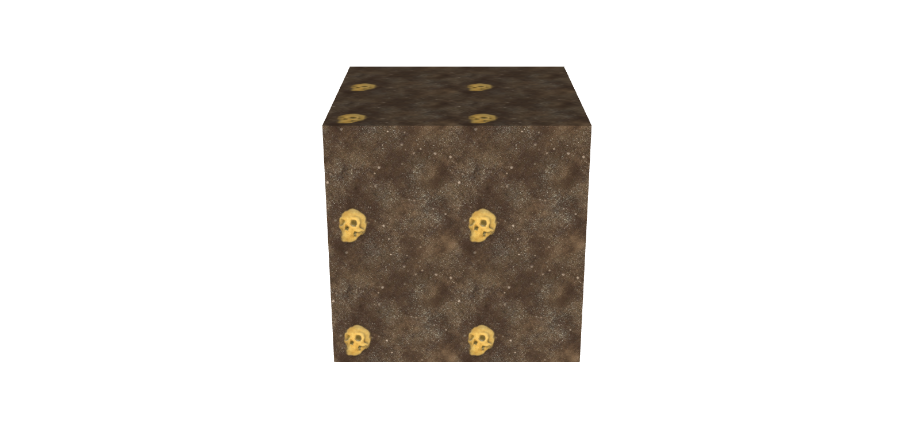

가로세로 2번의 반복을 주어 총 4개의 텍스트 이미지가 한 면에 노출되는 것을 확인할 수 있음 다음은 rotate이다.

```jsx
export default function example() {
  const textureLoader = new THREE.TextureLoader();
  const texture = textureLoader.load("/textures/skull/Ground Skull_basecolor.jpg");

  texture.wrapS = THREE.RepeatWrapping;
  texture.wrapT = THREE.RepeatWrapping;

  // texture.rotation = Math.PI * 0.25; // 텍스쳐의 회전
  texture.rotation = THREE.MathUtils.degToRad(45); // 텍스쳐의 회전

  // ..
}
```

이러면 아래와 같이 회전함

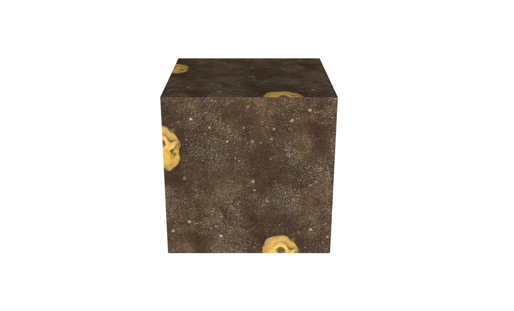

그런데 뭔가 이상하다. 회전 축이 박스의 가운데에서 돌아가지 않아서.. 원하는대로 해골이 회전하지 않음 따라서 회전 중심축을 가운데로 바꿔준다.

```jsx
export default function example() {
  const textureLoader = new THREE.TextureLoader();
  const texture = textureLoader.load("/textures/skull/Ground Skull_basecolor.jpg");

  texture.wrapS = THREE.RepeatWrapping;
  texture.wrapT = THREE.RepeatWrapping;

  texture.rotation = THREE.MathUtils.degToRad(65);
  texture.center.x = 0.5; // 텍스쳐의 중심점 변경 - x축 센터 정렬
  texture.center.y = 0.5; // 텍스쳐의 중심점 뱐걍 - y축 센터 정렬

  // ..
}
```

위와 같이 [texture.center](http://texture.center) 의 x, y 값을 0.5로 설정하면 한 면의 센터로 정렬되며 원하는대로 구현 가능함

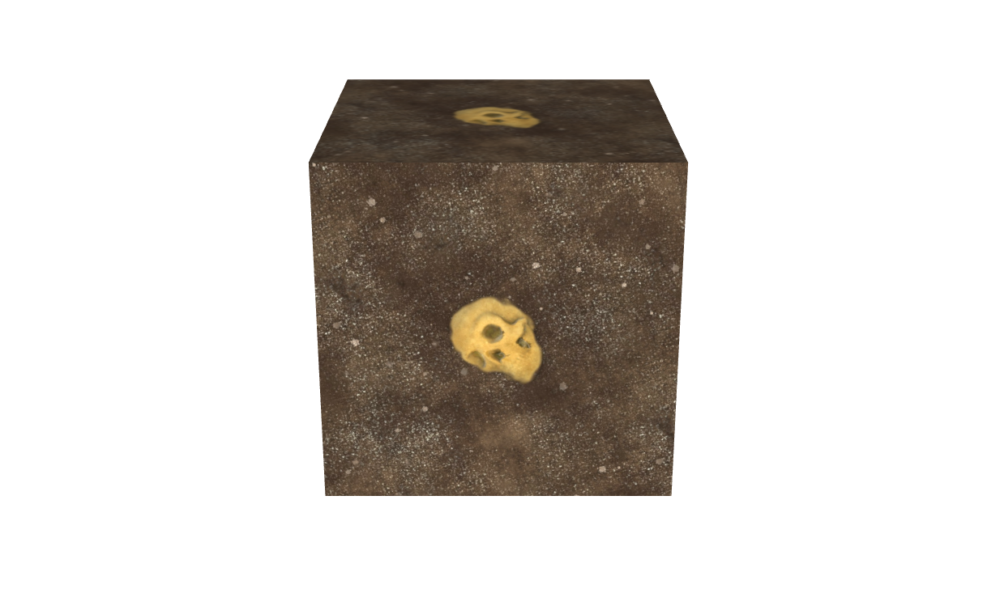

### 여러 이미지 텍스쳐가 적용된 큐브

이번에는 여러가지 텍스쳐가 적용된 큐브를 만들어본다. 각각 면에 다른 이미지를 적용함
이미지는 `images/mcstyle` 폴더에 있는 이미지를 가져다 쓴다.

`src/ex09.js`

```jsx
// ----- 주제: 여러가지 텍스쳐가 적용된 큐브

export default function example() {
  const textureLoader = new THREE.TextureLoader();

  // 각 면에 들어갈 텍스쳐 이미지 로드
  const rightTexture = textureLoader.load("/textures/mcstyle/right.png");
  const leftTexture = textureLoader.load("/textures/mcstyle/left.png");
  const topTexture = textureLoader.load("/textures/mcstyle/top.png");
  const bottomTexture = textureLoader.load("/textures/mcstyle/bottom.png");
  const frontTexture = textureLoader.load("/textures/mcstyle/front.png");
  const backTexture = textureLoader.load("/textures/mcstyle/back.png");

  // 각 텍스쳐 원소로 가진 materials를 생성
  const materials = [
    new THREE.MeshBasicMaterial({ map: rightTexture }),
    new THREE.MeshBasicMaterial({ map: leftTexture }),
    new THREE.MeshBasicMaterial({ map: topTexture }),
    new THREE.MeshBasicMaterial({ map: bottomTexture }),
    new THREE.MeshBasicMaterial({ map: frontTexture }),
    new THREE.MeshBasicMaterial({ map: backTexture }),
  ];

  // ..

  // Mesh
  const geometry = new THREE.BoxGeometry(1, 1, 1);
  const mesh = new THREE.Mesh(geometry, materials); // Mesh 적용 시 materials를 적용하여 각 면에 해당하는 이미지를 넣어줌
  scene.add(mesh);

  // ...
}
```

위와 같이 넣어주면 각 면에 맞는 이미지가 적용된 큐브가 만들어진다. (순서가 중요함)

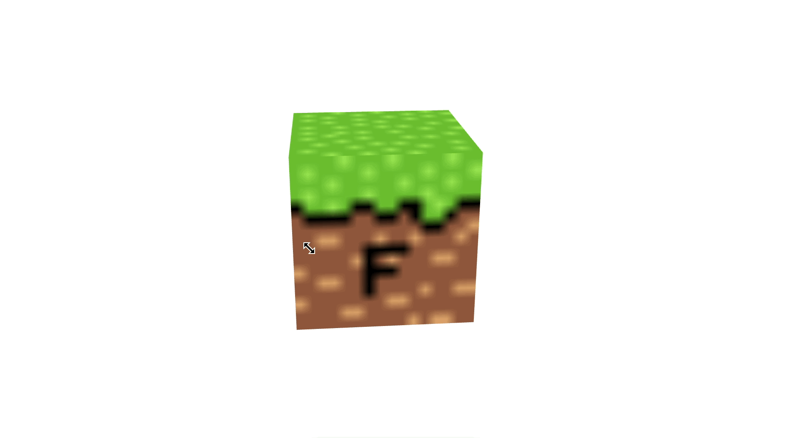

그런데 픽셀 크기의 이미지를 쓰니 화질이 영 떨어짐. 이를 개선하는 메서드가 있다.

```jsx
// ----- 주제: 여러가지 텍스쳐가 적용된 큐브

export default function example() {
  const textureLoader = new THREE.TextureLoader();

  // 각 면에 들어갈 텍스쳐 이미지 로드
  const rightTexture = textureLoader.load("/textures/mcstyle/right.png");
  // ..

  // 각 텍스쳐 원소로 가진 materials를 생성
  const materials = [
    new THREE.MeshBasicMaterial({ map: rightTexture }),
    // ..
  ];

  // 픽셀 크기의 이미지 화소를 선명하게 표현
  rightTexture.magFilter = THREE.NearestFilter;
  leftTexture.magFilter = THREE.NearestFilter;
  topTexture.magFilter = THREE.NearestFilter;
  bottomTexture.magFilter = THREE.NearestFilter;
  frontTexture.magFilter = THREE.NearestFilter;
  backTexture.magFilter = THREE.NearestFilter;

  // ..
}
```

위처럼 각 texture의 magFilterfh NearestFilter를 적용해주면 아래와 같이 선명한 블럭이 생성된다.

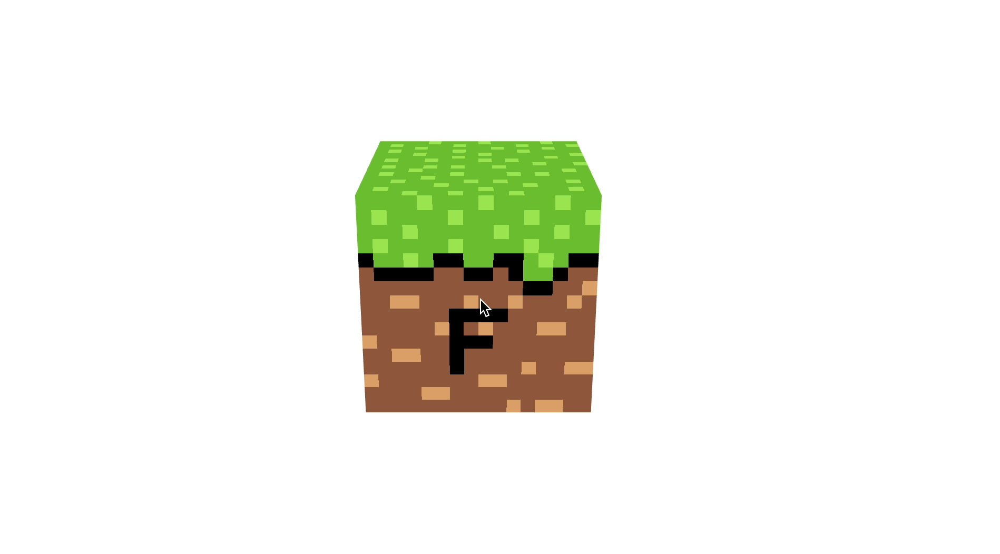

마인크래프 블럭과 흡사한 블럭하나가 만들어진 것을 확인할 수 있음

### MeshToonMaterial(만화 느낌)

MeshToonMaterial은 만화 느낌을 주는 메서드이다.

`src/ex10.js`

```jsx
// ----- 주제: MeshToonMaterial (만화 느낌)

export default function example() {
  const textureLoader = new THREE.TextureLoader();
  // ...

  // Mesh
  const geometry = new THREE.ConeGeometry(1, 2, 128);
  const material = new THREE.MeshToonMaterial({
    color: "plum", // 2톤으로 만화적 표현 구현
  });
  const mesh = new THREE.Mesh(geometry, material);
  scene.add(mesh);

  // ..
}
```

위와 같이 ConeGeometry 모양에 MeshToonMaterial을 plum color로 적용하면 아래와 같다.

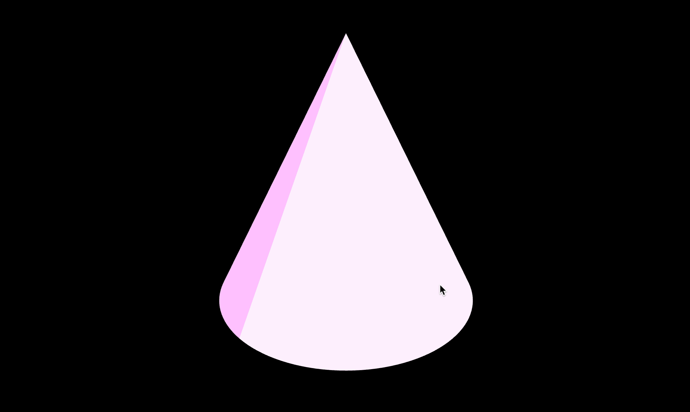

```jsx

```

여기에서 좀 더 그라데이션을 주기 위해 작은 픽셀에 (검정색-회색-하얀색) 3단계의 그라데이션이 담긴 파일(gradient.png)을 적용해본다.  (포토샵을 이용해 간단히 생성 가능)

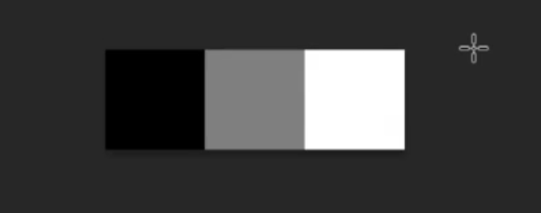


```jsx
// ----- 주제: MeshToonMaterial (만화 느낌)

export default function example() {
  const textureLoader = new THREE.TextureLoader();
	// gradientTex 이미지 로드
  const gradientTex = textureLoader.load("/textures/gradient.png");

  // ...

  // Mesh
  const geometry = new THREE.ConeGeometry(1, 2, 128);
  const material = new THREE.MeshToonMaterial({
    color: "plum",
		gradientMap: gradientTex // gradientTex 적용
  });
  const mesh = new THREE.Mesh(geometry, material);
  scene.add(mesh);

  // ..
}
```

위와 같이 gradientTex를 MeshToonMaterial의 gradientMap 속성에 적용하면 아래와 같이 노출된다.

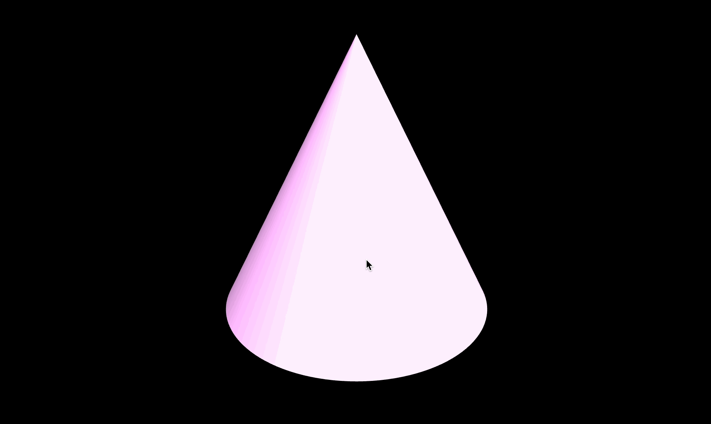

자연스러워졌으나 2D 만화의 느낌이 사라져버림. 이는 앞 시간에서 배운 magFilter를 적용하면 개선할 수 있다.

```jsx
// ----- 주제: MeshToonMaterial (만화 느낌)

export default function example() {
  const textureLoader = new THREE.TextureLoader();
  const gradientTex = textureLoader.load("/textures/gradient.png");
	gradientTex.magFilter = THREE.NearestFilter; // magFilter 적용

  // Mesh
  const geometry = new THREE.ConeGeometry(1, 2, 128);
  const material = new THREE.MeshToonMaterial({
    color: "plum",
		gradientMap: gradientTex
  });
  const mesh = new THREE.Mesh(geometry, material);
  scene.add(mesh);

  // ..
}
```

위와 같이 magFilter에 NearestFilter를 적용해주면 영역 구분이 확실하게 나뉜 3단계 색을 가진 원뿔모양으로 변경됨. 만화 느낌 다시 만들어졌따 (🤨)

