## Light(조명)

### Light 기본 사용법

기본적인 Light를 적용해보자. [AmbientLight](https://threejs.org/docs/index.html?q=amb#api/en/lights/AmbientLight)는 전체적으로 은은하게 깔아주는 기본적인 Light이다.

`light/src/ex01.js`

```jsx
// ----- 주제: Light 기본 사용법

export default function example() {
  // Renderer, Scene, Camera, Controls...

  // Light
  const ambientLight = new THREE.AmbientLight("white", 0.5);
  scene.add(ambientLight);

  // Mesh
  const geometry = new THREE.BoxGeometry(1, 1, 1);
  const material = new THREE.MeshStandardMaterial({ color: "seagreen" });
  const mesh = new THREE.Mesh(geometry, material);
  scene.add(mesh);

  //...
}
```

위 코드를 넣으면 아래와 같이 녹색 박스가 노출된다.

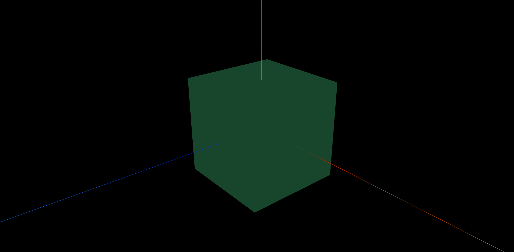

여기에 mesh를 여러개 추가해보자

`src/ex01.js`

```jsx
// ----- 주제: Light 기본 사용법

export default function example() {
  // Renderer, Scene, Camera, Controls...

  // Light
  const ambientLight = new THREE.AmbientLight("white", 0.5);
  scene.add(ambientLight);

  // Geometry
  const planeGeometry = new THREE.PlaneGeometry(10, 10);
  const boxGeometry = new THREE.BoxGeometry(1, 1, 1);
  const sphereGeometry = new THREE.SphereGeometry(0.7, 16, 16);

  // Material
  const material1 = new THREE.MeshStandardMaterial({ color: "white" });
  const material2 = new THREE.MeshStandardMaterial({ color: "white" });
  const material3 = new THREE.MeshStandardMaterial({ color: "white" });

  // Mesh
  const plane = new THREE.Mesh(planeGeometry, material1);
  const box = new THREE.Mesh(boxGeometry, material2);
  const sphere = new THREE.Mesh(sphereGeometry, material3);
  scene.add(plane, box, sphere);

  //...
}
```

위와 같이 mesh를 여러개 추가하면 하얀색 만 나옴 시야를 뒤로 빼면 바닥으로 깐 planeGeometry와 이외의 mesh들이 붙어있는 구조인 것을 확인할 수 있다.

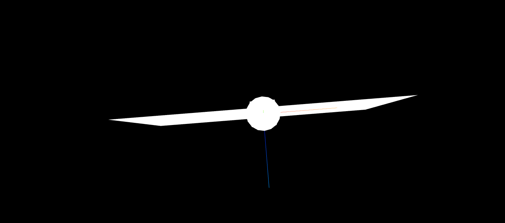

이들을 좀 떼어보자

```jsx
// ----- 주제: Light 기본 사용법

export default function example() {
  // Renderer, Scene, Camera, Controls...

  // Light
  const ambientLight = new THREE.AmbientLight("white", 0.5);
  scene.add(ambientLight);

  // Geometry
  const planeGeometry = new THREE.PlaneGeometry(10, 10);
  const boxGeometry = new THREE.BoxGeometry(1, 1, 1);
  const sphereGeometry = new THREE.SphereGeometry(0.7, 16, 16);

  // Material
  const material1 = new THREE.MeshStandardMaterial({ color: "white" });
  const material2 = new THREE.MeshStandardMaterial({ color: "royalblue" });
  const material3 = new THREE.MeshStandardMaterial({ color: "gold" });

  // Mesh
  const plane = new THREE.Mesh(planeGeometry, material1);
  const box = new THREE.Mesh(boxGeometry, material2);
  const sphere = new THREE.Mesh(sphereGeometry, material3);

  plane.rotation.x = Math.PI * -0.5; // 눞혀주기
  box.position.set(1, 1, 0); // 우측으로 이동
  sphere.position.set(-1, 1, 0); // 좌측으로 이동

  scene.add(plane, box, sphere);

  //...
}
```

위처럼 mesh 별 컬러와 위치를 다르게 해주면 아래와 같이 노출됨

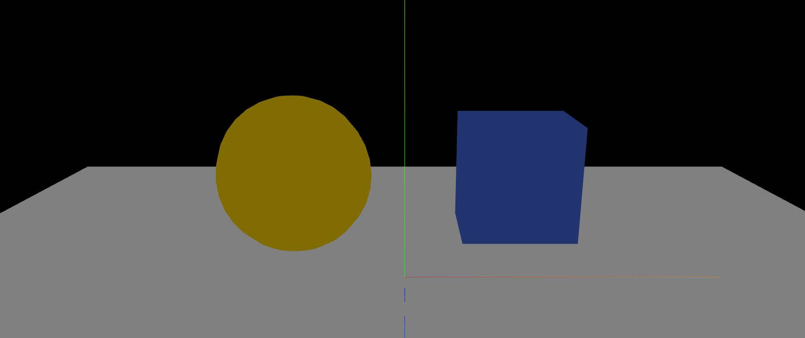

여기에 빛을 한가지 더 추가해보자

```jsx
// ----- 주제: Light 기본 사용법

export default function example() {
  // Renderer, Scene, Camera, Controls...

  // Light
  const ambientLight = new THREE.AmbientLight("white", 0.5);
  scene.add(ambientLight);

  // DirectionalLight 추가 - 태양광과 같은 느낌(전체적으로 뿌려짐)
  const light = new THREE.DirectionalLight("white", 0.5);
  light.position.y = 3;
  scene.add(light);

  //...
}
```

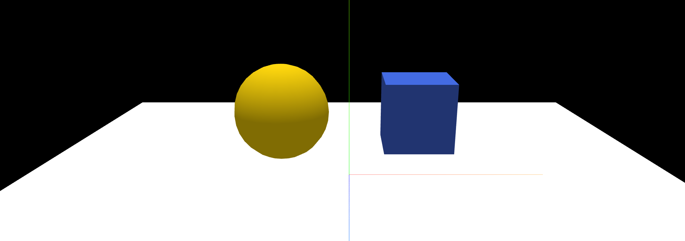

위와 같이 노출됨. 그런데 light.position을 설정해도 빛이 어느방향에서 넘어오는지 확인이 좀 어렵다. 그때에는 DirectionLightHelper를 사용하면 도움을 받을 수 있다.

```jsx
// ----- 주제: Light 기본 사용법

export default function example() {
  // Renderer, Scene, Camera, Controls...

  // Light
  const ambientLight = new THREE.AmbientLight("white", 0.5);
  scene.add(ambientLight);

  // DirectionalLight
  const light = new THREE.DirectionalLight("white", 0.5);
  light.position.y = 3;
  scene.add(light);

  // DirectionalLightHelper 추가
  const lightHelper = new THREE.DirectionalLightHelper(light);
  scene.add(lightHelper);

  //...
}
```

위와 같이 DirectionalLightHelper를 적용시키면 아래 이미지와 같이 빛이 비추는 방향이 사각형으로 그려짐

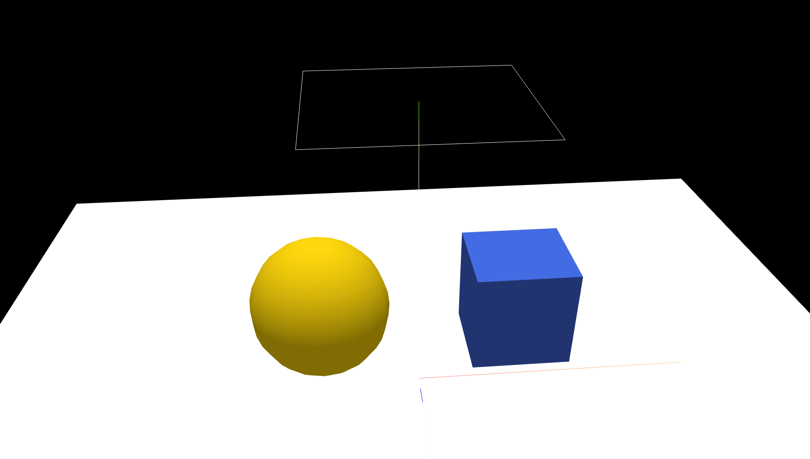

이러한 빛의 방향을 다양한 상황으로 확인하고 싶다면. dat.GUI를 활용하면 된다.

```jsx
// ----- 주제: Light 기본 사용법

export default function example() {
  // Renderer, Scene, Camera, Controls, Light, Mesh, AxesHelper ..

  // Dat GUI - light.position을 gui 툴에 적용
  const gui = new dat.GUI();
  gui.add(light.position, "x", -5, 5).name("light X");
  gui.add(light.position, "y", -5, 5).name("light Y");
  gui.add(light.position, "z", 2, 10).name("light Z");

  //...
}
```

위와 같이 light.position 값을 dat.GUI에 적용하면 아래와 같음

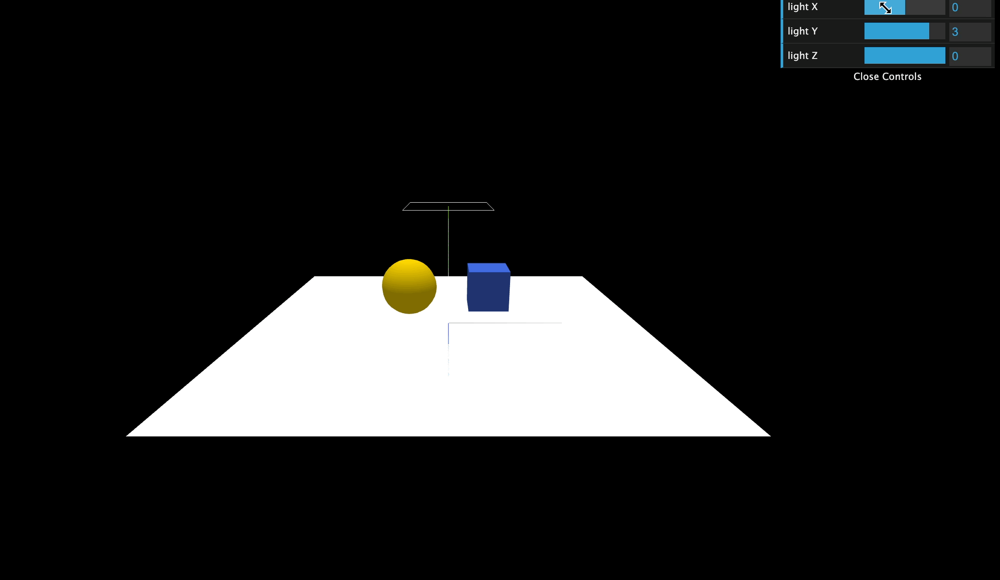

light.position에 대한 이해를 깊게 해볼 수 있다.

### Light 애니메이션

이번에는 Light에 애니메이션을 넣어보자! 움직이는 것이니 draw 함수 안에서 구현한다.

`src/ex02.js`

```jsx
// ----- 주제: Light 애니메이션

export default function example() {
  // ...

  // DirectionalLight 추가 - 태양광과 같은 느낌(전체적으로 뿌려짐)
  const light = new THREE.DirectionalLight("red", 0.5); // 위치 확인을 위해 색 변경
  light.position.y = 3;
  scene.add(light);

  // ..
  // 그리기
  const clock = new THREE.Clock();

  function draw() {
    // const delta = clock.getDelta(); // 프레임마다 시간을 가져옴(항상 같은 값)
    const time = clock.getElapsedTime(); // 시작후 경과된 시간을 가져옴(계속 증가하는 값)

    // 삼각함수 사용 원리
    // sin: 0 ~ 1 ~ 0 ~ -1 ~ 0 : a = 1일 때 b의 값을 의미(y)
    // cos: 1 ~ 0 ~ -1 ~ 0 ~ 1 : a = 1일 때 c의 값을 의미(x)

    light.position.x = Math.cos(time) * 3;
    light.position.z = Math.sin(time) * 3;

    renderer.render(scene, camera);
    renderer.setAnimationLoop(draw);
  }

  // ..
  draw();
}
```

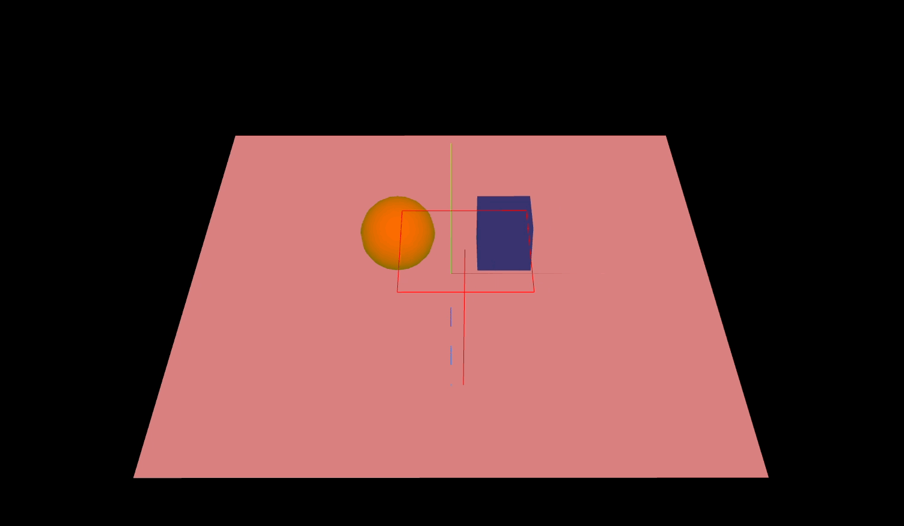

위와 같이 빛이 동그란 원형을 띄는 애니메이션으로 동작하는 것을 확인할 수 있다.
이를 위 코드에서는 cos, sin 함수를 이용해서 구현했는데, 원래는 아래와 같다.

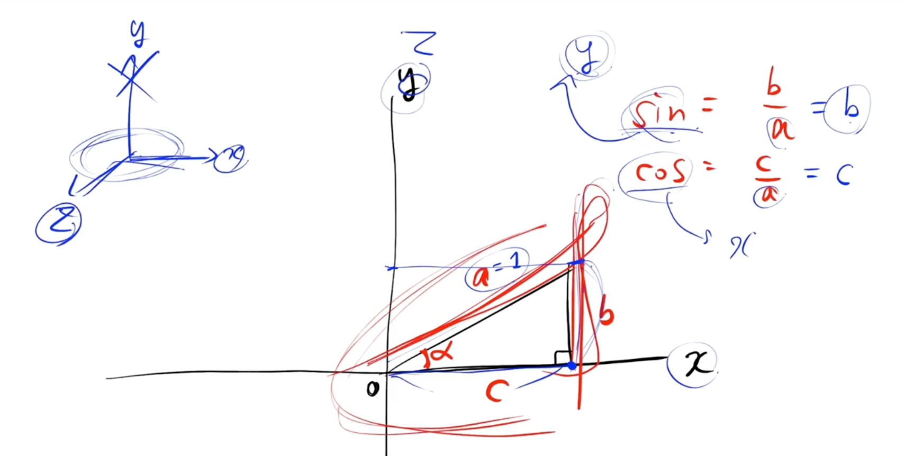

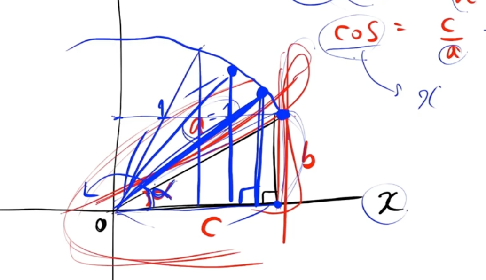

### 그림자(Shadow) 처리하기

빛의 움직임에 따라 mesh들에 그림자가 자연스럽게 생기도록 처리해본다.
기본적으로 빛에 따른 그림자 효과를 받으려면 receiveShadow 옵션을 활성화(true), 상대의 물체에 그림자 효과 영향을 주려면 castShadow 옵션을 활성화(true) 해줘야 한다.

`src/ex03.js`

```jsx
// ----- 주제: Light와 Shadow

export default function example() {
  // Renderer
  const canvas = document.querySelector("#three-canvas");
  const renderer = new THREE.WebGLRenderer({ canvas, antialias: true });
  renderer.setSize(window.innerWidth, window.innerHeight);
  renderer.setPixelRatio(window.devicePixelRatio > 1 ? 2 : 1);
  renderer.shadowMap.enabled = true; // 1. 그림자를 사용할 수 있도록 설정

  // Scene, Camera, AmbientLight, DirectionalLight ..
  const lightHelper = new THREE.DirectionalLightHelper(light);
  scene.add(lightHelper);

  // 2. 그림자 설정
  light.castShadow = true;

  // Controls, Geometry, Material...
  // Mesh
  const plane = new THREE.Mesh(planeGeometry, material1);
  const box = new THREE.Mesh(boxGeometry, material2);
  const sphere = new THREE.Mesh(sphereGeometry, material3);

  plane.rotation.x = Math.PI * -0.5; // 눞혀주기
  box.position.set(1, 1, 0);
  sphere.position.set(-1, 1, 0);

  // 3. 그림자를 받을 수 있도록 설정
  plane.receiveShadow = true;
  box.castShadow = true;
  box.receiveShadow = true;
  sphere.castShadow = true;
  sphere.receiveShadow = true;

  scene.add(plane, box, sphere);

  // ...
}
```

위와 같이 1-2-3번 순서대로 그림자 설정을 하면 아래와 같은 그림자 효과를 확인할 수 있다.


그런데 그림자를 확대해서 확인해보면 그림자가 조금 깨져서 노출된다.

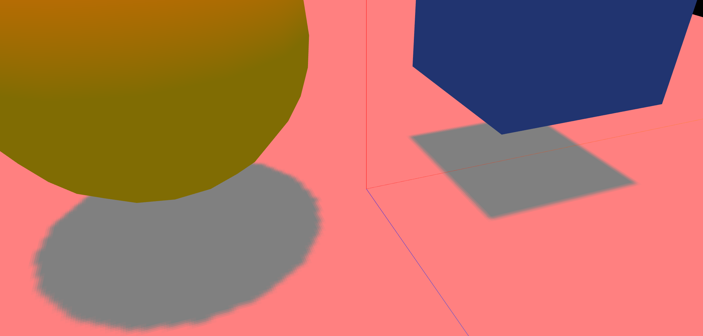

좋은 퀄리티로 보이지 않음. 이러한 효과도 light에서 조정할 수 있다.

```jsx
export default function example() {
  // Renderer
  const canvas = document.querySelector("#three-canvas");
  const renderer = new THREE.WebGLRenderer({ canvas, antialias: true });
  renderer.setSize(window.innerWidth, window.innerHeight);
  renderer.setPixelRatio(window.devicePixelRatio > 1 ? 2 : 1);
  renderer.shadowMap.enabled = true;

  // Scene, Camera, AmbientLight, DirectionalLight ..
  const lightHelper = new THREE.DirectionalLightHelper(light);
  scene.add(lightHelper);

  light.castShadow = true;
  light.shadow.mapSize.width = 1024; // 기본 512
  light.shadow.mapSize.height = 1024; // 기본 512

  // ...
}
```

`light.shadow.mapSize.width`, `light.shadow.mapSize.height` 속성을 기본 512에서 1024로 키우니까 명확한 shadow가 만들어짐. 더 크기를 키울 수 있으나 성능에 영향을 미치므로 적당히 한다.


만약 그림자가 딱딱해보이므로 자연스러운 블러효과도 줄 수 있다.

```jsx
export default function example() {
  // Renderer
  const canvas = document.querySelector("#three-canvas");
  const renderer = new THREE.WebGLRenderer({ canvas, antialias: true });
  renderer.setSize(window.innerWidth, window.innerHeight);
  renderer.setPixelRatio(window.devicePixelRatio > 1 ? 2 : 1);
  renderer.shadowMap.enabled = true;

  // Scene, Camera, AmbientLight, DirectionalLight ..
  const lightHelper = new THREE.DirectionalLightHelper(light);
  scene.add(lightHelper);

  light.castShadow = true;
  light.shadow.mapSize.width = 1024;
  light.shadow.mapSize.height = 1024;
  light.shadow.radius = 5; // 그림자 블러 처리

  // ...
}
```

위와 같이 `light.shadow.radius`값을 주면 자연스러운 효과를 줄 수 있겠다.

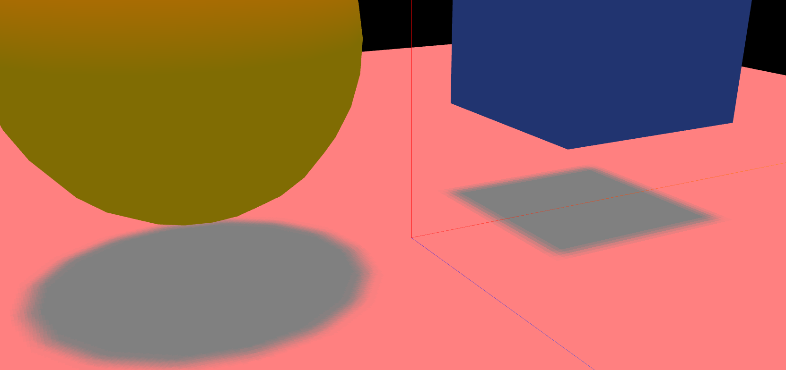

그 외에도 그림자 형태 자체를 조정할 수 있다. `light.shadow.radius`는 주석처리

```jsx
export default function example() {
  // Renderer
  const canvas = document.querySelector("#three-canvas");
  const renderer = new THREE.WebGLRenderer({ canvas, antialias: true });
  renderer.setSize(window.innerWidth, window.innerHeight);
  renderer.setPixelRatio(window.devicePixelRatio > 1 ? 2 : 1);
  renderer.shadowMap.enabled = true;
  // renderer.shadowMap.type = THREE.PCFShadowMap; // 기본값
  renderer.shadowMap.type = THREE.BasicShadowMap; // antialiasing이 사라진 거친 느낌
  renderer.shadowMap.type = THREE.PCFSoftShadowMap; // 좀 더 부드럽고 자연스러운 느낌

  // ...
}
```

기본 `THREE.PCFSoftShadowMap`에서 `THREE.BasicShadowMap`로 변경하면 아래와 같이 된다.

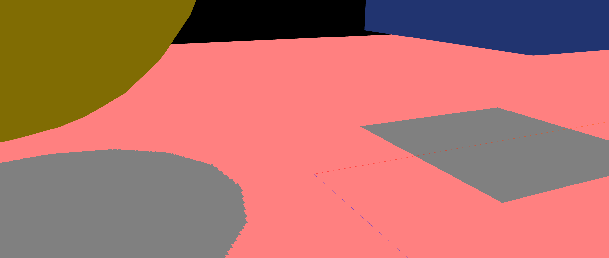

위 픽셀 효과를 조정하는 것은 하단 `light.shadow.mapSize`의 width, height 값으로 조정가능함


단 위와 같이 기본값이 `PCFShadowMap`를 제외한 `BasicShadowMap`, `PCFSoftShadowMap`의 경우 하단 블러처리 효과를 위해 넣은 `light.shadow.radius`이 제대로 동작하지 않는다. 블러효과를 적용하고 싶다면 기본 값을 사용하자.

다음으로 그림자를 생기게 해주는 영역에 제한을 걸어보자

```jsx
export default function example() {
  // Renderer
  // ..
  renderer.shadowMap.enabled = true;
  // renderer.shadowMap.type = THREE.PCFShadowMap;
  // renderer.shadowMap.type = THREE.BasicShadowMap;
  renderer.shadowMap.type = THREE.PCFSoftShadowMap;

  // Scene, Camera, AmbientLight, DirectionalLight ..

  light.castShadow = true;
  light.shadow.mapSize.width = 1024;
  light.shadow.mapSize.height = 1024;
  // light.shadow.radius = 5;

  light.shadow.camera.near = 1; // 영역 제한
  light.shadow.camera.far = 5; // 영역 제한

  // ...
}
```

위와 같이 light.shadow.camera 값을 near, far로 설정하면 그림자 영역이 1~5사이에서만 동작함을 의미한다.
실제 light.x값을 오른쪽으로 옮겨보면, 5이상의 범위에서는 그림자가 노출되지 않는 것을 볼 수 있음

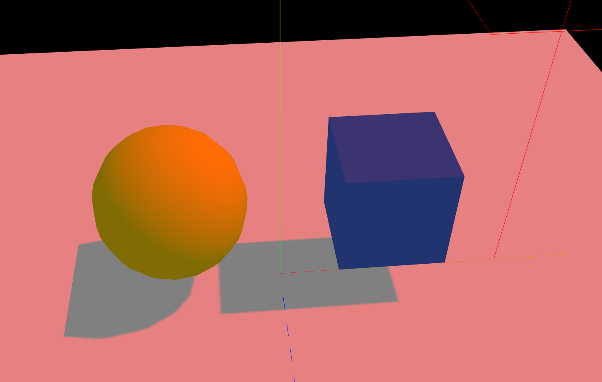

이를 그림자가 잘 노출되는 범위 내에서 성능에 도움될 수 있도록 제한을 걸어주면 좋겠다.
(위 예시의 경우 `light.shadow.camera.far = 10`정도면 적절함, 넉넉하게 잡아주자!)

### PointLight

[PointLight](https://threejs.org/docs/#api/en/lights/PointLight)는 어떤 지점에서 사방으로 퍼지는 전구와 같은 빛을 의미한다.

- color: (optional) hexadecimal color of the light. Default is 0xffffff (white).
- intensity: (optional) numeric value of the light's strength/intensity. Default is 1.
- distance: Maximum range of the light. Default is 0 (no limit).
- decay: The amount the light dims along the distance of the light. Default is 2.

`src/ex04.js`

```jsx
// ----- 주제: PointLight

export default function example() {
  // Renderer, Scene, Camera..
  // Light
  const ambientLight = new THREE.AmbientLight("white", 0.5);
  scene.add(ambientLight);

  // PointLight 추가 - 전구와 같은 느낌
  const light = new THREE.PointLight("white", 1);
  light.position.x = -5;
  light.position.y = 3;
  scene.add(light);

  // PointLightHelper 추가
  const lightHelper = new THREE.PointLightHelper(light);
  scene.add(lightHelper);

  // ..
}
```

위와 같이 PointLight와 PointLightHelper를 적용하면 아래와 같이 전구가 뿅 켜진 느낌을 줄 수 있다.

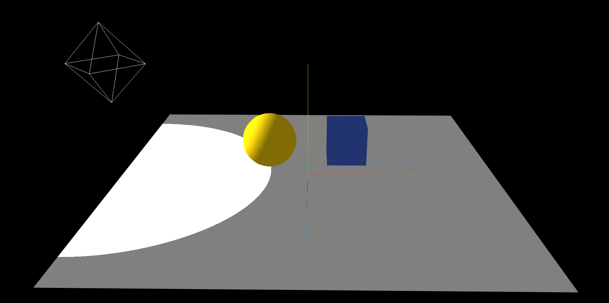

여기에 distance와,decay 요소를 각 100, 10만큼 주면 아래와 같다.
(`new THREE.PointLight("white", 1, 100, 10`)

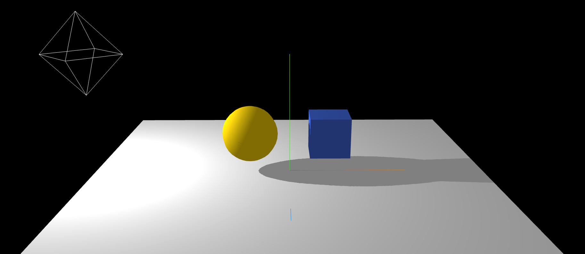

애니메이션 동작시켜보면 그럴싸함

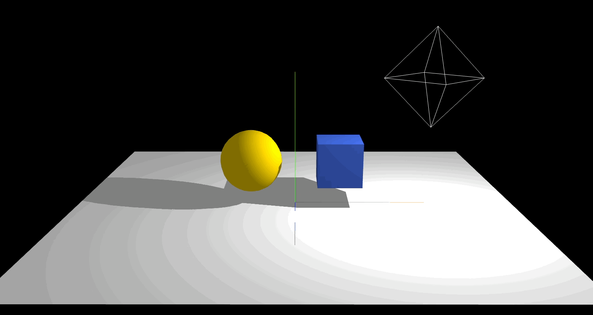

### SpotLight

SpotLight는 무대 위에서 쏟아지는 단독적인 조명 같은 것을 의미한다.

`src/ex05.js`

```jsx
// ----- 주제: SpotLight

export default function example() {
  // Renderer, Scene, Camera..

  // Light
  const ambientLight = new THREE.AmbientLight("white", 0.5);
  scene.add(ambientLight);

  // SpotLight 추가 - 무대 위 조명 같은 느낌
  const light = new THREE.SpotLight("white", 1, 10, Math.PI / 6);
  light.position.x = -5;
  light.position.y = 3;
  scene.add(light);

  // SpotLightHelper 추가
  const lightHelper = new THREE.SpotLightHelper(light);
  scene.add(lightHelper);

  // ...
}
```

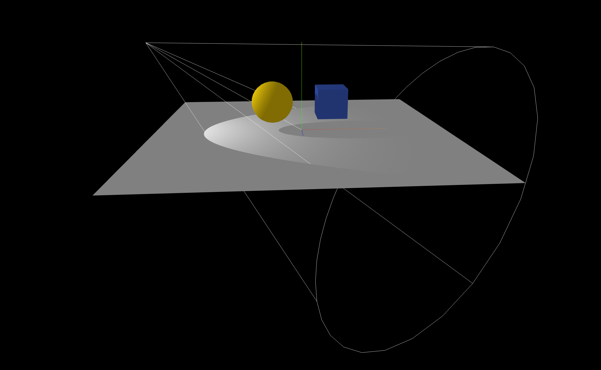

위와 같이 PointLight 자리에 SpotLight를 적용해주고, 마지막 전달인자에는 빛의 각도를 설정하는 것임.
위와 같이 설정 하며 고정해놓은 점에서 쏟아지는 단독 핀 조명으로 SpotLight가 구현된 것을 확인할 수 있다.

### HemisphereLight

HemisphereLight는 ambientLight와 비슷하게 전체적인 light에 영향을 미친다.
두 면의 색을 다르게 지정해서 위치별로 적용되는 빛을 조절할 수 있는 것으로 보임

`src/ex06.js`

```jsx
// ----- 주제: HemisphereLight

export default function example() {
  // Renderer, Scene, Camera..

  // Light - 기존 ambientLight는 주석 처리
  const light = new THREE.HemisphereLight("pink", "lime", 0.5);
  light.position.x = -5;
  light.position.y = 3;
  scene.add(light);

  // SpotLightHelper 추가
  const lightHelper = new THREE.HemisphereLightHelper(light);
  scene.add(lightHelper);

  // 2. 그림자 설정 - 필요없음
  // light.castShadow = true;
  // light.shadow.mapSize.width = 1024;
  // light.shadow.mapSize.height = 1024;
  // light.shadow.radius = 15; // 그림자 블러 처리
  // light.shadow.camera.near = 1;
  // light.shadow.camera.far = 5;

  // ...
}
```

위와 같이 넣으면 아래와 같이 light X값에 따라 빛이 조절되는 것을 확인할 수 있다.
이는 Y, Z 축에도 동일하게 적용됨. 두 가지 빛을 적용하여 각도에 따라 빛이 자연스럽게 변화하는 것을 구현할 때 활용해보면 좋을 것 같다

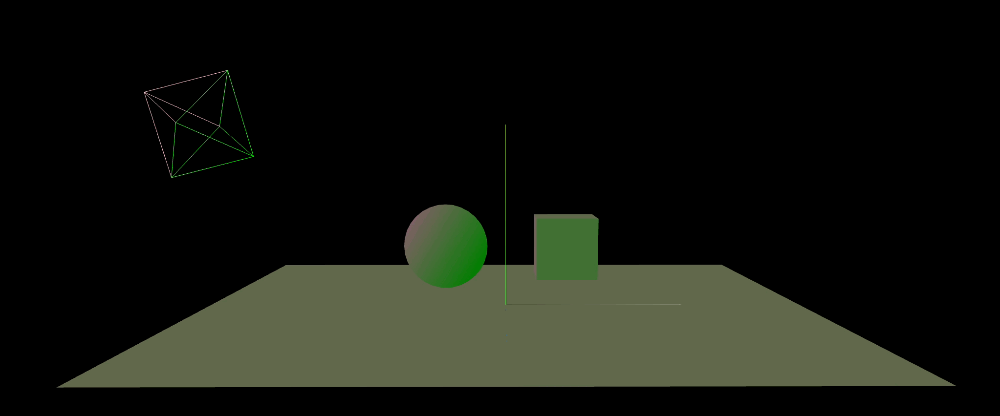

### RectAreaLight

RectAreaLight를 사용하면 사각형 모양에서 뿜어져나오는 조명 효과를 낼 수 있다.

`src/ex07.js`

```jsx
// ..
import { RectAreaLightHelper } from "three/examples/jsm/helpers/RectAreaLightHelper";

// ----- 주제: RectAreaLight

export default function example() {
  // Renderer, Scene, Camera..

  // Light
  // RectAreaLight 적용
  const light = new THREE.RectAreaLight("orange", 10, 2, 2);
  light.position.y = 2;
  light.position.z = 3;
  scene.add(light);

  // RectAreaLightHelper 추가 - 별도 import 하므로 THREE를 붙이지 않음
  const lightHelper = new RectAreaLightHelper(light);
  scene.add(lightHelper);

  // ..
}
```

위와 같이 RectAreaLight를 적용하면 사각형 조명에서 빛이 나오는 것을 확인할 수 있다.
화면에 보이는 사각형은 RectAreaLightHelper이므로 위 코드를 삭제하면 보이지 않는다.

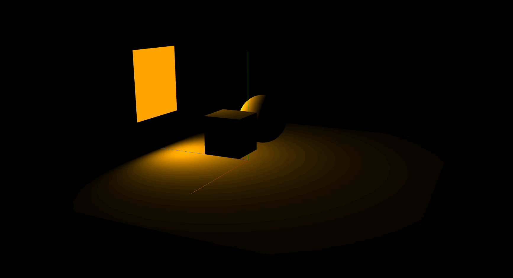

위 조명으로 재미있는 효과를 많이 구현할 수 있을 것 같다!
