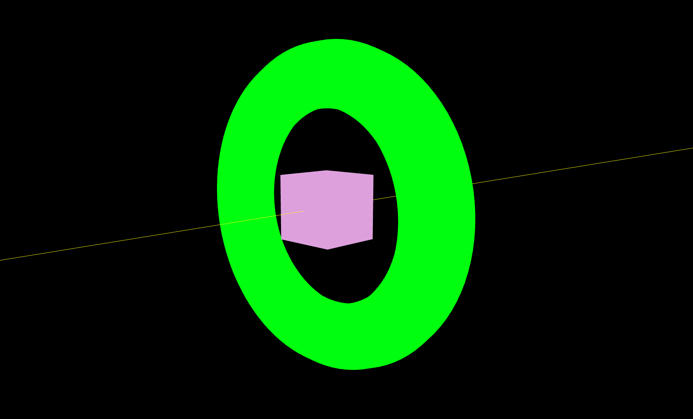

## Raycaster (클릭 감지)

### Raycaster의 동작 원리

레이캐스터에서 레이는 x-ray 즉 광선을 의미한다. 카메라에서 쏜 광선을 쏘면(클릭) 그 광선에 따라 맞은 mesh가 반응되도록 구현할 수 있다. 이따 맞은 mesh를 캐스팅해서 효과를 적용할 수 있음. 따라서 레이캐스터임

### 준비 - Line으로 선 만들고 mesh 배치하기

먼저 특정 방향으로 쏘아지는 광선(Line)을 만들고 이에 맞은 Mesh를 판별하는 것을 해보겠다.
먼저 시각적으로(geometry) 광선을 눈에 보이게 그려본다.

`raycaster/src/ex01.js`

```jsx
import * as THREE from "three";
import { OrbitControls } from "three/examples/jsm/controls/OrbitControls.js";

// ----- 주제: Line으로 선 만들고 mesh 배치하기

export default function example() {
  // Renderer, Scene..

  // Camera
  const camera = new THREE.PerspectiveCamera(75, window.innerWidth / window.innerHeight, 0.1, 1000);
  camera.position.x = 5; // 1. 광선이 옆을 바라보고 시작하도록 위치를 수정
  camera.position.y = 1.5;
  camera.position.z = 4;
  scene.add(camera);

  // Light..

  // Controls : 2. 마우스로 확인을 위해 추가
  const constrols = new OrbitControls(camera, renderer.domElement);

  // Mesh
  // 3. ray 구현
  const lineMaterial = new THREE.LineBasicMaterial({ color: "yellow" });
  const points = []; // 점들을 모아둘 배열
  points.push(new THREE.Vector3(0, 0, 100)); // 시작점(x, y, z)
  points.push(new THREE.Vector3(0, 0, -100)); // 끝점(x, y, z)
  const lineGeometry = new THREE.BufferGeometry().setFromPoints(points);
  const guide = new THREE.Line(lineGeometry, lineMaterial);
  scene.add(guide); // add

  // 4. ray에 맞을 mesh 구현
  // box mesh
  const boxGeometry = new THREE.BoxGeometry(1, 1, 1);
  const boxMaterial = new THREE.MeshBasicMaterial({ color: "plum" });
  const boxMesh = new THREE.Mesh(boxGeometry, boxMaterial);
  // torus mesh
  const torusGeometry = new THREE.TorusGeometry(2, 0.5, 16, 100);
  const torusMaterial = new THREE.MeshBasicMaterial({ color: "lime" });
  const torusMesh = new THREE.Mesh(torusGeometry, torusMaterial);
  scene.add(boxMesh, torusMesh); // add

  // ..
}
```

위 순서대로 광선과 이 광선을 맞을 mesh를 추가해주면 아래와 같이 노출된다.


이제 이 boxMesh와 torusMesh를 배열에 넣고 광선에 맞은 Mesh를 판별해본다.
