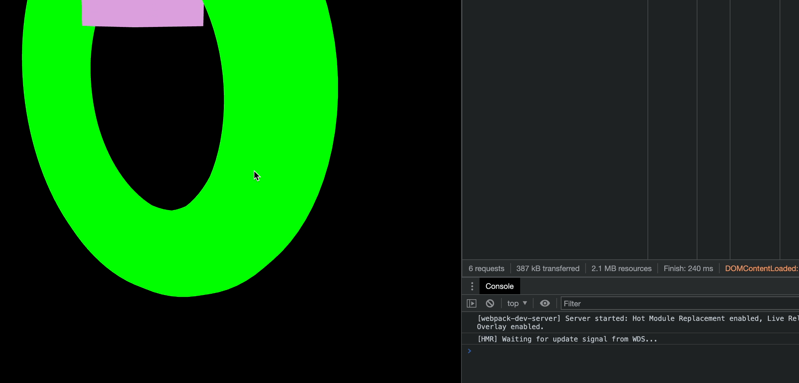

## Raycaster (클릭 감지)

### Raycaster의 동작 원리

레이캐스터에서 레이는 x-ray 즉 광선을 의미한다. 카메라에서 쏜 광선을 쏘면(클릭) 그 광선에 따라 맞은 mesh가 반응되도록 구현할 수 있다. 이따 맞은 mesh를 캐스팅해서 효과를 적용할 수 있음. 따라서 레이캐스터임

### 준비 - Line으로 선 만들고 mesh 배치하기

먼저 특정 방향으로 쏘아지는 광선(Line)을 만들고 이에 맞은 Mesh를 판별하는 것을 해보겠다.
먼저 시각적으로(geometry) 광선을 눈에 보이게 그려본다.

`raycaster/src/ex01.js`

```jsx
import * as THREE from "three";
import { OrbitControls } from "three/examples/jsm/controls/OrbitControls.js";

// ----- 주제: Line으로 선 만들고 mesh 배치하기

export default function example() {
  // Renderer, Scene..

  // Camera
  const camera = new THREE.PerspectiveCamera(75, window.innerWidth / window.innerHeight, 0.1, 1000);
  camera.position.x = 5; // 1. 광선이 옆을 바라보고 시작하도록 위치를 수정
  camera.position.y = 1.5;
  camera.position.z = 4;
  scene.add(camera);

  // Light..

  // Controls : 2. 마우스로 확인을 위해 추가
  const constrols = new OrbitControls(camera, renderer.domElement);

  // Mesh
  // 3. ray 구현
  const lineMaterial = new THREE.LineBasicMaterial({ color: "yellow" });
  const points = []; // 점들을 모아둘 배열
  points.push(new THREE.Vector3(0, 0, 100)); // 시작점(x, y, z)
  points.push(new THREE.Vector3(0, 0, -100)); // 끝점(x, y, z)
  const lineGeometry = new THREE.BufferGeometry().setFromPoints(points);
  const guide = new THREE.Line(lineGeometry, lineMaterial);
  scene.add(guide); // add

  // 4. ray에 맞을 mesh 구현
  // box mesh
  const boxGeometry = new THREE.BoxGeometry(1, 1, 1);
  const boxMaterial = new THREE.MeshBasicMaterial({ color: "plum" });
  const boxMesh = new THREE.Mesh(boxGeometry, boxMaterial);
  // torus mesh
  const torusGeometry = new THREE.TorusGeometry(2, 0.5, 16, 100);
  const torusMaterial = new THREE.MeshBasicMaterial({ color: "lime" });
  const torusMesh = new THREE.Mesh(torusGeometry, torusMaterial);
  scene.add(boxMesh, torusMesh); // add

  // ..
}
```

위 순서대로 광선과 이 광선을 맞을 mesh를 추가해주면 아래와 같이 노출된다.


이제 이 boxMesh와 torusMesh를 배열에 넣고 광선에 맞은 Mesh를 판별해본다.

### 특정 광선을 지나는 메쉬 체크하기

이제 광선을 맞는 것을 구현해본다.

`src/ex01.js`

```jsx
// ----- 주제: 특정 방향의 광선(Ray)에 맞은 Mesh 판별하기

export default function example() {
  // Renderer, Scene, Camera, Light, Controls...

  // Mesh
  const lineMaterial = new THREE.LineBasicMaterial({ color: "yellow" });
  const points = [];
  points.push(new THREE.Vector3(0, 0, 100));
  points.push(new THREE.Vector3(0, 0, -100));
  const lineGeometry = new THREE.BufferGeometry().setFromPoints(points);
  const guide = new THREE.Line(lineGeometry, lineMaterial);
  scene.add(guide);

  // ray에 맞을 mesh 추가
  const boxGeometry = new THREE.BoxGeometry(1, 1, 1);
  const boxMaterial = new THREE.MeshBasicMaterial({ color: "plum" });
  const boxMesh = new THREE.Mesh(boxGeometry, boxMaterial);
  boxMesh.name = "box"; // 식별을 위한 name property 추가

  const torusGeometry = new THREE.TorusGeometry(2, 0.5, 16, 100);
  const torusMaterial = new THREE.MeshBasicMaterial({ color: "lime" });
  const torusMesh = new THREE.Mesh(torusGeometry, torusMaterial);
  torusMesh.name = "torus"; // 식별을 위한 name property 추가

  scene.add(boxMesh, torusMesh);

  const meshes = [boxMesh, torusMesh];
  const raycaster = new THREE.Raycaster(); // 광선 생성

  const clock = new THREE.Clock();

  function draw() {
    const time = clock.getElapsedTime(); // 시간
    boxMesh.position.y = Math.sin(time) * 2;
    torusMesh.position.y = Math.cos(time) * 2;
    boxMesh.material.color.set("plum");
    torusMesh.material.color.set("lime");

    const origin = new THREE.Vector3(0, 0, 100); // 광선의 시작점
    const direction = new THREE.Vector3(0, 0, -1); // 광선의 방향: 정규화된 방향 -1을 적용
    // const direction = new THREE.Vector3(0, 0, -100);
    direction.normalize(); // -100을 normalize처리, 1로 계산
    raycaster.set(origin, direction); // 광선 생성

    const intersects = raycaster.intersectObjects(meshes); // 광선과 교차하는 객체들을 반환
    intersects.forEach((intersect) => {
      console.log(intersect.object.name); // 광선과 교체하는 name 속성을 반환
      intersect.object.material.color.set("red"); // 광선과 교체하면 red 컬러로 변경
    });

    console.log(raycaster.intersectObjects(meshes)); // 배열 내 객체들의 광선과의 교차점을 반환

    renderer.render(scene, camera);
    renderer.setAnimationLoop(draw);
  }

  // ..
  draw();
}
```

위 `boxMesh`, `torusMesh`에 식별을 위한 `name` 속성을 추가해 준 뒤 Raycaster라는 광선을 생성하여 시작점과 방향을 정해준다. 이때 광선의 방향을 -100을 넣지 않고 -1을 넣는데 이는 정규화된 방향을 의미하므로 -100이 아닌 -1을 넣음. 이후 raycaster.intersectObjects 로 광선과 교차하는 객체를 반환하도록 구현해주면 아래와 같이 디버그 컨솔에 원하는 값들과 교차점을 확인할 수 있다.


위 코드로 나오는 결과물은 아래와 같음


### 클릭한 메쉬 감지하기

이번에는 마우스로 클릭했을 때 클릭한 메쉬를 감지해보자.
우선 불필요한 line material과 draw 함수 내에서 이벤트 코드를 일부 삭제해주었다.

`src/ex02.js`

```jsx
// ----- 주제: 클릭한 Mesh 선택하기

export default function example() {
  // Renderer, Scene, Camera, Light, Controls ..
  const constrols = new OrbitControls(camera, renderer.domElement);

  // Mesh
  const boxGeometry = new THREE.BoxGeometry(1, 1, 1);
  const boxMaterial = new THREE.MeshBasicMaterial({ color: "plum" });
  const boxMesh = new THREE.Mesh(boxGeometry, boxMaterial);
  boxMesh.name = "box";

  const torusGeometry = new THREE.TorusGeometry(2, 0.5, 16, 100);
  const torusMaterial = new THREE.MeshBasicMaterial({ color: "lime" });
  const torusMesh = new THREE.Mesh(torusGeometry, torusMaterial);
  torusMesh.name = "torus";

  scene.add(boxMesh, torusMesh);

  const meshes = [boxMesh, torusMesh];
  const raycaster = new THREE.Raycaster();
  const mouse = new THREE.Vector2(); // 마우스 좌표 - 어디를 찍었는지 알기 위해(초기값: x:0, y:0)

  // ...

  function checkIntersects() {
    raycaster.setFromCamera(mouse, camera); // origin이 카메라 시점(위치)으로 설정한 뒤 광선의 시작점과 방향 설정
    const intersects = raycaster.intersectObjects(meshes); // 광선에 맞은 mesh들을 배열로 반환

    // 첫번째 선택된 메쉬만 선택하는 코드 - 방법 1
    // 광선이므로 하나만 선택되지않고 광선에 맞은 모두 mesh들이 intersects에 담김
    // for (const item of intersects) {
    //   console.log(item.object.name);
    //   item.object.material.color.set("red");
    //   break;
    // }

    // 첫번째 선택된 메쉬만 선택하는 코드 - 방법 2
    if (intersects[0]) {
      console.log(intersects[0]?.object.name);
    }
  }

  // 이벤트
  window.addEventListener("resize", setSize);
  window.addEventListener("click", (e) => {
    // console.log(e.clientX, e.clientY); // 화면에서 찍은 x, y 좌표

    // 2차원 좌표를 3차원 좌표로 정규화
    mouse.x = (e.clientX / canvas.clientWidth) * 2 - 1; // -1 ~ 1
    mouse.y = -((e.clientY / canvas.clientHeight) * 2 - 1); // -1 ~ 1
    // console.log(mouse); // (-1 ~ 1, -1 ~ 1)

    checkIntersects();
  });
}
```

위 코드는 선택된 메쉬를 가져오기 위해 마우스로 클릭한 좌표를 3차원 좌표로 가져오는 작업을 수행한다. mouse 객체 안에 click에 따른 `clientX`, `clientY` 값을 담는데 그대로 담지 않고, 비율에 의거한 3차원 좌표로 정규화한 데이터를 mouse 객체 안에 가둔 뒤 checkIntersects라는 함수를 실행시킨다.

이때 `raycaster.setFromCamera` 메서드를 활용해 광선의 시작점이 카메라 시점으로 설정되도록 하고, 선택된 Intersects 배열의 첫번째 값을 담아오도록 구현하면 된다.


### 드래그 클릭 방지

그런데 문제가 있다. 마우스로 mesh 위치를 움기인 뒤 마우스를 focusout하는 시점에 클릭되는 현상이 발생함.
예상하지 못한 불편한 현상이므로 이를 고쳐본다.



`src/ex02.js`

```tsx
import * as THREE from "three";
import { OrbitControls } from "three/examples/jsm/controls/OrbitControls.js";

// ----- 주제: 클릭한 Mesh 선택하기

export default function example() {
  // Renderer, Scene, Camera, Light, Controls, Mesh..

  // 그리기
  const clock = new THREE.Clock();

  function draw() {
    // ..
  }

  // ..

  function checkIntersects() {
    if (mouseMoved) return; // mouseMoved가 true면 함수 종료

    raycaster.setFromCamera(mouse, camera);
    const intersects = raycaster.intersectObjects(meshes);

    if (intersects[0]) {
      console.log(intersects[0]?.object.name);
    }
  }

  window.addEventListener("resize", setSize);
  window.addEventListener("click", (e) => {
    mouse.x = (e.clientX / canvas.clientWidth) * 2 - 1;
    mouse.y = -((e.clientY / canvas.clientHeight) * 2 - 1);
    checkIntersects();
  });

  let mouseMoved;
  let clickStartX;
  let clickStartY;
  let clickStartTime;

  // mousedown 시 누른 시점을 clickStartX, clickStartY, clickStartTime에 저장
  canvas.addEventListener("mousedown", (e) => {
    clickStartX = e.clientX;
    clickStartY = e.clientY;
    clickStartTime = Date.now();
  });

  // mouseup 시 커서 위치를 감지하여 클릭 체크
  canvas.addEventListener("mouseup", (e) => {
    const xGap = Math.abs(e.clientX - clickStartX); // 얼마나 움직였는지 x 거리
    const yGap = Math.abs(e.clientY - clickStartY); // 얼마나 움직였는지 y 거리
    const timeGap = Date.now() - clickStartTime; // 클릭한 시간(드래그인지 판단)

    // 위치 이동이 5 이하고, 클릭하고 뗀 시간차가 500이하면 클릭으로 간주!
    if (xGap > 5 || yGap > 5 || timeGap > 500) {
      mouseMoved = true;
    } else {
      mouseMoved = false;
    }
  });

  draw();
}
```

위와 같이 canvas의 mousedown, mouseup 이벤트로 클릭 위치의 차이와 클릭 시점 차이를 계산하여 클릭이라고 판단되는 시점을 mouseMoved 변수로 관리하도록 코드를 추가해주면 버그를 개선할 수 있다.

### 드래그 클릭 방지 모듈로 만들기

위 함수의 경우 다른 곳에서도 다양하게 사용될 수 있으므로 별도의 모듈로 만들어 사용해보도록 하자.
새 파일을 생성한다.

`srcPreventDragClick.js`

```jsx
export class PreventDragClick {
  constructor(elem) {
    this.mouseMoved; // 마우스를 드래그했는지 true / false로 판단 - 외부에서 사용하는 인스턴스 값

    let clickStartX;
    let clickStartY;
    let clickStartTime;

    elem.addEventListener("mousedown", (e) => {
      clickStartX = e.clientX;
      clickStartY = e.clientY;
      clickStartTime = Date.now();
    });

    elem.addEventListener("mouseup", (e) => {
      const xGap = Math.abs(e.clientX - clickStartX);
      const yGap = Math.abs(e.clientY - clickStartY);
      const timeGap = Date.now() - clickStartTime;

      if (xGap > 5 || yGap > 5 || timeGap > 500) {
        this.mouseMoved = true;
      } else {
        this.mouseMoved = false;
      }
    });
  }
}
```

위 코드를 작성하면 이제 새로운 js 파일에서 다음과 같이 모듈을 불러와 사용할 수 있다.

```jsx
import { PreventDragClick } from "./PreventDragClick";

export default function example() {
  // ..
  function checkIntersects() {
    // preventDragClick의 인스턴스인 mouseMouved를 상속
    if (preventDragClick.mouseMoved) return;

    // ..
  }

  // ..
  const preventDragClick = new PreventDragClick(canvas);
}
```

위 코드에서 `canvas`자리에 해당 이벤트를 발생시키는 element를 넘겨주어야 한다. 그리고 마우스 이벤트가 발생하면 `preventDragClick` 함수 내부에서는 인스턴스 객체인 `mouseMoved`를 체크하고, 이동한 거리와 시간을 비교하여 클릭 여부를 결정하게 된다.
