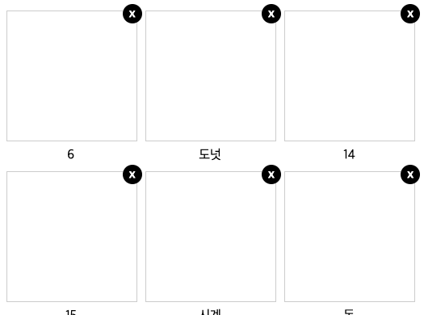
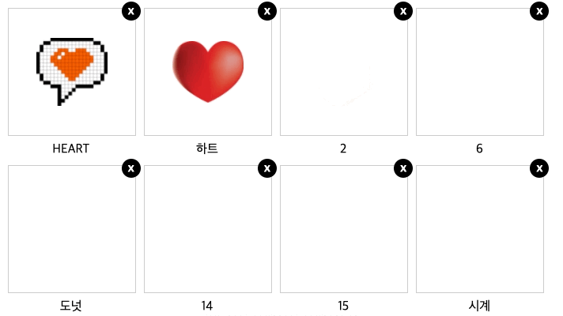
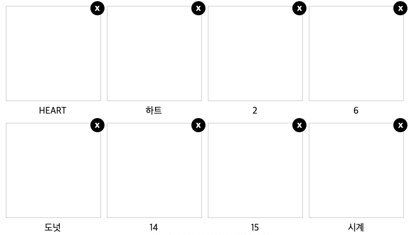
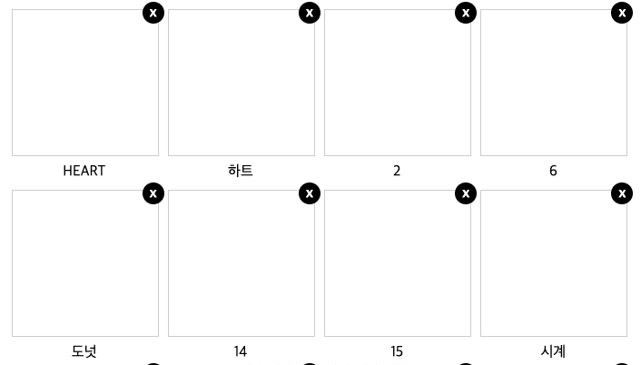

## 프론트엔드에서 함수형/이터러블/동시성 프로그래밍

FE에서 함수형, 이터러블, 동시성 프로그래밍을 활용하는 것에 대해 더욱 자세히 알아보자.

### ES6 템플릿 리터럴 활용

먼저 ES6에서 사용하는 템플릿 리터럴을 활용하는 부분을 한번 짚고 넘어간다.

```jsx
const a = 10;
const b = 5;

// 해당하는 스코프에서 이용할 수 있는 변수들을 다양하게 연산할 수 있다.
console.log(`${a} + ${b} = ${a + b}`); // 10 + 5 = 15
console.log(`${a} + ${b} + 10 = ${a + b + 10}`); // 10 + 5 + 10 = 25
console.log(`${a} / ${b} = ${a / b}`); // 10 / 5 = 2
```

### 이미지 목록 그리기

함수형 프로그래밍에서는 함수의 실행을 통해 기존의 데이터를 다른 형식으로 가공하고, 또 그 데이터를 또 다른 함수에 적용하여 또 다른 형태로 만들어 나가면서 원하는 결과로 만들어나간다. 같은 방법을 활용하여 이번에는 준비되어 있는 json 데이터를 가지고 이미지 목록을 화면에 그려본다.

```jsx
// 함수형 프로그래밍에서 함수는 첫 문자를 대문자로 표현한다.
const Images = {};

// 이미지를 data-fetching 한 것처럼 가져오도록 Images.fetch 함수 구현
Images.fetch = () =>
  new Promise((resolve) =>
    setTimeout(
      () =>
        resolve([
          { name: "HEART", url: "https://s3.marpple.co/files/m2/t3/colored_images/45_1115570_1162087.png" },
          { name: "하트", url: "https://s3.marpple.co/f1/2019/1/1235206_1548918825999_78819.png" },
          { name: "2", url: "https://s3.marpple.co/f1/2018/1/1054966_1516076769146_28397.png" },
          { name: "6", url: "https://s3.marpple.co/f1/2018/1/1054966_1516076919028_64501.png" },
          { name: "도넛", url: "https://s3.marpple.co/f1/2019/1/1235206_1548918758054_55883.png" },
          { name: "14", url: "https://s3.marpple.co/f1/2018/1/1054966_1516077199329_75954.png" },
          { name: "15", url: "https://s3.marpple.co/f1/2018/1/1054966_1516077223857_39997.png" },
          { name: "시계", url: "https://s3.marpple.co/f1/2019/1/1235206_1548918485881_30787.png" },
          { name: "돈", url: "https://s3.marpple.co/f1/2019/1/1235206_1548918585512_77099.png" },
          { name: "10", url: "https://s3.marpple.co/f1/2018/1/1054966_1516077029665_73411.png" },
          { name: "7", url: "https://s3.marpple.co/f1/2018/1/1054966_1516076948567_98474.png" },
          { name: "농구공", url: "https://s3.marpple.co/f1/2019/1/1235206_1548918719546_22465.png" },
          { name: "9", url: "https://s3.marpple.co/f1/2018/1/1054966_1516077004840_10995.png" },
          { name: "선물", url: "https://s3.marpple.co/f1/2019/1/1235206_1548918791224_48182.png" },
          { name: "당구공", url: "https://s3.marpple.co/f1/2019/1/1235206_1548918909204_46098.png" },
          { name: "유령", url: "https://s3.marpple.co/f1/2019/1/1235206_1548918927120_12321.png" },
          { name: "원숭이", url: "https://s3.marpple.co/f1/2019/1/1235206_1548919417134_80857.png" },
          { name: "3", url: "https://s3.marpple.co/f1/2018/1/1054966_1516076802375_69966.png" },
          { name: "16", url: "https://s3.marpple.co/f1/2018/1/1054966_1516077254829_36624.png" },
          { name: "안경", url: "https://s3.marpple.co/f1/2019/1/1235206_1548918944668_23881.png" },
          { name: "폭죽", url: "https://s3.marpple.co/f1/2019/1/1235206_1548919005789_67520.png" },
          { name: "폭죽 2", url: "https://s3.marpple.co/f1/2019/1/1235206_1548919027834_48946.png" },
          { name: "박", url: "https://s3.marpple.co/f1/2019/1/1235206_1548919062254_67900.png" },
          { name: "톱니바퀴", url: "https://s3.marpple.co/f1/2019/1/1235206_1548919302583_24439.png" },
          { name: "11", url: "https://s3.marpple.co/f1/2018/1/1054966_1516077078772_79004.png" },
          { name: "핫도그", url: "https://s3.marpple.co/f1/2019/1/1235206_1548919086961_23322.png" },
          { name: "고기", url: "https://s3.marpple.co/f1/2019/1/1235206_1548919274214_33127.png" },
          { name: "책", url: "https://s3.marpple.co/f1/2019/1/1235206_1548919326628_13977.png" },
          { name: "돋보기", url: "https://s3.marpple.co/f1/2019/1/1235206_1548919363855_26766.png" },
          { name: "집", url: "https://s3.marpple.co/f1/2019/1/1235206_1548919395033_19373.png" },
          { name: "사람", url: "https://s3.marpple.co/f1/2019/1/1235206_1548918696715_44274.png" },
          { name: "연필", url: "https://s3.marpple.co/f1/2019/1/1235206_1548919437239_32501.png" },
          { name: "파일", url: "https://s3.marpple.co/f1/2019/1/1235206_1548919468582_23707.png" },
          { name: "스피커", url: "https://s3.marpple.co/f1/2019/1/1235206_1548919495804_49080.png" },
          { name: "트로피 ", url: "https://s3.marpple.co/f1/2019/1/1235206_1548918438617_69000.png" },
          { name: "카메라", url: "https://s3.marpple.co/f1/2019/1/1235206_1548919847041_33220.png" },
          { name: "그래프", url: "https://s3.marpple.co/f1/2019/1/1235206_1548918521301_43877.png" },
          { name: "가방", url: "https://s3.marpple.co/f1/2019/1/1235206_1548918642937_11925.png" },
          { name: "입술", url: "https://s3.marpple.co/f1/2019/1/1235206_1548919886042_10049.png" },
          { name: "fire", url: "https://s3.marpple.co/f1/2019/1/1235206_1548920036111_19302.png" },
          { name: "TV", url: "https://s3.marpple.co/f1/2019/1/1235206_1548920054808_42469.png" },
          { name: "핸드폰", url: "https://s3.marpple.co/f1/2019/1/1235206_1548920109727_43404.png" },
          { name: "노트북", url: "https://s3.marpple.co/f1/2019/1/1235206_1548920142776_26474.png" },
          { name: "전구", url: "https://s3.marpple.co/f1/2019/1/1235206_1548920181784_14964.png" },
          { name: "장미", url: "https://s3.marpple.co/f1/2019/1/1235206_1548920264149_78607.png" },
          { name: "맥주", url: "https://s3.marpple.co/f1/2019/1/1235206_1548920312701_18073.png" },
          { name: "마이크", url: "https://s3.marpple.co/f1/2019/1/1235206_1548920397855_39832.png" },
          { name: "별", url: "https://s3.marpple.co/f1/2019/1/1235206_1548920420823_49166.png" },
          { name: "와이파이", url: "https://s3.marpple.co/f1/2019/1/1235206_1548920438005_35247.png" },
          { name: "헤드폰", url: "https://s3.marpple.co/f1/2019/1/1235206_1548920468136_82088.png" },
          { name: "peace", url: "https://s3.marpple.co/f1/2019/1/1235206_1548920538719_19072.png" },
          { name: "계산기", url: "https://s3.marpple.co/f1/2019/1/1235206_1548920348341_40080.png" },
          { name: "poo 2", url: "https://s3.marpple.co/f1/2019/1/1235206_1548924259247_12839.png" },
          { name: "poo 3", url: "https://s3.marpple.co/f1/2019/1/1235206_1548924850867_72121.png" },
          { name: "poo 4", url: "https://s3.marpple.co/f1/2019/1/1235206_1548925154648_40289.png" },
          { name: "poo", url: "https://s3.marpple.co/f1/2019/1/1235206_1548918988097_38121.png" },
          { name: "모니터", url: "https://s3.marpple.co/f1/2016/7/1043023_1469769774483.png" },
          { name: "talk", url: "https://s3.marpple.co/f1/2019/1/1235206_1548927111573_76831.png" },
          { name: "keyboard", url: "https://s3.marpple.co/f1/2018/1/1054966_1516330864360_25866.png" },
          { name: "daily 2", url: "https://s3.marpple.co/f1/2019/1/1235206_1548926169159_58295.png" },
          { name: "daily", url: "https://s3.marpple.co/f1/2018/7/1199664_1531814945451_49451.png" },
          { name: "편지", url: "https://s3.marpple.co/f1/2019/1/1235206_1548920087850_99421.png" },
          { name: "sns 하단바 2", url: "https://s3.marpple.co/f1/2019/1/1235206_1548917218903_88079.png" },
          { name: "sns 하단바", url: "https://s3.marpple.co/f1/2019/1/1235206_1548917192465_28365.png" },
          { name: "sns 이모지 6", url: "https://s3.marpple.co/f1/2019/1/1235206_1548927313417_99007.png" },
          { name: "sns 이모지", url: "https://s3.marpple.co/f1/2019/1/1235206_1548927219485_18861.png" },
          { name: "13", url: "https://s3.marpple.co/f1/2018/1/1054966_1516077164559_59630.png" },
          { name: "iphone", url: "https://s3.marpple.co/f1/2016/7/1043023_1469769886837.png" },
          { name: "아이패드", url: "https://s3.marpple.co/f1/2016/7/1043023_1469769820297.png" },
          { name: "컴퓨터", url: "https://s3.marpple.co/f1/2016/7/1043023_1469769802862.png" },
          { name: "5", url: "https://s3.marpple.co/f1/2018/1/1054966_1516076888018_74741.png" },
          { name: "poo 1", url: "https://s3.marpple.co/f1/2019/1/1235206_1548924230868_28487.png" },
          { name: "Sns icon_똥 안경", url: "https://s3.marpple.co/f1/2017/2/1043404_1487211657799.png" },
          { name: "Sns icon_똥 웃음", url: "https://s3.marpple.co/f1/2017/2/1043404_1487211686108.png" },
          { name: "4", url: "https://s3.marpple.co/f1/2018/1/1054966_1516076850148_36610.png" },
          { name: "Sns icon_똥 놀림", url: "https://s3.marpple.co/f1/2017/2/1043404_1487211670017.png" },
          { name: "달력", url: "https://s3.marpple.co/f1/2019/1/1235206_1548919531014_35045.png" },
          { name: "자물쇠", url: "https://s3.marpple.co/f1/2019/1/1235206_1548918410738_59815.png" },
          { name: "손 이모지", url: "https://s3.marpple.co/f1/2019/1/1235206_1548918353391_54897.png" },
          { name: "Sns icon_손바닥", url: "https://s3.marpple.co/f1/2017/2/1043404_1487210472038.png" },
          { name: "Sns icon_검지", url: "https://s3.marpple.co/f1/2017/2/1043404_1487210393226.png" },
          { name: "Sns icon_롹", url: "https://s3.marpple.co/f1/2017/2/1043404_1487210522978.png" },
          { name: "Sns icon_하이파이브", url: "https://s3.marpple.co/f1/2017/2/1043404_1487210538695.png" },
          { name: "Sns icon_브이", url: "https://s3.marpple.co/f1/2017/2/1043404_1487210508758.png" },
          { name: "Sns icon_중지", url: "https://s3.marpple.co/f1/2017/2/1043404_1487210428137.png" },
          { name: "Sns icon_주먹", url: "https://s3.marpple.co/f1/2017/2/1043404_1487210372629.png" },
          { name: "Sns icon_박수", url: "https://s3.marpple.co/f1/2017/2/1043404_1487210444994.png" },
          { name: "Sns icon_따봉", url: "https://s3.marpple.co/f1/2017/2/1043404_1487210488684.png" },
          { name: "손 이모지 2", url: "https://s3.marpple.co/f1/2019/1/1235206_1548921736267_35010.png" },
          { name: "손 이모지 3", url: "https://s3.marpple.co/f1/2019/1/1235206_1548922150829_10878.png" },
        ]),
      50
    )
  );
```

위 90개의 이미지 목록을 화면에 렌더링하는 함수를 만든다고 하면 아래와 같다.

```jsx
// 문자열 더하기를 만들기 위해 템플릿 리터럴을 사용하는 함수
const string = (iter) => _.reduce((a, b) => `${a}${b}`, iter);
// data array를 map으로 돔을 그린 뒤 pipe 함수로 html읆 문자열 덩어리로 반환하는 함수(curry 적용)
_.strMap = _.curry(_.pipe(L.map, string));

// 데이터 형식을 문자열로 변환하기 위한 tmpl 함수 생성
Images.tmpl = (imgs) => `
  <div class="images">
    ${_.strMap(
      (img) => `
        <div class="image">
          <div class="box"></div>
          <div class="name">${img.name}</div>
        </div>
      `,
      imgs
    )}
  </div>
`;
```

위와 같은 함수를 실제 돔에 그려넣는 것까지 함수형 프로그래밍을 완성하면 아래와 같다.

```jsx
const $ = {};
$.el = (html) => {
  const wrap = document.createElement("div"); // html 덩어리를 mappging할 div 생성
  wrap.innerHTML = html; // div 태그에 문자열 html을 넣어준다.
  return wrap.children[0]; // div 태그 반환
};
// $.qs = (sel, parent) => document.querySelector(sel, parent);
// 위 함수와 아래 $.qs는 같은 기능을 하는 함수이다.
$.qs = document.querySelector.bind(document);
$.append = _.curry((parent, child) => parent.appendChild(child));

_.go(
  Images.fetch(),
  Images.tmpl,
  $.el, //
  $.append($.qs("body")), // $.append 함수를 curry로 감싸서 (el) => $.append($.qs('body'), el) 코드를 간결히 변경
  console.log
);
```

위와 같이 코드를 선언적으로 하나씩 처리해나갈 수 있다..!


### 아이템 지우기

이번에는 이미지를 하나씩 삭제하는 버튼을 만들고, 이벤트를 달아 삭제 해보자.
먼저 이미지 컨테이너 내 삭제 버튼을 추가해주어야 한다.

```jsx
Images.tmpl = (imgs) => `
  <div class="images">
    ${_.strMap(
      (img) => `
        <div class="image">
          <div class="box"></div>
          <div class="name">${img.name}</div>
          <div class="remove">x</div>
        </div>
      `,
      imgs
    )}
  </div>
`;
```

원하는 기능은 모든 remove 버튼 엘리먼트에 삭제 기능을 붙여주는 것이다.
먼저, 모든 remove 태그를 담는 것부터 시작한다. 이미 만들어놓은 `$.qs` 함수는 하나의 태그만 가져올 수 있었다. 따라서 여러 태그를 끌고올 수 있는 `$.qsa` 함수를 만들어준다.

```jsx
$.qs = document.querySelector.bind(document);
$.qs = document.querySelectorAll.bind(document);
```

그런데 위 두 함수의 한계점은 document에서만 검색해올 수 있다는 것이다.
특정 엘리먼트를 기준으로 찾기 위해 조금 더 리팩토링하면 아래와 같다.

```jsx
$.qs = (sel, parent = document) => parent.querySelector(sel); // 하나만 찾음
$.qsa = (sel, parent = document) => parent.querySelectorAll(sel); // 여러개 찾음
```

parent의 값이 없을 때에는 document로 적용되도록 처리되었다.
위 함수를 적용하면 같이 처리하면 body 안의 .image 태그를 아래와 같은 함수로 가지고 올 수 있게된다.

```jsx
_.go(Images.fetch(), Images.tmpl, $.el, $.append($.qs("body")), (el) => $.qsa(".image", el), console.log);
// NodeList(90 [div.image, ...]
```

위 함수에 커링을 적용하고 싶다. 하지만 인자가 가변인 상태에서는 curry를 이용할 수 없음.
그래서 아래와 같이 `$.find`와 `$.findAll`라는 별도의 함수를 만들어 처리해준다.

```jsx
// 부모와 부모 안으로부터 자식을 찾아 사용하도록 설정
$.find = _.curry($.qs);
$.findAll = _.curry($.qsa);

// codes..

_.go(
  Images.fetch(),
  Images.tmpl,
  $.el,
  $.append($.qs("body")),
  $.findAll(".remove"), // 이렇게 적용해줄 수 있음!
  console.log
);
// NodeList(90 [div.image, ...]
```

이제 각각의 NodeList 엘리먼트에 삭제를 실행하는 클릭이벤트를 걸어준다.
각 엘리먼트는 이터러블 객체인 상태이므로 아래와 같이 코드를 적을 수 있다.

```jsx
_.go(
  // ..
  $.findAll(".remove"),
  _.each((el) =>
    el.addEventListener("click", (e) =>
      _.go(
        e.currentTarget,
        (el) => el.closest(".image"),
        (el) => el.parentNode.removeChild(el)
      )
    )
  )
);
```

위 코드는 메서드 중심으로 적혀 있으므로 이를 파이프라인 안에서의 함수 합성으로 표현해보자.

```jsx
//  (el) => el.closest(".image"),
$.closest = _.curry((sel, el) => el.closest(sel)); // closest 를 가져오는 curry 함수 생성
$.remove = (el) => el.parentNode.removeChild(el);

_.go(
  // ..
  $.findAll(".remove"),
  _.each((el) => el.addEventListener("click", (e) => _.go(e.currentTarget, $.closest(".image"), $.remove)))
);
```

각각 $.closest 함수와 $.remove 함수를 구현하여 파이프라인 표현을 개선할 수 있었다.
이 밖에도 \_.each 코드의 경우 많이 중복사용될 수 있는 함수이므로 별도로 분리해줄 수 있다.

```jsx
// 두번째 인자가 이터러블이 아닌 경우 엘리먼트 하나에만 적용되도록 처리하기 위해
// _.isIterable(els) ? els : [els] 형태로 변환 -> each가 적용된다.
$.on = (event, f)
		=> (els)
		=> _.each((el)
		=> el.addEventListener(event, f), _.isIterable(els) ? els : [els]);
```

위와 같이 처리하면 파이프라인 함수는 아래와 같이 정리된다.

```jsx
_.go(
  Images.fetch(),
  Images.tmpl,
  $.el,
  $.append($.qs("body")),
  $.findAll(".remove"),
  $.on("click", (e) => _.go(e.currentTarget, $.closest(".image"), $.remove))
);
```

### 커스텀 confirm 창과 Promise

이번에는 경고창을 만들어보고자 한다.
먼저 네이티브 경고창을 만들어보면 아래와 같이 간단히 만들 수 있다.

```jsx
_.go(
  Images.fetch(),
  Images.tmpl,
  $.el,
  $.append($.qs("body")),
  $.findAll(".remove"),
  $.on("click", (e) => {
    if (confirm("정말 삭제하시겠습니까?")) {
      _.go(e.currentTarget, $.closest(".image"), $.remove);
    }
  })
);
```

위와 같은 방식으로는 빠르게 기능 구현을 할 수 있지만, 컨펌창을 수정하는 것들을 불가능하다.
경고창을 만들어서 적용해보도록 하자

```jsx
const Ui = {}; // Ui 객체 생성
Ui.confirm = (msg) =>
  _.go(
    `
    <div class="confirm">
      <div class="body">
        <div class="msg">${msg}</div>
        <div class="buttons">
          <button type="button" class="cancel">취소</button>
          <button type="button" class="ok">확인</button>
        </div>
      </div>
    </div>
  `,
    $.el,
    $.append($.qs("body")),
    _.tap(console.log), // 현재 el :: <div class="confirm">..</div>
    $.find(".ok"),
    $.on("click", (e) => _.go(e.currentTarget, $.closest(".confirm"), $.remove)),
    console.log // 현재 el :: [button.ok]
  );

Ui.confirm("정말 삭제하시겠습니까?");
```


위 로직으로 팝업을 생성하여 [확인] 버튼을 클릭하면 팝업이 닫히는 효과를 구현해줄 수 있다. 하지만 문제가 있음.
[확인]버튼 다음에 [취소]버튼을 동작시키려면 전달되는 엘리먼트가 `button.cancel`여야 하지만 위 구조에서는 `button.ok`이기 때문이다.
따라서 위와 같은 클릭 이벤트를 별도의 이벤트로 바인딩 한 후 상속받는 엘리먼트는 기존의 `div.confirm`을 유지하도록 `_.tap` 함수를 사용해 리팩토링할 수 있다.

```jsx
Ui.confirm = (msg) =>
  _.go(
    `
  <div class="confirm">
    <div class="body">
      <div class="msg">${msg}</div>
      <div class="buttons">
        <button type="button" class="cancel">취소</button>
        <button type="button" class="ok">확인</button>
      </div>
    </div>
  </div>
`,
    $.el,
    $.append($.qs("body")),
    // _.tap 함수로 클릭이벤트를 감싸준다.
    _.tap(
      $.find(".ok"),
      $.on("click", (e) => _.go(e.currentTarget, $.closest(".confirm"), $.remove))
    ),
    _.tap(
      $.find(".cancel"),
      $.on("click", (e) => _.go(e.currentTarget, $.closest(".confirm"), $.remove))
    ),
    console.log // <div class="confirm"></div>
  );
```

다음으로 해당 함수를 구현하는 f 함수가 있다고 쳤을 때 실행시키면 결과는 아래와 같다.

```jsx
function f() {
  Ui.confirm("정말 삭제하시겠습니까?");
  console.log("hi!");
}
f(); // Ui.confirm 창 생성 후 바로 hi 콘솔이 찍힌다.
```

위와 같이 동작하면 Ui.confirm이 생성되는 것과 상관없이 hi가 콘솔에 찍힌다.
만약 기존 네이티브 confirm을 이용할 경우 hi 로그는 confirm창을 닫아야 실행되어 로그에 찍히게 된다.

```jsx
function f() {
  confirm("정말 삭제하시겠습니까?");
  console.log("hi!");
}
f(); // confirm 창 on/off 뒤 실행
```

`Ui.confirm`이 위 네이티브 `confirm` 창과 동일하게 동작하도록 만들기 위해서는 아래 코드처럼 Promise를 감싸서 처리하는 방법으로 구현할 수 있다.

```jsx
Ui.confirm = (msg) =>
  new Promise((resolve) =>
    _.go(
      `
    <div class="confirm">
      <div class="body">
        <div class="msg">${msg}</div>
        <div class="buttons">
          <button type="button" class="cancel">취소</button>
          <button type="button" class="ok">확인</button>
        </div>
      </div>
    </div>
  `,
      $.el,
      $.append($.qs("body")),
      _.tap(
        $.find(".ok"),
        // remove 후 resolve 반환
        $.on("click", (e) => _.go(e.currentTarget, $.closest(".confirm"), $.remove, resolve))
      ),
      _.tap(
        $.find(".cancel"),
        // remove 후 resolve 반환
        $.on("click", (e) => _.go(e.currentTarget, $.closest(".confirm"), $.remove, resolve))
      )
    )
  );

async function f() {
  await Ui.confirm("정말 삭제하시겠습니까?"); // 확인, 취소 버튼을 눌렀을 떄 아래 hi가 찍힌다.
  console.log("hi!");
}
```

위 코드를 기존 네이티브로 구현한 코드에 반영하면 아래와 같다.

```jsx
_.go(
  Images.fetch(),
  Images.tmpl,
  $.el,
  $.append($.qs("body")),
  $.findAll(".remove"),
  $.on("click", async (e) => {
    if (await Ui.confirm("정말 삭제하시겠습니까?")) {
      _.go(e.currentTarget, $.closest(".image"), $.remove); // Uncaught (in promise) TypeError: Cannot read properties of null (reading 'closest')
    }
  })
);
```

위와 같이 설정 후 `remove` 버튼을 클릭하면 에러가 발생한다!
바로 `async ~ await` 으로 인해 이벤트 객체인 `e.currentTarget`이 `null`이 되었기 떄문..
이는 어떤 로직 중에서 해당 값이 `null`로 변환된 것이므로 이러한 값 변화를 방어하기 위해 전달되는 e객체를 구조분해해서 얕은 복사를 해주면 된다.

```jsx
_.go(
  Images.fetch(),
  Images.tmpl,
  $.el,
  $.append($.qs("body")),
  $.findAll(".remove"),
  $.on("click", async ({ currentTarget }) => {
    // currentTarget을 구조분해
    if (await Ui.confirm("정말 삭제하시겠습니까?")) {
      _.go(currentTarget, $.closest(".image"), $.remove);
    }
  })
);
```

위처럼 처리하면 [확인] 동작이 잘 이루어진다. 헌데 [취소] 동작도 확인과 동일하게 아이템이 삭제되므로
Promise 반환 값에 true, false로 전달인자를 추가하는 방식으로 개선해준다.

```jsx
Ui.confirm = (msg) =>
  new Promise((resolve) =>
    _.go(
      `
  <div class="confirm">
    <div class="body">
      <div class="msg">${msg}</div>
      <div class="buttons">
        <button type="button" class="cancel">취소</button>
        <button type="button" class="ok">확인</button>
      </div>
    </div>
  </div>
`,
      $.el,
      $.append($.qs("body")),
      _.tap(
        $.find(".ok"),
        // resolve 전달인자에 true
        $.on("click", (e) => _.go(e.currentTarget, $.closest(".confirm"), $.remove, (_) => resolve(true)))
      ),
      _.tap(
        $.find(".cancel"),
        // resolve 전달인자에 false
        $.on("click", (e) => _.go(e.currentTarget, $.closest(".confirm"), $.remove, (_) => resolve(false)))
      )
    )
  );
```

마지막으로 파이프라인 함수를 좀 더 간단히 리팩토링하여 완성하면 아래와 같이 구현할 수 있다.

```jsx
_.go(
  Images.fetch(),
  Images.tmpl,
  $.el,
  $.append($.qs("body")),
  $.findAll(".remove"),
  $.on(
    "click",
    // currentTarget을 ct로 줄인 뒤 문장 표현 제거
    async ({ currentTarget: ct }) =>
      (await Ui.confirm("정말 삭제하시겠습니까?")) && _.go(ct, $.closest(".image"), $.remove)
  )
);
```

### 클래스를 대신 함수로 하는 추상화

위와 비슷한 창을 만들어 함수형 프로그래밍적으로 함수를 추상화하는 패턴과 사례를 더 살펴보자
위 Ui.confirm과 비슷한 역할을 하는 Ui.alert 기능이 생겼다고 하자.

```jsx
Ui.alert = (msg) =>
  new Promise((resolve) =>
    _.go(
      `<div class="confirm">
        <div class="body">
          <div class="msg">${msg}</div>
          <div class="buttons">
            <button type="button" class="ok">확인</button>
          </div>
        </div>
      </div>`,
      $.el,
      $.append($.qs("body")),
      _.tap(
        $.find(".ok"),
        $.on("click", (e) => _.go(e.currentTarget, $.closest(".confirm"), $.remove, (_) => resolve(true)))
      )
    )
  );
Ui.alert("삭제되었습니다.");
```

위 함수와 `Ui.confirm`에는 동일한 코드가 중복되는 부분이 다량 발생한다. 특히 button의 갯수에 따라 중복된 코드가 늘어난다는 공통점을 가진다. 따라서, 이를 List로 넣어주는 데이터에 따라 동적으로 처리할 수 있는 `Ui.message` 함수를 새로 만들어 코드를 줄여볼 수 있다.

```jsx
Ui.message = ({ msg, btns }) =>
  new Promise((resolve) =>
    _.go(
      `<div class="confirm">
        <div class="body">
          <div class="msg">${msg}</div>
          <div class="buttons">
            ${_.strMap((btn) => `<button type="button" class="${btn.type}">${btn.name}</button>`, btns)}
          </div>
        </div>
      </div>`,
      $.el,
      $.append($.qs("body")),
      ..._.map(
        (btn) =>
          _.tap(
            $.find(`.${btn.type}`),
            $.on("click", (e) => _.go(e.currentTarget, $.closest(".confirm"), $.remove, (_) => resolve(btn.value)))
          ),
        btns
      )
    )
  );
```

위 공통 유틸함수를 활용하여 `Ui.confirm`과 `Ui.alert`를 리팩토링해보면 아래와 같다.

```jsx
Ui.confirm = (msg) =>
  Ui.message({
    msg,
    btns: [
      { name: "확인", value: true, type: "ok" },
      { name: "취소", value: false, type: "cancel" },
    ],
  });
Ui.confirm("삭제하시겠습니까?");

Ui.alert = (msg) =>
  Ui.message({
    msg,
    btns: [{ name: "확인", value: true, type: "ok" }],
  });
Ui.alert("삭제되었습니다.");
```

더 나아가 Ui.message 함수에 적용된 구조분해를 제거하면 아래와 같이 구현할 수도 있다.

```jsx
Ui.message = (btns, msg) =>
  new Promise((resolve) =>
    _.go(
      `<div class="confirm">
      <div class="body">
        <div class="msg">${msg}</div>
        <div class="buttons">
          ${_.strMap((btn) => `<button type="button" class="${btn.type}">${btn.name}</button>`, btns)}
        </div>
      </div>
    </div>`,
      $.el,
      $.append($.qs("body")),
      ..._.map(
        (btn) =>
          _.tap(
            $.find(`.${btn.type}`),
            $.on("click", (e) => _.go(e.currentTarget, $.closest(".confirm"), $.remove, (_) => resolve(btn.value)))
          ),
        btns
      )
    )
  );
```

그럼 Ui.confirm과 Ui.alert 함수도 아래와 같이 변경되어야 한다.

```jsx
Ui.confirm = (msg) =>
  Ui.message(
    [
      { name: "확인", value: true, type: "ok" },
      { name: "취소", value: false, type: "cancel" },
    ],
    msg
  );

Ui.alert = (msg) => Ui.message([{ name: "확인", value: true, type: "ok" }], msg);
```

그럼 위 구조에서 `Ui.message` 함수에 `_.curry`를 적용할 수 있게된다.

```jsx
Ui.message = _.curry(
  (btns, msg) =>
    new Promise((resolve) =>
      _.go(
        `<div class="confirm">
        <div class="body">
          <div class="msg">${msg}</div>
          <div class="buttons">
            ${_.strMap((btn) => `<button type="button" class="${btn.type}">${btn.name}</button>`, btns)}
          </div>
        </div>
      </div>`,
        $.el,
        $.append($.qs("body")),
        ..._.map(
          (btn) =>
            _.tap(
              $.find(`.${btn.type}`),
              $.on("click", (e) => _.go(e.currentTarget, $.closest(".confirm"), $.remove, (_) => resolve(btn.value)))
            ),
          btns
        )
      )
    )
);
```

위와 같이 currying을 적용해주면 아래와 같이 함수를 구현할 수 있게된다.

```jsx
Ui.confirm = Ui.message([
  { name: "확인", value: true, type: "ok" },
  { name: "취소", value: false, type: "cancel" },
]);

Ui.confirm("삭제하시겠습니까?");

Ui.alert = Ui.message([{ name: "확인", value: true, type: "ok" }]);

Ui.alert("삭제되었습니다");
```

또한 얼마든지 커스텀된 메시지 창을 만들어낼 수 있게된다.

```jsx
Ui.message(
  [
    { name: "확인", value: true, type: "ok" },
    { name: "중간", value: false, type: "middle" },
    { name: "취소", value: false, type: "cancel" },
  ],
  "삭제하시겠습니까?"
);
```

위와 같이 함수형 프로그래밍을 활용하여 추상 클래스를 생성하여 자식 클래스를 생성하는 것과 같은 방식으로 코드 조각들을 만들어나갈 수 있다.

### 이미지 동시성 다루기

이번에는 이미지의 로딩 시점을 다루는 동시성을 다루는 코드를 작성해본다.
현재 구현된 목록 그리기는 저해상도 이미지를 활용하여 그려내고 있다. 만약 그리는 이미지의 해상도가 고해상도라면 이미지 로딩시점이 자연스럽게 않게 될 것이고, 이는 UX에 좋지 않다.

따라서 이미지가 모두 로드된 후 화면에 그리거나 로드된 이미지를 순차적으로 보여주는 기능을 함수형 프로그래밍으로 구현해보면서 동시성을 어떻게 구현할 수 있는지 알아보자.

여러가지 방법으로 구현할 수 있겠지만, 먼저 이미지 경로를 다른 곳에 담아서 호출하는 방식으로 구현할 수 있다.

```jsx
// 데이터 형식을 문자열로 변환하기 위한 tmpl 함수 생성
Images.tmpl = (imgs) => `
  <div class="images">
    ${_.strMap(
      (img) => `
        <div class="image">
          <div class="box">
						
					</div>
          <div class="name">${img.name}</div>
          <div class="remove">x</div>
        </div>
      `,
      imgs
    )}
  </div>
`;
```

```css
.fade {
  opacity: 0;
}
.fade-in {
  opacity: 1;
  transition: opacity 0.3s;
}
```

위와 같이 `lazy-src` 속성을 만들어 `img.url`을 담아 구현하는 방법이 있다.
위처럼 표현하면 우선 화면에는 아래와 같이 그려진다.



해당 이미지가 모두 로드된 시점에 src로 옮겨넣는 코드는 아래와 같이 표현할 수 있다.

```jsx
_.go(
  Images.fetch(),
  Images.tmpl,
  $.el,
  $.append($.qs("body")),
  // <div class="images">...</div>
  _.tap(
    $.findAll("img"),
    L.map(
      (img) =>
        new Promise((resolve) => {
          img.onload = () => resolve(img);
          img.src = img.getAttribute("lazy-src"); // img.src에 lazy-src 정보 넣기
        })
    ) // mapLazy {<suspended>}
  )
  /* codes.. */
);
```

위 코드는 모두 L.map으로 지연평가되는 상태이므로 이를 load된 순으로 자연스럽게 노출되도록 하려면 아래에 `fade-in` 클래스를 추가해주면 된다.

```jsx
_.go(
  Images.fetch(),
  Images.tmpl,
  $.el,
  $.append($.qs("body")),
  _.tap(
    $.findAll("img"),
    L.map(
      (img) =>
        new Promise((resolve) => {
          img.onload = () => resolve(img);
          img.src = img.getAttribute("lazy-src");
        })
    ),
    _.each((img) => img.classList.add("fade-in")) // fade-in 효과 추가
  )
  /* codes.. */
);
```



위 코드에서 fade-in 클래스를 추가하는 영역을 추상화해서 리팩토링해보면 아래와 같이 처리할 수도 있다.

```jsx
$.addClass = _.curry((name, el) => el.classList.add(name));

_.go(
  /* codes.. */
		_.each($.addClass("fade-in"))
  ),
);
```

만약 이미지를 로드순으로 순차적으로 그리는 것이 아닌, 전체 이미지가 모두 로드된 후 화면을 그린다면 어떻게 하면 될까? 바로 모든 평가가 끝날 때까지 기다리는 코드를 추가하면 된다.

```jsx
_.go(
  /* codes.. */
  _.tap(
    $.findAll("img"),
    L.map(
      (img) =>
        new Promise((resolve) => {
          img.onload = () => resolve(img);
          img.src = img.getAttribute("lazy-src");
        })
    ),
    C.takeAll, // 모든 엘리먼트의 평가를 모두 다 끝낸 후 다음을 진행하겠다.
    _.each($.addClass("fade-in"))
  )
  /* codes.. */
);
```



### 동시성 부하 조절

위 코드는 이미지가 모두 로드된 이후로 화면이 그려진다는 장점이 있지만, 이미지를 동시에 부르는 과정에서 지연이 발생하여 화면이 비어보이는 딜레이 현상이 있다. 따라서 이번에는 이미지를 동시에 부를 때 부하를 조절해서 더 자연스러운 화면을 만들어보려고 한다. 어떻게 자연스럽게 구현할 수 있을까? 바로 이미지를 n개씩 가져와서 그려주는 방법을 사용하면 순차적으로 화면에 레이아웃이 그려지므로 효과적으로 부하조절이 가능하다.

그룹을 만들 때에는 `groupBy` 함수를 이용하여 구현할 수 있다.
`groupBy` 함수는 아래와 같이 동작하는 함수이다.

```jsx
_.groupBy((a) => Math.floor(a / 4), [0, 1, 2, 3, 4, 5, 6, 7, 8, 9, 10]);
// {0: Array(4), 1: Array(4), 2: Array(3)}
// 0: (4) [0, 1, 2, 3]
// 1: (4) [4, 5, 6, 7]
// 2: (3) [8, 9, 10]

// 위 값을 2차원 배열로도 만들 수 있다.
_.values(_.groupBy((a) => Math.floor(a / 4), [0, 1, 2, 3, 4, 5, 6, 7, 8, 9, 10]));
// (3) [Array(4), Array(4), Array(3)]
// 0: (4) [0, 1, 2, 3]
// 1: (4) [4, 5, 6, 7]
// 2: (3) [8, 9, 10]
```

위 함수를 활용해 이미지 로드 시점의 함수를 리팩토링 해보면 아래와 같다.

```jsx
_.go(
  /* codes.. */
  _.tap(
    $.findAll("img"),
    L.map(
      (img) =>
        new Promise((resolve) => {
          img.onload = () => resolve(img);
          img.src = img.getAttribute("lazy-src");
        })
    ),
    // n개씩 그룹을 만든 후 그룹 단위로 평가를 처리하는 방식으로 부하를 조절
    (lazy) => {
      // console.log(lazy); // mapLazy {<suspended>}
      let r = L.range(Infinity); // 무한대로 value를 반환
      return _.go(
        lazy,
        _.groupBy((_) => Math.floor(r.next().value / 4)), //
        _.values,
        console.log // 이미지가 평가된 상태로 들어온다.
      );
    }
    /* codes.. */
  )
  /* codes.. */
);

// 0: (4) [img.fade, img.fade, img.fade, img.fade]
// 1: (4) [img.fade, img.fade, img.fade, img.fade]
// 2: (4) [img.fade, img.fade, img.fade, img.fade]
// ..
```

위와 같이 할 경우 `console.log`에 이미 평가된 상태의 이미지가 들어온다. 위 `new Promise`에서 이미 이미지가 평가된 상태로 반환되기 때문. 따라서 위 `new Promise` 함수를 고차 함수로 만들어준다.

```jsx
_.go(
  _.tap(
    $.findAll("img"),
    L.map(
      (img) =>
        (
          _ // 고차 함수로 한번 더 감싼다.
        ) =>
          new Promise((resolve) => {
            img.onload = () => resolve(img);
            img.src = img.getAttribute("lazy-src");
          })
    ),
    (lazy) => {
      let r = L.range(Infinity);
      return _.go(
        lazy,
        _.groupBy((_) => Math.floor(r.next().value / 4)), // 4개씩 그룹을 나눔
        L.values,
        L.map(L.map((f) => f())), // Promise 함수 실행
        L.map(C.takeAll), // 4개 로드가 모두 완료되면
        _.each(_.each($.addClass("fade-in"))) // 화면에 그린다.
      );
    }
  )
);
// 0: (4) [ƒ, ƒ, ƒ, ƒ]
// 1: (4) [ƒ, ƒ, ƒ, ƒ]
// 2: (4) [ƒ, ƒ, ƒ, ƒ]
```



위 코드가 재사용성이 높다고 판단될 경우 Images.loader라는 객체 안으로 함수 분리를 할 수 도 있다.

```jsx
// 이미지 로더 별도분리(limit)
Images.loader = (limit) =>
  _.tap(
    $.findAll("img"),
    L.map(
      (img) => (_) =>
        new Promise((resolve) => {
          img.onload = () => resolve(img);
          img.src = img.getAttribute("lazy-src");
        })
    ),
    (lazy) => {
      let r = L.range(Infinity);
      return _.go(
        lazy,
        _.groupBy((_) => Math.floor(r.next().value / limit)),
        L.values,
        L.map(L.map((f) => f())),
        L.map(C.takeAll),
        _.each(_.each($.addClass("fade-in")))
      );
    }
  );

_.go(
  Images.fetch(),
  Images.tmpl,
  $.el,
  $.append($.qs("body")),
  Images.loader(4), // Images.loader 함수 적용 4개씩 그룹을 지어 로드한다.
  $.findAll(".remove"),
  $.on(
    "click",
    async ({ currentTarget: ct }) =>
      (await Ui.confirm("정말 삭제하시겠습니까?")) && _.go(ct, $.closest(".image"), $.remove)
  )
);
```

### 고차 함수로 더 작게 나누어 재사용성 높이기 - 데이터형 없애기

문제를 작게 나누고 조합하고, 추상화를 하는 것은 프로그래머에게 매우 중요한 능력이다.
이번에는 기존의 코드에서 재사용될 만한 코드를 분리하고, 고차함수를 만들어 재사용성을 높여보자.

고차함수를 사용하게 되면 추상화 레벨이 높은 함수들을 쉽게 만들 수 있다.
이는 함수형 프로그래밍 테크닉 중 매우 중요한 부분이기도 하다.

앞서 `Images.loader` 함수도 이미지를 그룹핑하여 로드하는 함수를 별도로 추상화하여 분리한 예시이다. (`limit` 값에 따라 그룹 단위를 나눠 부하를 조절할 수 있도록 하여 재사용성을 높임)
여기에서 멈추지 말고 고차함수로 변경하여 더욱 재사용성을 높여보자.

먼저 고차함수의 특징은 도메인(데이터형)이 없다는 특징을 가진다.
헌데 `Images.loader` 함수를 보면 내부의 `$.findAll(’img’)`라던지, `img.src = img.getAttribute(’lazy-src’);`, `_*.each(*.each($.addClass("fade-in")))`의 경우 특정 도메인에 한정되어있다는 특징을 가진다. 이렇게 데이터형이 겉으로 드러나고 있는 부분을 최대한 분리하다보면 재사용성이 높은 함수가 만들어지게 된다.

기존의 `Images.loader` 함수를 보면 아래와 같다.

```jsx
Images.loader = (limit) =>
  _.tap(
    $.findAll("img"),
    L.map(
      (img) => (_) =>
        new Promise((resolve) => {
          img.onload = () => resolve(img);
          img.src = img.getAttribute("lazy-src");
        })
    ),
    (lazy) => {
      let r = L.range(Infinity);
      return _.go(
        lazy,
        _.groupBy((_) => Math.floor(r.next().value / limit)),
        L.values,
        L.map(L.map((f) => f())),
        L.map(C.takeAll),
        _.each(_.each($.addClass("fade-in")))
      );
    }
  );
```

위 함수에서 `fade-in` 클래스를 부여하는 코드를 아래로 내릴 수 있다.

```jsx
Images.loader = (limit) =>
  _.tap(
    $.findAll("img"),
    L.map(
      (img) => (_) =>
        new Promise((resolve) => {
          img.onload = () => resolve(img);
          img.src = img.getAttribute("lazy-src");
        })
    ),
    // 아래 함수는 특정 데이터에 대한 참조가 없으므로 재사용이 가능한 추상화 레벨이 높은 함수이다.
    (lazy) => {
      let r = L.range(Infinity);
      return _.go(
        lazy,
        _.groupBy((_) => Math.floor(r.next().value / limit)),
        L.values,
        L.map(L.map((f) => f())),
        L.map(C.takeAll)
      );
    },
    _.each(_.each($.addClass("fade-in"))) // fade-in 함수 별도 분리
  );
```

위처럼 fade-in 함수를 아래로 내리면, 특정 `limit` 값에 따라 나눠서 평가하는 역할을 하는 함수로 완전히 나눌 수 있게 된다. 해당 코드는 프론트엔드에서만 쓰여지는 코드도 아니며, 추상화 레벨이 매우 높다고 할 수 있음.
이를 재사용이 가능하도록 별도로 분리해보자.

```jsx
// 어떠한 곳에서든 여러개의 커리를 동시에 평가하는 역할을 수행하는 추상화된 재사용성이 높은 함수가 된다.
C.takeAllWithLimit = _.curry((limit, iter) => {
  let r = L.range(Infinity);
  return _.go(
    iter,
    _.groupBy((_) => Math.floor(r.next().value / limit)),
    L.values,
    L.map(L.map((f) => f())),
    L.map(C.takeAll)
  );
});
```

위처럼 `curry`를 감싼 `C.takeAllWithLimit`라는 함수로 별도로 분리해보았다.
이 함수는 이미지 로드 뿐만 아니라 어떠한 곳에서든 여러개의 커리를 동시에 평가하는 역할을 수행하는 매우 추상화 레벨이 높은 함수라고 할 수 있다. 기존 코드에 적용해보자 🙂

```jsx
Images.loader = (limit) =>
  _.tap(
    $.findAll("img"),
    L.map(
      (img) => (_) =>
        new Promise((resolve) => {
          img.onload = () => resolve(img);
          img.src = img.getAttribute("lazy-src");
        })
    ),
    C.takeAllWithLimit(limit), // C.takeAllWithLimit 함수 적용
    _.each(_.each($.addClass("fade-in")))
  );
```

매우 간단해졌다..!

### 상위 스코프 변수를 사용하는 함수와 아닌 함수들 쪼개기

`C.takeAllWithLimit` 함수를 조금 더 분리해보자

```jsx
C.takeAllWithLimit = _.curry((limit, iter) => {
  let r = L.range(Infinity);
  return _.go(
    iter,
    _.groupBy((_) => Math.floor(r.next().value / limit)),
    L.values,
    L.map(L.map((f) => f())),
    L.map(C.takeAll)
  );
});
```

위 함수에서 변수 `r`은 `groupBy` 내부에서만 사용하는 한정된 변수이며, `n`개씩 그룹핑하는 역할을 담당한다.
따라서 아래와 같이 분리할 수 있다.

```jsx
// groupBySize라는 함수 생성
_.groupBySize = _.curry((size, iter) => {
  let r = L.range(Infinity);
  return _.groupBy((_) => Math.floor(r.next().value / size), iter);
});
```

위 함수를 `C.takeAllWithLimit` 함수에 적용하면 아래와 같다.

```jsx
C.takeAllWithLimit = _.curry((limit = Infinity, iter) =>
  _.go(
    iter,
    _.groupBySize(limit), // limit 사이즈별로 그룹을 나눈다. limit이 undefined일 경우 모두 로드된 후 화면에 그려진다.
    L.values,
    L.map(L.map((f) => f())),
    L.map(C.takeAll)
  )
);
```
