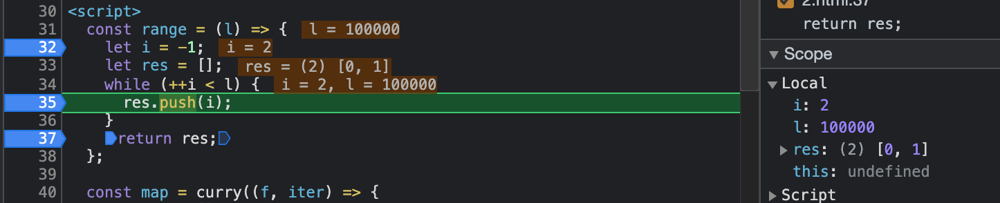

# 지연성 1

### range 함수와 느긋한 L.range 함수

숫자 하나를 받고 그 숫자의 크기만한 배열을 리턴하는 간단한 함수를 만들어보자.

```jsx
const range = (_) => _;
log(range(5)); // [0, 1, 2, 3, 4]
log(range(2)); // [0, 1]
```

가령 예를 들면 위와 같은 range 함수를 만들고자 하는 것이다.

```jsx
const range = (l) => {
  let i = -1;
  let res = [];
  while (++i < l) {
    log(i, "range"); // 0 "range", 1 "range", 2 "range", 3 "range"
    res.push(i);
  }
  return res;
};

// range 함수로 만들어진 배열의 모든 값을 더하는 함수는 아래와 같이 구현할 수 있다.
var list = range(4);
log(list); // [0, 1, 2, 3] - 이미 값이 도출된 상태
log(reduce(add, list)); // 6
```

### 느긋한 L.range 함수

위 range 함수를 활용해 느긋한 `L.range` 함수를 만들면 아래와 같다.

```jsx
const L = {};
// iterator를 만드는 제너레이터 함수 생성
L.range = function* (l) {
  let i = -1;
  while (++i < l) {
    log("test");
    log(i, "L.range"); // 아무것도 나오지 않음 -> 즉, list.next().value로 나오게된다.
    yield i;
  }
};

var list = L.range(4);
log(list); // L.range{<suspended>} - 값 평가가 아직 도출되지 않은 상태
// log(list.next()); // 0 "L.range" {value:0, done: false}
// log(list.next()); // 1 "L.range" {value:1, done: false}
log(reduce(add, list)); // 6
```

위 `L.range` 제너레이터 함수로 만들어진 `reduce(add, list);` 또한 동일하게 값 6을 만들어낸다. 그러나 위 일반 `range`함수와 `L.range`함수는 차이점이 존재하는데, 바로 `L.range` 함수에서 list가 일반 배열로 평가되는 것이 아닌 이터레이터로 나온다는 점이다. 이 함수가 동일한 값 6을 도출할 수 있는 이유는 reduce의 함수가 iterable을 받기 때문이며, 이는 즉 iterable을 iterator로 만들어 값을 산출하기 때문에 같은 값을 만들어내는 것이다.

좀 더 쉽게 설명하자면 🤔 `L.range` 함수로 만들어진 list 값은 실제 다음 함수인 `reduce`를 사용하기 전까지 값 평가가 완료되지 않은 상태, 즉 배열이 아닌 상태로 존재하다가 실제 다음 함수에서 값으로 다루어질 때 적절한 값 평가가 이루어진다고 볼 수 있다.

이런 이터레이터 L.range 함수를 사용하는 것이 range 함수를 사용하는 것보다 좀 더 효율적이다. 그 이유는 아래의 `reduce` 함수 구조를 보면 알 수 있다.

```jsx
const reduce = curry((f, acc, iter) => {
  if (!iter) {
    iter = acc[Symbol.iterator](); // iter가 없을 때 acc 값을 iterator로 만들어준다.
    acc = iter.next().value;
  }
  for (const a of iter) {
    acc = f(acc, a);
  }
  return acc;
});
```

`reduce` 함수에서는 iter값이 없을 때 acc 값을 `iterator`로 만들어주는 과정을 거친다.

이는 일반 `range`함수로 값을 도출했을 때 `[0, 1, 2, 3] → Array Iterator {} → 6`의 과정으로 계산이 도출됨을 의미한다. 그러나 `L.range` 함수로 값을 도출하면 초기값이 배열이 아닌 `L.range {<suspended>} → L.range{<suspended>} → 6`으로 도출된다. (iterator는 자기자신을 그대로 리턴하는 iterable이므로)

즉 연산의 과정이 짧아지므로 보다 더 효율적인 코드라고 할 수 있다.

### range 함수와 느긋한 L.range 함수 테스트

간단한 테스트 함수를 만들어 실제 효율적인 코드인지를 확인해보면 아래와 같다 🥸

```jsx
function test(name, time, f) {
  console.time(name);
  while (time--) f();
  console.timeEnd(name);
}

test("range", 10, () => reduce(add, range(1000000))); // range: 348.04833984375 ms
test("L.range", 10, () => reduce(add, L.range(1000000))); // L.range: 297.2119140625 ms
```

### take

큰 값을 잘라 잘라주는 함수인 take 함수를 만들어보자. 아래 take 함수처럼 iterable 프로토콜만 따른다면 다양한 소통과 조합을 할 수 있으므로, 조합성이 높고 효율적으로 구성이 가능하다.

```jsx
const take = curry((l, iter) => {
  let res = [];
  for (const a of iter) {
    res.push(a);
    if (res.length == l) return res;
  }
  return res;
});

console.time("");
log(take(5, range(100000))); // [0, 1, 2, 3, 4]
console.timeEnd(""); // 14.2861328125 ms

console.time("");
log(take(5, L.range(100000))); // [0, 1, 2, 3, 4]
console.timeEnd(""); // 0.2099609375 ms - 1

console.time("");
go(range(10000), take(5), reduce(add), log); // 10
console.timeEnd(""); // : 13.5 ms

console.time("");
go(L.range(10000), take(5), reduce(add), log); // 10
console.timeEnd(""); // : 0.218017578125 ms - 2
```

1. 실제 배열을 10000만큼 만들어서 5개를 자르는 것이 아닌 생성하면서 5개를 잘라내므로 시간적인 효율성이 크게 차이가 남을 볼 수 있다.

   ⇒ 무한 수를 넣어도 문제가 없다. `(log(take(5, L.range(Number.MAX_SAFE_INTEGER)));`

2. 제너레이터를 리턴하도록 go 함수를 씌우고 실제 연산은 iterable이 연산을 통해 생성한 배열만으로 연산을 실행하므로 필요한 연산만 하는 것을 통해 보다 더 효율적인 코드가 되는 것을 확인할 수 있다.

### 제너레이터/이터레이터 프로토콜로 구현하는 지연 평가

이터러블 중심 프로그래밍에서의 지연 평가를 흔히 `Lazy Evaluation`, 즉 느긋한 계산법이라고 불리는데, 이는 반대로 영리한 계산법 혹은 제때 계산법이라는 의미도 있다. 최대한 게으르게 최대한 영리하게 가장 필요할 때까지 평가를 미루고, 적절한 시점에 값을 연산하는 기법인 것이다.

기존에는 지연평가를 위한 별개의 연산을 직접 코드로 구현 해왔지만, 제너레이터/이터레이터 프로토콜이 자바스크립트에 공식적으로 제공되면서 이를 기반으로 서로 다른 함수들이 안전한 조합으로 기능을 구현할 수 있게 되었다. 이터러블 중심. 리스트 중심, 혹은 컬렉션 중심 프로그래밍으로 불리우는 지연 평가 프로그래밍은 map, filter, reduce 등을 기반으로 프로그래밍을 해나가는 것을 의미한다.

이들이 서로 어떻게 적절하게 지연을 이루어내고 함수 간의 조합성을 만들어가는지 하나씩 확인해보자.

### L.map

평가를 미루는 성질을 가지고 평가 순서를 달리 조작할 수 있는 준비가 되어있는 이터레이터를 반환하는 제너레이터 함수를 만들고자 한다.

```jsx
L.map = function* (f, iter) {
  for (const a of iter) yield f(a);
};
var it = L.map((a) => a + 10, [1, 2, 3]);
log([...it]); // [11, 12, 13]
log(it.next()); // {value: 11, done: false}
log(it.next().value); // 12
log(it.next()); // {value: 13, done: false}
```

### L.filter

이번에는 지연성을 가진 L.filter를 구현해본다.

```jsx
L.filter = function* (f, iter) {
  for (const a of iter) if (f(a)) yield a;
};
var it = L.filter((a) => a % 2, [1, 2, 3, 4]);
log(it.next()); // {value: 1, done: false}
log(it.next()); // {value: 3, done: false}
log(it.next()); // {value: undefined, done: true}
```

위 `L.map` 함수와 `L.filter` 함수의 특징은 함수 실행에 대한 반환값을 가진 변수 `it`는 아무것도 진행이 되지 않는다는 점이다. 이후 `next`를 통해 평가하고자 하는 값만으로 제때에 받아올 수 있는 것이다.

### range, map, filter, take, reduce 중첩 사용

기존에 즉시 평가되는 range, map, filter, take, reduce를 중첩 사용하여 코드를 만들어보고, 이후 이를 L.range, L.map, L.filter, take, reduce를 중첩 사용해보면서 좀 더 명확하고 구체적인 차이가 어떤지 알아보고, 평가 순서가 상관없는 함수형 프로그래밍의 이점을 살펴본다.

```jsx
const range = (l) => {
  let i = -1;
  let res = [];
  while (++i < l) {
    res.push(i);
  }
  return res;
};

const map = curry((f, iter) => {
  let res = [];
  iter = iter[Symbol.iterator]();
  let cur;
  while (!(cur = iter.next()).done) {
    const a = cur.value;
    res.push(f(a));
  }
  return res;
});

const filter = curry((f, iter) => {
  let res = [];
  iter = iter[Symbol.iterator]();
  let cur;
  while (!(cur = iter.next()).done) {
    const a = cur.value;
    if (f(a)) res.push(a);
  }
  return res;
});

const take = curry((l, iter) => {
  let res = [];
  iter = iter[Symbol.iterator]();
  let cur;
  while (!(cur = iter.next()).done) {
    const a = cur.value;
    res.push(a);
    if (res.length == l) return res;
  }
  return res;
});

const reduce = curry((f, acc, iter) => {
  if (!iter) {
    iter = acc[Symbol.iterator]();
    acc = iter.next().value;
  } else {
    iter = iter[Symbol.iterator]();
  }
  let cur;
  while (!(cur = iter.next()).done) {
    const a = cur.value;
    acc = f(acc, a);
  }
  return acc;
});

console.time("");
go(
  range(100000),
  map((n) => n + 10),
  filter((n) => n % 2),
  take(10),
  log
);
console.timeEnd("");
```



해당 함수값이 어떻게 변경되는지 보기 위해 디버그 콘솔 내 Sources에서 breakpoint를 걸어서 확인해본다.
