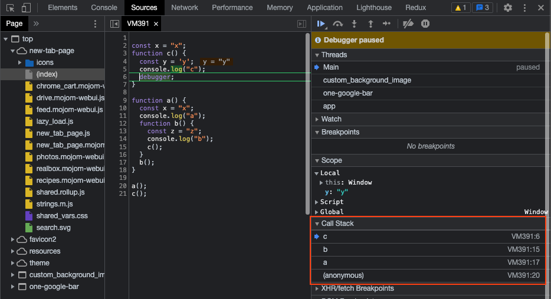

## 인간 JS 엔진되기

---

**[인간 JS 엔진되기](https://www.youtube.com/playlist?list=PLcqDmjxt30Rt9wmSlw1u6sBYr-aZmpNB3)**

- JS Core 기능을 직접 다뤄보면서, 놓쳤던 것들 다시 챙기기

---

### 함수와 함수의 호출

```jsx
// 함수의 선언
const add = (a, b) => a + b;
function calculator(func, a, b) {
  return func(a, b);
}

// 함수의 호출
add(3, 5); // 8
calculator(add, 3, 5); // 8
```

위처럼 함수의 선언과 호출을 나눠 사용할 수 있다.
calculator 함수의 경우 함수를 인자로 넘겨주어서 함수를 실행시켜줄 수 있다.

### 고차함수

아래와 같이 onClick 이란 고차함수가 있을 떄 e 매개변수는 어디에 위치시켜야할까?

```jsx
const onClick = () => () => console.log("hello");
document.querySelector("#header").addEventListener("click", onClick(e));

// 무엇이 정답?
// const onClick = (e) => () => console.log("hello");
// const onClick = () => (e) => console.log("hello");
```

위와 같이 고차함수를 매개변수로 넘겨줄 때 1. 함수의 호출부를 넣어야하는지, 선언부를 넣어야하는지, 2. 인자값 데이터를 어디에 넣어줘야하는지 궁금하다면 간단히 리턴값으로 대체해서 확인해볼 수 있다.

```jsx
// 만약 첫 번째 순서에 e가 들어간다면
const onClick = (e) => () => console.log("hello");
// 리턴값으로 값을 대체했을 때 아래와 같다.
document.querySelector("#header").addEventListener("click", () => console.log("hello"));
```

위와 같이 리턴값 어디에도 e 인자가 전달되는 부분이 없음. 따라서 아래와 같이 바꿔준다.

```jsx
// 만약 두 번째 순서에 e가 들어간다면
const onClick = () => (e) => console.log("hello");
// 리턴값으로 값을 대체했을 때 아래와 같다.
document.querySelector("#header").addEventListener("click", (e) => console.log("hello"));
```

위와 같이 e를 두 번째 순서에 위치시키면 적절하게 리턴값에 e 인자가 들어간 것을 확인할 수 있음
위처럼 함수의 선언과 호출, 그리고 고차함수에 대한 정확한 이해는 기본적이고 중요한 부분임

---

### 호출 스택 분석

`callstack.js`

```jsx
const x = "x";
function c() {
  const y = "y";
  console.log("c");
}

function a() {
  const x = "x";
  console.log("a");
  function b() {
    const z = "z";
    console.log("b");
    c();
  }
  b();
}

a();
c();

// a
// b
// c
// c
```

위 함수를 보고 코드를 실행해보기 전에 기본적으로 어떤 결과로 실행될지를 알아야 한다.
함수에서 각 접근 가능한 변수들도 미리 알 수 있어야 한다.

자바스크립트 코드는 기본적으로 왼쪽에서 오른쪽으로, 위에서부터 아래로 흐른다.
또한 스택 구조로 코드 수행 순서가 담긴다는 것을 잊지말자. (위 구조가 스택 구조로 읽히는지 확인)

```
a > log(즉시 실행 후 삭제) > b > log(즉시 실행 후 삭제) > c > log
```

즉, c 함수 종료 후 b 함수 종료, 마지막으로 a 함수가 종료되는 스택 구조
위 코드의 호출 순서를 코드 실행 시 확인 할 수 있다. `debugger` 라는 메서드를 실행시키면 됨.

`callstack.js`

```jsx
const x = "x";
function c() {
  const y = "y";
  console.log("c");
  debugger; // 여기 추가
}

function a() {
  // ..
}

a();
c();
```



개발자 도구를 확인하면 콜스택 뿐만 아니라 Scope까지 모두 확인할 수 있다.
anonymous는 뭘까? 헷갈린다면, 파일가 초기 실행되는 것을 anonymous라는 함수라고 생각하면 된다.

### 스코프 체인

호출 스택은 흐름만 이해하면 그 순서가 머리에 자연스럽게 그려지게 될 것이다.
이번에는 스코프 체인에 대해서도 알아보자. 스코프 체인은 함수가 어디까지 접근이 가능한지를 나타내는 단어이다.

```jsx
const x = "x";
function c() {
  const y = "y";
  console.log("c");
}

function a() {
  const x = "x";
  console.log("a");
  function b() {
    const z = "z";
    console.log("b");
    c();
  }
  b(); // 1 - b 함수 실행
}

a();
c();
```

1번 영역에서 b 함수가 실행되는 것은 스코프 체인에 의한 것이다. 같은 함수 a 내부에 b 함수 블럭의 본문이 존재하기 때문이다. 만약 위 코드가 아래와 같다면 어떨까?

```jsx
const x = "x";
function c() {
  const y = "y";
  console.log("c");
  function b() {
    const z = "z";
    console.log("b");
    c();
  }
}

function a() {
  const x = "x";
  console.log("a");
  b(); // 1 - b is not defined
}

a();
c();
```

a 함수에서 b함수가 실행되는데, 정상적으로 실행될까?
같은 블럭에 존재하지 않으므로 b 함수가 정의되지 않았다는 에러가 발생한다.
b 함수의 선언이 c 함수 내부에 있기 때문이다. 이것이 바로 lexical scope이며, 스코프 체인 이슈이다.
anonymous 함수 내 c 함수 존재(내부에 b 함수 존재) 즉 b → c → anonymous의 구조라고 할 수 있다.

스코프 체인이 중요한 이유는 무엇일까? 함수가 어디까지 접근 가능한지를 파악하기 위해서는 각 함수 간의 관계를 파악하는 것이 필수이기 때문이다.

만약 b 함수 내부에서 a 함수를 실행시킨다면 정상적으로 동작할까?

```jsx
const x = "x";
function c() {
  const y = "y";
  console.log("c");
  function b() {
    const z = "z";
    console.log("b");
    a(); // 1 - 정상 동작
  }
}

function a() {
  const x = "x";
  console.log("a");
}

a();
c();
```

정상적으로 동작한다. anonymous가 a 함수를 가지고 있기 때문이다.
b함수는 anonymous가 아니라, c 함수 내부에 존재하므로 에러가 발생했음

이렇게 선언 간의 지도가 머릿 속에 자연스럽게 그려지는지 확인해본다.

```jsx
const x = "x1";
function c() {
  // ..
}

function a() {
  const x = "x2";
  console.log("a");
  console.log(x); // x2
}

a();
```

위와 같은 코드가 있을 때, x의 값이 x2로 담기는 것도 스코프 체인의 개념으로 볼 수 있다.
a 함수 블럭 내에 x의 값이 선언되어 있기 때문임. 만약 a 함수 내부에 x 에 대한 선언이 없을 경우 x1이 로그에 찍힐 것이다.

이는 스코프 체인이 아닌, 호이스팅에 의한 것이다.

### 호이스팅

eslint를 쓰면 호이스팅을 기본적으로 막을 수 있다. 선언 전에 접근하는 호이스팅 이슈들을 미리 점검해준다.
함수는 작성방법에 따라 호이스팅 여부가 갈린다.

```jsx
console.log(a); // a(){ ... }
a(); // a
function a() {
  console.log("a");
}
```

function을 사용한 코드는 호이스팅에 의해 정상적으로 실행됨

```jsx
console.log(b); // b is not defined
b();
const b = () => {
  console.log("b");
};
```

반면, arrow function을 사용한 함수 형태는 호이스팅이 되지 않으므로 에러가 발생한다.
첫번째 function 함수가 에러가 발생하지 않는 이유는 무엇일까? 바로 함수의 선언 부분이 호이스팅 되기 때문이다. 마치 variable 변수가 호이스팅 되는 것과 같은 느낌이다.

```jsx
var h = "vicky";

// 위 코드는 곧 아래와 같다.

var h; // 호이스팅에 의해 h라는 변수가 코드 최상위로 끌어올려짐
// ...
h = "vicky";
console.log(window.h); // vicky :: window 객체로 자동 적용되는 이슈도 있음
```

### this

브라우저 상에서 기본적으로 this는 window다. (node 환경에서는 global임)

```jsx
console.log(this); // window { ... } globalThis
```

브라우저, 노드 모두 globalThis로 통합하여 사용할 수 있다.
strict 모드이면 this는 undefined이다. (ES2015 모듈에서는 strict 모드가 자동 적용됨)

```jsx
function a() {
  "use strict";
  console.log(this); // undefined
}

a();
```

this가 변경되는 가장 간략한 예시는 아래와 같다.

```jsx
const obj = {
  name: "vicky",
  sayName() {
    console.log(this.name);
  },
};

obj.sayName(); // vicky
window.name; // 빈 값 반환
```

그런데 sayName 함수를 새로운 변수에 담아버리면 this는 유실된다.

```jsx
const sayN = obj.sayName;
sayN(); // 빈 값 반환
```

또한, new 생성자 함수를 사용하여 this를 변경시킬 수 있다.

```jsx
function Human(name) {
  this.name = name;
}

new Human("vicky"); // Human {name: 'vicky'} [[Prototype]]: Object ...
```

이 밖에 bind, call, apply 메서드를 사용해 this를 변경할 수도 있다.

```jsx
function sayName() {
  console.log(this.name);
}
sayName(); // 빈 값 반환
sayName.bind({ name: "vicky" })(); // vicky
sayName.apply({ name: "vicky" }); // vicky
sayName.call({ name: "vicky" }); // vicky
```

this는 함수가 호출되는 순간에 정해진다.

위 코드에서 `obj.sayName()`의 경우 `sayName` 앞에 obj가 정확히 붙어있으므로 this는 obj 값들로 결정된다.
하지만 `sayN`의 경우 `obj.sayName()`을 담은 새로운 함수가 실행되므로 obj가 담기지 않는다.

이 밖에 this는 arrow function을 사용할 때에도 상속되지 않는다.

```jsx
const obj = {
  name: "vicky",
  sayName: () => console.log(this.name),
};

obj.sayName(); // 빈 값 반환
```

만약 아래의 경우에는 어떤 결과가 나올지 상상해보자

```jsx
const obj = {
  name: "vicky",
  sayName() {
    console.log(this.name);
    function inner() {
      console.log(this);
      console.log("inner:", this.name);
    }
    inner();
    // 만약 this를 obj로 상속하고 싶다면 bind, call, apply 활용 가능
    // inner.call(obj); // vicky
  },
};

obj.sayName();
// vicky
// window { ... }
// 빈 값 반환
```

왜 Inner 함수 내부의 this 값에 name이 상속되지 않았는가? this는 함수 호출 시 정해지며 obj.sayName은 호출 시 obj가 기준이 되므로 this가 적용되고, 상대적으로 inner는 함수 호출 시 this를 바꿔주는 영역이 없으므로 window 객체가 된다.

만약 arrow function이면 결과는 어떻게 될까?

```jsx
const obj = {
  name: "vicky",
  sayName() {
    console.log(this.name);
    const inner = () => {
      console.log(this);
      console.log(this.name);
    };
    inner();
  },
};

obj.sayName();
// vicky
// { name: 'vicky', sayName: f }
// vicky
```

이렇게 되면 inner 함수에 `obj.name` 값이 상속된다! 왜 때문인지 잘 파악해야 한다.
화살표 함수는 부모 함수의 this를 그대로 가져오므로 위 코드의 inner의 this도 obj 데이터를 상속받게 된다.

this는 함수가 호출될 때 함수 호출하는 방법에 따라 결정된다는 것을 기억하자.
머릿 속에 콜 스택이 그려지고 각 상황에서 this가 어떻게 적용되어 있는지도 파악할 수 있어야 한다.

위의 경우 `anonymous`(this = window) → `obj.sayName`(this = obj) → `log`(this.name 즉, obj.name인 vicky 반환) → `inner`(this = obj) → `log`(this.name 즉, obj.name인 vicky 반환)

만약 화살표 함수가 아닐 경우에는 아래와 같이 된다.

위의 경우 `anonymous`(this = window) → `obj.sayName`(this = obj) → `log`(this.name 즉, obj.name인 vicky 반환) → `inner`(this = window) → `log`(window.name 즉, 값이 없으므로 빈 값 반환)

### this를 분석할 수 없는 경우

this를 분석할 수 없는 경우도 있다.

```jsx
const header = document.querySelector('...');
header.addEventListener('click', function(){
	console.log(this); // <h3 class="mainPage"> ... </h3>
});
```

위와 같이 특정 돔을 가지고 클릭 이벤트마다 this를 찍어보는 로직이 있다고 하자
엘리먼트를 클릭할 때마다 this에는 클릭한 해당 엘리먼트가 찍힌다. 왜 일까?

this는 함수가 호출될 때 결정되는데, `function(){ console.log(this) }` 는 함수의 선언 영영이며, addEventListener 함수가 실제 호출된다고 할 수 있다. 즉, 위 함수가 호출되는 시점은 addEventListener 동작과정에서 숨겨진 어느 과정 가운데 수행되므로 click 이벤트에 this는 엘리먼트가 반환된다는 것을 외워야한다.

위 코드에서 엘리먼트가 남겨진 것은 예측컨데 addEventListener의 구조가 아래와 같을 것으로 생각할 수 있다.

```jsx
const header = {
	addEventListener: function(eventName, callback){
		// callback(); // this = window이므로 아닐 것 같음

		callback.call(this); // this = header로 바인딩
	}
}
```

위 this 변경 로직을 이해해두면, 향후 라이브러리를 개발하거나 데이터 핸들링을 위한 커스텀 함수를 만들 때 적절히 활용해볼 수 있을 것 같음.. 

만약 위와 같이 엘리먼트가 반환되지 않도록 하려면 화살표 함수로 구현하면 된다.

```jsx
const header = document.querySelector('...');
header.addEventListener('click', () => {
	console.log(this); // window
});
```

번외. apply와 call 함수의 차이점

```jsx
function add(a, b) { return a + b }

add.apply(null, [3, 5]); // 8, 뒤 인자가 배열로 들어감
add.call(null, 3, 5); // 8, 뒤 인자가 순서대로 들어감
```