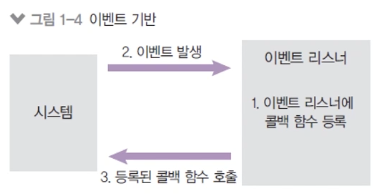
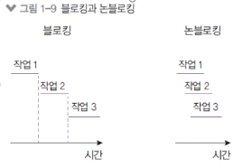
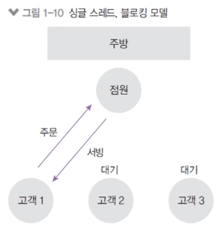
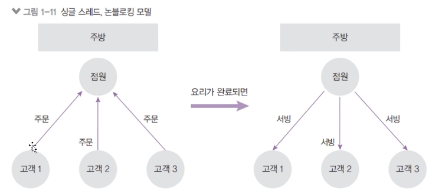
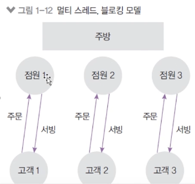
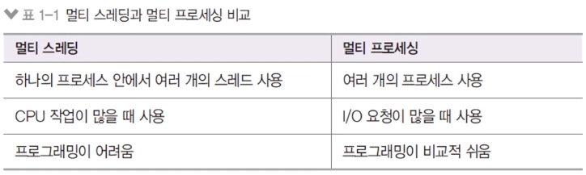

# 2) 노드의 특성

## 2-1. 이벤트 기반

버튼을 눌렀을 때 → 회원가입이 된다. 스크롤을 올릴 때 → 화면이 올라간다. 링크를 눌렀을 때 → 화면이 이동한다. 와 같이 모든 것이 이벤트 기반으로 돌아간다. 메모리에 콜백 함수(동작)에 대해 저장해둔다.

- 이벤트가 발생할 때 미리 지정해 둔 작업을 수행하는 방식
  - 이벤트의 예: 클릭, 네트워크 요청, 타이머 등
  - 이벤트 리스터: 이벤트를 등록하는 함수
  - 콜백 함수: 이벤트가 발생했을 때 실행될 함수

## 2-2. 논블로킹 I/O

오래 걸리는 함수를 백그라운드로 보내서 다음 코드가 먼저 실행되게 하고,
나중에 오래 걸리는 함수를 실행한다는 의미이다.

- 논 블로킹 방식 하에서 일부 코드는 백그라운드에서 병렬로 실행된다. (일부 코드: I/O 작업(파일 시스템 접근, 네트워크 요청), 압축, 암호화 등)
- 나머지 코드는 블로킹 방식으로 실행된다.
  - 즉, 동기이면 코드가 순서대로 실행되고(블로킹), 비동기이면 동시에 코드가 실행된다(논블로킹)
- - I/O 작업이 많을 때 노드 활용이 극대화 된다.

## 2-3. 프로세스 vs 스레드

- 프로세스와 스레드
  - 프로세스: 운영체제에서 할당하는 작업의 단위, 프로세스 간 자원 공유 X, 프로그램이 1개 뜨면 프로세스도 1개가 뜨는 개념이다.
  - 스레드: 프로세스 내에서 실행되는 작업의 단위, 부모 프로세스 자원 공유, 작은 탭
- 노드 프로세스는 멀티 스레드이지만 직접 다룰 수 있는 스레드는 하나이므로 싱글 스레드라고 표현
  - 멀티 스레드는 프로그래밍이 매우 어려워지므로 주로 싱글 스레드로 사용한다.
- 노드는 주로 멀티 스레드 대신 멀티 프로세스 활용
- 노드는 14버전부터 **멀티 스레드 사용 가능** → 동시에 여러가지 일을 할 수 있다.

## 2-4. 싱글 스레드

- 싱글 스레드라 주어진 일을 하나밖에 처리하지 못함
  - 스레드 하나는 CPU의 코어 1개를 먹는다. 즉 32core짜리 컴퓨터를 사면 싱글 스레드 Node 실행 시 31개의 코어는 아무 것도 하지 않고, 1개의 CPU만 열나게 동작하고 있는 구조
  - 위와 같이 블로킹이 발생하는 경우 나머지 작업은 모두 대기해야 한다. → 비효율 발생
- 주방에 비유 (점원: 스레드, 주문: 요청, 서빙: 응답)

- 대신 논 블로킹 모델을 채택하여 일부 코드(I/O)를 백그라운드(다른 프로세스)에서 실행 가능

  

  - 요청을 먼저 받고, 완료될 때 응답한다. (번호표를 나눠주고 부른다.)
  - I/O 관련 코드가 아닌 경우 싱글 스레드, 블로킹 모델과 같아진다.
  - 따라서 노드로 개발할 때에는 점원(스레드) 관리에 신경써야 한다. 또한 위와 같은 이슈로 많이 썻던 방식이 **멀티 프로세싱**으로, 점원(스레드)이 하나인 체인점(노드 프로세스)을 여러 개 두고 분산하는 방식이다.

## 2-5. 멀티 스레드 모델과의 비교

- 싱글 스레드 모델은 에러를 처리하지 못하는 경우 멈춤
  - 프로그래밍 난이도 쉽고, CPU, 메모리 자원 적게 사용
- 멀티 스레드 모델은 에러 발생 시 새로운 스레드를 생성하여 극복한다.
  - 단, 새로운 스레드 생성이나 놀고 있는 스레드 처리에 비용 발생
  - 프로그래밍 난이도가 어려움
  - 스레드 수만큼 자원을 많이 사용한다.

## 2-6. 멀티 스레드의 활용

- 노드 14버전

  - 멀티 스레드를 사용할 수 있도록 worker_threads 모듈 도입
  - CPU를 많이 사용하는 작업인 경우에 활용 가능
  - 멀티 프로세싱만 가능했던 아쉬움을 달래준다. (체인점 내는 것만 가능했는데, 하나의 가게에서 여러 직원을 두는 방법이 가능하게 되었다. 단, 멀티 스레드는 프로그래밍 난이도가 어려움으로 대게 싱글스레드로 구현하는 방법을 사용한다.)

    
