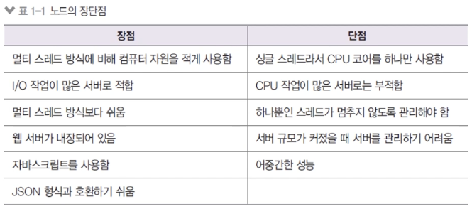

# 3. 서버로서의 노드

## 3-1. 서버로서의 노드

- 서버: 네트워크를 통해 클라이언트에 정보나 서비스를 제공하는 컴퓨터 또는 프로그램
- 클라이언트: 서버에 요청을 보내주는 주체(브라우저, 데스크탑 프로그램, 모바일 앱, 다른 서버에 요청을 보내는 서버)
- 예시
  - 브라우저(클라이언트, 요청)가 길벗 웹사이트(서버, 응답)에 접속
  - 핸드폰(클라이언트)을 통해 앱스토어(서버)에서 앱 다운로드
- 노드 ≠ 서버

  - But, 노드는 서버를 구성할 수 있게 하는 모듈(4장에서 공부)을 제공한다.
  - 노드 서버의 장단점

    (아래의 I/O 작업이란 Input&Output을 의미하며 요청받고, 응답주고, 파일 읽고 전달해주는 그런 이벤트 기반의 응답 동작에 적합하다. 이미지 리사이징이나 암호화 등 알고리즘이 들어가는 CPU 작업에는 부적합하다.)

    

  - CPU 작업을 위해 AWS Lambda나 Google Cloud Functions와 같은 별도 서비스 사용
  - 페이팔, 넷플릭스, 나사, 월마트, 링크드인, 우버 등에서 메인 또는 서브 서버로 사용한다.

## 3-2. 서버 외의 노드

- 자바스크립트 런타임이기 때문에 용도가 서버에만 한정되지 않는다.
- 웹, 모바일, 데스크탑 애플리케이션에도 사용한다.
  - 웹 프레임워크: Angular, React, Vue, Meteor 등
  - 모바일 앱 프레임워크: React Native
  - 데스크탑 개발도구: Electron(Atom, Slack, VSCode, Discord 등 제작)
- 위 프레임워크가 노드 기반으로 동작한다.
