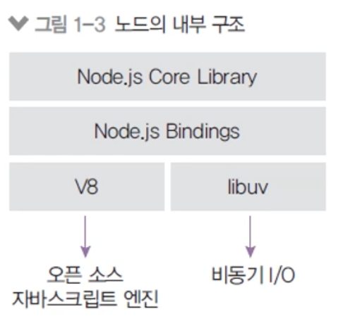

# 1. 노드의 정의

## 1-1. 노드의 정의

- **공식 홈페이지에서는**

  Node.js는 크롬 V8 자바스크립트 엔진으로 빌드된 **자바스크립트 런타임(실행기)**이다.

  - Node를 이용하면 html, 브라우저의 종속없이 실행될 수 있다.
    이는 곧 자바스크립트가 앱, 게임, 데스크탑 프로그램 등을 만들 수 있다는 의미이다.
  - 타입스크립트도 런타임은 Dino

- **노드는 서버가 아닐까? 서버라는 말이 없다.**
  - 서버의 역할도 수행할 수 있는 자바스크립트 런타임
  - 노드로 자바스크립트로 작성된 서버를 실행할 수 있다.
  - 서버 실행을 위해 필요한 http / https / http2 모듈을 제공

## 1-2. 런타임

- **노드: 자바스크립트 런타임**
  - 런타임: 특정 언어로 만든 프로그램들을 실행할 수 있게 해주는 가상 머신(크롬의 v8엔진 사용)의 상태
  - 노드: 자바스크립트로 만든 프로그램을 실행할 수 있게 해 줌
  - 다른 런타임으로는 웹 브라우저(크롬, 엣지, 사파리, 파이어폭스 등)가 있음
  - 노드 이전에도 자바스크립트 런타임을 만들기 위한 많은 시도가 있었으나 엔진 속도 문제로 실패함

## 1-3. 내부 구조

- **2008년 V8 엔진 출시, 2009년 노드 프로젝트 시작**
- **노드는 V8과 libuv를 내부적으로 포함**
  - V8 엔진: 오픈 소스 자바스크립트 엔진(C, C++) → 속도 문제 개선
  - libuv: 노드의 특성인 이벤트 기반, 논블로킹, **간단한 싱글 thread 비동기 I/O 모델**을 구현한 라이브러리 → libuv로 유명해졌다!
