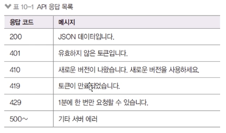

# API 사용량 제한 구현

### DOS 공격 등 대비 필요

DOS : 한사람이 여러번 새로고침하는 것을 의미

- 일정 시간동안 횟수 제한을 두어 무차별적인 요청을 막을 필요가 있다.
- `npm i express-slow-down`
- apiLimiter 미들웨어 추가

  - windowMS(기준 시간), delayAfter(허용 횟수), delayMS(호출 간격), onLimiReached(제한 초과 시 콜백 함수)
  - `nodebird-api/routes/middlewares.js`

    ```jsx
    const slowDown = require("express-slow-down");

    // ..
    exports.apiLimiter = slowDown({
      windowMs: 60 * 1000, // 1분 간
      delayAfter: 10, // 10번만 요청 가능
      delayMs: 1000, // 요청 간 1초의 간격이 있다.
      onLimitReached(req, res, options) {
        res.status(429).json({
          code: 429,
          message: "1분에 10번만 요청할 수 있습니다."
        });
      }
    });

    // deprecated 미들웨어는 사용하면 안 되는 라우터에 붙여서 사용 시 경고
    exports.deprecated = (req, res) => {
      res.status(410).json({
        code: 410,
        message: "새로운 버전이 나왔으니 버전 업그레이드를 해주세요!"
      });
    };
    ```

### 응답 코드 정리

- 응답 코드를 정리해서 어떤 에러가 발생헀는지 알려주기

  - 일관성이 있으면 된다.

    

### 새 라우터 버전 내놓기

- 사용량 제한 기능이 추가되어 기존 API와 호환되지 않음

  - 이런 경우 새로운 버전의 라우터를 사용하면 된다.
  - v2 라우터 작성(apiLimiter 추가된 버전)
  - v1 라우터는 deprecated 처리(router.use로 한 번에 모든 라우터에 적용)
  - `nodebird-api/routes/v1.js`

    ```jsx
    const express = require("express");
    const jwt = require("jsonwebtoken");
    const { verifyToken, deprecated } = require("./middlewares");
    const { Domain, User, Post, Hashtag } = require("../models");

    const router = express.Router();

    router.use(deprecated);

    // routers...

    module.exports = router;
    ```

  - `nodebird-api/app.js`

    ```jsx
    //..
    const v1 = require("./routes/v1");
    const v2 = require("./routes/v2"); // add

    // ..
    app.use("/auth", authRouter);
    app.use("/", indexRouter);
    app.use("/v1", v1);
    app.use("/v2", v2); // add

    //..
    ```
