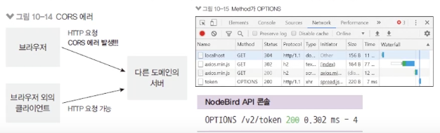

# CORS 적용

### nodecat 프론트 작성

- 프론트에서 서버의 API를 호출하면 어떻게 될까?

  - `routes/index.js`

    ```jsx
    // ..
    router.get("/", (req, res) => {
      res.render("main", { key: process.env.CLIENT_SECRET }); // 서버 키와 프론트 키를 분리해야한다.
    });

    module.exports = router;
    ```

  - `views/main.html`

    ```html
    <!DOCTYPE html>
    <html lang="en">
      <head>
        <meta charset="UTF-8" />
        <meta http-equiv="X-UA-Compatible" content="IE=edge" />
        <meta name="viewport" content="width=device-width, initial-scale=1.0" />
        <title>프론트 API 요청</title>
      </head>
      <body>
        <div id="result"></div>
        <script src="https://unpkg.com/axios/dist/axios.min.js"></script>
        <script>
          axios
            .post("http://localhost:8002/v2/token", {
              clientSecret: "{{key}}"
            })
            .then((res) => {
              document.querySelector("#result").textContent = JSON.stringify(res.data);
            })
            .catch((err) => {
              console.error(err);
            });
        </script>
      </body>
    </html>
    ```

### 프론트에서 요청 보내기


- localhost:4000에 접속하면 에러 발생
- 요청을 보내는 프론트(localhost:4000), 요청을 받는 서버(localhost:8002)가 다르면 에러가 발생한다.

  - 브라우저에서 서버로 API 요청을 보낼 때 도메인이 다르면 발생시키는 에러로
    서버에서 서버로 요청을 보낼 때에는 발생하지 않는다
  - CORS: Cross-Origin Resource Sharing 문제
  - 브라우저는 POST 대신 OPTIONS 요청을 먼저 보내 서버가 도메인을 허용하는지 미리 체크한다.

    

### CORS 문제 해결 방법

- `Access-Control-Allow-Origin` 응답 헤더를 넣어주어야 CORS 문제 해결 가능

  - res.set 메서드로 직접 넣어줘도 되지만 패키지를 사용하는게 편리
  - `npm i cors`
  - v2 라우터에 적용(app.js에 공통으로 적용해도 되지만 비추천)
  - `credentials: true`를 해야 프론트와 백엔드 간의 쿠키가 공유된다.
  - `nodebird-api/routes/v2.js`

    ```jsx
    const express = require("express");
    const jwt = require("jsonwebtoken");
    const { verifyToken, apiLimiter } = require("./middlewares");
    const { Domain, User, Post, Hashtag } = require("../models");
    const cors = require("cors");

    const router = express.Router();

    // v2 라우터 전체에 cors 허용
    router.use(
      cors({
        origin: true,
        credentials: true
      })
    );
    ```

### 클라이언트 도메인 검사하기

- 클라이언트 환경에서는 비밀키가 노출됨

  - 도메인까지 같이 검사해야 요청 인증 가능
  - 호스트와 비밀키가 모두 일치할 때만 CORS를 허용
  - 클라이언트의 도메인(req.get('origin'))과 등록된 호스트가 일치하는 지 찾음
  - url.parse().host는 http같은 프로토콜을 떼어내기 위함
  - cors의 인자로 origin을 주면 \* 대신 주어진 도메인만 허용할 수 있음
  - `nodebird-api/routes/v2.js`

    ```jsx
    const express = require("express");
    const jwt = require("jsonwebtoken");
    const { verifyToken, apiLimiter } = require("./middlewares");
    const { Domain, User, Post, Hashtag } = require("../models");
    const cors = require("cors");
    const url = require("url");

    const router = express.Router();

    // 미들웨어 확장 패턴
    router.use(async (req, res, next) => {
      // 도메인 검사
      const domain = await Domain.findOne({
        wehre: { host: url.UrlWithParsedQuery(req.get("origin"))?.host }
      });
      if (domain) {
        cors({
          origin: true,
          credentials: true
        })(req, res, next);
      } else {
        next();
      }
    });
    ```

### CORS 적용확인

- localhost:4000에 접속하면 정상적으로 토큰이 발행된다. (OPTION API의 Response Headers에 `Access-Control-Allow-*` 정보들이 들어와있음

  

---

### 프록시 서버

- CORS 문제에 대한 또다른 해결책

  - 서버 - 서버 간의 요청/응답에는 CORS 문제가 발생하지 않는 것을 활용
  - 직접 구현해도 되지만 `http-proxy-middleware`와 같은 패키지로 손쉽게 연동 가능

    
