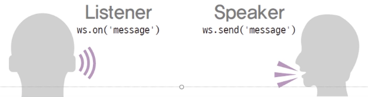
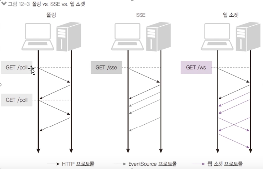
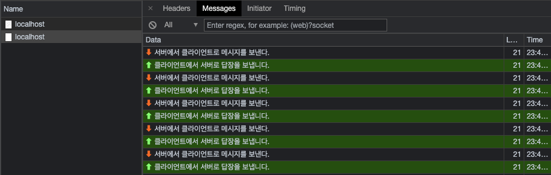

# 웹소켓 사용해보기

### 웹 소켓 이해하기



- 웹 소켓: 실시간 양방향 데이터 전송을 위한 기술
  - ws 프로토콜 사용 → 브라우저가 지원해야 함
  - 최신 브라우저는 대부분 웹 소켓을 지원함
  - 노드는 ws나 Socket I.O 같은 패키지를 통해 웹 소켓 사용 가능
- 웹 소켓 이전에는 폴링이라는 방식을 사용했음
  - HTTP가 클라이언트에서 서버로만 요청이 가기 때문에 주기적으로 서버에 요청을 보내 업데이트가 있는 지 확인함
  - 웹 소켓은 연결도 한 번만 맺으면 되고, HTTP와 포트 공유도 가능하며, 성능도 매우 좋음

### 서버센트 이벤트

- SSE(Server Sent Events)

  

  - EventSource라는 객체를 사용
  - 처음에 한 번만 연결하면 서버가 클라이언트에 지속적으로 데이터를 보내줌
  - 클라이언트에서 서버로는 데이터를 보낼 수 없다.

## ws 모듈로 웹 소켓 사용하기

### gif-chat 프로젝트 생성

- gif-chat 폴더 생성 후 package.json 작성

  ```jsx
  {
    "name": "gif-chat",
    "version": "1.0.0",
    "description": "GIF 채팅방",
    "main": "app.js",
    "scripts": {
      "start": "nodemon app"
    },
    "author": "Vicky",
    "license": "MIT",
    "devDependencies": {
      "nodemon": "^2.0.7"
    },
    "dependencies": {
      "cookie-parser": "^1.4.5",
      "dotenv": "^10.0.0",
      "express": "^4.17.1",
      "express-session": "^1.17.2",
      "morgan": "^1.10.0",
      "nunjucks": "^3.2.3",
      "ws": "^7.5.0"
    }
  }
  ```

### 기본 파일 작성

- 패키지를 설치 후 .env와 app.js, routes/index.js 파일 작성

  `.env`

  ```
  COOKIE_SECRET=1234
  ```

  `app.js`

  ```jsx
  const express = require("express");
  const path = require("path");
  const morgan = require("morgan");
  const cookieParser = require("cookie-parser");
  const session = require("express-session");
  const nunjucks = require("nunjucks");
  const dotenv = require("dotenv");

  dotenv.config();
  const webSocket = require("./socket");
  const indexRouter = require("./routes");

  const app = express();
  app.set("port", process.env.PORT || 8005);
  app.set("view engine", "html");
  nunjucks.configure("views", {
    express: app,
    watch: true
  });

  app.use(morgan("dev"));
  app.use(express.static(path.join(__dirname, "public")));
  app.use(express.json());
  app.use(express.urlencoded({ extended: false }));
  app.use(cookieParser(process.env.COOKIE_SECRET));
  app.use(
    session({
      resave: false,
      saveUninitialized: false,
      secret: process.env.COOKIE_SECRET,
      cookie: {
        httpOnly: true,
        secure: false
      }
    })
  );

  app.use("/", indexRouter);

  app.use((req, res, next) => {
    const error = new Error(`${req.method} ${req.url} 라우터가 없습니다.`);
    error.status = 404;
    next(error);
  });

  app.use((err, req, res, next) => {
    res.locals.message = err.messagel;
    res.locals.error = process.env.NODE_ENV !== "production" ? err : {};
    res.status(err.status || 500);
    res.render("error");
  });

  const server = app.listen(app.get("port"), () => {
    console.log(app.get("port"), "번 포트에서 대기 중");
  });

  webSocket(server);
  ```

  `routes/index.js`

  ```jsx
  const express = require("express");
  const router = express.Router();

  router.get("/", (req, res) => {
    res.render("index");
  });

  module.exports = router;
  ```

### ws 모듈 설치 및 socket.js 파일

- `npm i ws` 설치
  - 웹 소켓을 익스프레스에 연결하기 위함
- ws 모듈을 불러와 socket.js 작성

  ```jsx
  const WebSocket = require("ws");

  module.exports = (server) => {
    // web-socket-server
    const wss = new WebSocket.Server({ server });

    wss.on("connection", (ws, req) => {
      // 웹 소켓 연결 시
      const ip = req.headers["x-forwarded-for"] || req.connection.remoteAddress; // ip 파악
      console.log("새로운 클라이언트 접속", ip);
      // 클라이언트로부터 메시지
      ws.on("message", (message) => {
        console.log(message);
      });
      // 에러 시
      ws.on("error", (error) => {
        console.error(error);
      });
      // 연결 종료 시
      ws.on("close", () => {
        console.log("클라이언트 접속 해제", ip);
        clearInterval(ws.interval);
      });

      // 3초마다 클라이언트로 메시지 전송
      ws.interval = setInterval(() => {
        if (ws.readyState === ws.OPEN) {
          ws.send("서버에서 클라이언트로 메시지를 보낸다.");
        }
      }, 3000);
    });
  };
  ```

  - new Websocket.Server({ server })로 익스프레스 서버와 연결
  - connection 이벤트는 서버와 연결될 때 실행되는 이벤트
  - req.headers['x-forwarded-for'] || req.connection.remoteAddress는 클라이언트 IP를 알아내는 방법 중 하나
  - message, error, close 이벤트는 각각 메시지가 올 때, 에러 발생 시, 서버 연결 종료 시 호출
  - ws.OPEN은 연결 상태가 열려있다는 뜻(연결되었다는 뜻)
  - ws.send로 메시지 전송(3초마다 보낸다)

### 프론트에서 메시지 답장하기

- views/index.html를 작성하고 스크립트 작성

  ```jsx
  <!DOCTYPE html>
  <html lang="ko">
    <head>
      <meta charset="UTF-8" />
      <title>GIF 채팅방</title>
    </head>
    <body>
      <div>F12를 눌러 console 탭과 network 탭을 확인하세요.</div>
      <script>
        // WebSocket이라는 객체를 브라우저에서 모두 제공해준다.
        // WebSocket 연결시도 - socket.js에서 연결에 대한 준비 필요
        const webSocket = new WebSocket("ws://localhost:8005");
        webSocket.onopen = function () {
          console.log("서버와 웹 소켓 연결 성공!");
        };
        webSocket.onmessage = function (event) {
          console.log(event.data);
          webSocket.send("클라이언트에서 서버로 답장을 보냅니다.");
        };
      </script>
    </body>
  </html>
  ```

  - new WebSocket은 최신 브라우저에서 지원
  - 인수로 서버의 주소를 입력
  - onopen 이벤트 리스너는 서버와 연결되었을 때 호출
  - onmessage 이벤트 리스너는 서버에서 메시지가 올 때 호출
  - event.data에 서버 메시지 내용이 들어있음
  - webSocket.send로 서버로 메시지 전달 가능

  ### 서버 실행하기

  - [http://localhost:8005](http://localhost:8005) 접속

    - F12로 디버그 콘솔 실행
    - 접속하는 순간부터 노드의 콘솔과 브라우저의 콘솔에 3초마다 메시지가 로깅된다.

      - 노드 콘솔

        ```bash
        $ npm start

        > gif-chat@1.0.0 start
        > nodemon app

        [nodemon] 2.0.7
        [nodemon] to restart at any time, enter `rs`
        [nodemon] watching path(s): *.*
        [nodemon] watching extensions: js,mjs,json
        [nodemon] starting `node app.js`
        8005 번 포트에서 대기 중
        GET / 200 61.249 ms - 751
        새로운 클라이언트 접속 ::1
        GET /favicon.ico 404 12.163 ms - 1234
        클라이언트에서 서버로 답장을 보냅니다.
        클라이언트에서 서버로 답장을 보냅니다.
        클라이언트에서 서버로 답장을 보냅니다.
        ///
        ```

      - 브라우저 콘솔

        

### 다른 브라우저로도 연결하기

- 다른 브라우저에서 http://localhost:8005에 접속

  - 접속한 브라우저(클라이언트)가 두 개이므로, 서버가 받는 메시지의 양도 두 배가 된다.

    ```bash
    ...
    클라이언트에서 서버로 답장을 보냅니다.
    클라이언트에서 서버로 답장을 보냅니다.
    클라이언트에서 서버로 답장을 보냅니다.
    클라이언트 접속 해제 ::1
    GET / 304 5.719 ms - -
    새로운 클라이언트 접속 ::1
    클라이언트에서 서버로 답장을 보냅니다.
    ...
    ```

### 클라이언트 하나 종료하기

- 브라우저 하나 종료하기

  - 콘솔에 접속 해제 메시지가 뜨고, 메시지의 양이 하나가 된다.

    ```bash
    ...
    클라이언트에서 서버로 답장을 보냅니다.
    클라이언트 접속 해제 ::1
    클라이언트에서 서버로 답장을 보냅니다.
    클라이언트에서 서버로 답장을 보냅니다.
    ...
    ```

  - 편의성을 위해 ws 모듈 대신 [Socket.IO](http://socket.IO) 모듈 사용
