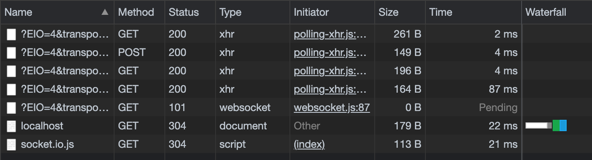
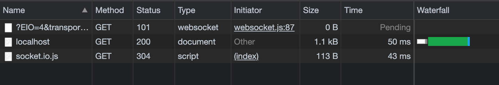

# Socket.IO 사용해보기

### Socket.IO 설치하기

- `npm i socket.io`
  - ws 패키지 대신 [Socket.IO](http://socket.IO) 연결
  - [Socket.IO](http://socket.IO) 패키지를 불러와 익스프레스 서버와 연결.
    두 번째 인수는 클라이언트와 연결할 수 있는 경로(/socket.io)
  - connection 이벤트는 서버와 연결되었을 때 호출, 콜백으로 소켓 객체(socket) 제공
  - socket.request로 요청 객체에 접근 가능, socket.id로 소케 고유 아이디 확인 가능
  - disconnect 이벤트는 연결 종료 시 호출, error는 에러 발생 시 호출
  - reply는 사용자가 직접 만들 이벤트로 클라이언트에서 reply 이벤트 발생 시 서버에 전달됨
  - socket.emit으로 메시지 전달. 첫 번째 인수는 이벤트명, 두 번째 인수가 메시지
- `socket.js`

  ```jsx
  const SocketIO = require("socket.io");

  module.exports = (server) => {
    // 서버와 연결
    const io = SocketIO(server, { path: "/socket.io" });

    // 웹소켓 연결 시
    io.on("connection", (socket) => {
      const req = socket.request;
      const ip = req.headers["x-forwarded-for"] || req.connection.remoteAddress;
      console.log("새로운 클라이언트 접속!", ip, socket.id, req.ip);
      // 연결 종료 시
      socket.on("disconnect", () => {
        console.log("클라이언트 접속 해제", ip, socket.id);
        clearInterval(socket.interval);
      });
      // 에러 시
      socket.on("error", (error) => {
        console.error(error);
      });
      // 클라이언트로부터 메시지
      socket.on("reply", (data) => {
        console.log(data);
      });
      // 3초마다 클라이언트로 메시지 전송
      socket.interval = setInterval(() => {
        socket.emit("news", "Hello Socket.IO");
      }, 3000);
    });
  };
  ```

### 클라이언트에서 메시지 주고 받기

- `views/index.html` 수정

  ```html
  <!DOCTYPE html>
  <html lang="ko">
    <head>
      <meta charset="UTF-8" />
      <title>GIF 채팅방</title>
    </head>
    <body>
      <div>F12를 눌러 console 탭과 network 탭을 확인하세요.</div>
      <script src="/socket.io/socket.io.js"></script>
      <script>
        const socket = io.connect("http://localhost:8005", {
          path: "/socket.io"
        });
        socket.on("news", function (data) {
          console.log(data);
          socket.emit("reply", "Hello Node.JS");
        });
      </script>
    </body>
  </html>
  ```

  - /socket.io/socket.io.js 스크립트를 넣어주어야 한다.(io 객체 제공)
  - connect 메서드로 서버 주소로 연결하고 서버의 설정과 같은 path 입력(/socket.io)
  - 서버 주소가 http 프로토콜임에 유의
  - news 이벤트 리스너로 서버에서 오는 news 이벤트 대기
  - `socket.emit('reply', 메시지)`로 reply 이벤트 발생

### 서버 실행하기

- http://localhost:8005에 접속

  - 개발자 도구 Network 탭을 보면 웹 소켓과 폴링 연결이 둘 다 있음을 확인할 수 있다.

    

  - Socket.IO는 먼저 폴링 방식으로 연결 후 (웹 소켓을 지원하지 않는 브라우저를 위해), 웹 소켓을 사용할 수 있다면 웹 소켓으로 업그레이드
  - 단, 위 과정을 생략하고 웹 소켓만 사용하고 싶다면 index.html에서 transports 옵션에 아래와 같이 "websocket"을 추가해주면 된다.

    ```html
    <!DOCTYPE html>
    <html lang="ko">
      <head>
        <meta charset="UTF-8" />
        <title>GIF 채팅방</title>
      </head>
      <body>
        <div>F12를 눌러 console 탭과 network 탭을 확인하세요.</div>
        <script src="/socket.io/socket.io.js"></script>
        <script>
          const socket = io.connect("http://localhost:8005", {
            path: "/socket.io",
            transports: ["websocket"] // 해당 조건이 없으면 polling 먼저 해보고 websocket이 가능하면 websocket 시작 - 싫으면 이 조건을 넣으면 된다.
          });
          socket.on("news", function (data) {
            console.log(data);
            socket.emit("reply", "Hello Node.JS");
          });
        </script>
      </body>
    </html>
    ```

    
