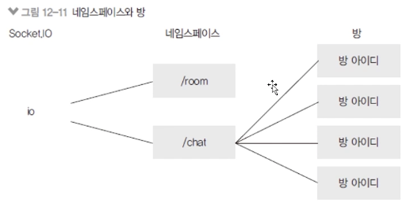

# 네임스페이스와 방

### socket.js에 소켓 이벤트 연결

- `app.set("io", io);` 로 app과 연결해주면 라우터에서 req.app.get('io')로 [socket.io](http://socket.io) 객체를 사용할 수 있다.
- `io.of('/room')`, `io.of('/chat')` 로 각 네임스페이스를 생성하여 해당 스페이스별로 접속해서 처리할 일을 적어준다.
- `socket.js`

  ```jsx
  const SocketIO = require("socket.io");

  module.exports = (server, app) => {
    // 서버와 연결
    const io = SocketIO(server, { path: "/socket.io" });
    app.set("io", io);
    const room = io.of("/room"); // namespace
    const chat = io.of("/chat"); // namespace

    room.on("connection", (socket) => {
      console.log("room 네임스페이스에 접속");
      socket.on("disconnect", () => {
        console.log("room 네임스페이스 접속 해제");
      });
    });

    chat.on("connection", (socket) => {
      console.log("chat 네임스페이스에 접속");
      const req = socekt.request;
      const {
        headers: { referer }
      } = req;
      const roomId = referer.split("/")[referer.split("/").length - 1].replace(/\?.+/, "");
      socket.join(roomId); // 방

      socket.on("disconnect", () => {
        console.log("chat 네임스페이스 접속 해제");
        socket.leave(roomId);
      });
    });
  };
  ```

### 방 개념 이해하기

- Socket.IO에서는 io 객체 아래에 네임스페이스와 방이 있음

  

  - 기본 네임스페이스는
  - 방은 네임스페이스의 하위 개념
  - 같은 네임스페이스, 같은 방 안에서만 소통할 수 있음

### color-hash 적용하기

- 익명 채팅이므로 방문자에게 고유 컬러 아이디 부여
  - 세션에 컬러아이디 저장(req.session.color)
- `app.js`

  ```jsx
  // ...
  const ColorHash = require("color-hash");

  // ...

  // 세션이 끝나기 전까지는 req.session.color에 공유한 색상이 부여된다. 세션 종료 시 초기화
  app.use((req, res, next) => {
    if (!req.session.color) {
      const colorHash = new ColorHash();
      req.session.color = colorHash.hex(req.sessionID);
    }
    next();
  });

  // ...

  webSocket(server, app);
  ```
