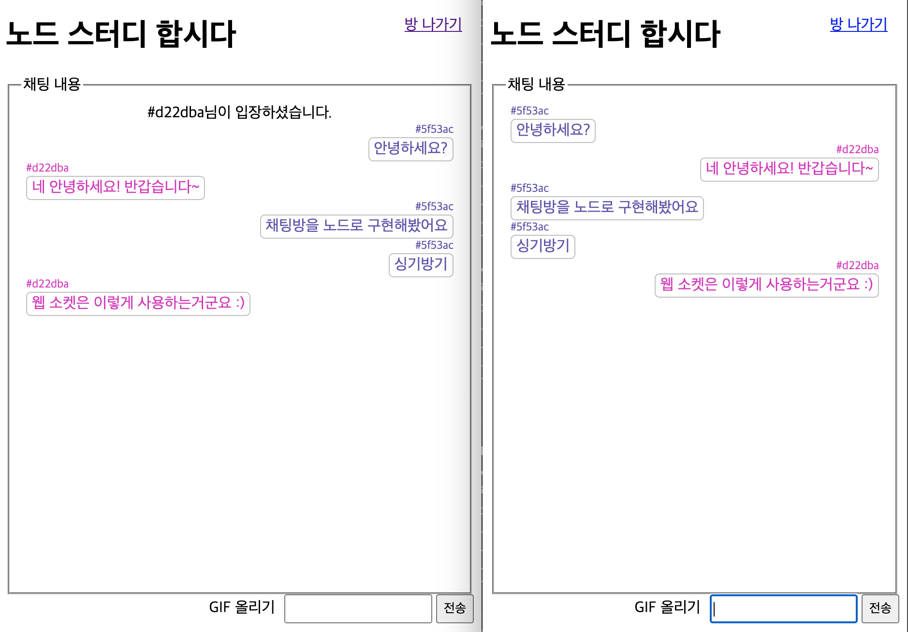

# 채팅 및 GIF 파일 주고 받기

### 채팅 소켓 이벤트 리스너 붙이기

- `views/chat.html`

  - chat 이벤트 리스너를 추가, 채팅 메시지가 웹 소켓으로 전송될 때 호출된다.
  - event.data.user(채팅 발송자)에 따라 다르게 렌더링된다.

  ```html
  <script>
    // ..

    socket.on("chat", function (data) {
      const div = document.createElement("div");
      if (data.user === "{{user}}") {
        div.classList.add("mine");
      } else {
        div.classList.add("other");
      }
      const name = document.createElement("div");
      name.textContent = data.user;
      div.appendChild(name);
      if (data.chat) {
        const chat = document.createElement("div");
        chat.textContent = data.chat;
        div.appendChild(chat);
      } else {
        const gif = document.createElement("img");
        gif.src = "/gif/" + data.gif;
        div.appendChild(gif);
      }
      div.style.color = data.user;
      document.querySelector("#chat-list").appendChild(div);
    });
    document.querySelector("#chat-form").addEventListener("submit", function (e) {
      e.preventDefault();
      if (e.target.chat.value) {
        axios
          .post("/room/{{room._id}}/chat", {
            chat: this.chat.value
          })
          .then(() => {
            e.target.chat.value = "";
          })
          .catch((err) => {
            console.error(err);
          });
      }
    });
  </script>
  ```

### 방에 접속하는 라우터 만들기

`routes/index.js`

```jsx
const express = require("express");

const Room = require("../schemas/room");
const Chat = require("../schemas/chat");

const router = express.Router();

// ...

// 비밀번호가 있는 방
router.get("/room/:id", async (req, res, next) => {
  try {
    const room = await Room.findOne({ _id: req.params.id }); // 방이 있는지 확인
    const io = req.app.get("io");

    // ...
    // 방 접속 시 기존 채팅 내역들을 가져와서 넣어준다.
    const chats = await Chat.find({ room: room._id }).sort("createdAt");
    return res.render("chat", {
      room,
      title: room.title,
      chats,
      user: req.session.color
    });
  } catch (error) {
    console.error(error);
    return next(error);
  }
});

// ..
module.exports = router;
```

### 채팅 라우터 만들기

- 채팅을 DB에 저장 후 방에 뿌려준다.

  ```jsx
  const express = require("express");

  const Room = require("../schemas/room");
  const Chat = require("../schemas/chat");

  const router = express.Router();

  // ..

  // 대화 보내기 라우터 추가
  router.post("/room/:id/chat", async (req, res, next) => {
    try {
      const chat = await Chat.create({
        room: req.params.id, // 방 ID
        user: req.session.color,
        chat: req.body.chat
      });
      // req.app.get("io").to(socket.io).emit("chat", chat); 해당 socket.io를 가진 유저에게만 대화 전달(귓속말)
      // req.app.get("io").broadcast.emit("chat", chat); 나를 제외한 나머지에게만 대화 전달
      req.app.get("io").of("/chat").to(req.params.id).emit("chat", chat); // 방(req.params.id) 지정 후 대화 전달
      res.send("ok");
    } catch (error) {
      console.error(error);
      next(error);
    }
  });

  module.exports = router;
  ```

### 채팅화면



### 웹 소켓만으로 채팅 구현하기

- DB를 쓰지 않고도 바로 socket.emit으로 채팅 전송 가능

  - `views/chat.html`

    ```html
    <script>
      // ...
      document.querySelector("#chat-form").addEventListener("submit", function (e) {
        e.preventDefault();
        if (e.target.chat.value) {
          socket.emit("chat", {
            room: `{{room._id}}`,
            user: `{{user}}`,
            chat: e.target.chat.value
          });
          e.target.chat.value = "";
        }
      });
    </script>
    ```

  - `socket.js`

    ```jsx
    chat.on("connection", (socket) => {
      // ...
      socket.on("disconnect", () => {
        // ...
      });
      socket.on("chat", (data) => {
        socket.to(data.room).emit(data);
      });
    });
    ```

- 이번 예제에서 라우터를 사용하여 소켓 통신을 한 이유?

  웹 소켓이랑 라우터를 연결하는 것을 실제 구현해 본 목적과 보통 DB를 처리할 일이 있을 때에는 라우터를 거치는 방식을 사용했었기 때문. 단, Http라우터랑 웹 소켓이 함께 돌아갈 때 성능적으로 무리가 갈 수 있으므로 socket.js에서 db까지 처리해서 구현하는 것이 좋을 수 있다.

### 기타 Socket.IO API

- 특정인에게 메시지 보내기(귓속말, 1대1 채팅 등에 사용)

  ```jsx
  // socket.to(소켓 아이디).emit(이벤트, 데이터);
  // 해당 socket.io를 가진 유저에게만 대화 전달(귓속말)
  req.app.get("io").to(socket.io).emit("chat", chat);
  ```

- 나를 제외한 전체에게 메시지 보내기

  ```jsx
  // socket.broadcast.emit(이벤트, 데이터);
  // socekt.broadcast.to(방 아이디).emit(이벤트, 데이터);
  // 나를 제외한 나머지에게만 대화 전달
  req.app.get("io").broadcast.emit("chat", chat);
  ```

### GIF 전송 구현

- `views/chat.html`

  ```html
   
  <h1>{{title}}</h1>
  <a href="/" id="exit-btn">방 나가기</a>
  <fieldset>
    <legend>채팅 내용</legend>
    <div id="chat-list">
       
      <div class="mine" style="color: {{chat.user}}">
        <div>{{chat.user}}</div>
        }
        
        
        <div>{{chat.chat}}</div>
        
      </div>
      
      <div class="system">
        <div>{{chat.chat}}</div>
      </div>
      
      <div class="other" style="color: {{chat.user}}">
        <div>{{chat.user}}</div>
        
        
        
        <div>{{chat.chat}}</div>
        
      </div>
       
    </div>
  </fieldset>
  <form action="/chat" id="chat-form" method="post" enctype="multipart/form-data">
    <label for="gif">GIF 올리기</label>
    <input type="file" id="gif" name="gif" accept="image/gif" />
    <input type="text" id="chat" name="chat" />
    <button type="submit">전송</button>
  </form>
  <script src="https://unpkg.com/axios/dist/axios.min.js"></script>
  <script src="/socket.io/socket.io.js"></script>
  <script>
    const socket = io.connect("http://localhost:8005/chat", {
      path: "/socket.io"
    });
    socket.on("join", function (data) {
      const div = document.createElement("div");
      div.classList.add("system");
      const chat = document.createElement("div");
      div.textContent = data.chat;
      div.appendChild(chat);
      document.querySelector("#chat-list").appendChild(div);
    });
    socket.on("exit", function (data) {
      const div = document.createElement("div");
      div.classList.add("system");
      const chat = document.createElement("div");
      div.textContent = data.chat;
      div.appendChild(chat);
      document.querySelector("#chat-list").appendChild(div);
    });
    socket.on("chat", function (data) {
      const div = document.createElement("div");
      if (data.user === "{{user}}") {
        div.classList.add("mine");
      } else {
        div.classList.add("other");
      }
      const name = document.createElement("div");
      name.textContent = data.user;
      div.appendChild(name);
      if (data.chat) {
        const chat = document.createElement("div");
        chat.textContent = data.chat;
        div.appendChild(chat);
      } else {
        const gif = document.createElement("img");
        gif.src = "/gif/" + data.gif;
        div.appendChild(gif);
      }
      div.style.color = data.user;
      document.querySelector("#chat-list").appendChild(div);
    });
    document.querySelector("#chat-form").addEventListener("submit", function (e) {
      e.preventDefault();
      if (e.target.chat.value) {
        axios
          .post("/room/{{room._id}}/chat", {
            chat: this.chat.value
          })
          .then(() => {
            e.target.chat.value = "";
          })
          .catch((err) => {
            console.error(err);
          });
      }
    });
    document.querySelector("#gif").addEventListener("change", function (e) {
      console.log(e.target.files);
      const formData = new FormData();
      formData.append("gif", e.target.files[0]);
      axios
        .post("/room/{{room._id}}/gif", formData)
        .then(() => {
          e.target.file = null;
        })
        .catch((err) => {
          console.error(err);
        });
    });
  </script>
  
  ```

- `routes/index.js`

  - 이미지 업로드이므로 multer 사용
  - 이미지 저장 후 파일 경로를 chat 데이터에 뿌림
  - 이미지를 제공할 static 폴더 연결

  ```java
  // ...
  try {
    fs.readdirSync('uploads');
  } catch (err) {
    console.error('uploads 폴더가 없어 uploads 폴더를 생성합니다.');
    fs.mkdirSync('uploads');
  }
  const upload = multer({
    storage: multer.diskStorage({
      destination(req, file, done) {
        done(null, 'uploads/');
      },
      filename(req, file, done) {
        const ext = path.extname(file.originalname);
        done(null, path.basename(file.originalname, ext) + Date.now() + ext);
      },
    }),
    limits: { fileSize: 5 * 1024 * 1024 },
  });
  router.post('/room/:id/gif', upload.single('gif'), async (req, res, next) => {
    try {
      const chat = await Chat.create({
        room: req.params.id,
        user: req.session.color,
        gif: req.file.filename,
      });
      req.app.get('io').of('/chat').to(req.params.id).emit('chat', chat);
      res.send('ok');
    } catch (error) {
      console.error(error);
      next(error);
    }
  });

  module.exports = router;
  ```
